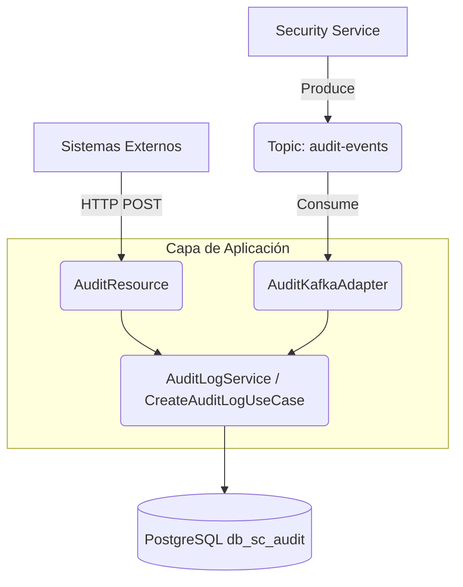
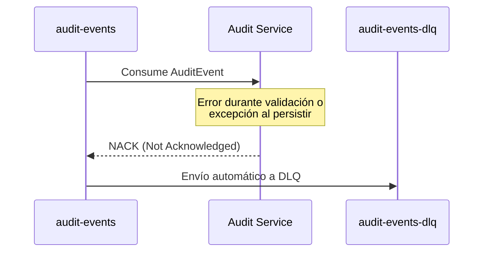

# Consumo de Eventos desde Kafka y Dead Letter Queue (DLQ)

En esta sesión abordaremos cómo integrar un consumidor de Kafka en nuestro microservicio de Auditoría respetando los principios de la Arquitectura Hexagonal y Clean Architecture. En este enfoque, Kafka actúa como un medio de entrada más (un puerto de entrada implementado por un adaptador), coexistiendo con nuestra API REST existente (otro adaptador de entrada).

Además, incluiremos el manejo de errores resiliente usando una **Dead Letter Queue (DLQ)**.

---

## 1. Convivencia de API y Kafka (Arquitectura)

En Clean Architecture, el core del negocio (**Use Cases** y **Domain Entities**) es agnóstico a la forma en que llegan los datos. 

La integración de Kafka significa simplemente crear un nuevo adaptador de entrada: `AuditKafkaAdapter`.
- **API REST**: `AuditResource` recibe las peticiones vía HTTP y llama al Use Case.
- **Kafka Consumer**: `AuditKafkaAdapter` recibe los mensajes desde un topic de Kafka y llama al **mismo** Use Case.



> [!NOTE] 
> La API REST existente no se elimina, se enriquece el servicio dándole a los clientes la opción de auditar eventos de de forma asíncrona a través de Kafka o síncrona mediante HTTP.

---

## 2. Librerías utilizadas

Para que Quarkus ofrezca soporte reactivo a Kafka bajo la especificación MicroProfile Reactive Messaging, incluimos la siguiente dependencia en nuestro `build.gradle.kts`:

```kotlin
implementation("io.quarkus:quarkus-smallrye-reactive-messaging-kafka")
```

---

## 3. Configuración de Kafka y DLQ en application.properties

Las propiedades del canal de entrada configuran todo el enrutamiento y la deserialización asíncrona:

```properties
# Kafka Global Configuration
kafka.bootstrap.servers=${KAFKA_BOOTSTRAP_SERVERS:localhost:9092}

# Kafka Consumer Configuration
mp.messaging.incoming.audit-in.connector=smallrye-kafka
mp.messaging.incoming.audit-in.topic=audit-events
mp.messaging.incoming.audit-in.group.id=audit-service

# Dead Letter Queue (DLQ) Configuration
mp.messaging.incoming.audit-in.failure-strategy=dead-letter-queue
mp.messaging.incoming.audit-in.dead-letter-queue.topic=audit-events-dlq
```

> [!TIP]
> **Generación Mágica:** Nota que no configuramos un *Deserializer* explicítamente. En las versiones modernas de Quarkus, SmallRye Reactive Messaging genera automáticamente el deserializador de Jackson apropiado basándose en la clase de tu método (en nuestro caso `AuditEvent`). De igual forma, el servidor inicial se ha definido globalmente (`kafka.bootstrap.servers`) permitiendo configurarse por variables de entorno vía Docker en ambientes superiores.

### Explicación de DLQ (Clave Didáctica)
Cuando ocurre un error no controlado durante del procesamiento de un mensaje (por ejemplo, validación fallida o caída de BD base), este **no se pierde**. Al configurar `failure-strategy=dead-letter-queue`, SmallRye Reactive Messaging automáticamente toma el mensaje que causó la excepción y lo deposita en un nuevo topic designado (`audit-events-dlq`). Esto permite:
1. Asegurar la resiliencia y el principio *zero message loss*.
2. Monitorear los mensajes fallidos en una cola aislada.
3. Procesarlos u observarlos posteriormente sin bloquear el flujo principal.



---

## 4. Estructura del Proyecto Actualizada

```text
src/main/java/cja/msa/sc/audit/
├── application/
├── domain/
└── infrastructure/
    ├── adapters/
    │   ├── in/
    │   │   ├── kafka/                       <-- (NUEVO) Kafka Inbound 
    │   │   │   ├── AuditKafkaAdapter.java   <-- Consumer
    │   │   │   ├── dto/
    │   │   │   │   └── AuditEvent.java      <-- Estructura del evento consumido
    │   │   │   └── mapper/
    │   │   │       └── AuditKafkaMapper.java <-- MapStruct mapper
    │   │   ├── web/                         <-- (EXISTENTE) API REST conservada
```

---

## 5. Explicación del Consumer y DTO

El DTO `AuditEvent` utiliza la sintaxis moderna de **Java Records** para ser inmutable. Jackson, el ObjectMapper por defecto en Quarkus, deserializa el JSON que llega de Kafka a este Record.

Para convertir este DTO hacia nuestra entidad de dominio `AuditLog`, utilizamos `MapStruct` creando la interfaz `AuditKafkaMapper`. Esta herramienta genera implementaciones al vuelo, permitiendo un código elegante y altamente mantenible sin requerir la creación tediosa de builders manuales dentro del adaptador.

El `AuditKafkaAdapter` incluye la notación `@Incoming("audit-in")` para conectarse a nuestros properties. En una arquitectura reactiva mediante Mutiny, usa el Mapper inyectado, delega la acción y al final iteramos con un `Uni<Void>` tras invocar el servicio para garantizar que si la operación asíncrona hacia la persistencia subyacente falla, la excepción rebote de nuevo a Reactive Messaging y aplique el DLQ.

> [!TIP]
> Didácticamente hemos incluido una condicional que lanza una excepción si el campo `functionality` es igual a `"SIMULATE_ERROR"`. Con esto podrás observar la función del DLQ en tu servidor en segundos.

---

## 6. Paso a paso para la verificación

Sigue estos pasos para probar la implementación localmente con `Kafka UI`:

1.  **Levanta la Infraestructura**: Usando tu docker-compose, asegúrate de levantar Kafka (puertos 9092 para broker y 8090 para el Kafka UI).
2.  **Inicia tu Aplicación Audit**: 
    ```bash
    npm run dev  # O equivalentemente ./gradlew quarkusDev
    ```
3.  **Produce un mensaje normal (Éxito)**:
    Abre tu Kafka UI en `http://localhost:8090` -> *Topics* -> `audit-events` -> *Produce Message*.
    - **Value**:
      ```json
      {
         "functionality": "LOGIN_SUCCESS",
         "username": "admin",
         "eventType": "SECURITY",
         "detail": "Acceso exitoso al sistema"
      }
      ```
    - Verifica en tu terminal que verás un `Successfully persisted audit log from Kafka`.

4.  **Simular el Error y probar el DLQ**:
    Produce este mensaje en el topic `audit-events`:
    - **Value**:
      ```json
      {
         "functionality": "SIMULATE_ERROR",
         "username": "admin",
         "eventType": "FAIL",
         "detail": "Este mensaje debe fallar"
      }
      ```
    - Revisa tu terminal, deberías ver la impresión: _"Simulated error occurred for DLQ demonstration. Message will be routed to DLQ."_
    - En el Kafka UI, retrocede a la vista de "Topics". Notarás que un nuevo topic llamado `audit-events-dlq` ha sido credo de forma automática (si tenías auto-creation encendida) o simplemente tendrá ahora `1` mensaje.
    - Entra a `audit-events-dlq` y verás el mensaje que causó la excepción listo para ser inspeccionado, demostrando así la fiabilidad del procesamiento sin pérdida de datos.
