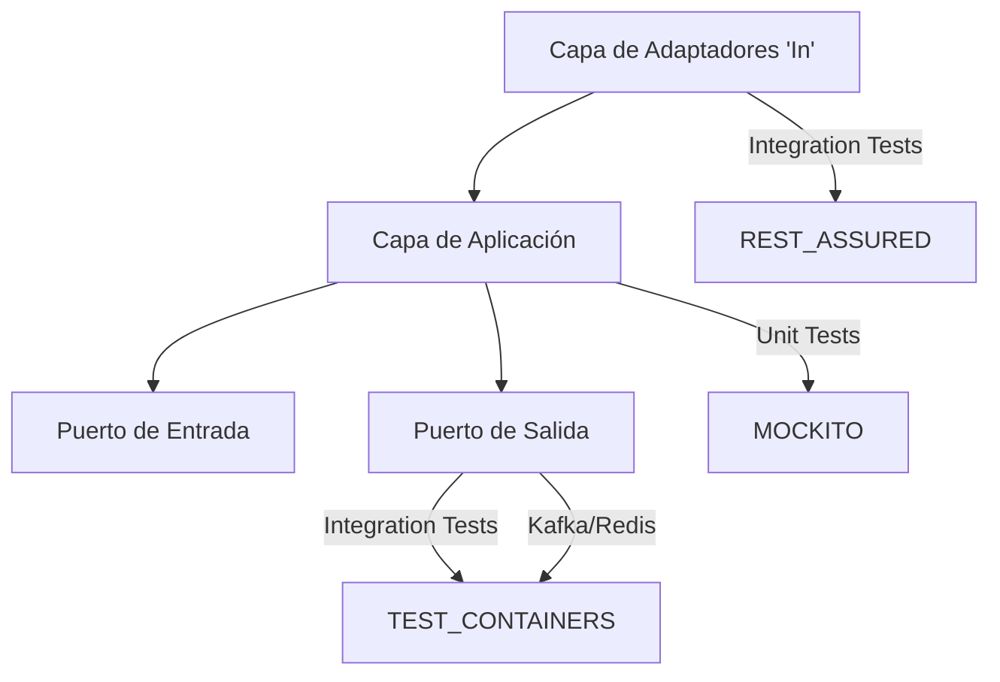

# 🎯 Sesión 08: Testing y Code Coverage con JaCoCo en Quarkus

En esta sesión aprenderemos a asegurar la calidad de nuestro código incorporando **Unit Testing**, **Integration Testing** y midiendo la **Cobertura de Código (Code Coverage)** empleando JaCoCo. Todo ello respetando nuestra Arquitectura Hexagonal y Clean Architecture.

---

## 1. Introducción

El testing es el pilar fundamental que nos permite desarrollar con confianza, iterar más rápido y asegurar que las modificaciones no rompan los requerimientos ya existentes.

### Unit vs Integration Testing

| Característica | Unit Testing (Pruebas Unitarias) | Integration Testing (Pruebas de Integración) |
| --- | --- | --- |
| **Alcance** | Prueba un componente/clase aislada (ej: Casos de Uso, Servicios de Dominio). | Prueba la interacción entre varios componentes (ej: Endpoints REST, Base de Datos, Kafka). |
| **Dependencias** | Se emplea la inyección de "Mocks" o "Stubs" para simular componentes externos. | Se levantan componentes reales, frameworks o testcontainers para validar el flujo completo. |
| **Velocidad** | Instantáneas (milisegundos). | Lentas (segundos o minutos por el coste inicial). |
| **Cuándo usar** | Lógica de negocio (Cálculos, validaciones, flujos de orquestación pura). | Validar REST API (Códigos HTTP), Queries a BD, Envío real a Tópicos, Auth Keycloak. |

### ¿Qué es el Code Coverage (Cobertura de Código)?
Es una métrica que define el porcentaje de código fuente que es ejecutado cuando se corre la suite de pruebas automatizada. Una cobertura alta significa que la mayor parte del código ha sido puesta a prueba. **JaCoCo** es la herramienta estándar en el ecosistema de Java para recolectar esta métrica.

---

## 2. Stack de Testing Requerido

Para nuestro microservicio `cja-msa-sc-security` empleamos las siguientes herramientas y librerías que Quarkus ya ofrece pre-compiladas para interoperar a la perfección:

*   **[JUnit 5]**: El framework estándar para declarar de forma estructurada los métodos de prueba.
*   **[Mockito]**: Librería esencial para la creación de mocks (simulaciones de puertos de salida) de cara al Unit Testing.
*   **[RestAssured]**: Librería para invocar, probar y validar endpoints HTTP REST de forma programática.
*   **[@QuarkusTest]**: Framework de testing de Quarkus. Inicializa el contenedor CDI y prepara la aplicación para las pruebas de integración.
*   **[JaCoCo]**: ("Java Code Coverage") Herramienta que inspeccionará el bytecode y determinará qué líneas se ejecutaron durante la prueba.

---

## 3. Arquitectura de Testing

Al emplear Arquitectura Hexagonal, el testing debe dividirse basándose en su anillo/capa correspondiente:

*   **Capa de Dominio / Aplicación (Casos de uso)**: **Unit Testing**. Se testean los Servicios y Repositorios sin levantar Quarkus (@ExtendWith(MockitoExtension.class)). Se inyectan las interfaces/ports con Mockito.
*   **Capa de Infraestructura (Adaptadores Entrada/Salida)**: **Integration Testing**. Se testean los Controladores REST (In/REST), Clientes (Out/Kafka), Adaptadores Redis (Out/Redis). Empleamos `@QuarkusTest` interactuando contra testcontainers o in-memory.

### Diagrama de Flujo y Arquitectura de Pruebas



---

## 4. Implementación Paso a Paso & 6. Ejemplos Prácticos

A continuación, mostramos en detalle dónde se ubican y cómo se implementaron los distintos ejemplos disponibles en el código de nuestro Workshop:

### 4.1. Estándar Didáctico de Pruebas

Para maximizar el aprendizaje, todas las clases de prueba en este proyecto han sido reestructuradas bajo los siguientes principios:
*   **Nomenclatura en Español**: Uso de `@DisplayName("...")` explícitos en español para todos los tests, facilitando la lectura directa del escenario esperado en los resultados de compilación.
*   **Patrón AAA (Arrange, Act, Assert)**: Separación documentada paso a paso de las fases de Preparación, Ejecución y Comprobación en el código interno de las funciones.
*   **Javadoc Instructivo Integral**: Inclusión de Javadoc metodológico por encima de cada clase y método, describiendo exactamente el objetivo general, el funcionamiento de la anotación Quarkus/Mockito en uso y el comportamiento evaluado.

### 4.2. Pruebas Unitarias (Unit Testing)

Tienen el propósito de ser extremadamente rápidas y aíslan la lógica del contenedor CDI de Quarkus empleando `@ExtendWith(MockitoExtension.class)`.

*   **`UserQueryServiceTest.java`**: Ejemplo de aislamiento de componentes hacia un Servicio de Dominio (Caso de Uso). Emplea callbacks `.thenAnswer` con Mockito para auditar la asignación programática de UUID antes del guardado del Entity.
*   **`AuthServiceTest.java`**: Aísla la orquestación (Business Logic), demostrando interacciones directas simuladas dictaminando un "Cache Hit" o reaccionando a un "Cache Miss" sin levantar nunca Redis ni Keycloak reales.

### 4.3. Pruebas de Integración (Integration Testing)

Cargan el ecosistema de dependencias e infraestructura mediante `@QuarkusTest` interactuando de manera transparente y real (vía TestContainers/DevServices).

*   **`MfaResourceTest.java` (Capa Web / Endpoints REST)**: Emplea `RestAssured` para encadenar comprobaciones a rutas HTTP (`/api/v1/auth/mfa/verify`) asegurando la de-serialización de Body JSON y que arrojen HTTP `200 OK`.
*   **`ApiAuditPublisherTest.java` (Fault Tolerance / RestClient)**: Valida de manera altamente metodológica la salida remota fallida. Mediante `@InjectMock @RestClient` inyecta timeouts y RuntimeExceptions forzando la caída del servicio para comprobar que la aplicación es salvada pacíficamente por rutinas `@Retry` interceptando y reintentando tres veces antes de ejecutar `@Fallback`.
*   **`KafkaAuditPublisherTest.java` (Mensajería Kafka)**: Acopla un Bróker Kafka transitorio mediante DevServices al que le probaremos inyectar y serializar con Jackson la semántica de un evento robusto sin que arroje excepciones perjudiciales.
*   **`UserResourceTest.java` (Aseguramiento OIDC/RBAC)**: Prueba si las negaciones Web (`401 Unauthorized` / `403 Forbidden`) funcionan correctamente contra RBAC sin tener que montar Keycloak. Engaño programado con `@TestSecurity(user = "admin_user", roles = {"ADMIN"})`.
*   **`RedisAuthCacheAdapterTest.java` (Redis Real Database)**: Este test ha evolucionado. A diferencia de las pruebas iniciales, ahora usa `@QuarkusTest` integrándose nativamente al inyector global para aprovisionar un contenedor de Redis efímero y realizar peticiones verdaderas de guardar y desencriptar un DataTransferObject (`TokenResponseDto`) directo contra Redis en memoria.

---

## 5. JaCoCo Code Coverage (Generación y Configuración)

Para incluir la generación estricta de reportes de cobertura en el entorno de Quarkus, añadimos la dependencia de la extensión oficial:

**`build.gradle.kts`**
```kotlin
testImplementation("io.quarkus:quarkus-jacoco")
```

### Ejecutar Pruebas y Generar Reporte

La forma de correr los tests con Quarkus en Gradle y compilar las métricas de JaCoCo es tan sencilla como lanzar el comando tradicional de tests de Gradle. Quarkus detecta la extensión jacoco automáticamente en el runtime del ClassLoader:

```bash
./gradlew clean test
```

### Reporte de Ejecución de Pruebas (Gradle)

Al finalizar la ejecución del comando, Gradle automáticamente genera un reporte HTML detallado con el resultado individual de todas las pruebas (paso/fallo, duración, errores).

1.  **Ubicación**: En tu explorador de archivos, dirígete a `build/reports/tests/test/index.html`.
2.  **Despliegue**: Haz clic derecho sobre este `.html` y ábrelo en tu navegador.
3.  **Interpretación**:
    *   **Packages / Classes**: Podrás navegar por estructura de árbol en tus tests.
    *   **Success Rate (%)**: Un 100% en verde significa que ningún test falló. Si ves cajas rojas, podrás entrar al test fallido y ver el `StackTrace` exacto o la discrepancia (ej: *Expected 200, Actual 401*).
    *   **Standard Output**: Si en tu código tienes logs o `System.out.println`, podrás leerlos dentro de cada test navegando en su subpágina respectiva.

### Reporte de Cobertura de Código (JaCoCo)

JaCoCo intercepta la JVM durante los tests para determinar qué porciones de código se ejecutaron y así entregarte una métrica visual de tu cobertura técnica global.

1.  **Ubicación**: Dirígete a la carpeta `build/jacoco-report/index.html` (o `target/jacoco-report/index.html` en Maven o si configuras jacoco standard).
2.  **Despliegue**: Abre el archivo `index.html` en tu navegador de preferencia.
3.  **Interpretación Cromática y Columnas**:
    Navega dando clic a nivel de paquetes, clases y, finalmente, métodos. Al entrar al código fuente, observarás una semántica en colores inyectada:
    *   🟩 **Verde (Full Coverage)**: Línea procesada y validada plenamente por tus baterías de test.
    *   🟨 **Amarillo (Partial Coverage)**: Se ejecutó la línea, pero pertenece a una estructura condicional (`if/else`, un bucle o condicional `switch`) de la cual **sólo cubriste un flujo parcial**. Ejemplo: Probaste el caso OK del `if`, pero ningún test forzó el `else` de Excepción.
    *   🟥 **Rojo (No Coverage)**: Línea jamás visitada por ningún test ejecutado.
    *   **Missed Branches vs Missed Instructions:** *Branches* evalúa los flujos y condiciones lógicas; *Instructions* evalúa el ratio literal a nivel de código de bytes compilado.

---

## 7. Ejecución de la Sesión

Sigue el paso a paso en modo live coding (2 horas estimadas):

1. Explicar Diferencia (Unit vs Integration).
2. TDD Rápido de 1 Endpoint REST asegurado con Keycloak `@TestSecurity`.
3. Revisión y Explicación de Unit Testing de Caso de Uso (`AuthService.java`).
4. Generación de reporte por consola: `./gradlew clean test`.
5. Mostrar y Navegar Reporte JaCoCo HTML.

---

## 9. Estructura del Proyecto de Testing

La ruta habitual de reposición debe clonar al original `src/main/java`:

```text
src/
└── test/
    └── java/
        └── cja/msa/sc/security/
            ├── application/
            │   └── service/            <-- Unit Tests (Business Rules)
            └── infrastructure/
                └── adapters/
                    ├── in/rest/        <-- Integrations Tests (Endpoints)
                    └── out/            <-- Integrations Tests (DB, Brokers)
```

---

## 10. Buenas Prácticas Relevantes

1.  **Separación de Conceptos:** No mezcles Pruebas de Integración con Pruebas Unitarias. Un "Unit Test" rápido no debe cargar un contenedor de BD/Keycloak.
2.  **Coverage es una Guía y métrica, no un Objetivo Absoluto.** No busques ciegamente el 100% testando clases autogeneradas (MapStruct), métodos Setters/Getters, ni validaciones exhaustivas. Lo recomendado suele ser un ~80% centrado en la **Lógica de Dominio Central**.
3.  **Independencia:** Cada método `@Test` no debe depender del estado de otro método paralelo o secuencial. Emplea `@BeforeEach` para resetear al punto de arranque.
4.  **No sobresaturemos la CI/CD:** Considerar emplear tags `@Tag("integration")` para no correr los test pesados y dependientes de BD en los stages preliminares del Pipeline y hacerlo todo más fluido.
