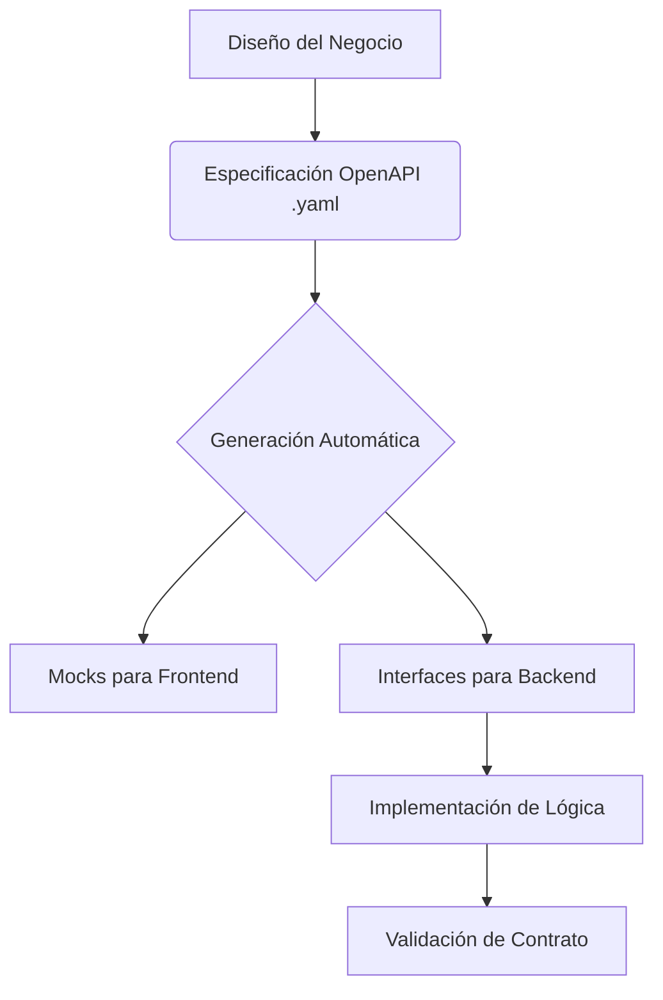

import Tabs from '@theme/Tabs';
import TabItem from '@theme/TabItem';

# APIFirst: El Contrato como Punto de Partida

En el desarrollo de microservicios modernos, no empezamos escribiendo código de base de datos o lógica de negocio. Empezamos diseñando la **interfaz de comunicación**.

## ¿Qué es APIFirst?

APIFirst es una estrategia que posiciona a las APIs como "ciudadanos de primera clase". Significa que el equipo dedica tiempo a definir el **contrato** (usualmente en OpenAPI/Swagger) antes de implementar cualquier línea de código.

:::tip Insight Arquitectónico
Un contrato bien definido no solo escala sistemas, sino que **escala equipos**. Permite que el equipo de Frontend y Backend trabajen en paralelo desde el día uno.
:::

## Beneficios Clave

<Tabs>
<TabItem value="calidad" label="Calidad y Consistencia">

- **Validación Estricta**: Los parámetros de entrada y salida están definidos y validados.
- **Sin Ambigüedades**: "Optional" vs "Required" queda claro en el YAML.
- **Documentación Viva**: El código y la documentación siempre están sincronizados.

</TabItem>
<TabItem value="velocidad" label="Velocidad de Desarrollo">

- **Mocks Instantáneos**: El equipo de UI puede usar herramientas como Prism para simular la API.
- **Generadores de Código**: Herramientas como `openapi-generator` crean los DTOs y Resource Interfaces automáticamente.

</TabItem>
</Tabs>

## Nuestra Hoja de Ruta: De la Especificación a la Entidad

A lo largo de este curso, utilizaremos un enfoque APIFirst para construir nuestro ecosistema de microservicios. No inventaremos las estructuras sobre la marcha; seguiremos los contratos ya establecidos.

Implementaremos las entidades de persistencia y objetos de dominio necesarios para dar vida a las APIs descritas en nuestras especificaciones técnicas:

:::info Especificaciones del Curso
Estaremos trabajando sobre los siguientes contratos fundamentales:
1.  **[Security Microservice API](file:../../../api/openapi-msa-security.yml)**: Gestión de identidades, usuarios y flujo MFA.
2.  **[Audit Microservice API](file:../../../api/openapi-msa-audit.yml)**: Registro inmutable de eventos y auditoría.
:::

Al llegar a las sesiones de **Persistencia** y **Seguridad**, verás cómo convertimos definiciones como `UserResponse`, `LoginRequestDto` o `AuditLogResponseDto` en entidades JPA y servicios reactivos robustos.
