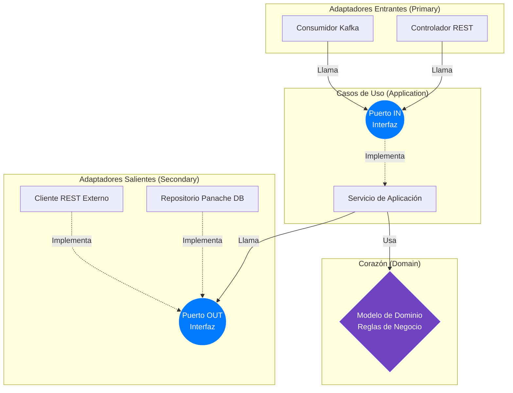
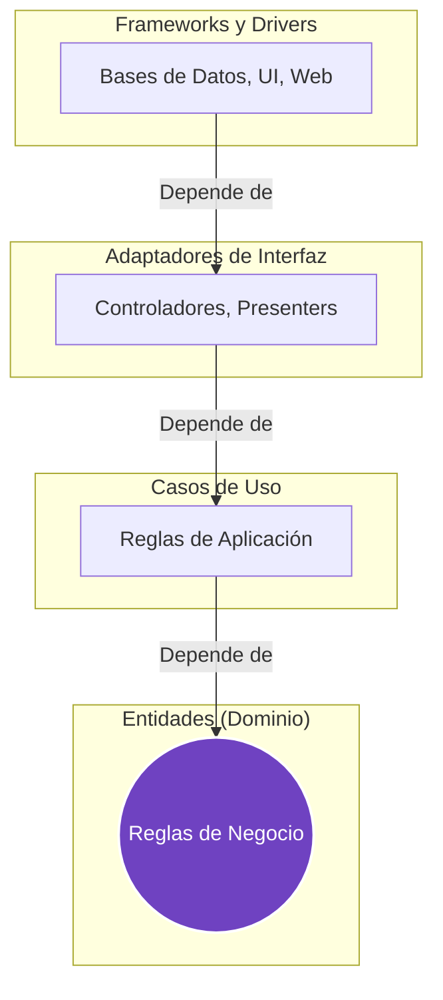
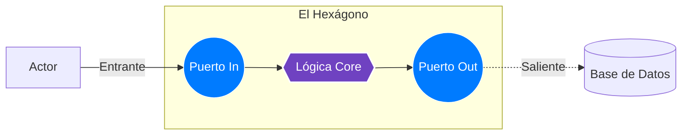
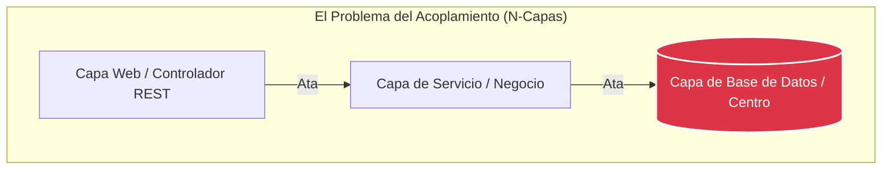
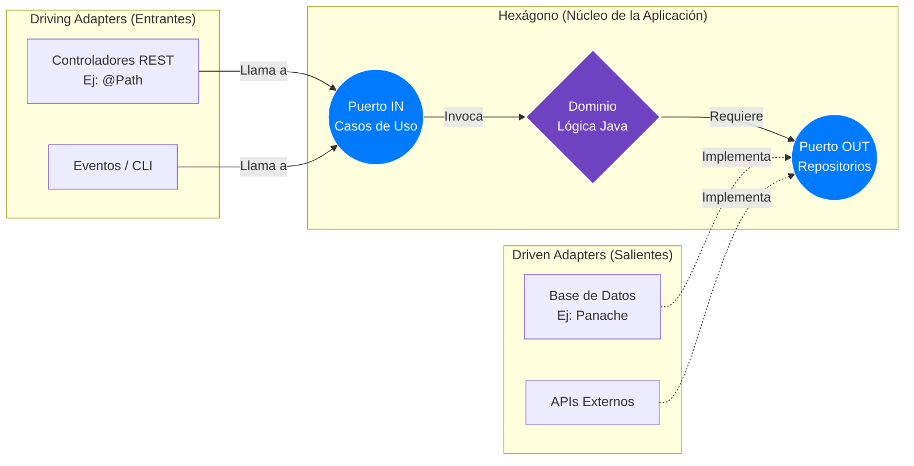

# Arquitectura Hexagonal y Clean Architecture

**Clean Architecture** y la **Arquitectura Hexagonal** son patrones de diseño estructural avanzados que comparten un fin absoluto: **Proteger las Reglas de Negocio (Dominio) de cualquier framework, base de datos o agente tecnológico externo.**

:::tip Independiente de frameworks
La infraestructura tecnológica (bases de datos, web, frameworks) debe ser un detalle de implementación efímero e intercambiable, y nunca el centro de gravedad de tu aplicación.
:::

---

## 1. El Core Visual: Inversión de Dependencias

El secreto unificado de este patrón es cómo **invierte el flujo de dependencias tradicional**. En lugar de que el Dominio dependa de la Base de Datos, **todo depende del Dominio**.



:::warning Regla de Oro
La capa central (💜 Dominio) **jamás** importa una librería HTTP (`@Path`), de persistencia (`@Entity`), ni anotaciones del framework (`@ApplicationScoped`). Solo entiende y habla puro lenguaje Java.
:::

---

## 2. Entendiendo las Piezas

A menudo se utilizan los términos Clean Architecture y Arquitectura Hexagonal como sinónimos. Aunque persiguen el mismo fin de protección, el enfoque arquitectónico difiere levemente.

import Tabs from '@theme/Tabs';
import TabItem from '@theme/TabItem';

<Tabs>
<TabItem value="clean" label="Clean Architecture">

Propuesta por **Robert C. Martin (Uncle Bob)**, se enfoca en **capas concéntricas** regidas por la *Regla de Dependencia*: el código fuente solo apunta hacia el centro. Ningún círculo interior sabe nada del exterior.



</TabItem>
<TabItem value="hexa" label="Arquitectura Hexagonal">

Ideada por **Alistair Cockburn** (Ports & Adapters), enfatiza la **simetría**. El núcleo es agnóstico al exterior y se comunica estrictamente mediante Puertos (Interfaces) y Adaptadores (Implementaciones).



</TabItem>
</Tabs>

### El Poder de Juntarlas
En proyectos modernos como Quarkus, fusionamos ambas: **Clean Architecture** nos dicta cómo estructurar las carpetas (`domain`, `application`, `infrastructure`), mientras que **Hexagonal** nos otorga el mecanismo estricto de los contratos (Puertos y Adaptadores) para bloquear la fuga de lógica.

---

## 3. El Problema a Resolver: El Monolito N-Capas

En una arquitectura tradicional (N-Capas o MVC estándar), el diseño suele ser **Data-Driven**. El flujo de dependencias es lineal y descendente, apuntando trágicamente hacia el motor de almacenamiento.



Esto **ata** tu lógica de negocio directamente a repositorios SQL y controladores HTTP. Si cambias de base de datos, debes reescribir media aplicación. La Arquitectura Hexagonal soluciona esto aislando completamente el cerebro, como vimos en la Gráfica de Inversión de Dependencias.

---

## 4. Diseño Interno: Puertos y Adaptadores

Para lograr el aislamiento absoluto, el ecosistema se divide conceptualmente:



- **Puertos (Interfaces):** Reglas dictadas por el Dominio o Aplicación en código Java puro.
  - *Puerto de Entrada (In Port):* Define cómo el exterior interactúa con la app.
  - *Puerto de Salida (Out Port):* Define qué necesita la app del exterior sin cerrarse a ninguna tecnología.
- **Adaptadores (Clases Concretas):** Código "sucio" (Quarkus, Hibernate, Kafka) que implementa o invoca a los puertos.

---

## 5. Implementación en Quarkus

### Estructura de Directorios Genérica

Organizamos las carpetas haciendo que la arquitectura sea evidente a simple vista:

```text
mi-microservicio/
├── build.gradle.kts                    # Script con todas las dependencias
└── src/
    └── main/
        ├── java/com/empresa/app/
        │   ├── domain/                         # 💜 NÚCLEO (Cero Frameworks)
        │   │   ├── model/User.java             # Entidad principal
        │   │   └── exception/UserException.java
        │   │
        │   ├── application/                    # 💙 PUERTOS Y CASOS (Orquestador)
        │   │   ├── port/
        │   │   │   ├── in/GetUserUseCase.java  # Lo que la app OFRECE (In Port)
        │   │   │   └── out/UserRepository.java # Lo que la app NECESITA (Out Port)
        │   │   └── service/GetUserService.java # Implementa In Port, usa Out Port
        │   │
        │   ├── infrastructure/                 # 🤎 ADAPTADORES (Framework / DB)
        │   │   └── adapters/
        │   │       ├── in/rest/UserApi.java    # Controlador REST (@Path)
        │   │       └── out/db/JpaUserRepo.java # Repositorio de BD (Panache)
        │
        └── resources/
            └── application.properties          # Configuración de Quarkus
```

### Código: Desacople en Acción

<Tabs>
<TabItem value="domain" label="1. El Dominio (Puro)">

Ninguna tecnología externa entra aquí. Es POJO (Plain Old Java Object).

```java title="domain/model/User.java"
package com.empresa.app.domain.model;

public class User {
    private String username;
    private String password;
    
    // Lógica pura de negocio, sin @Entity ni @Table
    public void validateActiveStatus() {
        if (this.status != Status.ACTIVE) {
            throw new UserBlockedException(this.username);
        }
    }
}
```

</TabItem>
<TabItem value="port" label="2. El Puerto (Contrato)">

La aplicación declara lo que necesita que la infraestructura haga por ella.

```java title="application/port/out/UserRepository.java"
package com.empresa.app.application.port.out;

import com.empresa.app.domain.model.User;
import java.util.Optional;

// El contrato que obliga a la infraestructura a proveer usuarios
public interface UserRepository {
    Optional<User> findByUsername(String username);
}
```

</TabItem>
<TabItem value="service" label="3. El Orquestador">

El servicio ejecuta la lógica llamando al puerto, sin saber si los datos vienen de PostgreSQL o Redis.

```java title="application/service/GetUserService.java"
package com.empresa.app.application.service;

import com.empresa.app.application.port.in.GetUserUseCase;
import com.empresa.app.application.port.out.UserRepository;
import jakarta.enterprise.context.ApplicationScoped;

@ApplicationScoped 
public class GetUserService implements GetUserUseCase {
    
    private final UserRepository repository; // Inyección de la Interfaz Pura
    
    public GetUserService(UserRepository repository) {
        this.repository = repository;
    }

    @Override
    public User get(String username) {
        return repository.findByUsername(username)
                 .orElseThrow(() -> new UserNotFoundException(username));
    }
}
```

</TabItem>
<TabItem value="adapter" label="4. El Adaptador (Infraestructura)">

El código tecnológico que cumple el contrato usando Quarkus y Hibernate.

```java title="infrastructure/adapters/out/db/JpaUserRepo.java"
package com.empresa.app.infrastructure.adapters.out.db;

import com.empresa.app.application.port.out.UserRepository;
import com.empresa.app.domain.model.User;
import jakarta.enterprise.context.ApplicationScoped;
import jakarta.inject.Inject;

@ApplicationScoped 
public class JpaUserRepo implements UserRepository { // <- SATISFACE el Puerto
    
    @Inject
    PanacheUserEntityDao panacheDao; // Tecnología concreta PostgreSQL
    
    @Inject
    EntityToDomainMapper mapper; // Traductor de capas

    @Override
    public Optional<User> findByUsername(String username) {
        Optional<UserEntity> entity = panacheDao.find("username", username).firstResultOptional();
        return entity.map(mapper::toDomain);
    }
}
```

</TabItem>
</Tabs>

:::info Migración sin Dolor
Si mañana necesitas cambiar la base de datos a MongoDB para ahorrar costos, el **único lugar del código** que debes reemplazar es `JpaUserRepo.java`. Todo el Dominio (`User.java`) y la Aplicación (`GetUserService.java`) permanecerán intactos, ahorrándote meses de reescritura.
:::

---

## 6. Puntos Clave

1. **Testabilidad Inmediata**: Al estar desacoplada de la BD y la red, la lógica de negocio se prueba con Unit Tests veloces (usando Mockito sobre los puertos).
2. **Independencia de Framework**: Quarkus es espectacular, pero si en 5 años el estándar cambia, migrar la aplicación será únicamente reescribir los adaptadores, preservando intacto el núcleo del software desarrollado.
3. **Mantenibilidad Corporativa**: Los errores de negocio nacen exclusivamente del núcleo de dominio, deteniendo el "spaghetti code" de validaciones regadas por controladores y repositorios.
