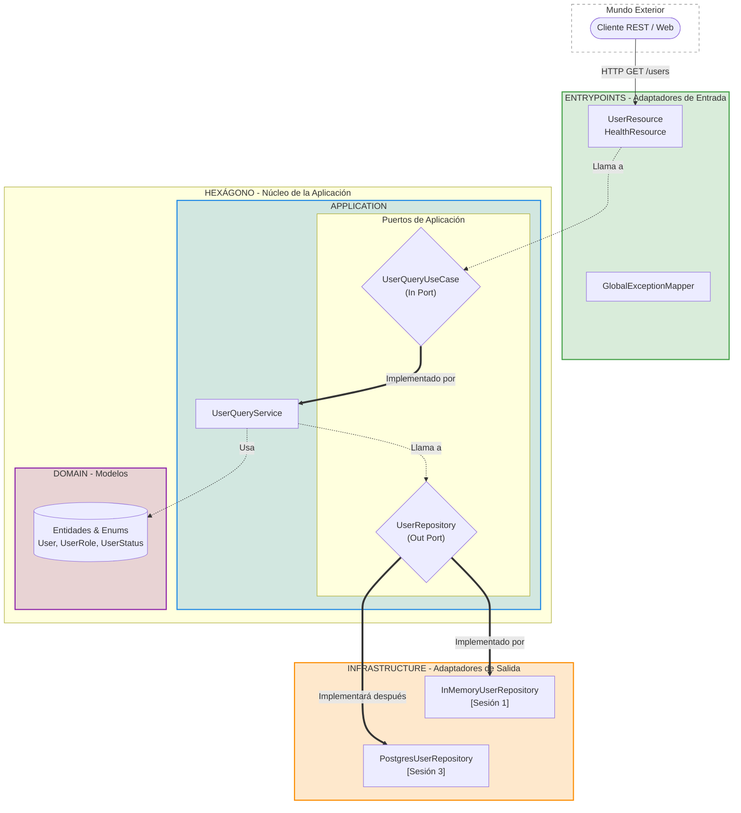

# Construcción del Microservicio: Especificación Técnica

Esta sesión establece la **base técnica definitiva** para la creación de nuestro microservicio de seguridad `cja-msa-sc-security`. El objetivo es comprender cómo orquestar un microservicio cloud-native profesional con Quarkus, guiado estrictamente por **Hexagonal Architecture**.

:::tip Objetivo Práctico
Aprenderás a organizar capas sin acoplamiento, configurar un proyecto Quarkus con Gradle Kotlin DSL, y utilizar Lombok y MapStruct para mantener el código elegante y escalable.
:::

---

## 1. Arquitectura Visual: Radiografía del Microservicio

Comprender el flujo de los datos es el primer paso antes de escribir una sola línea de código. Nuestro microservicio está diseñado para proteger el núcleo (Dominio) de cualquier contaminación externa.



> **Las dependencias fluyen única y exclusivamente hacia el centro luminoso (Dominio).**

---

## 2. Decisiones Técnicas: El Stack Elegido

Para construir un sistema de grado bancario/fintech, la elección de la tecnología no es casualidad. Hemos seleccionado herramientas orientadas al rendimiento extremo (Cloud-Native) y la mantenibilidad a largo plazo bajo la protección de la JVM.

import Tabs from '@theme/Tabs';
import TabItem from '@theme/TabItem';

<Tabs>
<TabItem value="core" label="El Motor: Quarkus & Java">

| Herramienta | Versión | Rol |
|---|---|---|
| **Java** | 25 (EA) | Lenguaje principal (o Java 21 LTS) |
| **Quarkus** | 3.32.2 | Framework Cloud-Native de Microservicios |
| **Gradle** | 8.x | Gestor de compilación (Kotlin DSL) |

**¿Por qué Quarkus en lugar del tradicional Spring Boot?**
- **Arranque Supersónico**: Levanta en `< 500ms` (frente a los 3-5s típicos de Spring).
- **Consumo de Memoria Reducido**: Requiere habitualmente un 40-60% menos de memoria RAM, volviéndolo ideal para alta densidad de contenedores en Kubernetes.
- **GraalVM**: Viene listo de fábrica para compilarse a binario nativo (AOT) sin las fricciones históricas de reflexión profunda.

</TabItem>
<TabItem value="tools" label="Herramientas de Productividad">

| Herramienta | Versión | Rol |
|---|---|---|
| **Lombok** | 1.18.36 | Eliminación absoluta de código boilerplate (Getters, Builders). |
| **MapStruct** | 1.6.3 | Mapeo ultra-rápido entre entidades de Dominio puro y DTOs de Infraestructura HTTP. |
| **SmallRye Health** | Integrado | Telemetría Liveness/Readiness exigidos por Kubernetes. |

**¿Por qué MapStruct en lugar de Reflection (ModelMapper)?**
- **Velocidad de Ejecución Absoluta**: MapStruct **no usa reflexión en runtime**. Genera el código mapeador real en tiempo de compilación, resultando entre 10x y 100x más rápido.
- **Seguridad Garantizada en Compilación**: Si un campo cambia de nombre en el Dominio y el mapeo se rompe, *tu proyecto directamente no compilará*, evitando fallos silenciosos y caóticos en producción.

</TabItem>
</Tabs>

---

## 3. Anatomía del Proyecto: Capas y Directorios

El código fuente debe "gritar" lo que el sistema hace, no qué framework utiliza. Esta es la estructura topológica exacta de las capas de nuestro ecosistema.

<Tabs>
<TabItem value="tree" label="Estructura Completa">

```text
cja-msa-sc-security/
├── build.gradle.kts                    # Dependencias y motor de compilación
└── src/main/java/cja/msa/sc/security/
    ├── domain/                         # 💜 NÚCLEO (Cero Frameworks)
    │   ├── model/                      # Entidades (User) y Enums
    │   └── exception/                  # Excepciones puras de negocio
    │
    ├── application/                    # 💙 ORQUESTACIÓN (Hexágono)
    │   ├── port/in/                    # Contratos de Entrada (Casos de uso)
    │   ├── port/out/                   # Contratos de Salida (Repositorios)
    │   └── service/                    # Implementación de Casos de uso
    │
    └── infrastructure/                 # 🤎 ADAPTADORES (Framework / DB)
        └── adapters/
            ├── in/rest/                # Endpoints (UserResource, DTOs, Mappers)
            └── out/persistence/        # BD real o Mocks (InMemoryUserRepository)
```

</TabItem>
<TabItem value="domain" label="Domain (El Núcleo)">

**El Corazón (Cero Frameworks)**
- **Qué hay:** Entidades (`User.java`), Value Objects, Enums, Excepciones puras.
- **Regla Inquebrantable:** Esta capa **nunca** importa utilidades ajenas o anotaciones de infra como `jakarta.*` o `io.quarkus.*`. Si Quarkus se destruye mañana, tu dominio sigue siendo 100% válido y funcional en cualquier software estándar de Java.

</TabItem>
<TabItem value="app" label="Application (Orquestador)">

**Las Reglas de Movimiento**
- **Qué hay:** Los Puertos (Las Interfaces `In` y `Out`) y los Servicios Concretos (`UserQueryService.java`).
- **Comportamiento:** Orquesta inteligentemente el flujo. Recibe mandos lógicos del Exterior a través de los Puertos IN, orquesta las piezas del Dominio puro, y exige u obtiene datos a la Infraestructura ajena a través de los Puertos OUT.

</TabItem>
<TabItem value="infra" label="Infrastructure (Adaptadores)">

**El Código Contaminado**
- **Qué hay:** Quarkus, Annotations, Bibliotecas RESTEasy, Panache, DTOs (`UserResponseDto.java`), Mappers (`UserRestMapper.java`) y los Repositorios reales que tocan el disco o red.
- **Comportamiento:** Su única labor es traducir las groseras peticiones REST HTTP o mensajes de Kafka en llamadas limpias y tipadas hacia los Puertos In; y paralelamente, implementar las interfaces de los Puertos Out para cumplir las exigencias de almacenamiento o consulta de la capa Application.

</TabItem>
</Tabs>

---

## 4. Operación: Endpoints y Pruebas Reales

Nuestro microservicio cobrará vida exponiendo operaciones puras a través de sus adaptadores REST (Endpoints Entrada).

### API Contract

| Método | Ruta | Propósito | HTTP Status |
|---|---|---|---|
| `GET` | `/health` | Kubernetes Liveness & Readiness Probes | `200 OK` |
| `GET` | `/api/v1/users` | Listado general de usuarios controlados | `200 OK` |
| `GET` | `/api/v1/users/{id}` | Búsqueda perimetral de un usuario específico | `200 OK` / `404 Not Found` |
| `POST` | `/api/v1/users` | Transacción de registro de una entidad | `201 Created` |

### Lanzamiento Local y Pruebas Automáticas

La experiencia de desarrollador (Developer Experience DX) de Quarkus incluye *Live Reloading* instantáneo por defecto.

<Tabs>
<TabItem value="run" label="1. Levantar Quarkus (Dev Mode)">

Inicia el entorno interactivo de desarrollo directamente desde tu terminal en la raíz del proyecto. Cualquier cambio detectado re-compilará los deltas en fracción de segundo sin tener que matar el proceso físico de tu terminal.

```bash
# Windows PowerShell
.\gradlew.bat quarkusDev

# Entornos Linux / macOS
./gradlew quarkusDev
```
*Tip: Puedes acceder a la interfaz de telemetría de desarrollo gráfica del motor en `http://localhost:8080/q/dev`*

</TabItem>
<TabItem value="test" label="2. Disparar Peticiones (cURL)">

Con el motor dev en marcha, abre una pestaña contigua en tu terminal y dispara el contrato:

```bash
# 1. Revisar Salud Instante (Health Check)
curl -X GET http://localhost:8080/health

# 2. Emular Creación de Usuario vía JSON
curl -X POST http://localhost:8080/api/v1/users \
     -H "Content-Type: application/json" \
     -d '{"username":"nuevo","email":"test@test.com","password":"123","fullName":"Estudiante Alpha"}'

# 3. Listar Colectivo Base
curl -X GET http://localhost:8080/api/v1/users

# 4. Extracción Unitaria
curl -X GET http://localhost:8080/api/v1/users/usr-001
```

</TabItem>
</Tabs>