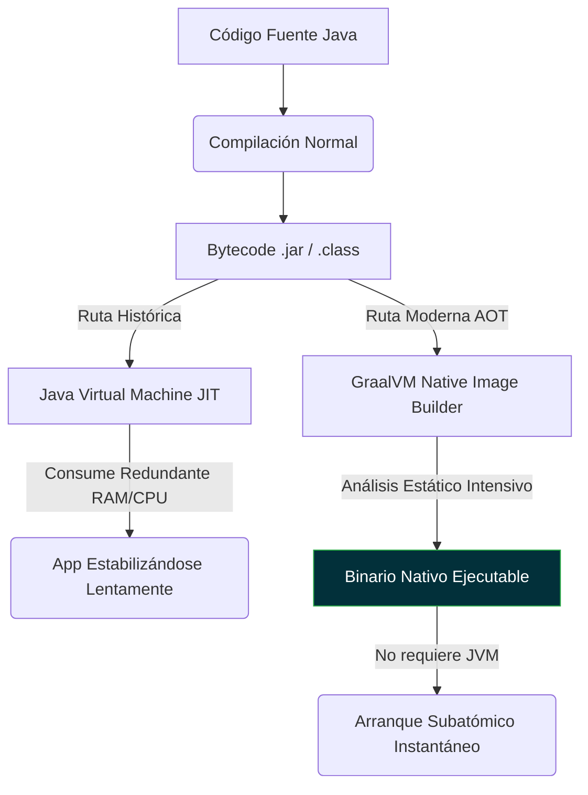

# GraalVM: La Máquina Virtual Políglota de Alto Rendimiento

## Visión General

**GraalVM** es un ecosistema del JDK avanzado (originado por Oracle) capaz de ejecutar aplicaciones Java con un rendimiento excepcional. Su verdadera revolución en el entorno **Cloud Native** proviene de su compilador **Ahead-Of-Time (AOT)**, el cual permite transformar el código en un ejecutable binario nativo cerrado e independiente.

> "GraalVM cambia el paradigma de Java: de requerir una máquina virtual pesada a ejecutarse como un binario minimalista y ultrarrápido, igualando el modelo operativo de C, Go o Rust."

---

## Por Qué es Importante

En la era del Cloud Computing, clústeres de Kubernetes y arquitecturas Serverless (como funciones AWS Lambda), el tiempo de arranque y la memoria inicial representan dinero directo en la factura.

import Tabs from '@theme/Tabs';
import TabItem from '@theme/TabItem';

<Tabs>
<TabItem value="jit" label="El Problema: JVM Tradicional (JIT)">

**Arranque Lento y Pesado**
Al hacer `java -jar`, el componente **JIT (Just-In-Time)** toma el *Bytecode* para calentarlo y compilarlo a código máquina mientras la aplicación se ejecuta.
- Consume muchísima CPU y RAM durante los primeros segundos nomás para escanear rutas.
- Tarda en estabilizarse, obligando a generar pausas iniciales largas en pruebas *liveness* de Kubernetes.
- Genera tiempos muertos inaceptables (**Cold Starts**) en escenarios de pago por milisegundo.

</TabItem>
<TabItem value="aot" label="La Solución: GraalVM (AOT)">

**Arranque Instantáneo**
Su compilador **Ahead-Of-Time** compila de antemano el código, las dependencias y las partes mínimas necesarias del JDK en un artefacto estático.
- Tiempo de arranque reducido a milisegundos.
- Consumo mínimo de memoria RAM inactiva.
- Descarta el motor JIT por completo y elimina el overhead de calentamiento inicial.

</TabItem>
</Tabs>

---

## Arquitectura / Flujo

GraalVM Native Image ejecuta un agresivo análisis estático (escaneo de código muerto) durante la compilación para empaquetar únicamente lo que el programa utilizará.



---

## Implementación

El mayor reto arquitectónico histórico de GraalVM era procesar la **reflexión dinámica** (usada fuertemente por abstracciones como Spring Boot). 

**Quarkus es el puente clave**: Al evaluar la reflexión y mapear los proxies durante la fase previa (*Build Time*), le entrega a GraalVM un mapa exacto del contexto. Así, compilar una aplicación compleja a binario se vuelve casi transparente para el desarrollador.

<Tabs>
<TabItem value="gradle" label="Compilación NATIVA">

Este comando destruye el `.jar` convencional y emite un binario de código máquina.

```bash title="Comando de Gradle"
# Compilará un binario ejecutable para tu Arquitectura/Sistema Operativo actual
./gradlew build -Dquarkus.native.enabled=true
```

</TabItem>
<TabItem value="docker" label="Contenedor Docker">

Las imágenes Docker pasan de pesar ~250MB (usando `openjdk`) a un formato *Micro* de apenas unos escasos **30-45 MB**.

```dockerfile title="src/main/docker/Dockerfile.native-micro"
FROM quay.io/quarkus/quarkus-micro-image:2.0
WORKDIR /work/
COPY build/*-runner /work/application
RUN chmod 775 /work/application
EXPOSE 8080
CMD ["./application", "-Dquarkus.http.host=0.0.0.0"]
```

</TabItem>
</Tabs>

---

## Ejemplo

La diferencia entre mantener la JVM y migrar a GraalVM AOT resalta estadísticamente:

| Característica Clave | Java Virtual Machine (JIT) | GraalVM Native Image (AOT) |
| :--- | :--- | :--- |
| **Formato Físico** | Archivos empaquetados `.jar` o `.war` | Ejecutable binario nativo autónomo (`.exe` / ELF) |
| **Dependencia OS** | Requiere JDK/JRE montado e instalado | **NO REQUIERE** Java instalado en el OS/Docker |
| **Pena de Compilación** | Rápido (Segundos para el Bytecode) | **Extremadamente Lento** (Minutos y alto uso CPU/RAM) |
| **Tiempo de Arranque** | Segundo a Minutos (Warm-up penalty) | **~15 - 30 Milisegundos** |
| **RAM en Inactividad** | ~130 MB - 300 MB base mínima | **~15 MB - 30 MB** absolutos |

---

## Buenas Prácticas

Operar arquitecturas con Native Image requiere un cambio de paradigma en el ciclo de vida de desarrollo:

:::warning Pipeline CI/CD Obligatorio
Construir una imagen nativa (`-Dquarkus.native.enabled=true`) **NUNCA debe hacerse en el ciclo de desarrollo iterativo local**. El proceso de análisis de código muerto consume toda la RAM y la CPU del ordenador por varios minutos. 

Desarrolla localmente siempre sobre la JVM ultrarrápida (`./gradlew quarkusDev`) y delega la compilación nativa final exclusivamente a los servidores de Integración Continua (CI) que empujan a producción.
:::

:::info Arquitectura de Destino
Si el pipeline crea la imagen final para desplegarla en contenedores de Kubernetes, asegúrate de correr el script del build AOT *dentro* de una imagen base de Linux compatible (ej. ejecutando Native Image builder nativo Docker), para que el binario resultante respete los binarios ELF de Linux.
:::

---

## Puntos Clave

1. **Revolución Serverless**: Reducir el tiempo de arranque de cientos de milisegundos a apenas **15ms** hace posible el patrón *Functions as a Service* puro en Java.
2. **Alta Densidad Operativa**: Al desplomar el consumo de RAM, es posible alojar fácilmente de 5 a 10 veces más réplicas del microservicio en el mismo hardware Kubernetes, achicando presupuestos.
3. **Quarkus como Enabler**: Fue Quarkus quien solucionó la complejidad de declarar los metadatos de reflexión para GraalVM en esquemas empresariales, automatizándolo sin fricción.
