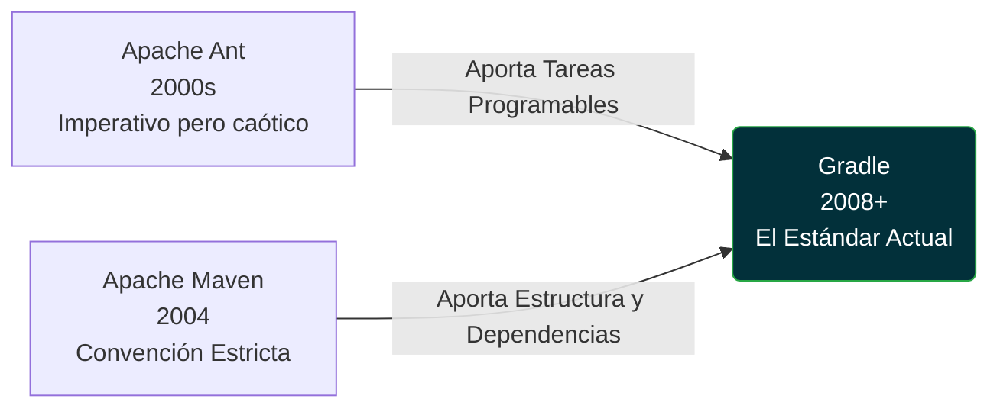

# Gradle: El Sistema de Construcción Moderno

## Visión General

**Gradle** es una herramienta de automatización de compilación de código abierto orientada a la máxima flexibilidad y rendimiento. A diferencia de sus predecesores que usaban XML rígido, Gradle utiliza un **DSL (Domain Specific Language)** expresivo, siendo el estándar moderno **Kotlin**.

> "Un sistema de build moderno no solo compila código; habilita a toda una organización a entregar software de manera consistente y veloz."

---

## Por Qué es Importante

El dominio actual de Gradle en ecosistemas modernos (como Android o entornos Cloud Native) se debe a ventajas operativas medibles.

import Tabs from '@theme/Tabs';
import TabItem from '@theme/TabItem';

<Tabs>
<TabItem value="performance" label="Rendimiento Superior">

**Velocidad Extrema**
Gradle utiliza la caché de compilación (**Build Cache**) y evaluaciones de estado (*UP-TO-DATE*), compilando sólo lo estrictamente necesario. Las compilaciones incrementales son de **2 a 10 veces más rápidas que en Maven**.

</TabItem>
<TabItem value="code" label="Código en lugar de XML">

**Expresividad Máxima**
Al usar Kotlin (`build.gradle.kts`), tu configuración de build es *código real*. Obtienes autocompletado en el IDE, detección de errores en tiempo de escritura y capacidad para refactorizar.

</TabItem>
<TabItem value="daemon" label="Gradle Daemon">

**Arranques Acelerados**
Mantiene un proceso nativo en segundo plano (Daemon), el cual acelera masivamente subsecuentes compilaciones al evitar el tiempo de inicio de la JVM.

</TabItem>
</Tabs>

---

## Arquitectura / Flujo

¿Cómo llegamos a Gradle? La evolución tecnológica de los sistemas de build refleja la necesidad de combinar una estructura férrea con flexibilidad imperativa.



---

## Implementación: El Verdadero Contraste

La principal ventaja del modelo de Gradle con Kotlin no es solo estética, es una drástica reducción matemática de líneas, especialmente al lidiar con plataformas (BOMs), alcances (*scopes*) y exclusiones de librerías. Observa la diferencia manejando el **mismo** bloque lógico.

<Tabs>
<TabItem value="gradle" label="Gradle (Kotlin DSL)">

El enfoque conciso y seguro con solo **12 líneas efectivas**.

```kotlin title="build.gradle.kts"
dependencies {
    // 1. Importación de Plataforma (BOM) en una sola línea
    implementation(enforcedPlatform("io.quarkus.platform:quarkus-bom:3.9.2"))
    
    // 2. Dependencias tradicionales
    implementation("io.quarkus:quarkus-resteasy-reactive")
    
    // 3. Exclusión de librerías en un bloque limpio
    implementation("io.quarkus:quarkus-hibernate-orm") {
        exclude(group = "org.jboss.logging")
    }
    
    // 4. Scopes nativos declarativos
    testImplementation("io.quarkus:quarkus-junit5")
}
```

</TabItem>
<TabItem value="maven" label="Maven (XML)">

El estándar heredado exige más de **30 líneas anidadas** para lograr matemáticamente **la misma construcción de dependencias**.

```xml title="pom.xml"
<!-- 1. Importación de Plataforma (BOM) verborrágica -->
<dependencyManagement>
    <dependencies>
        <dependency>
            <groupId>io.quarkus.platform</groupId>
            <artifactId>quarkus-bom</artifactId>
            <version>3.9.2</version>
            <type>pom</type>
            <scope>import</scope>
        </dependency>
    </dependencies>
</dependencyManagement>

<dependencies>
    <!-- 2. Dependencias tradicionales -->
    <dependency>
        <groupId>io.quarkus</groupId>
        <artifactId>quarkus-resteasy-reactive</artifactId>
    </dependency>
    
    <!-- 3. Exclusión profundamente anidada -->
    <dependency>
        <groupId>io.quarkus</groupId>
        <artifactId>quarkus-hibernate-orm</artifactId>
        <exclusions>
            <exclusion>
                <groupId>org.jboss.logging</groupId>
                <artifactId>*</artifactId>
            </exclusion>
        </exclusions>
    </dependency>
    
    <!-- 4. Scopes declarados en propiedad hija -->
    <dependency>
        <groupId>io.quarkus</groupId>
        <artifactId>quarkus-junit5</artifactId>
        <scope>test</scope>
    </dependency>
</dependencies>
```

</TabItem>
</Tabs>

---

## Ejemplo

Para inicializar un proyecto completo, estos son los archivos de configuración requeridos y cómo se interconectan.

```kotlin title="settings.gradle.kts (Raíz del proyecto)"
rootProject.name = "mi-microservicio-backend"
```

```properties title="gradle.properties (Entorno)"
# Variables de entorno y rendimiento de configuración
org.gradle.caching=true
org.gradle.parallel=true
quarkusPlatformGroupId=io.quarkus.platform
```

```kotlin title="build.gradle.kts (Lógica del proyecto)"
plugins {
    id("io.quarkus")
}

dependencies {
    implementation("io.quarkus:quarkus-resteasy")
    implementation("io.quarkus:quarkus-hibernate-orm-panache")
    
    testImplementation("io.quarkus:quarkus-junit5")
    testImplementation("io.rest-assured:rest-assured")
}
```

---

## Velocidad: ¿Es realmente más rápido que Maven?

La respuesta es rotundamente **Sí**. El diseño estructural de Gradle Inc. está fundamentado en la evitación del trabajo redundante. Mientras que Maven ejecuta sus fases de construcción de manera imperativa y casi siempre lineal (compilando de cero), Gradle instrumenta gráficos acíclicos dirigidos (DAGs) para reutilizar inteligentemente los resultados ya obtenidos.

<Tabs>
<TabItem value="incremental" label="Compilación Incremental">

### Modificación de un solo archivo
Cuando modificas una clase de servicio o controlador, el motor de Gradle sabe exactamente a nivel de grafo qué componentes dependen de él, y recompila **únicamente esa fracción del árbol**.

- **Maven:** Ejecuta fases estandarizadas que pueden tomar ~15 segundos en microservicios medios.
- **Gradle:** Detecta estados `UP-TO-DATE` y completa la inyección en **~0.6 segundos** (hasta **85x veces más rápido** en el ciclo diario de código).

</TabItem>
<TabItem value="cache" label="Limpieza y Caché Global">

### Cambio de Ramas (Clean Build)
Si cambias a una rama de `git` antigua que un compañero (o tú mismo ayer) ya había compilado, el *Build Cache* de Gradle intercepta la tarea.

- **Maven:** Destruye la carpeta `target/` y pierde minutos valiosos recompilando todo el código fuente al 100%.
- **Gradle:** Descarga inmediatamente los *artifacts* ya pre-calculados de la caché local o concurrente, reduciendo tiempos de 1 minuto a apenas **~2 o 4 segundos** (típicamente de **3x a 10x más rápido**).

</TabItem>
</Tabs>

---

## Buenas Prácticas

Para operar Gradle como un experto en cualquier servidor o pipeline de Integración Continua (CI/CD):

### El Wrapper (gradlew)

:::tip El Poder del Wrapper
No utilices instalaciones globales de Gradle. El script `gradlew` garantiza que cualquier máquina (o pipeline CI/CD) descargará la versión exacta que requiere el proyecto de forma automática.
:::

```bash title="Comandos CLI Recomendados"
# Arrancar la aplicación Quarkus en modo dev
./gradlew quarkusDev

# Compilar y empaquetar para producción
./gradlew build

# Ejecutar las pruebas unitarias
./gradlew test
```

### Gestión de la Caché Local

:::warning Omitir del Control de Versiones
Ignora globalmente en tu `.gitignore` la carpeta oculta **`.gradle/`**. Se genera automáticamente por el daemon y es donde se almacena la caché incremental y dependencias temporales locales.
:::

---

## Puntos Clave

1. **Rendimiento Comprobable**: Gradle reduce drásticamente los tiempos muertos en el desarrollo gracias a su Daemon y Build Cache.
2. **Predictibilidad Repetible**: Usar `gradlew` asegura que un build funcione idénticamente en la máquina del junior, en la del líder y en el servidor de despliegue.
3. **DSL Nativo**: Migrar de XML a Kotlin DSL introduce ingeniería de software real a los archivos de configuración (tipado seguro, variables, validación pre-compilación).
