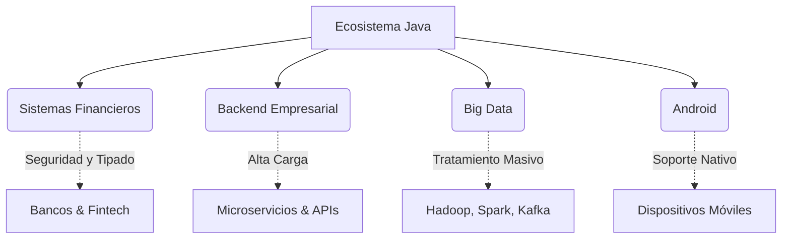

# Java: Poderes, Uso y Evolución

Java es uno de los lenguajes de programación más utilizados y probados en el mundo empresarial. Su lema **"Escribe una vez, ejecuta en cualquier lugar"** (WORA) lo convirtió en el rey del backend a nivel mundial.

:::tip La Ley de Java
El código escrito hace 20 años sigue ejecutándose perfectamente en las máquinas virtuales modernas. Esa es la verdadera definición de **Estabilidad**.
:::

## 🚀 ¿Por qué elegir Java hoy?

El ecosistema de Java no solo ha sobrevivido, sino que ha evolucionado para dominar los entornos modernos de nube y microservicios.

import Tabs from '@theme/Tabs';
import TabItem from '@theme/TabItem';

<Tabs>
<TabItem value="performance" label="Rendimiento Cercano al Metal">

Gracias al compilador **JIT (Just-In-Time)** y optimizaciones en caliente, Java es extremadamente rápido para cargas de trabajo prolongadas, alcanzando velocidades comparables a entornos nativos como C/C++.

</TabItem>
<TabItem value="ecosystem" label="Ecosistema Inmenso">

Posee la colección de librerías de código abierto más grande del mundo (**Maven Central**), lo que permite resolver prácticamente cualquier problema sin tener que reinventar la rueda.

</TabItem>
<TabItem value="concurrency" label="Multihilo Revolucionario">

Con la introducción de los **Virtual Threads** (Project Loom), Java puede manejar *millones* de hilos concurrentes con un costo de memoria casi nulo.

</TabItem>
</Tabs>

---

## 🏗️ Casos de Uso Principales

El dominio de Java es absoluto en sistemas que requieren alta disponibilidad y escalabilidad masiva.



---

## ⏳ La Evolución Lógica (Versiones LTS)

Desde Java 9, la cadencia de lanzamiento entrega una nueva versión cada 6 meses, consolidando el valor empresarial en las versiones **LTS (Long-Term Support)**.

### La Línea de Tiempo de LTS

<Tabs>
<TabItem value="java8" label="Java 8 (2014)">

**La Gran Revolución Funcional**
- Introdujo **Lambdas** (`() -> {}`) y la API **Streams**.
- Añadió `Optional` para mitigar el infame `NullPointerException`.
- *Uso:* Aún hoy, es la base de muchos sistemas legacy.

```java title="Procesamiento Funcional con Streams y Lambdas"
List<String> names = Arrays.asList("Ana", "Juan", "Pedro");
names.stream()
    .filter(name -> name.startsWith("A"))
    .forEach(System.out::println);
```

</TabItem>
<TabItem value="java11" label="Java 11 (2018)">

**La Primera LTS Moderna**
- Inferencia de tipos con `var`.
- **HTTP Client moderno** (Reactivo, soportando HTTP/2).
- Herramientas mejoradas para manipular Strings (`isBlank()`, `lines()`).

```java title="Inferencia de Tipos y Nuevo HTTP Client"
var request = HttpRequest.newBuilder()
    .uri(URI.create("https://api.example.com"))
    .build();

var client = HttpClient.newHttpClient();
var response = client.send(request, HttpResponse.BodyHandlers.ofString());
System.out.println(response.body());
```

</TabItem>
<TabItem value="java17" label="Java 17 (2021)">

**El Estándar Actual del Mercado**
- **Text Blocks:** Strings multilínea usando `"""`.
- **Pattern Matching básico** y Clases Selladas (`Sealed Classes`).
- **Records:** Clases inmutables para transportar datos, eliminando boilerplate.

```java title="DTOs Inmutables con Records"
// Adiós a docenas de líneas de getters, setters, equals y hashCode
public record UserDto(String name, String email) {}
```

</TabItem>
<TabItem value="java21" label="Java 21 (2023)">

**La Nueva Revolución Concurrente**
- **Pattern Matching avanzado** para constructores `switch`.
- **Sequenced Collections:** Interfaces claras para operaciones con orden (`getFirst()`, `getLast()`).
- **Virtual Threads (Loom):** Hilos extremadamente ligeros. Permite escalar servidores web de manera absurda sin programación reactiva compleja.

```java title="Escalabilidad Masiva con Virtual Threads"
try (var executor = Executors.newVirtualThreadPerTaskExecutor()) {
    IntStream.range(0, 1_000_000).forEach(i -> {
        // Ejecución de 1 millón de hilos concurrentes sin colapsar la memoria
        executor.submit(() -> System.out.println("Hilo ligero " + i));
    });
}
```

</TabItem>
<TabItem value="java25" label="Java 25 (LTS Futura)">

**La Próxima Frontera**
- **Valhalla (Avance):** Tipos de valor para acercar el rendimiento de memoria al de C++ (sin punteros a objetos pequeños).
- **Panama:** Nueva Foreign Function & Memory API (Reemplaza JNI, mil veces más rápida).

```java title="Tipos de Valor Cercanos al Metal (Proyección Valhalla)"
// Concepto futuro: objetos compactos sin sobrecarga de identidad en memoria
public value record Point(int x, int y) {}

Point p1 = new Point(10, 20);
```

</TabItem>
</Tabs>

---

## 🎯 Conclusión Arquitectónica

> "Una arquitectura moderna construida sobre **Java 21 o Java 25** combina la pureza del código imperativo tradicional con la escalabilidad extrema de sistemas puramente asíncronos."

:::info ⚡ En este curso
Al trabajar con características modernas (como **Quarkus**), las empresas apuntan directamente a **Java 21 o Java 25**, aprovechando los *Virtual Threads* para lograr un rendimiento insuperable en la nube.
:::
