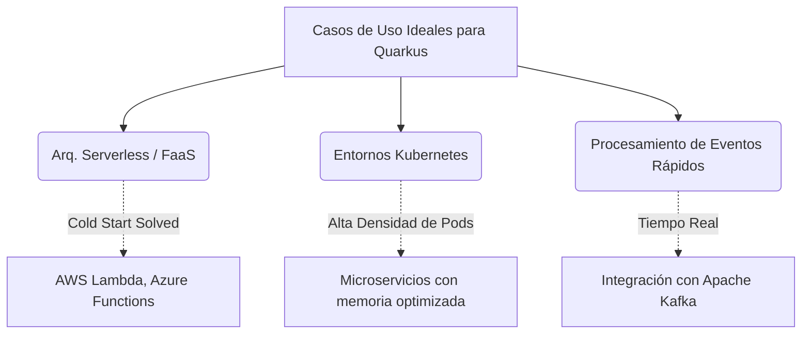

# Quarkus: Supersonic Subatomic Java

**Quarkus** es un framework diseñado por Red Hat para programar aplicaciones Java enfocadas 100% en la era **Cloud-Native, Serverless y Kubernetes.**

Toma el enorme y probado ecosistema Java (Hibernate, RESTEasy, Kafka, Camel) y lo compila de manera inteligente para consumir una fracción de la memoria tradicional y arrancar casi instantáneamente.

:::tip El Propósito de Quarkus
Quarkus no reinventa las librerías; reinventa **cómo** se cargan y ejecutan esas librerías en la nube.
:::

---

## ⚡ ¿Por qué usar Quarkus? Sus Superpoderes

import Tabs from '@theme/Tabs';
import TabItem from '@theme/TabItem';

<Tabs>
<TabItem value="native" label="Compilación Nativa">

**GraalVM al Máximo**
Puede convertir el código Java en un binario ejecutable específico para el sistema operativo, deshaciéndose por completo de la JVM en el entorno de producción.

```bash title="Compilando un ejecutable nativo puro"
./mvnw package -Pnative
```

</TabItem>
<TabItem value="startup" label="Arranque Ultra-Rápido">

**Serverless Real en Java**
Un microservicio compilado nativamente puede arrancar en **15 milisegundos**. Ideal para cargas de trabajo "Serverless" (como AWS Lambda) que necesitan escalar de 0 a 1000 instancias al instante.

</TabItem>
<TabItem value="dx" label="Experiencia del Desarrollador">

**Developer Joy (Live Reloading)**
Guarda el archivo en tu IDE y los cambios se aplican instantáneamente, sin necesidad del tedioso proceso de recompilar y reiniciar el contenedor.

```bash title="Modo Dev: Código y recarga en caliente"
./mvnw compile quarkus:dev
```

</TabItem>
<TabItem value="reactive" label="Unificado">

**Reactivo e Imperativo Combinados**
Quarkus te permite escribir código secuencial tradicional y código reactivo/asíncrono puro (usando Mutiny) en el mismo proyecto y bajo la misma infraestructura.

</TabItem>
</Tabs>

---

## 🌍 ¿Dónde brilla más Quarkus?

Quarkus es la herramienta perfecta cuando los recursos y el tiempo de respuesta inicial importan.



---

## 🥊 Quarkus vs Spring Boot: El Cambio de Paradigma

Spring Boot sigue siendo el rey indiscutible del backend enterprise tradicional, pero Quarkus es la evolución necesaria para la nube. La diferencia radical está en **CUÁNDO** se procesa la información.

:::info El Cambio Fundamental (Build-Time vs Run-Time)
> "Mover el procesamiento costoso de la ejecución al momento de compilación es el superpoder arquitectónico de Quarkus."
:::

### Comparativa Arquitectónica

<Tabs>
<TabItem value="spring" label="Spring Boot (Dynamic Runtime)">

Utiliza reflexión masiva, escaneo de classpath, carga dinámica de clases y proxies en **tiempo de ejecución**. Todo esto ralentiza el arranque inicial de la aplicación y consume gran cantidad de memoria RAM de base (overhead inútil en la nube).

</TabItem>
<TabItem value="quarkus" label="Quarkus (Build Time)">

Mueve la mayoría de estos procesos (escaneo, parseo de configs, preparación de mapeos) al **tiempo de compilación**. Cuando el binario de la app arranca en el servidor, *ya sabe exactamente todo lo que tiene que hacer*. Se elimina toda la reflexión innecesaria.

</TabItem>
</Tabs>

### Beneficios en Términos Numéricos

El impacto en la infraestructura es inmediato y contundente:

| Métrica Crítica | Spring Boot (Tradicional) | Quarkus (JVM) | Quarkus + GraalVM (Nativo) |
| :--- | :--- | :--- | :--- |
| **Tiempo de Arranque (First Response)** | ~4.0 a 10.0 segundos | ~0.7 segundos | **~0.015 segundos (15ms)** |
| **Consumo de Memoria RAM (RSS)** | ~250 MB mínimo | ~130 MB | **~12 a 35 MB** |
| **Densidad de Despliegue (Kubernetes)** | Baja (1x pod) | Media (2x pods) | **Alta (10x pods)** |

---

## 🏢 Ventajas Tangibles para la Empresa

1. **Factura Cloud más barata:** Si AWS te cobra por RAM y milisegundos, correr Quarkus nativo (35MB y 15ms de arranque) disminuye tus costos operativos radicalmente en comparación con un jar de Spring Boot que exige 512MB de RAM por instancia.
2. **Escalabilidad Inmediata:** Ante un pico repentino de tráfico (ej. "Black Friday"), Kubernetes necesita instanciar réplicas de tus servicios. Quarkus escala en milisegundos; los usuarios finales nunca sufrirán de un "Cold Start" lento.
3. **Curva de Aprendizaje Suave:** Quarkus no te obliga a aprender un lenguaje ni un ecosistema nuevo; soporta muchas APIs de Jakarta EE de siempre e, incluso, ofrece *compatibilidad nativa con anotaciones de Spring* (por ejemplo, puedes usar `@RestController` o `@Autowired` sin problemas en un proyecto Quarkus).
