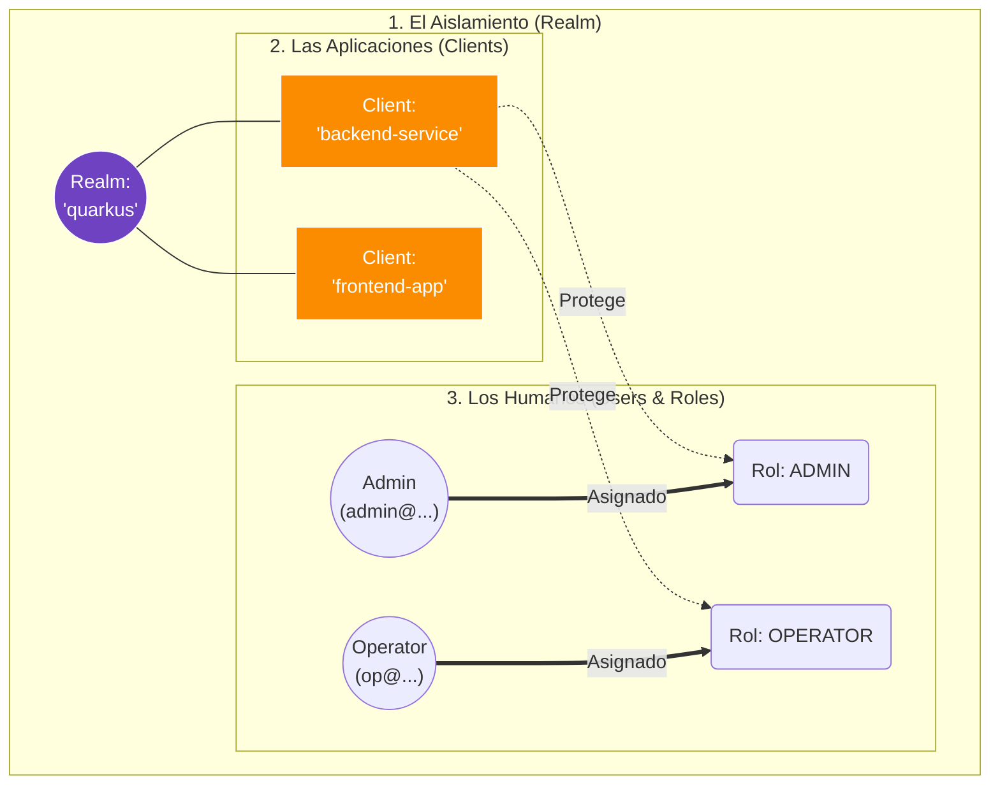

# Guía de Configuración Local de Keycloak

Este documento es una guía práctica (y fundamental) para arrancar **Keycloak** en tu máquina de desarrollo, prepararlo como tu Proveedor de Identidad autorizado, e inyectarlo de forma segura en nuestro microservicio Quarkus `cja-msa-sc-security`.

---

## 1. El Modelo Mental de Keycloak

Antes de tocar la consola o levantar contenedores, es vital entender la jerarquía estructural interna de Keycloak. Todo en este servidor gira en torno a tres grandes capas contenedoras:



:::info Aislamiento Estricto
Un **Realm** es como un edificio corporativo cerrado. Los usuarios, tokens y políticas que crees dentro del Realm `quarkus` no tienen forma alguna de interactuar o iniciar sesión en otro Realm diferente de la misma máquina.
:::

---

## 2. Puesta en Marcha (Despliegue Docker)

La forma más limpia y profesional de correr Keycloak en un entorno de desarrollo (evitando contaminar tu sistema operativo con instalaciones nativas de Java) es utilizar un contenedor efímero de Docker en modo 개발 (`start-dev`).

```bash
docker run -p 8180:8080 -e KEYCLOAK_ADMIN=admin -e KEYCLOAK_ADMIN_PASSWORD=admin quay.io/keycloak/keycloak:24.0.0 start-dev
```

:::tip Consola Administrativa
Una vez descargada la imagen y arrancado el contenedor, tu motor de seguridad estará escuchando inmediatamente en `http://localhost:8180`. Tus credenciales maestras iniciales serán `admin` / `admin`.
:::

---

## 3. Topología de la Seguridad (Consola Visual)

Una vez logueado en la Consola Administrativa de Keycloak (`http://localhost:8180`), debemos replicar el Modelo Mental que vimos en el gráfico superior construyendo las piezas una por una.

import Tabs from '@theme/Tabs';
import TabItem from '@theme/TabItem';

<Tabs>
<TabItem value="realm" label="1. Crear Realm">

1. Haz clic en el menú desplegable **master** (arriba a la izquierda).
2. Haz clic en el botón azul **Create Realm**.
3. En el campo **Realm name**, escribe `quarkus` y presiona **Create**.

</TabItem>
<TabItem value="client" label="2. Crear Cliente">

Dentro de tu nuevo Realm `quarkus`:
1. Navega a **Clients** y presiona **Create client**.
2. **General Settings:**
   - Tipo: `OpenID Connect`
   - Client ID: `backend-service` (Debe coincidir EXACTAMENTE con tu API Quarkus).
3. **Capability config:**
   - Client authentication: **ON** *(Requerido para habilitar el Client Secret).*
   - Flujos: Mantén `Standard flow` y `Direct access grants` activados.
4. **Login settings:**
   - Valid redirect URIs: `*`
   - Web origins: `*`
   - Guarda los cambios.
5. 🔑 Ve a la nueva pestaña **Credentials** y copia y guarda el **Client Secret** generado.

</TabItem>
<TabItem value="users" label="3. Usuarios y Roles">

**Paso A: Crear los Roles**
1. Navega a **Realm roles** -> **Create role**.
2. Crea exactamente estos tres roles: `ADMIN`, `OPERATOR`, `CONSULTATION`.

**Paso B: Crear el Personal**
1. Navega a **Users** -> **Add user**.
2. Crea un usuario con Username `admin` y otro `operator01`.
3. 🚨 Activa **Email verified: ON** en ambos para evitar bloqueos.

**Paso C: Credenciales y Mapeo**
1. En el perfil de cada usuario, ve a la pestaña **Credentials** -> **Set password**. Guarda su contraseña y **apaga el switch de Temporary** (CRÍTICO).
2. Ve a la pestaña **Role mapping** -> **Assign role** y pégale el rol `ADMIN` al usuario admin, y `OPERATOR` al usuario operator01.

</TabItem>
</Tabs>

---

## 4. Inyección en Quarkus (`application.properties`)

Tu microservicio todavía no sabe que Keycloak existe. Para atar ambos mundos criptográficamente, inyecta las siguientes coordenadas en tu archivo `application.properties`:

```properties title="src/main/resources/application.properties"
# ── Configuración Keycloak (Delegación OIDC) ────────────────
quarkus.oidc.auth-server-url=${OIDC_AUTH_SERVER_URL:http://localhost:8180/realms/quarkus}
quarkus.oidc.client-id=${OIDC_CLIENT_ID:backend-service}

# 🚨 Reemplaza esto con el Secret real copiado del Paso 3
quarkus.oidc.credentials.secret=${OIDC_CLIENT_SECRET:tYbv6fT4UDIEMR6xWks2gvkBeszjzrCV}

# Configuración Interna Pura de Quarkus
quarkus.oidc.roles.role-claim-path=realm_access/roles
quarkus.oidc.token.require-jwt-introspection-only=true

# ── Facade Keycloak (MicroProfile REST Client) ───────────────
quarkus.rest-client.keycloak-api.url=${OIDC_AUTH_SERVER_URL:http://localhost:8180/realms/quarkus}
```

:::caution Secreto Expuesto
Por seguridad, un `Client Secret` en producción jamás debe vivir dentro del `application.properties`. Se inyecta mediante variables de entorno en el pipeline CI/CD o a través de Kubernetes Secrets.
:::

---

## 5. Auditoría Local: Probando la API

Quarkus ya está asegurado. Probemos el ciclo completo de vida del JWT actuando como el cliente (Frontend) disparando comandos cURL contra nuestro backend en el puerto `8080`.

<Tabs>
<TabItem value="login" label="Paso 1: Obtener Token">

Hacemos un *Bypass Request* hacia el Facade de nuestro backend de seguridad.

```bash
curl -X POST "http://localhost:8080/api/v1/auth/login" \
     -H "Content-Type: application/json" \
     -d '{"username": "admin","password": "admin"}'
```

*Copia el inmenso string devuelto en el campo `"access_token"`, y si quieres probar el deslogueo, copia también el `"refresh_token"`.*

</TabItem>
<TabItem value="auth" label="Paso 2: Consumir API (201)">

Usamos el token inyectándolo en la cabecera `Authorization: Bearer <TOKEN>` para crear un nuevo usuario en nuestro sistema. Como el token pertenece a un `ADMIN`, pasará la seguridad y Quarkus responderá `201 Created`.

```bash
curl -v -X POST "http://localhost:8080/api/v1/users" \
     -H "Content-Type: application/json" \
     -H "Authorization: Bearer <TU_ACCESS_TOKEN_AQUI>" \
     -d '{
         "username": "usuario_valido",
         "email": "test@dominio.com",
         "password": "Password123!",
         "fullName": "Usuario Valido"
     }'
```

</TabItem>
<TabItem value="forbidden" label="Paso 3: Bloqueo RBA (403)">

Si repites el **Paso 1** pero logueándote como `operator01` (para obtener su token) y lo utilizas en el **Paso 2**, la arquitectura detectará instantáneamente la violación de RBAC (Role-Based Access Control).

Quarkus evaluará la anotación `@RolesAllowed({"ADMIN"})` de la clase Java, la comparará con los roles contenidos criptográficamente en el JWT, y reventará la petición devolviendo un absoluto **HTTP 403 Forbidden**.

</TabItem>
</Tabs>
