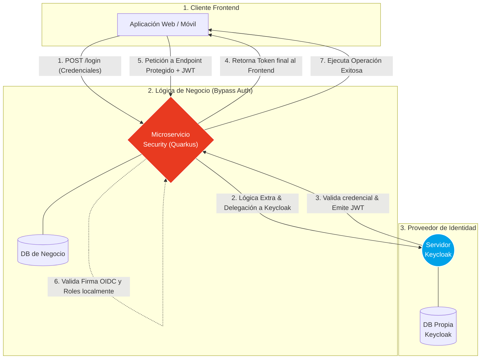

# Keycloak (Identity Provider)

**Keycloak** es una plataforma de software open-source (patrocinada por Red Hat) que proporciona Identidad y Gestión de Acceso (IAM) de forma centralizada para aplicaciones modernas, APIs y microservicios.

En lugar de que cada microservicio deba reinventar la rueda creando sus propias tablas de `Usuario` y `Roles`, implementando su propia encriptación bcrypt, o codificando flujos de "Recuperar contraseña por email", tú **delegas el 100% de la responsabilidad de autenticación a Keycloak**.

:::tip La ley de Autenticación
"No programes tu propio login. Alguien más ya lo hizo mejor, más seguro y gratis."
:::

---

## 1. Radiografía Visual: La Delegación de Identidad

En nuestra arquitectura específica, el microservicio de seguridad actúa como un **Bypass Inteligente** (o *Proxy de Autenticación*). El Frontend no se comunica directamente con Keycloak; en su lugar, ataca los endpoints de nuestro backend. 

Esto nos permite inyectar **lógica de negocio propia** (como registrar intentos de auditoría, requerir autenticación multi-factor MFA o disparar eventos asíncronos) antes o después de delegar la validación real de los datos al servidor de identidad. Además, nuestro microservicio expone rutas de administración que Quarkus protege extrayendo remotamente los roles del token.



:::tip Relación Desacoplada en la Autorización (Paso 6)
Aunque usamos a nuestro backend como intermediario para el Login (Pasos 1 al 4), **la autorización es descentralizada**. Cuando el cliente manda posteriormente su JWT en la cabecera (Paso 5), Quarkus **no realiza una llamada por red a Keycloak** para preguntar si ese token es válido. Valida la firma criptográfica y mapea los `Roles` en milisegundos utilizando memoria local.
:::

---

## 2. El Dilema de la Autenticación

Existen tres caminos tradicionales para abordar el inicio de sesión en un proyecto de software empresarial:

import Tabs from '@theme/Tabs';
import TabItem from '@theme/TabItem';

<Tabs>
<TabItem value="keycloak" label="🏆 Servidor OIDC (Keycloak)">

La solución definitiva para control total y cero licenciamiento.

- **Esfuerzo**: Inmediato (Despliegue Docker). Soporte nativo para Social Login (Autenticación con Google, GitHub) sin programar backend.
- **Costo**: **Gratis**. Solo pagas tu infraestructura (Ej. tu cluster de Kubernetes). No hay límite de usuarios.
- **Single Sign-On (SSO)**: Nativo. Te logueas en una app y todas las de tu ecosistema confían en esa identidad (como Google Suite).
- **Personalización**: **Total**. Eres dueño de tus datos y puedes inyectar extensiones Java (SPIs) para alterar sus motores.

</TabItem>
<TabItem value="saas" label="SaaS en la Nube (Auth0, Cognito)">

Soluciones comerciales totalmente gestionadas y en modalidad "As a Service".

- **Esfuerzo**: Inmediato. Panel listo para usar.
- **Costo**: Alto y escalable exponencialmente. Pagas por volumen de usuarios activos (MAUs = Monthly Active Users).
- **Single Sign-On (SSO)**: Nativo.
- **Personalización**: Parcial y con Vendor Lock-in (Atrapado al proveedor). Los datos de tus usuarios viven en sus servidores gringos.

</TabItem>
<TabItem value="diy" label="Hazlo tú Mismo (Crear API Login)">

La ruta tradicional universitaria y la más peligrosa en el mundo moderno.

- **Esfuerzo**: Altísimo (Meses de trabajo duro resolviendo: Recuperar Clave, Doble Factor [MFA], Bloqueo por fuerza bruta, Captchas).
- **Costo**: "Gratis" (Pero un insano costo de horas-hombre para la empresa).
- **Single Sign-On (SSO)**: Inexistente. Tendrás que re-programar un protocolo complejo como OIDC desde cero.
- **Seguridad**: Muy propenso a errores humanos y filtraciones de seguridad catastróficas.

</TabItem>
</Tabs>

---

## 3. Integración "Cero Esfuerzo" con Quarkus

En nuestro microservicio `cja-msa-sc-security`, configuramos Keycloak mediante el estándar OIDC (OpenID Connect). Gracias a las extensiones de Quarkus, es literalmente una o dos líneas de configuración.

<Tabs>
<TabItem value="properties" label="application.properties">

En la configuración, no verás algoritmos complejos. Delegamos todo apuntando nuestro microservicio a la URL del **Realm** de Keycloak.

```properties title="src/main/resources/application.properties"
# La URL donde vive el servidor IAM y su "Espacio de trabajo" (Realm)
quarkus.oidc.auth-server-url=http://localhost:8080/realms/quarkus

# El nombre del cliente configurado dentro de Keycloak
quarkus.oidc.client-id=backend-service

# Exige que todo endpoint autenticado requiere un JWT válido
quarkus.http.auth.permission.authenticated.paths=/*
quarkus.http.auth.permission.authenticated.policy=authenticated
```

</TabItem>
<TabItem value="admin" label="Consola Keycloak">

En la interfaz gráfica de Keycloak (típicamente en el puerto `8080`), realizas 3 sencillos pasos topológicos:

1. **Crear un Realm**: El espacio seguro de tu aplicación (Ej. `quarkus`).
2. **Crear un Client**: Para identificar quién se está conectando (Ej. `backend-service`).
3. **Crear Usuarios/Roles**: Tu masa laboral o clientes con contraseñas que ellos mismos gestionan.

</TabItem>
</Tabs>

:::info Autenticación Ciega
Una vez configurado, cualquier petición HTTP (como `/api/v1/users`) a Quarkus que no contenga un *Bearer Token* firmado criptográficamente por ese Realm de Keycloak, será automáticamente rechazada con un `401 Unauthorized` antes de que siquiera llegue a tus clases Java.
:::
