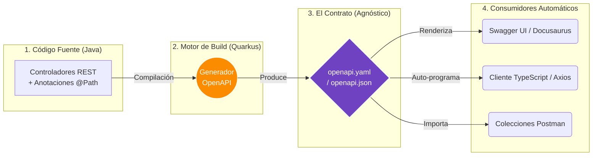

# Documentación Automática con OpenAPI (Swagger)

**OpenAPI Specification (OAS)** —anteriormente conocida como Swagger— es el estándar absoluto de la industria para definir interfaces RESTful. No es simplemente documentación; **es un contrato programático y estricto** que describe las capacidades de tu API de una forma que tanto humanos como máquinas pueden comprender y procesar.

:::tip Documentación Automática
La mejor documentación de una API es la que no tienes que escribir a mano.
:::

---

## 1. Radiografía Visual: El Flujo OpenAPI

El inmenso poder de OpenAPI radica en la **inversión de la carga de trabajo**. En sistemas modernos como Quarkus, tú no escribes el documento; tú escribes el código, y el framework deduce y genera el contrato matemático.



:::tip Única Fuente de Verdad
Al derivarse directamente del código compilado, es mecánicamente imposible que tu documentación y el comportamiento real del backend estén desfasados.
:::

---

## 2. El Fin de la Documentación Desactualizada

Históricamente, los equipos de desarrollo dependían de documentos Word, páginas de Confluence o colecciones de Postman compartidas para saber "cómo llamar a un endpoint". 

Esto generaba tres problemas graves paralizando a los equipos de Frontend y QA:
1. **La Asincronía Humana:** El backend cambia un tipo `integer` a `string`, pero olvida actualizar la Wiki. El Frontend explota en producción.
2. **Contratos Ambiguos:** Postman muestra un *ejemplo* de un payload, pero no te dice cuál es la longitud máxima exacta permitida de un campo de contraseña.
3. **El Boilerplate Front:** Los ingenieros de Frontend desperdiciaban horas programando interfaces de TypeScript y fetchers Axios a mano copiando los datos de la Wiki.

### Evolución del Ecosistema

import Tabs from '@theme/Tabs';
import TabItem from '@theme/TabItem';

<Tabs>
<TabItem value="openapi" label="🏆 OpenAPI (El Estándar)">

- **Mantenimiento**: Automático. El código *es* la documentación.
- **Precisión Técnica**: Matemática. Valida tipos exactos, límites (min/max), enteros vs flotantes, nulos y requeridos.
- **Integración UI**: Dinámica. Swagger UI o Redoc renderizan consolas interactivas donde el desarrollador puede ejecutar llamadas reales a la API directamente desde el navegador.

</TabItem>
<TabItem value="postman" label="Colecciones Postman">

- **Mantenimiento**: Manual. Requiere exportar e importar archivos JSON constantemente o pagar licenciamiento corporativo para sincronizar workspaces.
- **Precisión Técnica**: Media. Es brutal para lanzar pruebas rápidas e integradas, pero un mal mecanismo para gobernar un contrato estricto de tipos de datos.

</TabItem>
<TabItem value="wiki" label="Wikis / Confluence">

- **Mantenimiento**: Engorroso. Se desactualiza el mismo día que se publica.
- **Precisión Técnica**: Sujeta a error y omisión humana. Texto plano sin capacidad de validación programática.

</TabItem>
</Tabs>

---

## 3. La Anatomía de la Especificación: El Contrato Completo

Para que OpenAPI sea útil, no basta con exponer la ruta; debemos documentar cabalmente **qué entra, qué sale y por qué falla**. Quarkus utiliza las anotaciones de **MicroProfile OpenAPI** (`org.eclipse.microprofile.openapi.annotations.*`).

Observemos cómo se documenta profesionalmente un endpoint crítico como el Login:

<Tabs>
<TabItem value="java" label="1. El Código Java (Anotado)">

El desarrollador enriquece el controlador y los DTOs con descripciones semánticas.

```java title="AuthResource.java"
import org.eclipse.microprofile.openapi.annotations.Operation;
import org.eclipse.microprofile.openapi.annotations.enums.SchemaType;
import org.eclipse.microprofile.openapi.annotations.media.Content;
import org.eclipse.microprofile.openapi.annotations.media.Schema;
import org.eclipse.microprofile.openapi.annotations.parameters.RequestBody;
import org.eclipse.microprofile.openapi.annotations.responses.APIResponse;
import org.eclipse.microprofile.openapi.annotations.tags.Tag;
import jakarta.ws.rs.POST;
import jakarta.ws.rs.Path;

@Path("/api/v1/auth")
@Tag(name = "Autenticación", description = "Operaciones de inicio de sesión y MFA")
public class AuthResource {

    @POST
    @Path("/login")
    @Operation(
        summary = "Iniciar sesión de usuario",
        description = "Valida credenciales y retorna un access_token o un mfa_token si corresponde."
    )
    @RequestBody(
        required = true,
        content = @Content(
            mediaType = "application/json",
            schema = @Schema(implementation = LoginRequestDto.class)
        )
    )
    @APIResponse(
        responseCode = "200",
        description = "Login exitoso o confirmación de requerimiento MFA",
        content = @Content(mediaType = "application/json", schema = @Schema(implementation = LoginResponseDto.class))
    )
    @APIResponse(
        responseCode = "401",
        description = "Credenciales inválidas"
    )
    public LoginResponseDto login(LoginRequestDto request) {
        return authService.authenticate(request);
    }
}
```

```java title="LoginRequestDto.java"
@Schema(name = "LoginRequest", description = "Payload para iniciar sesión")
public class LoginRequestDto {
    @Schema(required = true, example = "user", description = "El nombre de usuario o email")
    public String username;

    @Schema(required = true, example = "password123", minLength = 8, description = "Contraseña en texto plano")
    public String password;
}
```

```java title="LoginResponseDto.java"
@Schema(name = "LoginResponse", description = "Respuesta de inicio de sesión")
public class LoginResponseDto {
    @Schema(description = "Nombre de usuario autenticado")
    public String username;

    @Schema(description = "JWT Token principal para consultas a la API")
    public String accessToken;
}
```

</TabItem>
<TabItem value="yaml" label="2. El Resultado OpenAPI Completo">

Quarkus escanea las anotaciones y en tiempo de compilación genera un contrato estricto e irrompible.

```yaml title="openapi.yaml"
openapi: 3.0.3
info:
  title: Security Microservice API
  description: "API de seguridad, gestión de usuarios, login y MFA."
  version: 1.0.0
servers:
  - url: http://localhost:8080
    description: Servidor de Desarrollo Local
paths:
  /api/v1/auth/login:
    post:
      tags:
        - Autenticación
      summary: "Iniciar sesión de usuario"
      description: "Valida credenciales y retorna un access_token o un mfa_token si corresponde."
      requestBody:
        required: true
        content:
          application/json:
            schema:
              $ref: '#/components/schemas/LoginRequest'
      responses:
        "200":
          description: "Login exitoso o confirmación de requerimiento MFA"
          content:
            application/json:
              schema:
                $ref: '#/components/schemas/LoginResponse'
        "401":
          description: "Credenciales inválidas"
components:
  schemas:
    LoginRequest:
      description: "Payload para iniciar sesión"
      type: object
      required:
        - password
        - username
      properties:
        username:
          description: "El nombre de usuario o email"
          type: string
          example: "user"
        password:
          description: "Contraseña en texto plano"
          minLength: 8
          type: string
          example: "password123"
    LoginResponse:
      type: object
      properties:
        username:
          type: string
        accessToken:
          type: string
```

</TabItem>
<TabItem value="front" label="3. El Impacto Frontend">

Utilizando un generador automático (`openapi-generator-cli`), el equipo de Frontend obtiene el cliente de conexión **gratis e instantáneo** con validaciones nativas:

```typescript title="api-client.ts"
// AUTO-GENERADO. NO EDITAR MANUALMENTE.
import axios from 'axios';

/**
 * Payload para iniciar sesión
 */
export interface LoginRequest {
    /**
     * El nombre de usuario o email
     */
    username: string;
    /**
     * Contraseña en texto plano
     */
    password: string; // Garantizado por el backend
}

export const AuthApi = {
    /**
     * Iniciar sesión de usuario
     * Valida credenciales y retorna un access_token o un mfa_token si corresponde.
     */
    async login(request: LoginRequest) {
        if (request.password.length < 8) {
            throw new Error("Password must be at least 8 characters"); // Validación local instantánea
        }
        return axios.post('/api/v1/auth/login', request);
    }
}
```

</TabItem>
</Tabs>

:::info Magia de Generadores
Herramientas como OpenAPI Generator pueden tomar tu archivo `openapi.yaml` auto-generado y programar por ti los clientes para más de 50 lenguajes y frameworks diferentes (Angular JS, React, Flutter Dart, Go, iOS Swift, etc), arrastrando toda la documentación Javadoc original hacia el IDE del frontend.
:::
