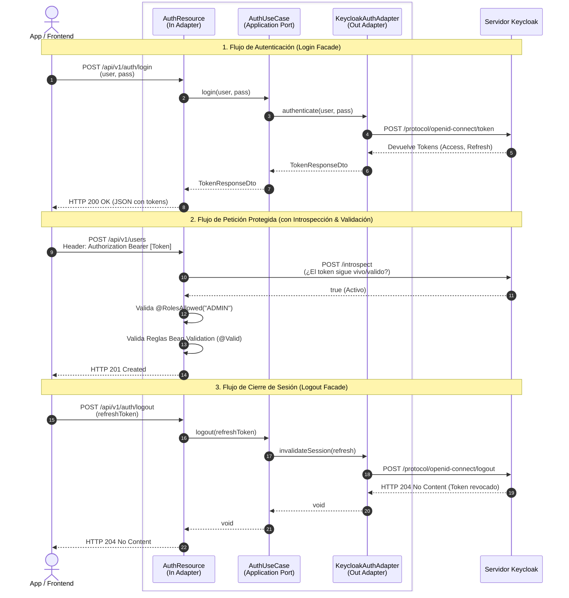

# Securización y Documentación Viva

Este documento detalla la implementación de tres pilares fundamentales para elevar nuestra API REST a nivel de producción: aseguramiento de datos de entrada (**Bean Validation**), protección de recursos mediada por tokens (**Keycloak OIDC**) y exposición de contratos legibles (**OpenAPI/Swagger UI**).

---

## 1. Radiografía Visual: El Flujo de Seguridad Inyectado

Todo comienza con el flujo de autenticación mediado por nuestro patrón Facade. El Frontend se comunica exclusivamente con nuestro microservicio, el cual orquesta la validación de credenciales con Keycloak e intercepta estructuralmente todas las transacciones entrantes con capas de seguridad y validación.



:::tip Orquestación Transparente
Gracias a la **Clean Architecture**, todo el flujo de comunicación hacia Keycloak (pasos 3 al 6 y 18 al 21) está completamente aislado en la capa del `KeycloakAuthAdapter`. Nuestros casos de uso no saben ni les importa la existencia de Keycloak, ellos solo lidian con dominios abstractos.
:::

---

## 2. Los Tres Pilares de la Implementación

Para dotar a nuestra API de estas capacidades empresariales, agregamos al `build.gradle.kts` cuatro dependencias clave dentro del ecosistema Quarkus: `quarkus-hibernate-validator`, `quarkus-oidc`, `quarkus-smallrye-openapi` y `quarkus-rest-client-jackson`.

A continuación, diseccionamos cómo se configura cada pilar en nuestro código:

import Tabs from '@theme/Tabs';
import TabItem from '@theme/TabItem';

<Tabs>
<TabItem value="validation" label="1. Bean Validation (Datos)">

Protegemos la integridad de nuestra base de datos validando los DTOs de entrada directamente en la capa de **Infraestructura REST (Primary Adapters)** usando JSR-380.

```java title="CreateUserDto.java"
public class CreateUserDto {
    @NotBlank(message = "El nombre de usuario (username) no puede ser nulo o vacío")
    @Size(min = 5, max = 20)
    @Pattern(regexp = "^[a-zA-Z0-9_]+$")
    private String username;

    @NotBlank
    @Email(message = "Debe ser un formato de email válido")
    private String email;
}
```

:::info Manejo Global de Errores (400 Bad Request)
Cuando una de estas reglas restrictivas se rompe, el motor lanza una `ConstraintViolationException`. Usamos un `ValidationExceptionMapper` (patrón `@Provider` de JAX-RS) para interceptarla y devolver una respuesta JSON estructurada al cliente frontal, indicando exactamente qué campos exactos fallaron para que el frontend los dibuje de rojo.
:::

</TabItem>
<TabItem value="security" label="2. OIDC & RBAC (Seguridad)">

Delegamos la validación del Token hacia Keycloak y usamos Control de Acceso Basado en Roles nativos (RBAC) para denegar el acceso a recursos protegidos.

```java title="UserResource.java"
@POST
@RolesAllowed({"ADMIN"}) // Interceptor Quarkus OIDC cortafuegos
public Response createUser(@Valid CreateUserDto request) { ... }
```

En el archivo `application.properties`, inyectamos las coordenadas del servidor IAM (`http://localhost:8180/realms/quarkus`) y configuramos el Facade interno:

```properties title="application.properties"
# Validador de firma local conectando a Keycloak
quarkus.oidc.auth-server-url=http://localhost:8180/realms/quarkus
quarkus.oidc.client-id=backend-service
quarkus.oidc.credentials.secret=secret
quarkus.oidc.roles.role-claim-path=realm_access/roles

# El REST Client que hace el Bypass hacia Keycloak
quarkus.rest-client.keycloak-api.url=http://localhost:8180/realms/quarkus
```

</TabItem>
<TabItem value="openapi" label="3. OpenAPI (Documentación)">

Hacemos que nuestro código fuente sea la única fuente de la verdad para la documentación, utilizando descripciones enriquecidas de **MicroProfile OpenAPI**.

```java title="UserResource.java"
@Operation(summary = "Obtener usuario por ID", description = "Retorna la tupla pública de un usuario.")
@APIResponses(value = {
    @APIResponse(responseCode = "200", description = "Usuario encontrado",
                 content = @Content(schema = @Schema(implementation = UserResponseDto.class))),
    @APIResponse(responseCode = "404", description = "No se encontró el usuario")
})
@GET
@Path("/{id}")
public Response getUserById(@PathParam("id") String id) { ... }
```

:::tip Swagger UI Interactivo
Al ejecutar Quarkus en modo desarrollo (o forzándolo por property), se expone un portal gráfico auto-generado en `http://localhost:8080/swagger-ui`. Podrás llenar tests HTTP completos haciendo clic en los botones "Try it out", los cuales dispararán al backend respectivo validaciones y seguridad implícita.
:::

</TabItem>
</Tabs>

---

## 3. Pruebas y Matriz End-to-End

Asegúrate de tener tu contenedor local de Keycloak en ejecución y saneado (ver [Configuración de Keycloak](./configuracion-keycloak)).

<Tabs>
<TabItem value="scenarios" label="Escenarios de Prueba cURL">

Ejecuta estas pruebas progresivas en tu Postman o cURL para comprobar cómo responden los tres pilares de defensa:

1. **Prueba Bean Validation (HTTP 400)**: Obtén un Token Bearer válido, envíalo en la cabecera, pero lanza un POST con un `JSON Body` donde el campo `"email"` sea inválido (ej. `"hola"` en lugar de `"hola@email.com"`). Quarkus rechazará la solicitud inmediatamente sin tocar la base de datos.
2. **Prueba Cortafuegos Ciego (HTTP 401)**: Envía el JSON perfecto anterior a `@POST /api/v1/users` PERO retírale el encabezado estricto `Authorization: Bearer <TOKEN>`. Obtendrás un rechazo *Unauthorized*.
3. **Prueba Control RBAC (HTTP 403)**: Loguéate interactuando con el proxy `/auth/login` con las credenciales de un usuario del call center, rol (`OPERATOR`), inyecta su token y dispara hacia `/users`. Obtendrás *Forbidden* porque la acción es de privilegio alto `ADMIN`.
4. **Respuesta Triunfal (HTTP 201)**: Finalmente, inyecta el Token perteneciente a un humano con el Role `ADMIN` y un body inmaculado.

</TabItem>
<TabItem value="directory" label="Evolución de Arquitectura Hexagonal">

Este es el impacto que ha provocado la securización dentro de las divisiones topológicas del Hexágono:

```text
src/main/java/cja/msa/sc/security/...
├── application/
│   ├── port/
│   │   └── out/
│   │       └── AuthenticationPort.java         <- [NUEVO] Puerto de Salida (Facade)
│   └── service/
│       └── AuthUseCase.java                    <- [NUEVO] Lógica de Autenticación
├── infrastructure/
│   └── adapters/
│       ├── in/
│       │   └── rest/
│       │       ├── exception/
│       │       │   └── ValidationExceptionMapper.java  <- [NUEVO] Atrapa HTTP 400 BeanValidation
│       │       ├── AuthResource.java                   <- [NUEVO] Adaptador REST para Login Proxy
│       │       └── UserResource.java                   <- [MODIFICADO] Inyección de @Valid, @Roles y OpenAPI
│       └── out/
│           └── keycloak/
│               ├── KeycloakAuthAdapter.java            <- [NUEVO] Adaptador Concreto IAM
│               └── KeycloakRestClient.java             <- [NUEVO] Cliente Quarkus REST (MicroProfile)
```

</TabItem>
</Tabs>
