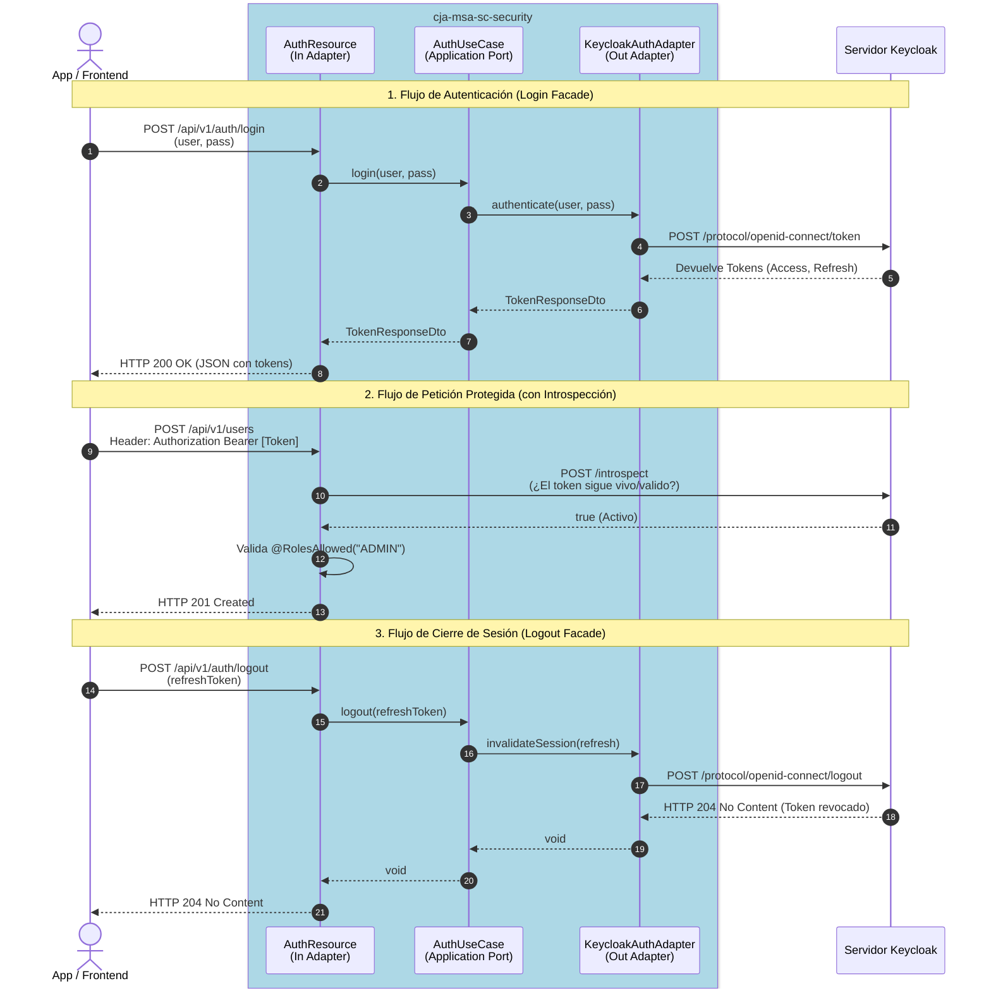

# Validación, OpenAPI y Seguridad Básica

---

## 1. Propósito de la Sesión

El propósito de esta sesión es agregar tres capacidades fundamentales para cualquier API REST lista para producción:
1. **Bean Validation (Hibernate Validator):** Para asegurar que los datos de entrada cumplen con reglas de negocio estrictas.
2. **OpenAPI (pequeño Swagger UI):** Para documentar de manera viva y estructurada nuestros endpoints.
3. **Keycloak (OIDC JWT):** Para proteger nuestros endpoints asegurando que solo los usuarios con los roles correctos puedan interactuar con la API.

Mantendremos estrictamente la estructura orientada a **Hexagonal Architecture** de la Sesión 1.

---

## 2. Nuevas Dependencias

Agregamos las siguientes librerías a nuestro `build.gradle.kts`:

```kotlin
// Hibernate Validator para anotaciones como @NotBlank, @Email
implementation("io.quarkus:quarkus-hibernate-validator")

// Generación de documentación de OpenAPI y Swagger UI interactivo
implementation("io.quarkus:quarkus-smallrye-openapi")

// Autenticación y Autorización basada en OpenID Connect (OIDC) y JWT
implementation("io.quarkus:quarkus-oidc")

// Facade Keycloak: MicroProfile REST Client con Jackson
implementation("io.quarkus:quarkus-rest-client-jackson")
```

---

## 3. Implementación: Bean Validation

### 3.1 DTO de Petición (`CreateUserDto`)
Las validaciones de entrada pertenecen a la capa de Infraestructura / Adaptadores REST. Para evitar inyecciones e inconsistencias, usamos anotaciones `jakarta.validation.constraints`:

```java
public class CreateUserDto {
    @NotBlank(message = "El nombre de usuario (username) no puede ser nulo o vacío")
    @Size(min = 5, max = 20)
    @Pattern(regexp = "^[a-zA-Z0-9_]+$")
    private String username;

    @NotBlank
    @Email
    private String email;
    // ...
}
```

### 3.2 El Manejador de Excepciones de Validación (`ValidationExceptionMapper`)
Cuando una validación falla, Hibernate arroja una `ConstraintViolationException`. Capturamos esto usando un `@Provider` en JAX-RS para retornar un formato estructurado `HTTP 400 Bad Request`.

```json
{
  "status": 400,
  "error": "Bad Request",
  "message": "Fallo de validación en los datos de entrada",
  "details": [
    {
      "field": "createUser.request.email",
      "message": "Debe ser un formato de email válido"
    }
  ]
}
```

---

## 4. Implementación: OpenAPI y Swagger UI

Agregamos descripciones enriquecidas a nuestra API utilizando las anotaciones estándar de MicroProfile OpenAPI.

### 4.1 En el Recurso (`UserResource`)
```java
@Operation(summary = "Obtener usuario por ID", description = "Retorna la tupla pública de un usuario.")
@APIResponses(value = {
    @APIResponse(responseCode = "200", description = "Usuario encontrado",
                 content = @Content(schema = @Schema(implementation = UserResponseDto.class))),
    @APIResponse(responseCode = "404", description = "No se encontró el usuario")
})
public Response getUserById(@PathParam("id") String id) { ... }
```

---

## 5. Implementación: Seguridad con Keycloak (OIDC)

### 5.1 Restricción de Roles (`@RolesAllowed`)
```java
@POST
@RolesAllowed({"ADMIN"}) // Solo usuarios autenticados y con rol "ADMIN"
public Response createUser(@Valid CreateUserDto request) { ... }
```

### 5.2 Configuración en `application.properties`
```properties
quarkus.oidc.auth-server-url=http://localhost:8180/realms/quarkus
quarkus.oidc.client-id=backend-service
quarkus.oidc.credentials.secret=secret
quarkus.oidc.roles.role-claim-path=realm_access/roles

# Cliente REST Interno hacia Keycloak (Facade auth)
quarkus.rest-client.keycloak-api.url=http://localhost:8180/realms/quarkus
```

---

## 6. Configuración Rápida de Keycloak local con Docker

```bash
docker run --name keycloak-local -p 8180:8080 \
  -e KC_BOOTSTRAP_ADMIN_USERNAME=admin \
  -e KC_BOOTSTRAP_ADMIN_PASSWORD=admin \
  quay.io/keycloak/keycloak:26.5.5 start-dev
```

**Pasos en el Keycloak UI (`http://localhost:8180`):**
1. Crear un Realm llamado `quarkus`.
2. Crear un Cliente llamado `backend-service` (habilitar Client Authentication y Service Accounts).
3. Configurar client secret a `secret`.
4. Crear roles en los Realm Roles (`ADMIN`, `OPERATOR`, `CONSULTATION`).
5. Crear usuarios y asignarles los passwords y roles correspondientes.

Ver guía completa en: [Configuración de Keycloak](./configuracion-keycloak)

---

## 7. Árbol de Proyecto Actualizado

```
src/main/java/cja/msa/sc/security/...
├── application/
│   ├── port/...
│   └── service/
│       └── UserQueryService.java
├── domain/
│   ├── exception/
│   │   └── UserNotFoundException.java
│   └── model/...
└── infrastructure/
    └── adapters/
        ├── in/
        │   └── rest/
        │       ├── dto/...
        │       ├── exception/
        │       │   ├── GlobalExceptionMapper.java
        │       │   └── ValidationExceptionMapper.java  <- [NUEVO]
        │       ├── mapper/...
        │       ├── HealthResource.java
        │       └── UserResource.java                   <- [MODIFICADO]
        └── out/...
```

---

## 8. Pasos para Probar esta Sesión

1. Levanta Keycloak e importa o configura los usuarios indicados.
2. Obtén un Token Bearer para el cliente.
3. Envía una petición `POST /api/v1/users` con un cuerpo vacío o email inválido.
4. Confirma que recibes un HTTP 400 (Bean Validation).
5. Envía un Body válido sin el Token. Obtendrás `401 Unauthorized`.
6. Envía un Token válido pero de un usuario `OPERATOR`. Obtendrás `403 Forbidden`.
7. Entra en el navegador a `http://localhost:8080/swagger-ui` para ver la documentación OpenAPI.

---

## 9. Facade de Autenticación ROPC

Se agregó un intermediario (Facade) en `cja-msa-sc-security` para no exponer Keycloak directamente al Frontend:

1. **`KeycloakRestClient`**: Interfaz con `@RegisterRestClient` que mapea las llamadas `/token` y `/logout` de Keycloak.
2. **`AuthResource`**: Expone internamente los endpoints `/api/v1/auth/login` y `/api/v1/auth/logout`.
3. Todo respeta **Clean Architecture** mediante el caso de uso `AuthUseCase` y el puerto de salida `AuthenticationPort`.

```bash
# Ejemplo de Login via Facade
curl -X POST "http://localhost:8080/api/v1/auth/login" \
     -H "Content-Type: application/json" \
     -d '{"username": "admin","password": "admin"}'
```

---

## 10. Flujo de Arquitectura y Seguridad (Secuencia)


