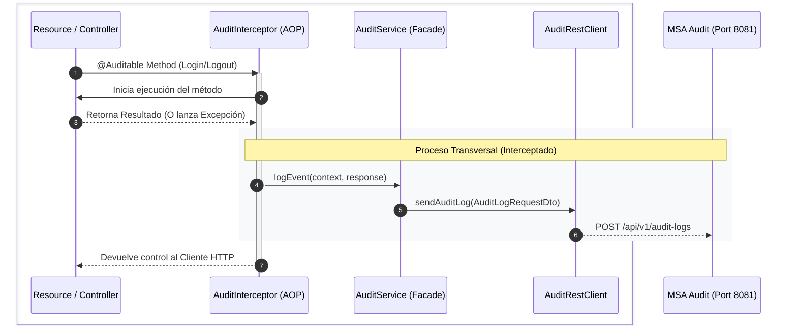

# Integración seguridad y auditoría vía RestClient

En esta sesión, conectamos el ecosistema de microservicios. Implementamos una comunicación síncrona mediante **MicroProfile RestClient** para que el servicio de seguridad delegue la persistencia de eventos de auditoría (logins, logouts, errores) al microservicio especializado, utilizando técnicas de **Programación Orientada a Aspectos (AOP)** para mantener un código limpio y desacoplado.

---

## 1. Radiografía Visual: El Flujo de Auditoría Silenciosa

El objetivo es que los desarrolladores de negocio no tengan que preocuparse por la auditoría. Mediante una anotación personalizada, interceptamos la ejecución de los métodos para disparar una llamada asíncrona ("fire and forget") hacia el microservicio de auditoría.



:::tip Desacoplamiento AOP
Al usar interceptores, el código de `AuthResource` no sabe que está siendo auditado. Esto nos permite agregar o quitar la auditoría de cualquier endpoint simplemente añadiendo o borrando una anotación, respetando el principio de **Responsabilidad Única**.
:::

---

## 2. Configuración e Infraestructura

Para habilitar esta comunicación, necesitamos registrar el cliente declarativo y configurar las coordenadas de red del servicio destino.

import Tabs from '@theme/Tabs';
import TabItem from '@theme/TabItem';

<Tabs>
<TabItem value="config" label="1. Dependencias & Propiedades">

Agregamos el soporte para clientes REST con serialización JSON en el `build.gradle.kts` del servicio Security:

```kotlin title="build.gradle.kts"
implementation("io.quarkus:quarkus-rest-client-jackson")
```

En el archivo de configuración, definimos la URL base del microservicio de auditoría:

```properties title="application.properties"
# Coordenadas del Microservicio de Auditoría
quarkus.rest-client.audit-api.url=http://localhost:8081
```

</TabItem>
<TabItem value="client" label="2. Definición del RestClient">

Usamos **MicroProfile RestClient** para definir el contrato de forma declarativa. No necesitamos implementar la lógica de HTTP interna, Quarkus se encarga de ello.

```java title="AuditRestClient.java"
@RegisterRestClient(configKey = "audit-api")
@Path("/api/v1/audit-logs")
public interface AuditRestClient {

    @POST
    @Consumes(MediaType.APPLICATION_JSON)
    void sendAuditLog(AuditLogRequestDto request);
}
```

</TabItem>
</Tabs>

---

## 3. Implementación del Patrón Interceptor

Creamos una anotación `@Auditable` para marcar qué métodos deben disparar el registro de actividad.

<Tabs>
<TabItem value="annotation" label="1. La Anotación (@Auditable)">

:::info ¿Por qué usamos @Nonbinding?
En CDI, por defecto se busca una coincidencia exacta de los atributos. Al usar `@Nonbinding`, le indicamos a Quarkus que intercepte **todos** los métodos decorados con `@Auditable`, sin importar si el valor de `functionality` cambia entre uno y otro.
:::

```java title="Auditable.java"
@InterceptorBinding
@Target({ElementType.METHOD, ElementType.TYPE})
@Retention(RetentionPolicy.RUNTIME)
public @interface Auditable {
    @jakarta.enterprise.util.Nonbinding
    String functionality() default "SECURITY";

    @jakarta.enterprise.util.Nonbinding
    String eventType() default "GENERIC_EVENT";
}
```

</TabItem>
<TabItem value="interceptor" label="2. El Interceptor">

Este componente "envuelve" la ejecución del método, captura los payloads y el resultado, y coordina el envío de datos.

```java title="AuditInterceptor.java"
@Auditable @Interceptor @Priority(2020)
public class AuditInterceptor {
    @Inject AuditService auditService;

    @AroundInvoke
    public Object auditMethod(InvocationContext context) throws Exception {
        // 1. Antes: Extrae metadatos de la anotación
        // 2. Ejecuta el método original
        Object result = context.proceed();
        // 3. Después: Envía auditoría asíncrona
        auditService.logEvent(...);
        return result;
    }
}
```

</TabItem>
</Tabs>

---

## 4. Estructura del Proyecto

La integración se organiza dentro de la capa de infraestructura, separando los adaptadores externos de la lógica transversal de AOP.

```text
src/main/java/cja/msa/sc/security/infrastructure/
├── aop/
│   ├── Auditable.java              <- Enlace del Interceptor
│   └── AuditInterceptor.java       <- Lógica de captura
└── adapters/out/rest/audit/
    ├── AuditRestClient.java        <- Cliente MicroProfile
    ├── AuditService.java           <- Fachada de infraestructura
    └── dto/
        └── AuditLogRequestDto.java <- Contrato de envío
```

---

## 5. Limitaciones y Consideraciones

:::caution Fire and Forget
En esta fase, la llamada es síncrona bajo un patrón de "enviar y olvidar" dentro de un bloque `try-catch`. 
- **Riesgo**: Si el servicio de auditoría tarda mucho, impactará el tiempo de respuesta del login.
- **Solución futura**: Migrar a llamadas reactivas con `Uni<Void>` o usar colas de mensajería (Kafka/RabbitMQ) para un desacoplado total.
:::

Accede a la documentación del **[Microservicio de Auditoría](./microservicio-auditoria)** para entender cómo se procesan estos eventos una vez recibidos.
