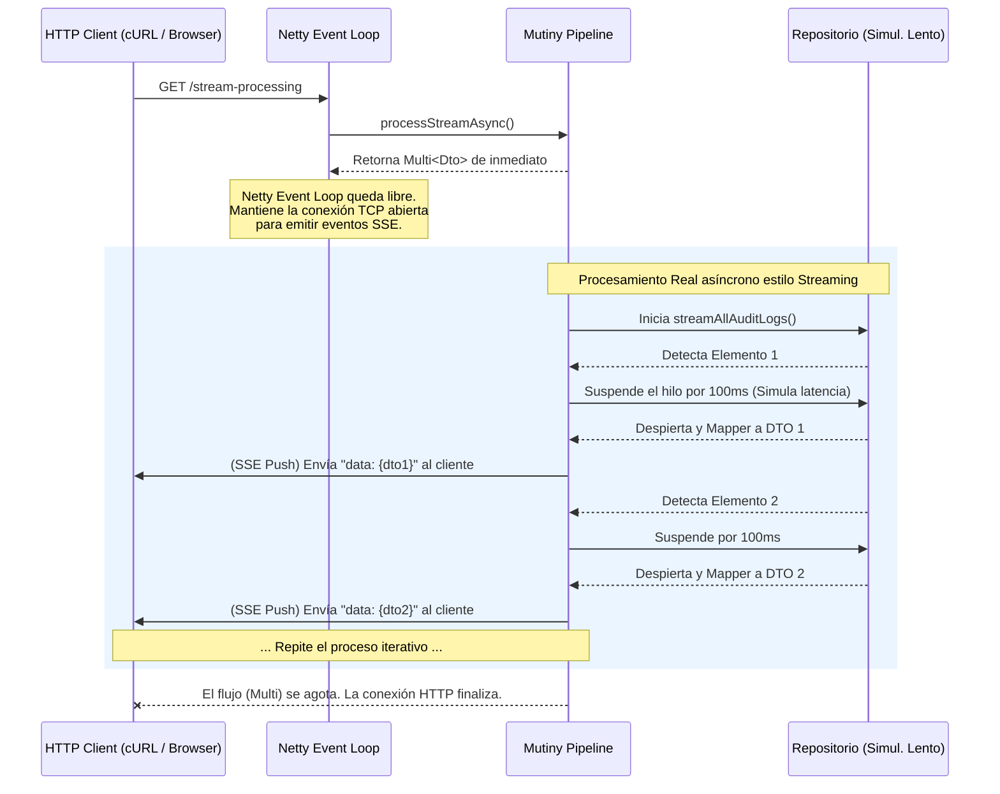

# APIs Reactivas con Mutiny

## 1. Objetivo de la Sesión
El objetivo de esta sesión es crear un microservicio de auditoría (`cja-msa-sc-audit`) aplicando **Clean Architecture**, **Hexagonal Architecture** y un enfoque de **API Reactiva** usando **Quarkus Mutiny** y **Java 21+**. Adicionalmente, introducimos tres potentes herramientas para reducir deuda técnica: **Lombok**, **MapStruct** y **OpenAPI**.

## 2. Alcance Implementado
Se ha construido:
- Arquitectura limpia `cja-msa-sc-audit`.
- Dominio mínimo (`AuditLog`) y REST DTOs generados con `Lombok`.
- Mapeo automatizado entre Capas mediante `MapStruct`.
- Puertos y Casos de Uso (Application Layer) reactivos usando `Uni` (Mutiny).
- Documentación de API automatizada con `Quarkus SmallRye OpenAPI`.
- Adaptador REST Reactivo con Quarkus (`io.quarkus:quarkus-rest`).
- Adaptador de persistencia en memoria reactiva usando `Uni.createFrom()`.

## 3. Librerías y Dependencias Utilizadas
- **Java 21+**
- **Quarkus Platform 3.30**
- `quarkus-rest` (RESTEasy Reactive)
- `quarkus-rest-jackson` (Serialización JSON)
- `quarkus-smallrye-openapi` (OpenAPI y Swagger-UI)
- **MapStruct 1.5.5.Final**
- **Lombok 1.18.38**

## 4. Especificaciones Técnicas
El microservicio expone su API en un enfoque 100% no bloqueante delegando al framework Mutiny mediante el objeto `Uni`. Se minimiza drásticamente el uso de CPU retenido mientras se esperan operaciones lentas.

## 5. Programación Reactiva vs Programación Tradicional (Bloqueante)

En la **programación tradicional**, si un sistema web necesita guardar en base de datos, el Hilo (Thread) asignado a esa petición HTTP se "duerme" (Bloquea) hasta que la base de datos responda. Un Hilo bloqueado cuesta en promedio 1MB de RAM.

La **programación reactiva** usa un modelo basado en eventos. Un hilo muy rápido (Event Loop) recibe la petición, le pide a la Capa de Datos "guarda esto y llámame cuando termines" e inmediatamente el hilo queda libre para atender el siguiente cliente HTTP.

## 6. Enfoque Reactivo Adoptado (Quarkus y Mutiny)

Mutiny ofrece un modelo para eventos reactivos con 2 componentes base:
- `Uni<T>`: Representa un pipeline reactivo que emitirá `0` a `1` resultado en el futuro.
- `Multi<T>`: Emite `0` a `N` items sobre el tiempo (ejemplo flujos tipo Streams constantes de datos).

## 7. Manejo de Hilos
En nuestro modelo:
- **Netty IO Thread (Event Loop)**: Recibe el request `/audit-logs`.
- Invoca al controlador (`AuditLogResource`). Este retorna de inmediato un `Uni<Response>`.
- Quarkus entonces se queda observando el evento `Uni`. Todo el pipeline se ejecuta asíncronamente.
- Al final, cuando el `Uni` de persistencia resuelve, el callback "despierta" en un Worker Thread para enviar la respuesta HTTP. **Nunca hubo un hilo dormido perdiendo tiempo.**

## 8. Diseño del Microservicio Audit (Hexagonal)
- **Domain**: Entidad puramente reactiva, pero inmutable gracias a Lombok.
- **Application**: Lógica Mutiny. `AuditLogService` devuelve `Uni<AuditLog>`.
- **Adapters In**: `AuditLogResource` devolviendo Unis.
- **Adapters Out**: Persistencia Mutiny En-Memoria simulando latencia asíncrona.

## 9. Estructura del Proyecto

```text
cja-msa-sc-audit/
├── build.gradle.kts
└── src/
    └── main/
        ├── java/cja/msa/sc/audit/
        │   ├── domain/
        │   │   └── model/
        │   │       └── AuditLog.java
        │   ├── application/
        │   │   ├── port/
        │   │   │   ├── in/
        │   │   │   │   ├── CreateAuditLogUseCase.java
        │   │   │   │   └── GetAuditLogsQueryUseCase.java
        │   │   │   └── out/
        │   │   │       └── AuditLogRepository.java
        │   │   └── service/
        │   │       └── AuditLogService.java
        │   └── infrastructure/
        │       └── adapters/
        │           ├── in/
        │           │   └── rest/
        │           │       ├── dto/
        │           │       │   ├── request/
        │           │       │   │   └── CreateAuditLogDto.java
        │           │       │   └── response/
        │           │       │       └── AuditLogResponseDto.java
        │           │       ├── mapper/
        │           │       │   └── AuditLogRestMapper.java
        │           │       └── AuditLogResource.java
        │           └── out/
        │               └── persistence/
        │                   └── InMemoryAuditLogRepository.java
```

## 10. Configuración y uso de Lombok

```kotlin
compileOnly("org.projectlombok:lombok:1.18.38")
annotationProcessor("org.projectlombok:lombok:1.18.38")
annotationProcessor("org.projectlombok:lombok-mapstruct-binding:0.2.0")
```

**Annotations utilizadas:**
- `@Data`: Combina `@ToString`, `@EqualsAndHashCode`, `@Getter`, `@Setter` y `@RequiredArgsConstructor`.
- `@Builder`: Genera el Patrón Builder para inicializar clases sin usar largos constructores.
- `@NoArgsConstructor`: Obligatorio en DTOs para que Jackson pueda deserializar JSON.
- `@AllArgsConstructor`: Requisito interno del patrón Builder de Lombok.

## 11. Configuración y uso de MapStruct

```kotlin
implementation("org.mapstruct:mapstruct:1.5.5.Final")
annotationProcessor("org.mapstruct:mapstruct-processor:1.5.5.Final")
```

En Quarkus, definimos un mapper usando inyección CDI: `@Mapper(componentModel = "cdi")`.

## 12. Endpoints Implementados
- `POST /api/v1/audit-logs`: Endpoint asíncrono. Retorna Uni.
- `GET /api/v1/audit-logs`: Endpoint asíncrono para listar auditorías activas.
- `GET /api/v1/audit-logs/stream-processing`: Endpoint que simula procesamiento masivo asíncrono mediante flujos de Mutiny.

## 13. Ejemplos de Request y Response (con cURL)

**POST /api/v1/audit-logs**

```bash
curl -X POST http://localhost:8080/api/v1/audit-logs \
  -H "Content-Type: application/json" \
  -d '{
  "functionality": "SECURITY_LOGIN",
  "username": "xgarnica",
  "eventType": "LOGIN_SUCCESS",
  "requestPayload": "{ \"username\": \"xgarnica\" }",
  "responsePayload": "{ \"token\": \"eyJ...\" }",
  "eventResult": "SUCCESS",
  "detail": "User logged in correctly",
  "originService": "cja-msa-sc-security"
}'
```

*Response (201 Created):*
```json
{
  "eventId": "a1b2c3d4-e5f6-7a8b-9c0d-1e2f3g4h5i6j",
  "functionality": "SECURITY_LOGIN",
  "eventDate": "2026-03-09T23:30:00",
  "username": "xgarnica",
  "eventType": "LOGIN_SUCCESS",
  "eventResult": "SUCCESS",
  "detail": "User logged in correctly",
  "originService": "cja-msa-sc-security"
}
```

**GET /api/v1/audit-logs/stream-processing** (Server-Sent Events)

```bash
curl -X GET http://localhost:8080/api/v1/audit-logs/stream-processing
```

*El servidor mandará los registros de uno en uno con una pausa intermedia de 100ms. Nunca carga la lista entera en memoria.*

## 14. Diagrama de Flujo Asíncrono de Mutiny



## 15. Ejemplo de Código (Reactividad Mutiny con MapStruct)

```java
@POST
@Operation(summary = "Create an Audit Log")
public Uni<Response> createAuditLog(CreateAuditLogDto request) {
    // Pipeline Mutiny: Declaramos transformación sin ejecutar bloqueos
    return Uni.createFrom().item(() -> auditLogRestMapper.toDomain(request))
            .flatMap(createAuditLogUseCase::createAuditLog)
            .map(auditLogRestMapper::toDto)
            .map(dto -> Response.status(Response.Status.CREATED).entity(dto).build());
}
```

## 16. Buenas Prácticas Aplicadas
- **Pipeline Re-Use:** Construcción correcta del chaining reactivo (`flatMap` vs `map`).
- **Data Isolation:** `MapStruct` automatiza pero garantiza mantener blindada la entidad y el dominio.
- **Reducción Boilerplate:** Lombok provee legibilidad de alto nivel.
- **Auto-Documentación:** OpenAPI como contrato fuente (Contract First/Code First).
