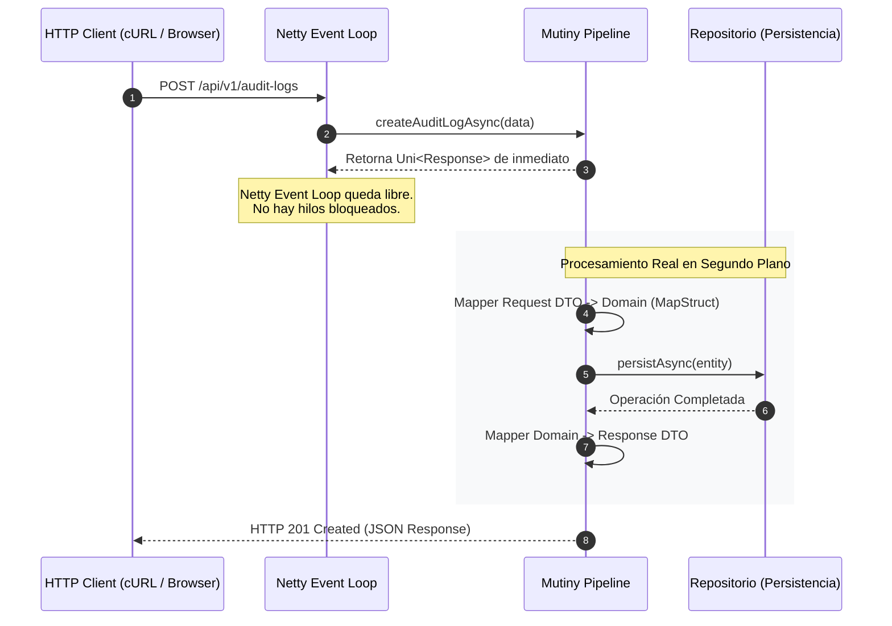

# Auditoría Reactiva con Mutiny

El microservicio de auditoría (`cja-msa-sc-audit`) es el encargado de persistir de forma asíncrona cada evento relevante del ecosistema. Construido con un enfoque 100% no bloqueante, este servicio demuestra cómo manejar flujos de datos de alta velocidad con un consumo mínimo de recursos mediante **Quarkus Mutiny**.

---

## 1. Radiografía Visual: El Ciclo de Vida del Evento

Para entender la potencia de este microservicio, primero debemos observar cómo interactúan sus capas internas con el motor de eventos de Quarkus. Al recibir una petición, el sistema no se queda esperando a la persistencia; en su lugar, orquesta una tubería de ejecución (**Mutiny Pipeline**) que fluye de forma asíncrona hacia el cliente.



:::tip Eficiencia Reactiva
Gracias al **Event Loop**, un solo hilo puede gestionar cientos de auditorías concurrentes. Mientras la "base de datos" (o nuestra simulación en memoria) trabaja, el microservicio sigue disponible para nuevos registros sin aumentar el consumo de RAM por hilos dormidos.
:::

---

## 2. Los Componentes del Ecosistema

Para lograr un código limpio y eficiente, integramos herramientas que eliminan el código repetitivo (*boilerplate*) y automatizan las transformaciones entre capas.

import Tabs from '@theme/Tabs';
import TabItem from '@theme/TabItem';

<Tabs>
<TabItem value="stack" label="1. Stack & Dependencias">

Usamos **Java 21+** y **Quarkus 3.x** como base. Las dependencias críticas en `build.gradle.kts` son:

```kotlin title="build.gradle.kts"
// Motor Reactivo y JSON
implementation("io.quarkus:quarkus-rest")
implementation("io.quarkus:quarkus-rest-jackson")

// Documentación y Mapeo
implementation("io.quarkus:quarkus-smallrye-openapi")
implementation("org.mapstruct:mapstruct:1.5.5.Final")

// Boilerplate
compileOnly("org.projectlombok:lombok:1.18.38")
annotationProcessor("org.projectlombok:lombok:1.18.38")
```

</TabItem>
<TabItem value="tools" label="2. Lombok & MapStruct">

Combinamos estas dos librerías para mantener nuestro dominio puro y nuestros mappers automatizados.

:::info Anotaciones Lombok
- `@Data`: Genera Getters, Setters y utilidades de objeto.
- `@Builder`: Implementa el patrón constructor fluido.
- `@Mapper(componentModel = "cdi")`: (MapStruct) Indica que el mapper es un bean inyectable de Quarkus.
:::

```java title="AuditLogRestMapper.java (MapStruct)"
@Mapper(componentModel = "cdi")
public interface AuditLogRestMapper {
    AuditLog toDomain(CreateAuditLogDto dto);
    AuditLogResponseDto toDto(AuditLog domain);
}
```

</TabItem>
<TabItem value="structure" label="3. Estructura Hexagonal">

El microservicio está blindado mediante capas que protegen el dominio de la infraestructura:

```text
cja-msa-sc-audit/
├── domain/model/AuditLog.java       <- Inmutable (Lombok)
├── application/                     <- Orquestación Mutiny
│   ├── port/in/CreateAuditUseCase.java
│   └── service/AuditLogService.java
└── infrastructure/adapters/         <- Implementación Técnica
    ├── in/rest/AuditLogResource.java (UNI Response)
    └── out/persistence/InMemoryAuditRepository.java
```

</TabItem>
</Tabs>

---

## 3. Implementación y Pruebas

La verdadera magia ocurre en el controlador, donde transformamos la entrada en un flujo reactivo asíncrono.

<Tabs>
<TabItem value="code" label="Pipeline Mutiny (Código)">

```java title="AuditLogResource.java"
@POST
public Uni<Response> createAuditLog(@Valid CreateAuditLogDto request) {
    // Pipeline Declarativo: No se ejecuta hasta que alguien se 'suscribe'
    return Uni.createFrom().item(() -> auditLogMapper.toDomain(request))
            .flatMap(createAuditUseCase::execute)
            .map(auditLogMapper::toDto)
            .map(dto -> Response.status(Status.CREATED).entity(dto).build());
}
```

:::caution La Regla de Oro
Recuerda que dentro del `Uni`, **nunca** debes usar llamadas bloqueantes (como JDBC tradicional o `Thread.sleep`). Si lo haces, el Event Loop se detendrá y el rendimiento colapsará.
:::

</TabItem>
<TabItem value="curl" label="Consumo de la API (cURL)">

Puedes probar la creación y el streaming de eventos SSE:

**Registro de Auditoría:**
```bash
curl -X POST http://localhost:8080/api/v1/audit-logs \
  -H "Content-Type: application/json" \
  -d '{
  "functionality": "SECURITY_LOGIN",
  "username": "admin",
  "eventType": "LOGIN_SUCCESS",
  "originService": "cja-msa-sc-security"
}'
```

**Procesamiento en Batch (SSE):**
```bash
# Verás los logs aparecer uno a uno con latencia simulada
curl -X GET http://localhost:8080/api/v1/audit-logs/stream-processing
```

</TabItem>
</Tabs>

---

## 4. Resumen de Buenas Prácticas

1. **Pipeline Re-Use**: Usamos `.flatMap` para encadenar otros `Uni` y `.map` para transformaciones síncronas.
2. **Data Isolation**: MapStruct garantiza que el DTO de la API nunca sea igual a la entidad de Persistencia.
3. **Auto-Documentación**: Accede a `http://localhost:8080/swagger-ui` para ver el contrato vivo generado por SmallRye OpenAPI.
