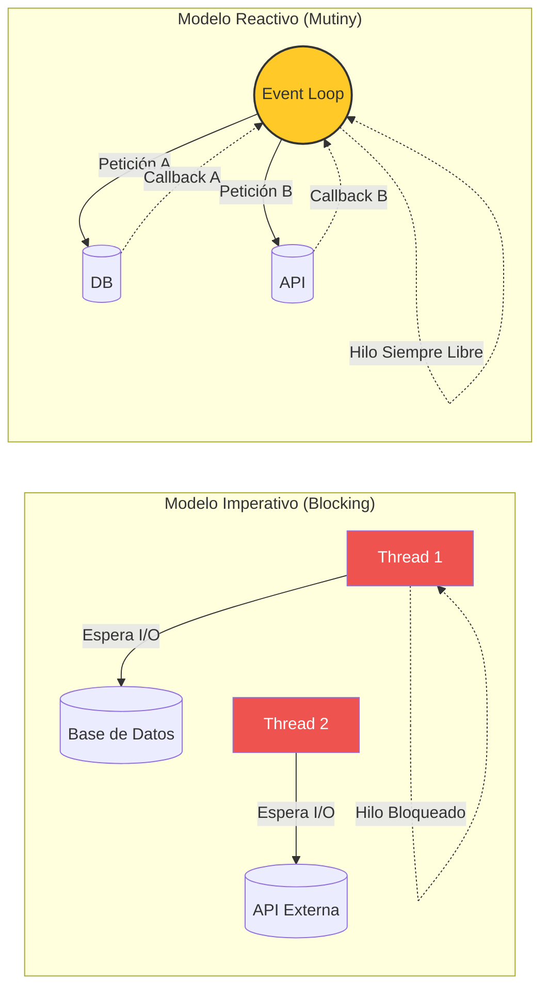
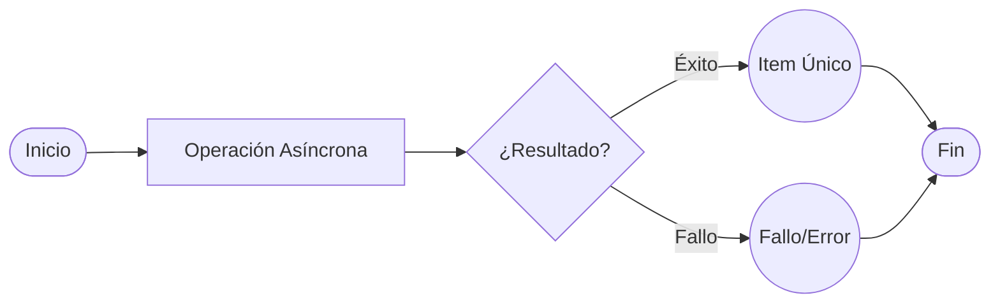
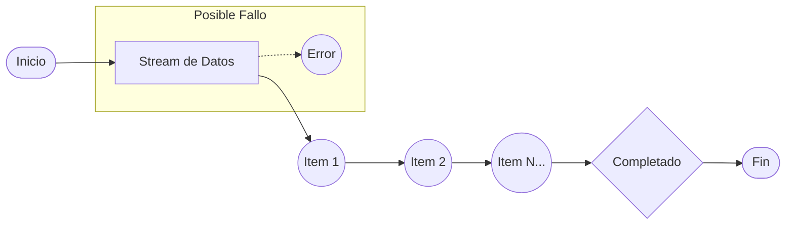

# Programación Reactiva con Mutiny

En el mundo moderno de los microservicios, la escalabilidad ya no se mide solo en cuántos servidores tenemos, sino en qué tan eficientemente usamos los recursos de cada uno. Quarkus nace nativamente reactivo, permitiéndonos manejar miles de peticiones simultáneas con un consumo mínimo de memoria.

---

## 1. Radiografía Visual: Imperativo vs Reactivo

La diferencia fundamental radica en cómo el servidor gestiona las esperas (I/O). Mientras que el modelo tradicional bloquea un hilo entero por cada petición, el modelo reactivo de Quarkus libera el hilo para que siga trabajando mientras espera por la base de datos o una API externa.



:::tip El Event Loop
Imagina un camarero (Event Loop) que toma tu pedido y, en lugar de quedarse parado frente a la cocina esperando tu plato, se va a atender a otras 10 mesas. Cuando tu plato está listo, la cocina le avisa y él te lo entrega. Eso es **I/O No Bloqueante**.
:::

---

## 2. Los Bloques de Construcción: Uni y Multi

Mutiny es la librería reactiva que usa Quarkus. Se diseñó para ser extremadamente legible y centrada en eventos. Sus dos tipos principales de datos son:

import Tabs from '@theme/Tabs';
import TabItem from '@theme/TabItem';

<Tabs>
<TabItem value="uni" label="1. Uni (Cero o un elemento)">

Representa una operación asíncrona que devolverá un único resultado (o un fallo) en el futuro. Es el equivalente reactivo a un `Optional` o un `Future`.



**Uso típico:** Consultar un usuario por ID, guardar un registro, llamar a una API que devuelve un JSON.

```java title="Ejemplo de Uni"
@GET
@Path("/{id}")
public Uni<User> getUser(String id) {
    return userRepository.findById(id)
        .onItem().ifNull().failWith(new NotFoundException())
        .onFailure().retry().atMost(3); // Reintento automático
}
```

:::info Composición
Los `Uni` permiten encadenar operaciones mediante `.onItem().transformToUni()`, creando tuberías de ejecución fluidas sin el famoso "Callback Hell".
:::

</TabItem>
<TabItem value="multi" label="2. Multi (Cero, uno o N elementos)">

Representa un flujo de datos (Stream) que puede emitir múltiples elementos a lo largo del tiempo. Es ideal para streaming de datos o procesamiento de grandes volúmenes.



**Uso típico:** Leer miles de filas de una DB, recibir mensajes de Kafka, streaming de eventos SSE hacia el frontend.

```java title="Ejemplo de Multi"
@GET
@Produces(MediaType.SERVER_SENT_EVENTS)
public Multi<String> streamData() {
    return Multi.createFrom().ticks().every(Duration.ofSeconds(1))
        .onItem().transform(tick -> "Update #" + tick)
        .select().first(10); // Emitir solo los primeros 10
}
```

</TabItem>
</Tabs>

---

## 3. Ventajas del Enfoque Reactivo

¿Por qué complicarse con `Uni` y `Multi` si el código imperativo parece más sencillo de leer? Aquí están las razones clave:

1. **Mayor Concurrencia**: Puedes manejar muchísimas más peticiones con el mismo hardware, ya que no desperdicias gigabytes de RAM manteniendo hilos dormidos esperando por la red.
2. **Resiliencia Nativa**: Mutiny trae operadores de "Primer nivel" para manejar fallos: `.onFailure().retry()`, `.onFailure().recoverWithItem()`, o `.onItem().delayIt()`.
3. **Eficiencia en la Nube**: En entornos Serverless o Kubernetes, donde pagas por CPU y Memoria, un microservicio reactivo es drásticamente más barato de operar.
4. **Programación Declarativa**: El código se lee como una receta de pasos (`Toma esto -> Transforma aquello -> Si falla, haz esto`), lo que facilita el razonamiento sobre flujos complejos.

:::caution El Peligro del Bloqueo
La regla de oro en programación reactiva es: **¡NUNCA BLOQUEES EL EVENT LOOP!**. Si usas `Thread.sleep()` o una librería de DB antigua (JDBC) dentro de un flujo reactivo, congelarás todo el servidor. Quarkus te avisará con un error gigante en los logs si detecta esto.
:::

---

## 4. ¿Cuándo usar qué?

| Situación | Recomendación | ¿Por qué? |
| :--- | :--- | :--- |
| CRUD Simple | Imperativo (Blocking) | Si el tráfico es bajo, la simplicidad del código prima. |
| Altísima concurrencia | **Reactivo (Mutiny)** | Optimización total de recursos y rendimiento. |
| Streaming / Push | **Multi** | Es el estándar natural para flujos infinitos. |
| Llamadas a múltiples APIs | **Uni** | Permite ejecutar llamadas en paralelo fácilmente sin hilos complejos. |
