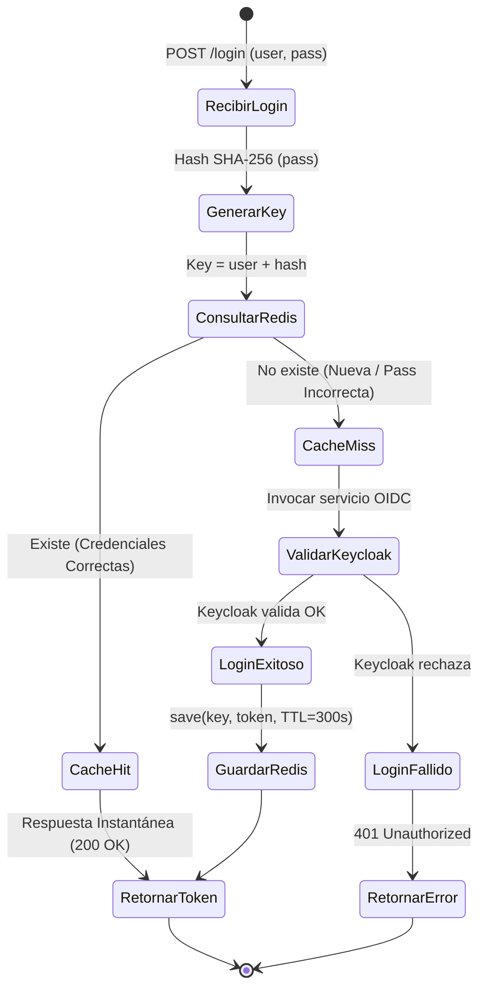
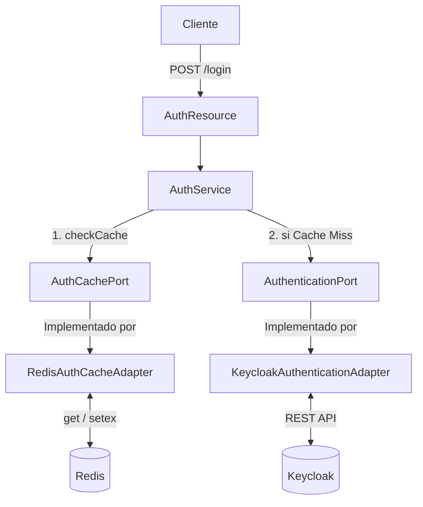

# Caché de Autenticación con Redis

Integrar **Redis** en el microservicio `cja-msa-sc-security` es la diferencia entre hacer esperar 300ms a cada usuario en cada login, o responderle en menos de 1ms la mayor parte de las veces. A diferencia del microservicio de auditoría (que gestiona el almacenamiento de eventos), este módulo de caché vive dentro de **Security** y optimiza específicamente el flujo de autenticación contra Keycloak.

Implementamos un patrón de caché seguro donde la clave incluye un hash SHA-256 de la contraseña, garantizando que solo la combinación exacta de credenciales puede recuperar un token cacheado.

---

## 1. Radiografía Visual: El Flujo de Login con Caché

El diagrama de estados siguiente muestra la decisión central: si las credenciales tienen un token válido en Redis, el microservicio **no necesita contactar a Keycloak**, ahorrando cientos de milisegundos por petición.



:::tip ¿Por qué el hash de la contraseña en la clave?
Sin el hash, un atacante que conoce el username podría obtener el token de otro usuario con una contraseña incorrecta si aún está en caché. Con el hash SHA-256, la clave `auth:token:usuario:a3f5b8c1d2...` es única por combinación de credenciales. **Una contraseña incorrecta genera una clave diferente → siempre Cache Miss → siempre rechazada por Keycloak.**
:::

---

## 2. La Arquitectura: Puerto y Adaptador

Redis vive completamente en la capa de **infraestructura**. El dominio interactúa con él a través del puerto de salida `AuthCachePort`, manteniendo el núcleo desacoplado de la tecnología de caché.



---

## 3. Implementación del Patrón Hexagonal

import Tabs from '@theme/Tabs';
import TabItem from '@theme/TabItem';

<Tabs>
<TabItem value="port" label="1. Puerto de Salida">

El contrato del dominio es simple y no menciona Redis en ninguna parte:

```java title="AuthCachePort.java"
public interface AuthCachePort {
    Optional<TokenResponseDto> getAuthInfo(String username, String password);
    void saveAuthInfo(String username, String password, TokenResponseDto tokenResponse);
}
```

</TabItem>
<TabItem value="adapter" label="2. Adaptador Redis">

La implementación concreta inyecta el cliente de Redis de Quarkus y construye la clave segura con SHA-256:

```java title="RedisAuthCacheAdapter.java"
@ApplicationScoped
public class RedisAuthCacheAdapter implements AuthCachePort {

    @Override
    public Optional<TokenResponseDto> getAuthInfo(String username, String password) {
        return Optional.ofNullable(valueCommands.get(buildKey(username, password)));
    }

    @Override
    public void saveAuthInfo(String username, String password, TokenResponseDto token) {
        valueCommands.setex(buildKey(username, password),
            Duration.ofSeconds(ttlSeconds).toSeconds(), token);
    }

    private String buildKey(String username, String password) {
        // Hash SHA-256 de la contraseña → ninguna contraseña incorrecta reutiliza caché
        return CACHE_PREFIX + username + ":" + hashPassword(password);
    }
}
```

</TabItem>
<TabItem value="config" label="3. Configuración Redis">

```properties title="application.properties"
# Conexión a Redis
quarkus.redis.hosts=${REDIS_HOSTS:redis://localhost:6379}

# TTL de la caché de autenticación (5 minutos)
auth.cache.ttl.seconds=300
```

</TabItem>
<TabItem value="docker" label="4. Redis Local con Docker">

Elige la opción más conveniente para tu entorno de desarrollo:

```bash title="Opción A: Docker Run"
docker run -d --name redis-local -p 6379:6379 redis:7-alpine

# Verifica conectividad
docker exec -it redis-local redis-cli ping
# Respuesta esperada: PONG
```

```yaml title="Opción B: docker-compose.yml (recomendada)"
services:
  redis:
    image: redis:7-alpine
    ports:
      - "6379:6379"
    volumes:
      - redis_data:/data
    command: redis-server --appendonly yes --maxmemory 128mb --maxmemory-policy allkeys-lru

volumes:
  redis_data:
```

</TabItem>
</Tabs>

---

## 4. Impacto en Rendimiento y Consideraciones

<Tabs>
<TabItem value="perf" label="Métricas de Rendimiento">

| Escenario | Sin Redis | Con Redis (Cache Hit) | Ahorro |
|:---|:---|:---|:---|
| **Login exitoso (latencia)** | ~150–300 ms | **< 1 ms** | **99.7% reducción** |
| **100 logins/seg del mismo usuario** | 100 llamadas a Keycloak | **1 llamada + 99 de caché** | **99% menos carga** |
| **1,000 usuarios concurrentes** | ~150–300 seg acumulados | **~0.1–1 seg acumulados** | **Escalabilidad masiva** |

</TabItem>
<TabItem value="tradeoffs" label="Consideraciones (Trade-Offs)">

:::caution Consistencia Eventual y Memoria
- **Consistencia**: Un token podría permanecer en caché tras ser revocado en Keycloak. El TTL corto (300s) limita la ventana de riesgo a 5 minutos máximo.
- **Memoria RAM**: ~1 KB por entrada de token. Con TTL activo y la política `allkeys-lru`, la memoria se mantiene controlada dentro del límite configurado.
- **Persistencia**: Sin configurar `appendonly yes`, un reinicio de Redis borra la caché (inofensivo para el negocio, solo causa más llamadas a Keycloak momentáneamente).
:::

</TabItem>
<TabItem value="redis-cli" label="Comandos Redis CLI">

Comandos útiles para inspeccionar y depurar la caché en desarrollo:

```bash
# Ver todas las claves de autenticación almacenadas
KEYS auth:token:*

# Ver el TTL restante de una clave específica (en segundos)
TTL auth:token:usuario1:a3f5b8c1d2...

# Monitorear operaciones en tiempo real
MONITOR

# Limpiar toda la base de datos (solo en desarrollo)
FLUSHDB
```

</TabItem>
</Tabs>

---

## 5. Estructura del Proyecto

```text
src/main/java/cja/msa/sc/security/...
├── application/port/out/
│   ├── AuthenticationPort.java
│   └── AuthCachePort.java          <- [NUEVO] Puerto de Salida
└── infrastructure/adapters/out/
    ├── keycloak/KeycloakAuthenticationAdapter.java
    └── redis/
        └── RedisAuthCacheAdapter.java  <- [NUEVO] Adaptador Redis
```
