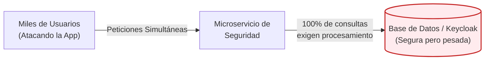
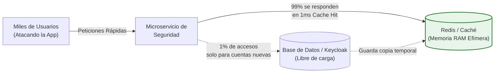
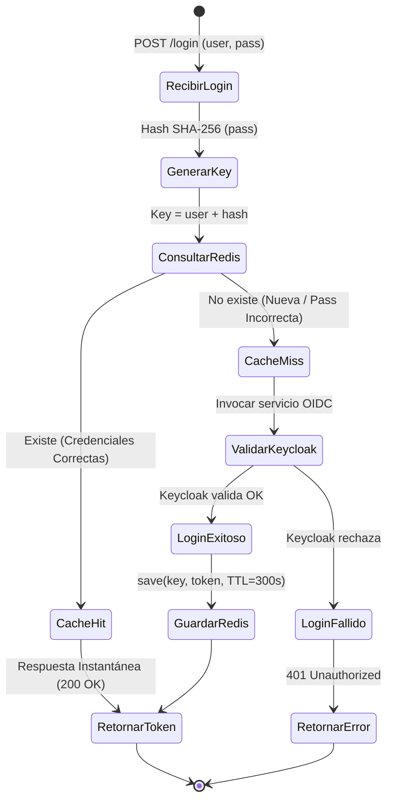
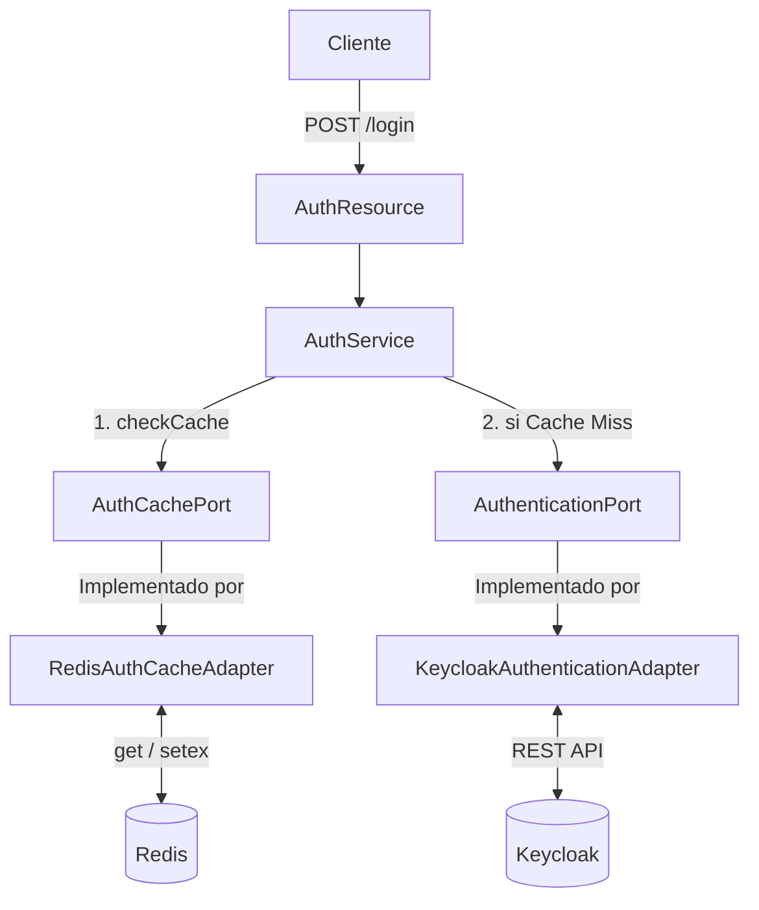

# Caché de Autenticación con Redis

:::tip Aceleración Crítica de Microservicios
El acceso a discos o redes foráneas es el enemigo número uno de la escalabilidad por concurrencia. Mover validaciones intensivas hacia Memorias de Caché no solo reduce latencias masivas, **ahorra picos fatales en tu Base de Datos principal**.
:::

Integrar **Redis** en el microservicio `cja-msa-sc-security` es la diferencia entre hacer esperar 300ms a cada usuario en cada login, o responderle en menos de 1ms la mayor parte de las veces. A diferencia del microservicio de auditoría (que gestiona el almacenamiento de eventos), este módulo de caché vive dentro de **Security** y optimiza específicamente el flujo de autenticación contra Keycloak.

Implementamos un patrón de caché seguro donde la clave incluye un hash SHA-256 de la contraseña, garantizando que solo la combinación exacta de credenciales puede recuperar un token cacheado.

---

## 1. ¿Qué es Redis y el Caching? (Conceptos Didácticos)

Imagina las operaciones de ventanilla de un **Banco**. En una arquitectura tradicional, si un cliente desea realizar múltiples depósitos en cajas diferentes, cada cajero está obligado a pedir su documento de identidad, escanear su huella y enviar esa información a la Central Nacional de Identificación (tu Base de Datos principal / Keycloak) para verificar su integridad. Aunque es un proceso sumamente seguro, el viaje a la central es costoso (toma unos 300ms). Si decenas de miles de clientes hacen esto simultáneamente en todo el país, el proveedor de identidad colapsa.

Al emplear una **Memoria Caché**, introducimos confianza temporal. La primera vez que el cliente es validado por la central y entra a la sucursal, el banco le entrega una **Pulsera VIP Criptográfica** que es válida únicamente por 5 minutos. Durante el resto de su estancia, los cajeros simplemente ven el identificador de su pulsera y procesan su solicitud de manera casi instantánea (1ms) sin necesidad de volver a interrogar a la central.

Redis es exactamente esa capa de optimización: un almacén temporal alojado íntegramente en Memoria RAM súper veloz, que memoriza esas "autorizaciones" (tokens) para absorber el 99% del impacto que sufriría tu base de datos madre.

### ¿Cuándo conviene usarlo?
- Cuando los **datos se leen masivamente, pero cambian muy poco** (Permisos de usuario, catálogos de producto, configuraciones).
- Cuando el cálculo original de la respuesta **quema mucho procesamiento de CPU** y no tiene sentido recalcularlo cientos de veces por segundo.
- Como datos de alta volatilidad (si se borra la pizarra temporalmente, no pasa nada grave, el bibliotecario solo tiene que volver a hacer el viaje largo al sótano una vez).

### Casos Reales en Instituciones y Negocios
- 🍿 **Streaming (Netflix/Spotify)**: En cada Click que haces, el sistema debe saber qué plan tienes suscrito. Ellos validan esa identidad en Redis, no atacando a Postgres/AWS cada segundo.
- 🎮 **Industria de Videojuegos**: Mantener tablas de puntuaciones mundiales (*Leaderboards*) a tiempo real, donde miles de jugadores ganan puntos simultáneamente.
- 🛒 **E-commerce y Supermercados**: Retener el "Carrito de compras" efímeramente para asegurar que la app se sienta fluida e inmediata sin atorar discos duros.

---

## 2. Tradicional vs Capa Caché (Comparativa Visual)

El siguiente gráfico refleja por qué una técnica simple elimina dramáticamente el estrés del backend.

### 1. El Problema (Sistema sin Caché)


### 2. La Solución (Con capa en Memoria RAM)


---

## 3. Radiografía Visual: El Flujo de Login con Caché

El diagrama de estados siguiente muestra la decisión central: si las credenciales tienen un token válido en Redis, el microservicio **no necesita contactar a Keycloak**, ahorrando cientos de milisegundos por petición.



:::tip ¿Por qué el hash de la contraseña en la clave?
Sin el hash, un atacante que conoce el username podría obtener el token de otro usuario con una contraseña incorrecta si aún está en caché. Con el hash SHA-256, la clave `auth:token:usuario:a3f5b8c1d2...` es única por combinación de credenciales. **Una contraseña incorrecta genera una clave diferente → siempre Cache Miss → siempre rechazada por Keycloak.**
:::

---

## 4. La Arquitectura: Puerto y Adaptador

Redis vive completamente en la capa de **infraestructura**. El dominio interactúa con él a través del puerto de salida `AuthCachePort`, manteniendo el núcleo desacoplado de la tecnología de caché.



---

## 5. Implementación del Patrón Hexagonal

import Tabs from '@theme/Tabs';
import TabItem from '@theme/TabItem';

<Tabs>
<TabItem value="port" label="1. Puerto de Salida">

El contrato del dominio es simple y no menciona Redis en ninguna parte:

```java title="AuthCachePort.java"
public interface AuthCachePort {
    Optional<TokenResponseDto> getAuthInfo(String username, String password);
    void saveAuthInfo(String username, String password, TokenResponseDto tokenResponse);
}
```

</TabItem>
<TabItem value="adapter" label="2. Adaptador Redis">

La implementación concreta inyecta el cliente de Redis de Quarkus y construye la clave segura con SHA-256:

```java title="RedisAuthCacheAdapter.java"
@ApplicationScoped
public class RedisAuthCacheAdapter implements AuthCachePort {

    @Override
    public Optional<TokenResponseDto> getAuthInfo(String username, String password) {
        return Optional.ofNullable(valueCommands.get(buildKey(username, password)));
    }

    @Override
    public void saveAuthInfo(String username, String password, TokenResponseDto token) {
        valueCommands.setex(buildKey(username, password),
            Duration.ofSeconds(ttlSeconds).toSeconds(), token);
    }

    private String buildKey(String username, String password) {
        // Hash SHA-256 de la contraseña → ninguna contraseña incorrecta reutiliza caché
        return CACHE_PREFIX + username + ":" + hashPassword(password);
    }
}
```

</TabItem>
<TabItem value="config" label="3. Configuración Redis">

```properties title="application.properties"
# Conexión a Redis
quarkus.redis.hosts=${REDIS_HOSTS:redis://localhost:6379}

# TTL de la caché de autenticación (5 minutos)
auth.cache.ttl.seconds=300
```

</TabItem>
<TabItem value="docker" label="4. Redis Local con Docker">

Elige la opción más conveniente para tu entorno de desarrollo:

```bash title="Opción A: Docker Run"
docker run -d --name redis-local -p 6379:6379 redis:7-alpine

# Verifica conectividad
docker exec -it redis-local redis-cli ping
# Respuesta esperada: PONG
```

```yaml title="Opción B: docker-compose.yml (recomendada)"
services:
  redis:
    image: redis:7-alpine
    ports:
      - "6379:6379"
    volumes:
      - redis_data:/data
    command: redis-server --appendonly yes --maxmemory 128mb --maxmemory-policy allkeys-lru

volumes:
  redis_data:
```

</TabItem>
<TabItem value="api" label="5. Consumo de Instancia (API)">

Este patrón intercepta las peticiones desde Infraestructura sin ensuciar la Lógica de Negocio. De cara al Consumidor REST (Angular, React, Postman), el flujo mejora en tiempo pero mantiene 100% de transparencia en el contrato API:

```http title="Request: Primer Intento (300ms) / Segundos Intentos (1ms)"
POST /login
Content-Type: application/json

{
    "username": "admin",
    "password": "mi_password_segura"
}
```

```json title="Response 200 OK"
{
    "token": "eyJhbGciOiJSUzI1NiIs...",
    "expires_in": 300
}
```

</TabItem>
</Tabs>

---

## 6. Impacto en Rendimiento y Consideraciones

<Tabs>
<TabItem value="perf" label="Métricas de Rendimiento">

| Escenario | Sin Redis | Con Redis (Cache Hit) | Ahorro |
|:---|:---|:---|:---|
| **Login exitoso (latencia)** | ~150–300 ms | **< 1 ms** | **99.7% reducción** |
| **100 logins/seg del mismo usuario** | 100 llamadas a Keycloak | **1 llamada + 99 de caché** | **99% menos carga** |
| **1,000 usuarios concurrentes** | ~150–300 seg acumulados | **~0.1–1 seg acumulados** | **Escalabilidad masiva** |

</TabItem>
<TabItem value="tradeoffs" label="Consideraciones (Trade-Offs)">

:::caution Consistencia Eventual y Memoria
- **Consistencia**: Un token podría permanecer en caché tras ser revocado en Keycloak. El TTL corto (300s) limita la ventana de riesgo a 5 minutos máximo.
- **Memoria RAM**: ~1 KB por entrada de token. Con TTL activo y la política `allkeys-lru`, la memoria se mantiene controlada dentro del límite configurado.
- **Persistencia**: Sin configurar `appendonly yes`, un reinicio de Redis borra la caché (inofensivo para el negocio, solo causa más llamadas a Keycloak momentáneamente).
:::

</TabItem>
<TabItem value="redis-cli" label="Comandos Redis CLI">

Comandos útiles para inspeccionar y depurar la caché en desarrollo:

```bash
# Ver todas las claves de autenticación almacenadas
KEYS auth:token:*

# Ver el TTL restante de una clave específica (en segundos)
TTL auth:token:usuario1:a3f5b8c1d2...

# Monitorear operaciones en tiempo real
MONITOR

# Limpiar toda la base de datos (solo en desarrollo)
FLUSHDB
```

</TabItem>
<TabItem value="observability" label="Observabilidad (Métricas)">

:::info Trazabilidad en Producción
Un sistema ciego es riesgoso en arquitecturas empresariales. Al implementar Redis, debes trazar obligatoriamente el rendimiento de la Memoria Caché para evitar un cuello de botella o robo de memoria RAM.
:::

Utilizando librerías base como `Micrometer`, puedes exportar métricas de Redis Server a Prometheus/Grafana. Considera vigilar lo siguiente:

- **Cache Hit Ratio (`keys.hits` vs `keys.misses`)**: Si tu ratio de "Hit" es bajo, significa que la caché es inútil (tu TTL expira muy rápido).
- **Eviction Keys (`evicted_keys`)**: Monitorea de cerca. Si escala, Redis se ha quedado sin memoria y está "expulsando" tokens vigentes forzadamente.
- **P99 Latency**: El procesamiento jamás debe saltar la barrera de 5 a 10 milisegundos, prevé caídas de red internas.

```properties title="application.properties"
# Extensión nativa de Quarkus para habilitar telemetría automatizada Redis > Prometheus
quarkus.redis.telemetry.enabled=true
```

</TabItem>
</Tabs>

---

## 7. Valkey: El Sólido Sucesor Open-Source de Redis

Si estás estudiando o trabajando en la nube recientemente, tal vez hayas escuchado sobre **Valkey**. ¿Qué es y qué significa para este proyecto?

:::info El Surgimiento de Valkey
Durante más de 10 años, Redis fue un estandarte sagrado del código abierto bajo la licencia libre **BSD**, ganándose el puesto indiscutido como el motor clave-valor número uno del mundo. Sin embargo, en Marzo de 2024, *Redis Labs* (la empresa registrada que maneja la marca comercial) modificó silenciosamente las futuras versiones de Redis (7.4+) a modelos limitantes de código cerrado (**RSALv2 / SSPLv1**) con el fin principal de cobrar y prohibir a grandes proveedores cloud como AWS, Google Cloud u Oracle ofrecer "Redis Administrado" sin pagarles comisiones.

A raíz de ello, la élite de la comunidad open-source original, respaldada agresivamente por la **The Linux Foundation** y gigantes de la industria, tomaron el último código fuente completamente libre (versión 7.2.4) e hicieron una bifurcación de continuidad. Esa bifurcación fue bautizada como **Valkey**.
:::

### ¿Por qué sirve como Alternativa de reemplazo absoluto?
1. **Compatibilidad del 100%**: Valkey es un clon directo desde las raíces. A nivel de infraestructura tu código Java/Quarkus ni se entera. Usa el mismo analizador, comandos internos de red y tipos de datos. El uso de `quarkus-redis-client` que empleamos conectará naturalmente contra Valkey.
2. **Mejor Respaldo Genuino**: Al nacer como rebelión de la Linux Foundation, las futuras parches de seguridad, optimizaciones de hilos y algoritmos LRU están siendo impulsados por cientos de expertos libres de corporaciones cerradas.
3. **Gratuidad Inquebrantable**: Mantiene la clásica promesa de portabilidad sin comisiones.

*En este proyecto, podrías intercambiar tu contenedor Docker `redis:7-alpine` por `valkey/valkey:latest` en escasos segundos sin afectar un solo DTO.*

---

## 8. Estructura del Proyecto

```text
src/main/java/cja/msa/sc/security/...
├── application/port/out/
│   ├── AuthenticationPort.java
│   └── AuthCachePort.java          <- [NUEVO] Puerto de Salida
└── infrastructure/adapters/out/
    ├── keycloak/KeycloakAuthenticationAdapter.java
    └── redis/
        └── RedisAuthCacheAdapter.java  <- [NUEVO] Adaptador Redis
```
