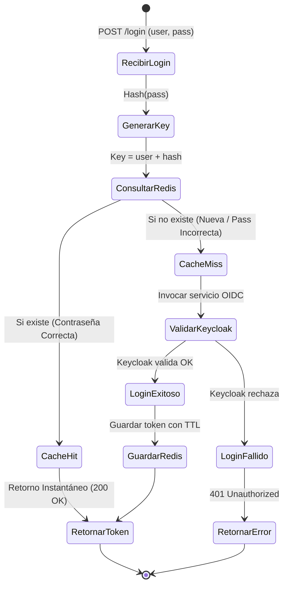
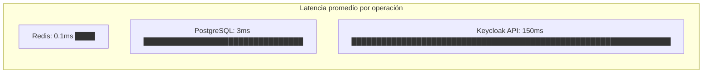
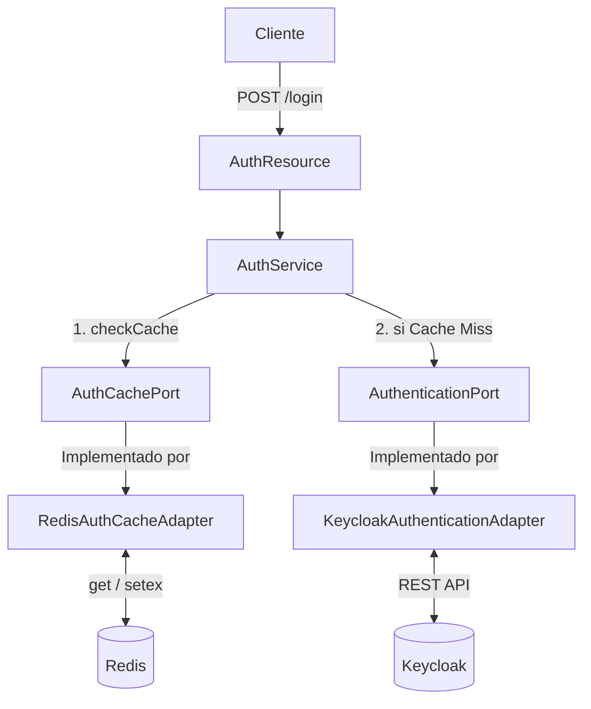

# Sesión 4 — Redis como Caché en Security

## 1. Objetivo de la Sesión
El objetivo de esta sesión es integrar **Redis como sistema de caché** en el microservicio `cja-msa-sc-security`. Aprenderemos cómo almacenar y recuperar información de manera eficiente para optimizar consultas recurrentes como la validación de autenticación, respetando los principios de **Clean Architecture** y **Hexagonal Architecture**.

## 2. Alcance Implementado
- Integración del cliente Redis para Quarkus.
- Implementación de un caso de uso didáctico: caché de la respuesta de autenticación en el flujo de `login`.
- Creación de un puerto de salida (`AuthCachePort`) y su adaptador (`RedisAuthCacheAdapter`).
- Adición de la configuración de Redis en `application.properties`.

## 3. Dependencias
- **Quarkus Redis Client:** `io.quarkus:quarkus-redis-client`
- **Quarkus Jackson:** Para la serialización/deserialización automática.

## 4. ¿Qué es Redis y por qué se usa como Caché?
**Redis** (Remote Dictionary Server) es un almacén de estructura de datos en memoria. Se utiliza como caché porque:
- **Ultra rápido:** Al residir en memoria RAM, los tiempos de lectura y escritura son sub-milisegundos.
- **Estructuras ricas:** Soporta strings, hashes, listas, sets, etc.
- **Expiración (TTL):** Permite configurar tiempos de vida por clave, ideal para purgar datos obsoletos.

## 5. Caso de Uso: Caché Segura de Autenticación

Al momento en que un usuario se autentica exitosamente contra Keycloak, la respuesta se almacena en Redis con un TTL. **La clave del caché se construye usando el `username` Y un hash (SHA-256) de la contraseña**, evitando que una contraseña incorrecta obtenga un token cacheado.



## 6. Configuración de Redis

```properties
# ── Configuración de Caché (Redis) ──
quarkus.redis.hosts=${REDIS_HOSTS:redis://localhost:6379}
# Tiempo de expiración de la caché de autenticación en segundos
auth.cache.ttl.seconds=300
```

## 7. Código de Integración

**Puerto (AuthCachePort)**:
```java
public interface AuthCachePort {
    Optional<TokenResponseDto> getAuthInfo(String username, String password);
    void saveAuthInfo(String username, String password, TokenResponseDto tokenResponse);
}
```

**Adaptador Redis (RedisAuthCacheAdapter)**:
```java
@ApplicationScoped
public class RedisAuthCacheAdapter implements AuthCachePort {

    @Override
    public Optional<TokenResponseDto> getAuthInfo(String username, String password) {
        return Optional.ofNullable(valueCommands.get(buildKey(username, password)));
    }

    @Override
    public void saveAuthInfo(String username, String password, TokenResponseDto tokenResponse) {
        valueCommands.setex(buildKey(username, password),
            Duration.ofSeconds(ttlSeconds).toSeconds(), tokenResponse);
    }

    private String buildKey(String username, String password) {
        return CACHE_PREFIX + username + ":" + hashPassword(password); // Hash SHA-256
    }
}
```

## 8. Estructura Actualizada del Proyecto

```text
src/main/java/cja/msa/sc/security/...
├── application/
│   ├── port/
│   │   └── out/
│   │       ├── AuthenticationPort.java
│   │       └── AuthCachePort.java          (NUEVO)
│   └── service/
│       └── AuthService.java                (MODIFICADO)
└── infrastructure/
    └── adapters/
        └── out/
            ├── keycloak/KeycloakAuthenticationAdapter.java
            └── redis/
                └── RedisAuthCacheAdapter.java (NUEVO)
```

## 9. Configuración de Redis local con Docker

```bash
# Opción 1: docker run
docker run -d --name redis-local -p 6379:6379 redis:7-alpine

# Verificar conectividad
docker exec -it redis-local redis-cli ping
# Respuesta esperada: PONG
```

```yaml
# Opción 2: docker-compose.yml (recomendada)
services:
  redis:
    image: redis:7-alpine
    container_name: redis-local
    ports:
      - "6379:6379"
    volumes:
      - redis_data:/data
    command: redis-server --appendonly yes --maxmemory 128mb --maxmemory-policy allkeys-lru

volumes:
  redis_data:
```

### Comandos útiles de Redis CLI
```bash
# Ver todas las claves almacenadas
KEYS auth:token:*

# Ver el TTL restante de una clave
TTL auth:token:usuario1:a3f5b8c1d2...

# Eliminar todo el contenido de la base de datos (desarrollo)
FLUSHDB

# Monitorear operaciones en tiempo real
MONITOR
```

## 10. Ventajas y Desventajas de Redis — Análisis Numérico

| Escenario | Sin Redis | Con Redis (Cache Hit) | Ahorro |
|---|---|---|---|
| **Login exitoso (latencia)** | ~150–300 ms (ida y vuelta a Keycloak) | **< 1 ms** | **99.7% reducción** |
| **100 logins/seg del mismo usuario** | 100 llamadas a Keycloak | **1 llamada + 99 lecturas caché** | **99% menos carga** |
| **1,000 usuarios concurrentes** | ~150–300 seg acumulados | **~0.1–1 seg acumulados** | **Escalabilidad masiva** |

### Comparativa de Latencia


### Desventajas y Consideraciones

| Aspecto | Detalle | Mitigación |
|---|---|---|
| **Uso de memoria RAM** | ~1 KB por entrada de token. Para 1,000,000 = ~1 GB. | Configurar `maxmemory` y política `allkeys-lru`. Con TTL de 300s el consumo real es mucho menor. |
| **Persistencia limitada** | Si Redis se reinicia sin persistencia, se pierden datos cacheados. | Usar `appendonly yes` o `RDB snapshots`. |
| **Consistencia eventual** | Un token podría seguir en caché tras ser revocado en Keycloak. | El TTL corto (300s) limita la ventana de inconsistencia. |

## 11. Diagramas de Arquitectura



## 12. Próximos Pasos
- Implementar **Circuit Breaker** con `@Fallback` y MicroProfile Fault Tolerance para protegerse de caídas de Redis (ver Sesión 5).
- Utilizar **RedisPubSub** para invalidación distribuida de caché.
