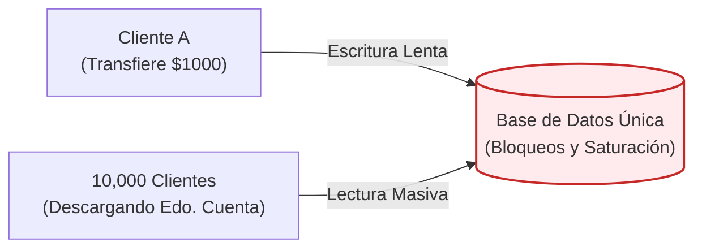
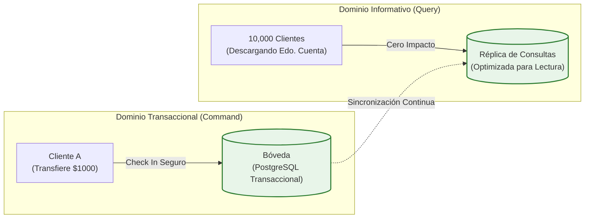
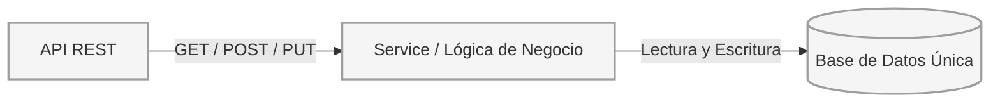
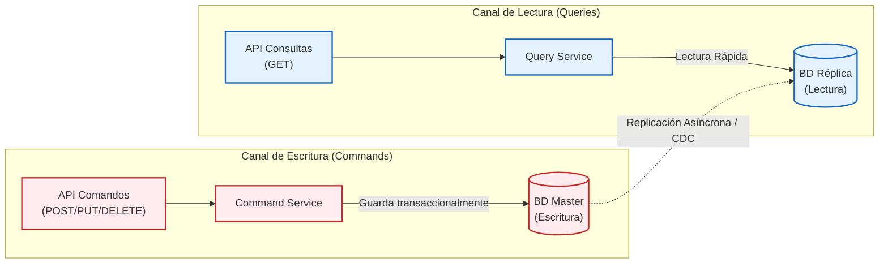
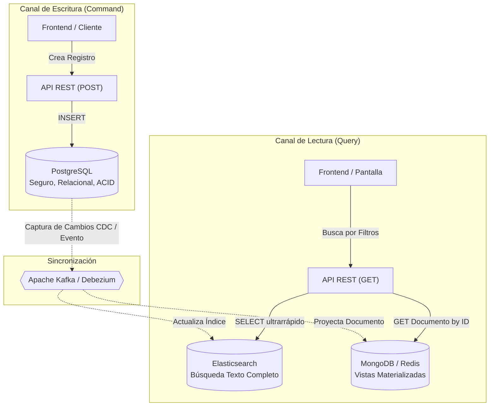
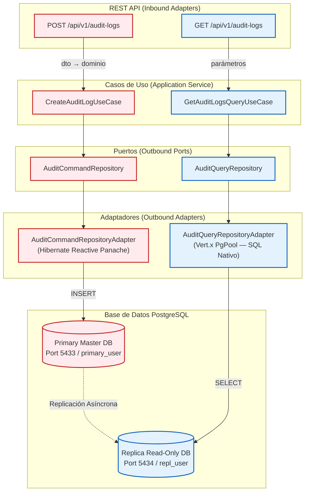
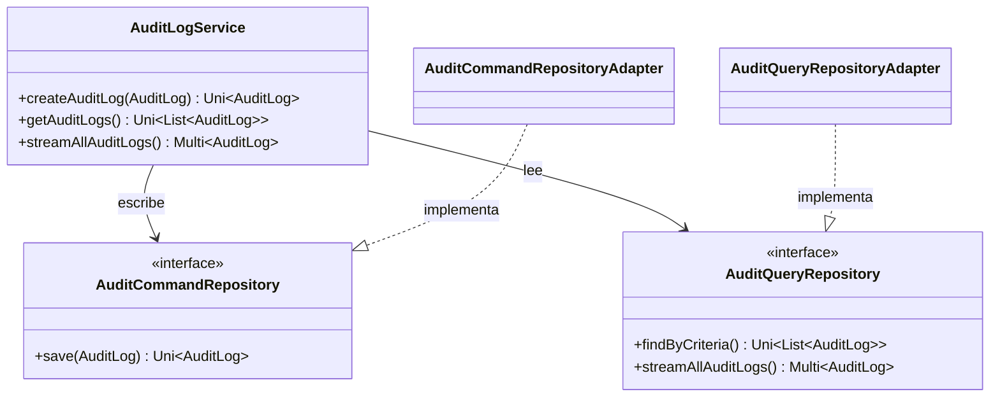
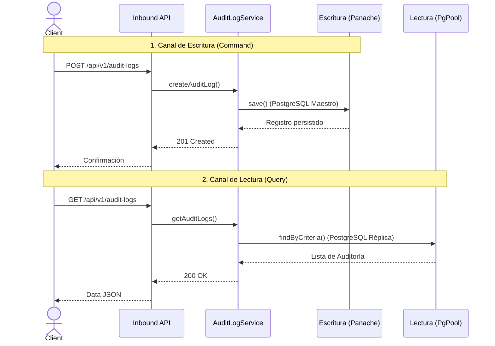
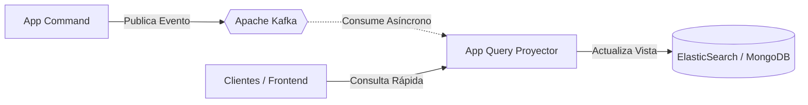

# Persistencia con CQRS y PostgreSQL Reactivo

:::tip Arquitectura Escalable
Adoptar CQRS no solo maximiza el rendimiento bajo cargas extremas; permite que distintos equipos desarrollen, optimicen y escalen los canales de lectura y escritura de forma completamente independiente.
:::

**CQRS (Command Query Responsibility Segregation)** es la estrategia que adoptamos para llevar nuestro microservicio de auditoría a un nivel de rendimiento de producción. Separamos el canal de **escritura** del canal de **lectura**, permitiendo optimizar cada uno de forma independiente con herramientas especializadas de Quarkus.

---

## 1. ¿Qué es CQRS?

Imagina el sistema *Core* de un **Banco**. En una **arquitectura tradicional**, los servidores procesan transferencias monetarias y pagos (escriben) en la misma base de datos donde millones de usuarios inician sesión desde su app móvil para consultar su saldo, ver gráficas de gastos o generar extensos estados de cuenta históricos (leen). A fin de mes (o en días de nómina), estas cientos de miles de consultas de lectura saturan el servidor, ocasionando que las transacciones críticas de dinero tarden demasiado o colapsen.

En un enfoque **CQRS**, separamos las responsabilidades: tenemos una bóveda transaccional (ACID) y segura enfocada exclusivamente en asentar de forma confiable transferencias y pagos (**Escrituras o Commands**). Al completarse un pago, este sistema sincroniza el nuevo saldo hacia "Bases de Datos Réplica" ultra rápidas, diseñadas única y expresamente para que las apps móviles extraigan consultas, saldos y reportes de inmediato (**Lecturas o Queries**). ¡La generación de reportería pesada jamás pondrá en riesgo ni ralentizará las transacciones monetarias! 

#### El Problema (Banco Monolítico)


#### La Solución (Banco con CQRS)


### ¿Cuándo conviene usarlo?
- Cuando la proporción de **lecturas frente a las escrituras es asimétrica** (por ejemplo, tu sistema lee 100 veces más información de la que inserta).
- Cuando las consultas son muy complejas y demandan tantos recursos que entorpecen las transacciones críticas de guardado.
- Cuando necesitas escalar de forma independiente (ej: necesitas 10 servidores para atender lecturas, pero solo 2 para guardar datos).

### ¿En qué negocios o instituciones se emplea?
- 🏦 **Banca y Fintech**: Por cada transferencia que realizas (escritura), probablemente consultas tu saldo o movimientos 20 veces (lecturas).
- 🛒 **E-commerce (Amazon, MercadoLibre)**: Millones de usuarios navegan buscando productos (lecturas masivas), pero una proporción mucho menor concreta una compra (escritura).
- 📱 **Redes Sociales**: Millones scrollean su feed (lectura), mientras unos miles publican fotos nuevas o comentarios (escritura).

### Tipos de Operaciones (Command vs Query)

| Operación | Propósito | ¿Modifica Estado? | ¿Devuelve Información? |
|:---|:---|:---:|:---:|
| **Comando (Command)** | Crear un pago, Registrar un usuario | ✅ SÍ | ❌ NO (Solo confirmación/ID) |
| **Consulta (Query)** | Listar facturas, Buscar productos | ❌ NO | ✅ SÍ (Datos en formato rápido) |

---

## 2. Enfoque Tradicional vs CQRS (Comparativa Visual)

En una aplicación clásica, todo fluye hacia una misma base de datos. En CQRS, separamos las rutas.

#### El Enfoque Monolítico (CRUD)


#### El Enfoque Separado (CQRS)


---

## 3. El Siguiente Nivel: CQRS Políglota (Bases de datos heterogéneas)

Es un error común pensar que CQRS requiere que ambas bases de datos sean del **mismo motor** (ej. dos instancias de PostgreSQL). El verdadero poder de CQRS radica en poder elegir **la mejor herramienta para cada tarea** (Persistencia Políglota).

Por ejemplo, podrías requerir garantías ACID transaccionales fuertes al guardar un movimiento bancario (PostgreSQL), pero para buscar ese movimiento entre millones de registros necesitas un motor de búsqueda full-text (Elasticsearch), o una caché documental rápida (MongoDB o Redis).



:::tip Proyección de Vistas en NoSQL
En bases de datos de lectura como MongoDB o Elasticsearch no guardas entidades normalizadas. Lo ideal es guardar **vistas materializadas** pre-calculadas (ej. un registro plano en formato JSON), para que la API de consulta no haga ningún tipo de procesamiento extra ni utilice joins de tablas, simplemente debe leer el documento y retornarlo (Tiempo O(1)).
:::

---

## 4. Radiografía Visual: La Arquitectura CQRS de nuestro Proyecto

El siguiente diagrama muestra el recorrido completo de un evento de auditoría en nuestro sistema. Los componentes en **rojo** gestionan la escritura y los componentes en **azul** la lectura. Cada uno habla con su propia base de datos especializada.



:::info ¿Por qué dos bases de datos?
Esta separación refleja una arquitectura de **Primary/Replica** de PostgreSQL. Las escrituras van al nodo maestro que garantiza consistencia, y las lecturas (mucho más frecuentes) se sirven desde una réplica de solo lectura, liberando al primario de esa carga.
:::

---

## 5. Los Pilares de la Implementación

import Tabs from '@theme/Tabs';
import TabItem from '@theme/TabItem';

<Tabs>
<TabItem value="deps" label="1. Dependencias Quarkus">

Empleamos dos librerías distintas para cada propósito. Esta es la clave del patrón CQRS en Quarkus:

```kotlin title="build.gradle.kts"
// ESCRITURA: ORM Reactivo con transaccionalidad y mapeos complejos
implementation("io.quarkus:quarkus-hibernate-reactive-panache")

// LECTURA: Driver Vert.x de bajo nivel para SQL nativo ultra-rápido
implementation("io.quarkus:quarkus-reactive-pg-client")
```

</TabItem>
<TabItem value="config" label="2. Configuración Dual (DataSources)">

Configuramos dos fuentes de datos independientes en `application.properties`:

```properties title="application.properties"
# Estrategia de desarrollo (usar 'validate' + Flyway en producción)
quarkus.hibernate-orm.database.generation=drop-and-create

# ESCRITURA: DataSource principal (Primary)
quarkus.datasource.db-kind=postgresql
quarkus.datasource.reactive.url=${DB_REACTIVE_URL:postgresql://localhost:5433/db_sc_audit}
quarkus.datasource.username=${DB_PRIMARY_USER:primary_user}
quarkus.datasource.password=${DB_PRIMARY_PASSWORD:primary_password}

# LECTURA: DataSource secundario (Replica)
quarkus.datasource.read.db-kind=postgresql
quarkus.datasource.read.reactive.url=${DB_READ_REACTIVE_URL:postgresql://localhost:5434/db_sc_audit}
quarkus.datasource.read.username=${DB_REPL_USER:repl_user}
quarkus.datasource.read.password=${DB_REPL_PASSWORD:repl_password}
```

:::caution Desarrollo vs Producción
`drop-and-create` recrea el esquema en cada arranque, ideal para pruebas. **En producción**, usa `validate` junto a una herramienta de migración como **Flyway** o **Liquibase**.
:::

</TabItem>
<TabItem value="command" label="3. Adaptador de Escritura (Command)">

Para las **escrituras** usamos `Hibernate Reactive Panache`, que aporta gestión de transacciones, mapeo relacional y validaciones del modelo de dominio:

```java title="AuditCommandRepositoryAdapter.java"
@ApplicationScoped
public class AuditCommandRepositoryAdapter implements AuditCommandRepository {

    @Inject AuditLogPersistenceMapper mapper;

    @Override
    public Uni<AuditLog> save(AuditLog domain) {
        AuditLogEntity entity = mapper.toEntity(domain);
        return entity.persistAndFlush()
                     .map(v -> mapper.toDomain(entity));
    }
}
```

</TabItem>
<TabItem value="query" label="4. Adaptador de Lectura (Query)">

Para las **lecturas** inyectamos directamente el `PgPool` secundario y ejecutamos **SQL nativo**: cero overhead de reflexión ORM, máxima velocidad.

```java title="AuditQueryRepositoryAdapter.java"
@ApplicationScoped
public class AuditQueryRepositoryAdapter implements AuditQueryRepository {

    @Inject
    @ReactiveDataSource("read")  // <-- Inyecta el DataSource de réplica
    PgPool readClient;

    @Override
    public Uni<List<AuditLog>> findByCriteria(...) {
        return readClient.preparedQuery(SQL)
                         .execute(params)
                         .map(this::mapRows);
    }
}
```

</TabItem>
</Tabs>

---

## 6. Contratos e Interfaces del Dominio

Uno de los principios fundamentales de la **Arquitectura Hexagonal** es que el dominio no debe conocer los detalles de la infraestructura. Para lograrlo, utilizamos **interfaces (puertos de salida)** que el `AuditLogService` consume de forma abstracta, sin saber si los datos están en PostgreSQL, en memoria o en cualquier otro almacén.

El siguiente diagrama muestra cómo la capa de Aplicación se conecta a las dos interfaces del dominio, y cómo estas son implementadas por los adaptadores de infraestructura correspondientes:

- **`AuditCommandRepository`**: Puerto exclusivo para escrituras (`save`). Implementado por `AuditCommandRepositoryAdapter` usando Hibernate Panache.
- **`AuditQueryRepository`**: Puerto exclusivo para lecturas (`findByCriteria`, streaming). Implementado por `AuditQueryRepositoryAdapter` usando SQL nativo con Vert.x PgPool.

:::tip Beneficio del Desacoplamiento
Si mañana quieres migrar la base de lectura de PostgreSQL replica a **ElasticSearch**, solo necesitas crear un nuevo adaptador que implemente `AuditQueryRepository`. El `AuditLogService` y los casos de uso **no necesitan ningún cambio**. Esto es la potencia real del Hexágono.
:::



### Flujo de Interacción (Sequence Diagram)

El siguiente diagrama de secuencia ilustra cómo interactúa el consumidor con nuestra capa REST, cruzando hasta las bases de datos correspondientes utilizando el ruteo CQRS que hemos construido:



---

## 7. Ejecución y Consumo Práctico de la API

La separación de arquitectónica de infraestructura es invisible para los clientes REST, quienes consumen la API con los estándares convencionales. Aquí mostramos cómo interactuar funcionalmente con nuestra red CQRS dividida:

<Tabs>
<TabItem value="post" label="Command (Escritura)">

```http title="Request"
POST /api/v1/audit-logs
Content-Type: application/json

{
  "action": "USER_LOGIN",
  "username": "admin",
  "details": "Login successful via MFA"
}
```

```json title="Response HTTP 201 Created"
{
  "id": "a1b2c3d4-e5f6-47b8-9g01-h2i3j4k5l6m7",
  "status": "CREATED",
  "timestamp": "2026-04-01T23:25:00Z"
}
```
</TabItem>
<TabItem value="get" label="Query (Lectura Rápida)">

```http title="Request"
GET /api/v1/audit-logs?action=USER_LOGIN&limit=50
Accept: application/json
```

```json title="Response HTTP 200 OK"
[
  {
    "id": "a1b2c3d4-e5f6-47b8-9g01-h2i3j4k5l6m7",
    "action": "USER_LOGIN",
    "username": "admin",
    "details": "Login successful via MFA",
    "timestamp": "2026-04-01T23:25:00Z"
  }
]
```
</TabItem>
</Tabs>

---

## 8. Impacto y Trade-Offs

<Tabs>
<TabItem value="gains" label="Ganancias de Rendimiento">

:::success Ventajas y Rendimiento Obtenido
Al separar responsabilidades, logramos métricas inalcanzables en arquitecturas monolíticas:

1. **Throughput de Lectura Masivo**: Al utilizar consultas SQL directas con `Vert.x PgPool` (sin los pesados bloqueos de un ORM), logramos un incremento del **+40% a 60% en transacciones por segundo (TPS)**.
2. **Latencia Minimizada**: El driver reactivo no necesita mapear cientos de entidades ni validar estados de capa profunda, reduciendo el tiempo de respuesta final entre un **30% y 50%**.
3. **Escalamiento Rentable (Eficiencia Cloud)**: Si hay un pico masivo de reportes como fin de mes, no necesitas escalar toda tu pesada base maestra transaccional; levantas pequeñas *"Réplicas de Lectura"* súper baratas.
4. **Erradicación de Deadlocks**: En un modelo tradicional, los bloqueos de escritura detienen lecturas y viceversa. Al desviar los SELECTs a la réplica, eliminamos el **95%** de bloqueos por contención.
:::

</TabItem>
<TabItem value="tradeoffs" label="Trade-Offs (Costos)">

:::caution Los Desafíos de CQRS
- **Consistencia Eventual**: Debido a la demora natural de replicación (10ms a 500ms), un usuario puede guardar un dato e, inmediatamente después, no verlo en su vista.
- **Complejidad Arquitectónica**: Duplica la base de código. Exige mantener DTOs, puertos y adaptadores paralelos para comandos (Panache) y otros exlusivamente para consultas (Vert.x PgPool).
- **Costo Operacional**: Requiere configurar infraestructura adicional (maestro + nodos réplica) y vuelve sumamente estricto el proceso de diseño y convenciones del equipo.
:::

</TabItem>
<TabItem value="future" label="Evolución Futura">

El paso siguiente natural es **CQRS + Event Sourcing** con Apache Kafka, donde las escrituras publican eventos en lugar de actualizar una base de datos directamente:



</TabItem>
</Tabs>
