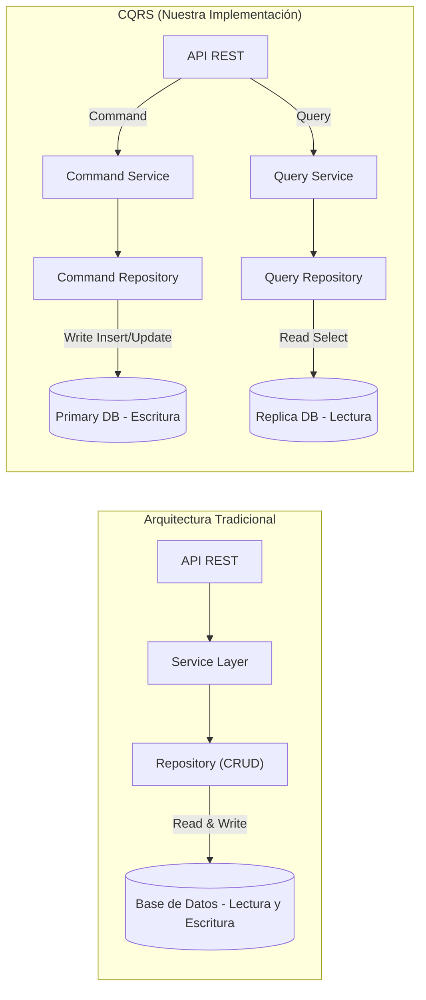
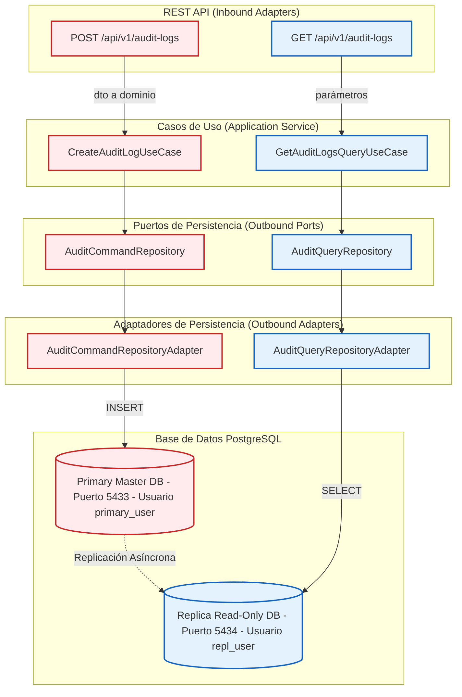
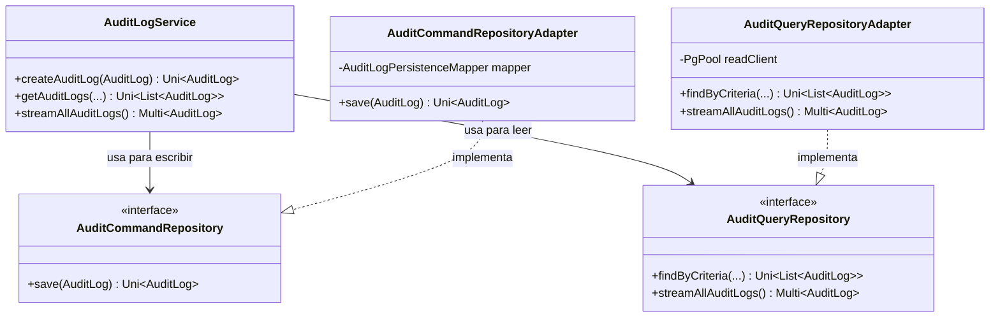
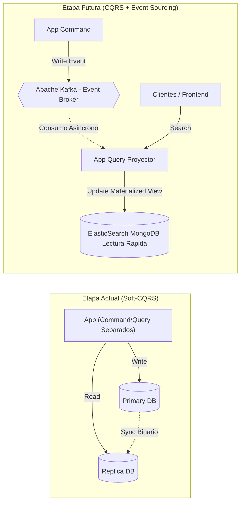

# Persistencia con CQRS en Quarkus Reactivo

Esta sesión se centra en la adopción del patrón de arquitectura **CQRS (Command Query Responsibility Segregation)** para manipular el almacenamiento y recuperación de datos en nuestro microservicio de auditoría usando **Quarkus Hibernate Reactive Panache** y **PostgreSQL**.

---

## 1. ¿Qué es CQRS?

CQRS es un patrón arquitectónico que postula que la estructura de datos utilizada para **leer** información (Queries) debe estar separada de la estructura utilizada para **modificar** información (Commands / Escrituras).

### Flujo Tradicional vs CQRS



### Ventajas de CQRS

1. **Escalamiento Independiente**: Operaciones de lectura (muy frecuentes) se ejecutan en nodos de réplica, mientras las escrituras apuntan al nodo maestro.
2. **Modelos Optimizados**: Puedes diseñar tu modelo de persistencia riguroso para la escritura y usar lecturas veloces directas para consultas.
3. **Seguridad Diferenciada**: En esta sesión, dividimos los roles de base de datos (`primary_user` vs `repl_user`). La lectura no podrá jamas borrar datos accidentalmente.

---

## 2. Visión Arquitectónica de CQRS en el Proyecto



---

## 3. Implementación Práctica en Quarkus

```kotlin
// Manejo de Entidades con Modelo Reactive Panache
implementation("io.quarkus:quarkus-hibernate-reactive-panache")

// Driver reactivo de PostgreSQL basado en Vert.x
implementation("io.quarkus:quarkus-reactive-pg-client")
```

### Configuración del DataSource en `application.properties`

```properties
# Estrategia de creación de esquema de base de datos
quarkus.hibernate-orm.database.generation=drop-and-create

# 1. ESCRITURA: Database Writer (Primary)
quarkus.datasource.db-kind=postgresql
quarkus.datasource.reactive.url=${DB_REACTIVE_URL:postgresql://localhost:5433/db_sc_audit}
quarkus.datasource.username=${DB_PRIMARY_USER:primary_user}
quarkus.datasource.password=${DB_PRIMARY_PASSWORD:primary_password}

# 2. LECTURA: Database Reader (Replica)
quarkus.datasource.read.db-kind=postgresql
quarkus.datasource.read.reactive.url=${DB_READ_REACTIVE_URL:postgresql://localhost:5434/db_sc_audit}
quarkus.datasource.read.username=${DB_REPL_USER:repl_user}
quarkus.datasource.read.password=${DB_REPL_PASSWORD:repl_password}
```

> **Decisión Didáctica**: `drop-and-create` es ideal para desarrollo. En producción se debería usar `validate` junto a Flyway o Liquibase.

---

## 4. Separación del Código (Command vs Query)



### Sección Command: `AuditCommandRepositoryAdapter`
En el lado de las escrituras, utilizamos **Hibernate Reactive Panache** (`PanacheRepositoryBase`) para insertar objetos `AuditLogEntity`.
- Garantiza transaccionalidad, mapeos relacionales y validación del modelo.
- Transforma nuestro dominio `AuditLog` a una `AuditLogEntity` antes de interactuar con DB.

### Sección Query: `AuditQueryRepositoryAdapter`
En el lado de las lecturas: **Vert.x PgPool Client** nativo invocando SQL puro.

```java
@ApplicationScoped
public class AuditQueryRepositoryAdapter implements AuditQueryRepository {

    // Se inyecta explícitamente el DataSource secundario (Replica)
    @Inject
    @ReactiveDataSource("read")
    PgPool readClient;

    @Override
    public Uni<List<AuditLog>> findByCriteria(...) {
        // Ejecución de SQL Dinámico raw.
        // Se evita overhead de Reflexión o ORM para maximizar la velocidad de lectura.
    }
}
```

---

## 5. Estadísticas de Rendimiento e Impacto

| Métrica | Ganancia |
|---|---|
| **Incremento de Throughput en Lectura** | +40% a +60% TPS usando Vert.x PgPool vs ORM |
| **Reducción de Latencia de Lectura** | ~30% a 50% menos tiempo de respuesta |
| **Reducción de Bloqueos (Deadlocks)** | +95% reducción al desviar SELECTs a la réplica |
| **Eficiencia de Infraestructura** | ~40% ahorro en costos cloud (réplicas baratas para lectura) |

### Desventajas (Trade-Offs)
- **Consistencia Eventual (Replication Lag):** Demora de ~10ms a 500ms entre escritura y disponibilidad en réplica.
- **Complejidad de Código:** +50% más código (2 interfaces, 2 adaptadores, 2 DataSources).
- **Costo de Infraestructura Base:** +100% hardware mínimo (2 contenedores PostgreSQL).

---

## 6. Evolución Futura de CQRS


