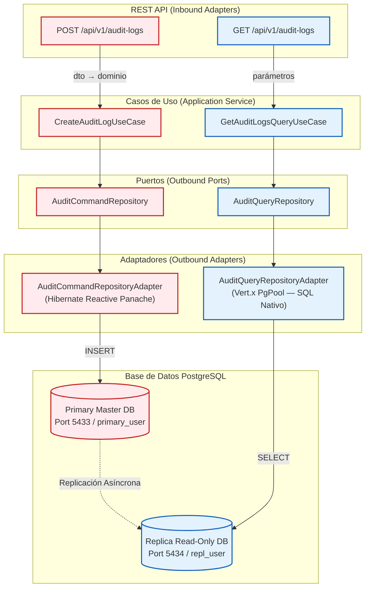
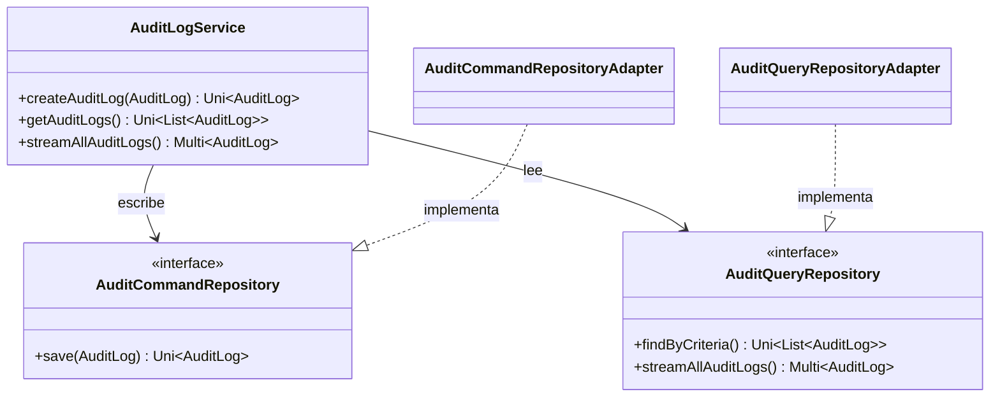
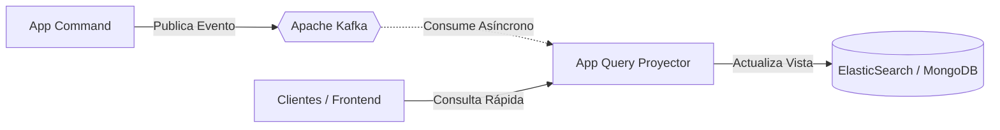

# Persistencia con CQRS y PostgreSQL Reactivo

**CQRS (Command Query Responsibility Segregation)** es la estrategia que adoptamos para llevar nuestro microservicio de auditoría a un nivel de rendimiento de producción. Separamos el canal de **escritura** del canal de **lectura**, permitiendo optimizar cada uno de forma independiente con herramientas especializadas de Quarkus.

---

## 1. Radiografía Visual: La Arquitectura CQRS Completa

El siguiente diagrama muestra el recorrido completo de un evento de auditoría en nuestro sistema. Los componentes en **rojo** gestionan la escritura y los componentes en **azul** la lectura. Cada uno habla con su propia base de datos especializada.



:::info ¿Por qué dos bases de datos?
Esta separación refleja una arquitectura de **Primary/Replica** de PostgreSQL. Las escrituras van al nodo maestro que garantiza consistencia, y las lecturas (mucho más frecuentes) se sirven desde una réplica de solo lectura, liberando al primario de esa carga.
:::

---

## 2. Los Pilares de la Implementación

import Tabs from '@theme/Tabs';
import TabItem from '@theme/TabItem';

<Tabs>
<TabItem value="deps" label="1. Dependencias Quarkus">

Empleamos dos librerías distintas para cada propósito. Esta es la clave del patrón CQRS en Quarkus:

```kotlin title="build.gradle.kts"
// ESCRITURA: ORM Reactivo con transaccionalidad y mapeos complejos
implementation("io.quarkus:quarkus-hibernate-reactive-panache")

// LECTURA: Driver Vert.x de bajo nivel para SQL nativo ultra-rápido
implementation("io.quarkus:quarkus-reactive-pg-client")
```

</TabItem>
<TabItem value="config" label="2. Configuración Dual (DataSources)">

Configuramos dos fuentes de datos independientes en `application.properties`:

```properties title="application.properties"
# Estrategia de desarrollo (usar 'validate' + Flyway en producción)
quarkus.hibernate-orm.database.generation=drop-and-create

# ESCRITURA: DataSource principal (Primary)
quarkus.datasource.db-kind=postgresql
quarkus.datasource.reactive.url=${DB_REACTIVE_URL:postgresql://localhost:5433/db_sc_audit}
quarkus.datasource.username=${DB_PRIMARY_USER:primary_user}
quarkus.datasource.password=${DB_PRIMARY_PASSWORD:primary_password}

# LECTURA: DataSource secundario (Replica)
quarkus.datasource.read.db-kind=postgresql
quarkus.datasource.read.reactive.url=${DB_READ_REACTIVE_URL:postgresql://localhost:5434/db_sc_audit}
quarkus.datasource.read.username=${DB_REPL_USER:repl_user}
quarkus.datasource.read.password=${DB_REPL_PASSWORD:repl_password}
```

:::caution Desarrollo vs Producción
`drop-and-create` recrea el esquema en cada arranque, ideal para pruebas. **En producción**, usa `validate` junto a una herramienta de migración como **Flyway** o **Liquibase**.
:::

</TabItem>
<TabItem value="command" label="3. Adaptador de Escritura (Command)">

Para las **escrituras** usamos `Hibernate Reactive Panache`, que aporta gestión de transacciones, mapeo relacional y validaciones del modelo de dominio:

```java title="AuditCommandRepositoryAdapter.java"
@ApplicationScoped
public class AuditCommandRepositoryAdapter implements AuditCommandRepository {

    @Inject AuditLogPersistenceMapper mapper;

    @Override
    public Uni<AuditLog> save(AuditLog domain) {
        AuditLogEntity entity = mapper.toEntity(domain);
        return entity.persistAndFlush()
                     .map(v -> mapper.toDomain(entity));
    }
}
```

</TabItem>
<TabItem value="query" label="4. Adaptador de Lectura (Query)">

Para las **lecturas** inyectamos directamente el `PgPool` secundario y ejecutamos **SQL nativo**: cero overhead de reflexión ORM, máxima velocidad.

```java title="AuditQueryRepositoryAdapter.java"
@ApplicationScoped
public class AuditQueryRepositoryAdapter implements AuditQueryRepository {

    @Inject
    @ReactiveDataSource("read")  // <-- Inyecta el DataSource de réplica
    PgPool readClient;

    @Override
    public Uni<List<AuditLog>> findByCriteria(...) {
        return readClient.preparedQuery(SQL)
                         .execute(params)
                         .map(this::mapRows);
    }
}
```

</TabItem>
</Tabs>

---

## 3. Contratos e Interfaces del Dominio

Uno de los principios fundamentales de la **Arquitectura Hexagonal** es que el dominio no debe conocer los detalles de la infraestructura. Para lograrlo, utilizamos **interfaces (puertos de salida)** que el `AuditLogService` consume de forma abstracta, sin saber si los datos están en PostgreSQL, en memoria o en cualquier otro almacén.

El siguiente diagrama muestra cómo la capa de Aplicación se conecta a las dos interfaces del dominio, y cómo estas son implementadas por los adaptadores de infraestructura correspondientes:

- **`AuditCommandRepository`**: Puerto exclusivo para escrituras (`save`). Implementado por `AuditCommandRepositoryAdapter` usando Hibernate Panache.
- **`AuditQueryRepository`**: Puerto exclusivo para lecturas (`findByCriteria`, streaming). Implementado por `AuditQueryRepositoryAdapter` usando SQL nativo con Vert.x PgPool.

:::tip Beneficio del Desacoplamiento
Si mañana quieres migrar la base de lectura de PostgreSQL replica a **ElasticSearch**, solo necesitas crear un nuevo adaptador que implemente `AuditQueryRepository`. El `AuditLogService` y los casos de uso **no necesitan ningún cambio**. Esto es la potencia real del Hexágono.
:::



---

## 4. Impacto y Trade-Offs

<Tabs>
<TabItem value="gains" label="Ganancias de Rendimiento">

| Métrica | Ganancia |
|:---|:---|
| **Throughput en Lectura** | +40 a 60% más TPS con Vert.x PgPool vs ORM |
| **Latencia de Lectura** | ~30 a 50% menos tiempo de respuesta |
| **Reducción de Deadlocks** | +95% al desviar SELECTs a la réplica |
| **Eficiencia Cloud** | ~40% ahorro (réplicas baratas para lecturas) |

</TabItem>
<TabItem value="tradeoffs" label="Trade-Offs (Costos)">

:::caution Consistencia Eventual
- **Replication Lag**: Existe una demora de ~10 a 500ms entre que un dato se escribe en el primario y está disponible en la réplica. Para datos críticos que se necesitan leer inmediatamente después de escribirse, hay que tener este factor en cuenta.
- **Complejidad**: +50% más código (2 interfaces, 2 adaptadores, 2 DataSources configurados).
- **Infraestructura mínima**: 2 contenedores PostgreSQL en lugar de 1.
:::

</TabItem>
<TabItem value="future" label="Evolución Futura">

El paso siguiente natural es **CQRS + Event Sourcing** con Apache Kafka, donde las escrituras publican eventos en lugar de actualizar una base de datos directamente:



</TabItem>
</Tabs>
