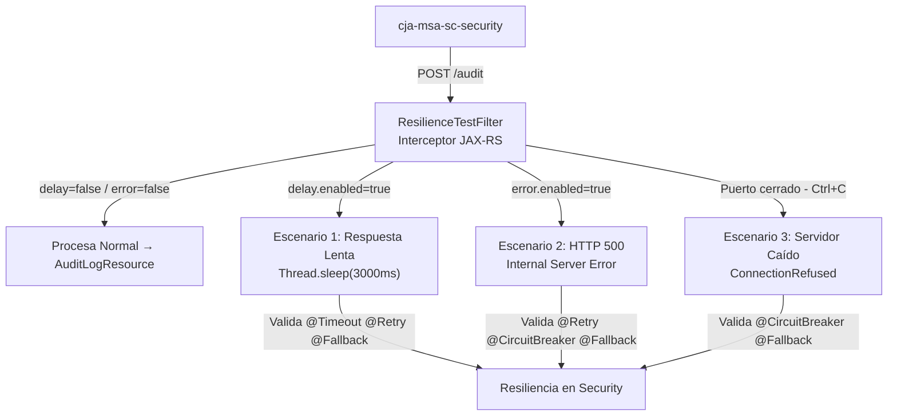

# Escenarios de Falla Controlados en Audit

Esta sesión tiene un propósito 100% **pedagógico**: dotamos al microservicio `cja-msa-sc-audit` de comportamientos anómalos **controlados** para poder demostrar en vivo cómo reaccionan las estrategias de resiliencia de `cja-msa-sc-security` ante fallos reales.

:::info Aislamiento Total
Las simulaciones están implementadas como un **filtro JAX-RS** en la capa de infraestructura (`ResilienceTestFilter`). El dominio y la lógica de negocio de `cja-msa-sc-audit` **no saben que existen estas simulaciones**. Se activan y desactivan con propiedades de configuración, sin tocar el código de negocio.
:::

---

## 1. Mapa Visual: Los Tres Escenarios



---

## 2. Los Tres Escenarios de Prueba

import Tabs from '@theme/Tabs';
import TabItem from '@theme/TabItem';

<Tabs>
<TabItem value="slow" label="1. Respuesta Lenta (Timeout)">

Simula que `audit` está tardando en guardar un registro por congestión de red o bloqueos en la base de datos.

**Resiliencia activada en Security:** `@Timeout` → `@Retry` → `@Fallback`

```properties title="audit application.properties"
# Activar demora de 3000ms (mayor al @Timeout de 1000ms en security)
audit.resilience.test.delay.enabled=true
audit.resilience.test.delay.ms=3000

# Desactivar
audit.resilience.test.delay.enabled=false
```

**Pasos para probar:**
1. Activar la demora con `delay.ms=3000`.
2. Ejecutar un Login en `cja-msa-sc-security`.
3. Observar en los logs de `security`:
   - `@Timeout` corta la llamada al superar 1000ms.
   - `@Retry` reintenta 2 veces más.
   - `@Fallback` registra la evidencia localmente.

:::caution Thread.sleep en producción
Esta técnica usa `Thread.sleep` en el hilo del servidor, lo que satura hilos en una carga real. Es **exclusiva para pruebas de desarrollo**. En producción, un Chaos Engineering tool como **Chaos Monkey** es la herramienta adecuada.
:::

</TabItem>
<TabItem value="error" label="2. Error HTTP 500">

Simula que la base de datos de `audit` ha fallado con un error interno severo (NPE, DB connection lost, etc.).

**Resiliencia activada en Security:** `@Retry` → `@CircuitBreaker` → `@Fallback`

```properties title="audit application.properties"
# Activar respuesta HTTP 500 inmediata
audit.resilience.test.error.enabled=true

# Desactivar
audit.resilience.test.error.enabled=false
```

**Pasos para probar:**
1. Activar el error.
2. Lanzar **múltiples** peticiones de Login rápidamente en `security`.
3. Tras ~4-5 fallos, el `@CircuitBreaker` **ABRE**:
   - Las siguientes peticiones van directamente al `@Fallback` sin consultar a `audit` (Fast Fail).
   - Esperar 5 segundos → el circuito pasa a **SEMI-ABIERTO** y deja pasar una petición de prueba.

</TabItem>
<TabItem value="down" label="3. Servidor Caído">

El escenario más drástico: `audit` deja de existir y el puerto de red se cierra completamente.

**Resiliencia activada en Security:** `@CircuitBreaker` → `@Fallback`

**Pasos para probar:**
1. Detener el proceso de `cja-msa-sc-audit` en la terminal (`Ctrl+C`).
2. En `cja-msa-sc-security`, realizar varias peticiones de Login.
3. Observar `ConnectionRefusedException` en los primeros intentos.
4. El `@CircuitBreaker` entra en acción → el `@Fallback` toma el control.

:::tip El Resultado Esperado
El usuario de `security` **nunca recibe un error**. Solo el log de auditoría falla silenciosamente con un mensaje de fallback. Esto demuestra el **aislamiento de fallos** entre microservicios.
:::

</TabItem>
</Tabs>

---

## 3. Implementación Técnica

La magia ocurre en el filtro JAX-RS que intercepta todas las peticiones entrantes a `audit` **antes** de que lleguen al controlador:

```java title="ResilienceTestFilter.java"
@Provider
public class ResilienceTestFilter implements ContainerRequestFilter {

    @ConfigProperty(name = "audit.resilience.test.delay.enabled", defaultValue = "false")
    boolean delayEnabled;

    @ConfigProperty(name = "audit.resilience.test.delay.ms", defaultValue = "3000")
    long delayMs;

    @ConfigProperty(name = "audit.resilience.test.error.enabled", defaultValue = "false")
    boolean errorEnabled;

    @Override
    public void filter(ContainerRequestContext ctx) throws IOException {
        if (errorEnabled) {
            ctx.abortWith(Response.serverError().build()); // Retorna HTTP 500
            return;
        }
        if (delayEnabled) {
            Thread.sleep(delayMs); // Pausa artificial
        }
    }
}
```

---

## 4. Estructura del Proyecto

```text
cja-msa-sc-audit/
└── src/main/java/cja/msa/sc/audit/infrastructure/adapters/in/rest/
    ├── AuditLogResource.java         (Sin cambios)
    └── filter/
        └── ResilienceTestFilter.java <- [NUEVO] Simulador de fallos
```
