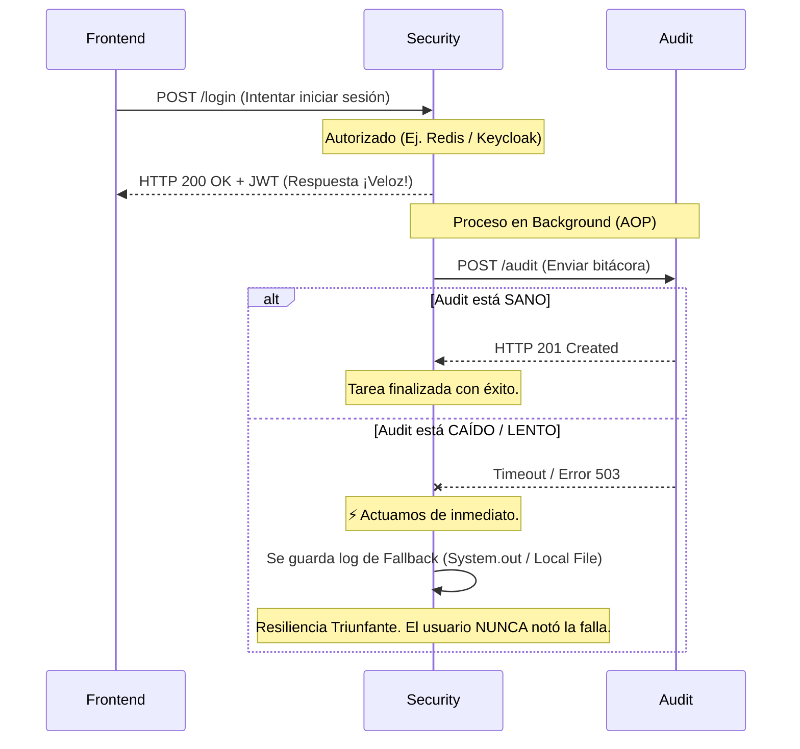
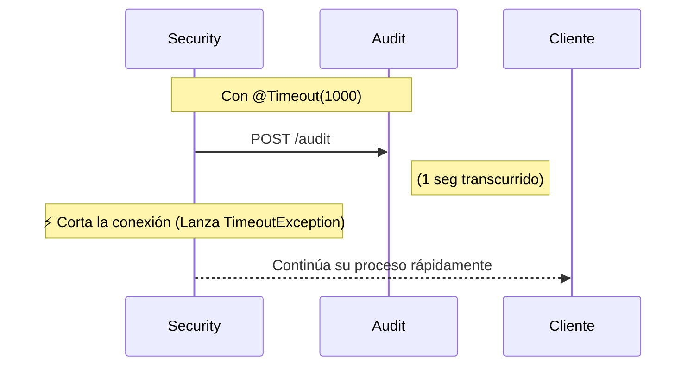
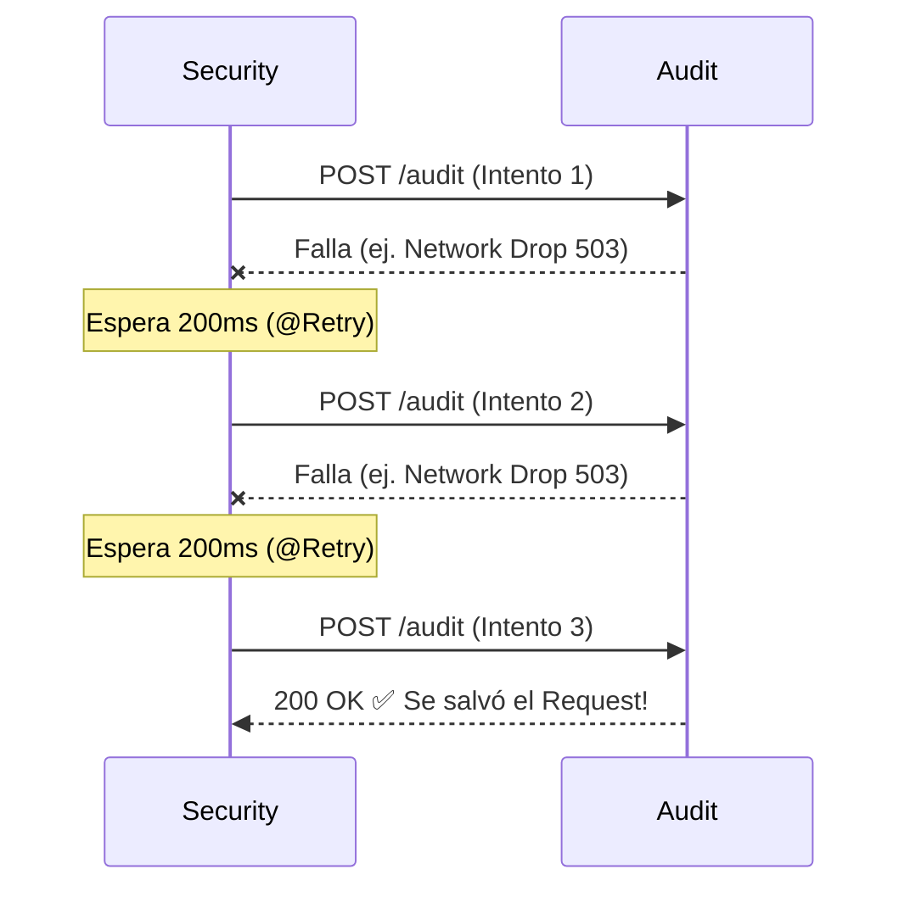
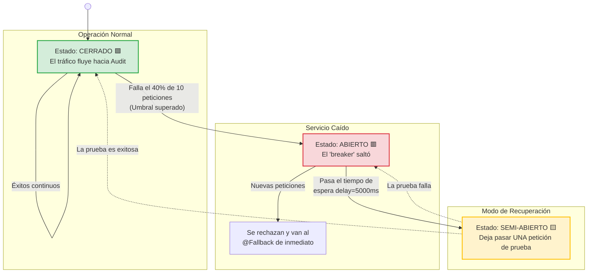
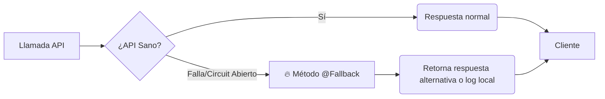
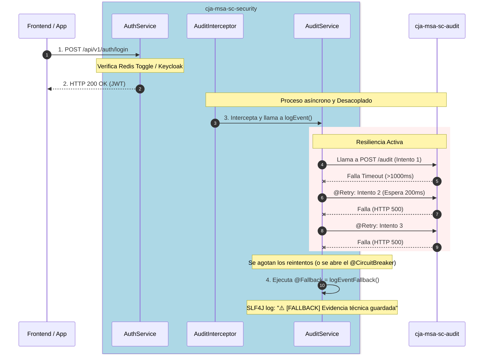

# Endpoints Resilientes en Security

## 1. Objetivo de la Sesión
Introducir el concepto de **Resiliencia (Tolerancia a Fallos)** en la comunicación entre microservicios, específicamente protegiendo a `cja-msa-sc-security` contra inestabilidades del microservicio `cja-msa-sc-audit`.

## 2. Dependencia Principal
```kotlin
implementation("io.quarkus:quarkus-smallrye-fault-tolerance")
```

## 3. ¿Por qué la Resiliencia es Indispensable?

> *"No se trata de **si** un sistema va a fallar, sino de **cuándo** lo hará y **cómo** te vas a recuperar."*

En arquitecturas distribuidas, **la red no es confiable, la latencia no es cero y los servidores no son inmortales**. La resiliencia es el escudo que garantiza que un componente débil o caído (ej. `audit`) **jamás** provoque un efecto dominó que arrastre a la muerte a los componentes sanos que lo consumen (ej. `security`).

### Diagrama del Caso de Uso



---

## 4. `@Timeout` — Límite de Tiempo de Espera

**Fija un límite estricto** al tiempo que una parte del sistema está dispuesta a esperar por una respuesta. Si ese límite se alcanza, la invocación se considera fallida inmediatamente, liberando los hilos bloqueados.



**Escenario Real:** Pasarela de Pagos Lenta — Si un banco no responde en 3 segundos, abortar y mostrar "Intente nuevamente", sin saturar los servidores.

```java
@Timeout(value = 1000) // 1 segundo = 1000 ms
public void logEvent(...) {
    auditRestClient.sendAuditLog(auditData);
}
```

---

## 5. `@Retry` — Reintento Automático

Permite que una operación fallida se intente de nuevo automáticamente antes de aceptar la derrota. Útil para **Fallos Transitorios (Transient Failures)**: errores que ocurren por un micro-segundo.



**Escenario Real:** Pods de Kubernetes reiniciando — Con `@Retry(maxRetries = 3, delay = 500)`, el sistema detecta la falla, espera, y el pod ya arrancó para el segundo intento.

```java
@Retry(maxRetries = 2, delay = 200) // Máximo 2 reintentos extra, esperando 200ms entre ellos
public void logEvent(...) { ... }
```

---

## 6. `@CircuitBreaker` — Interruptor de Circuito

Un **Interruptor Térmico** de software. Si las peticiones hacia otro servicio están fallando sistemáticamente, "corta la corriente" para evitar ahogar al otro servicio.

**3 estados:**
- **Cerrado (Closed):** Todo está sano, las peticiones fluyen con normalidad.
- **Abierto (Open):** Si X cantidad de errores ocurren, "Salta" el taco. Las peticiones ni siquiera viajan por red.
- **Semi-Abierto (Half-Open):** Al pasar cierto tiempo (`delay`), se lanza 1 petición de prueba. Si es exitosa, se CIERRA el circuito.



```java
// 1. Evalúa las últimas 10 llamadas
// 2. Si 4 o más fallan (failureRatio = 0.4) → ABRE el circuito por 5000ms
@CircuitBreaker(requestVolumeThreshold = 10, failureRatio = 0.4, delay = 5000)
public void logEvent(...) { ... }
```

---

## 7. `@Fallback` — Plan B / Graceful Degradation

El patrón de **Mitigación** definitiva. ¿Qué debe hacer tu backend si todas las opciones anteriores fallan? Un `@Fallback` proporciona un camino algorítmico secundario que atrapa el error y provee datos cacheados o un reporte silenciado.



```java
@Timeout(1000)
@Retry(maxRetries = 2, delay = 200)
@CircuitBreaker(requestVolumeThreshold = 10, failureRatio = 0.4, delay = 5000)
@Fallback(fallbackMethod = "logEventFallback")
public void logEvent(...) { ... }

// El Throwable t permite identificar QUÉ política disparó el fallback
public void logEventFallback(..., Throwable t) {
    if (t instanceof TimeoutException) {
        log.warn("🚨 @Timeout detonado");
    } else if (t instanceof CircuitBreakerOpenException) {
        log.warn("🚨 @CircuitBreaker Abierto");
    } else {
        log.warn("🚨 Excepción de @Retry agotado o fallo general");
    }
}
```

---

## 8. Flujo Completo con Resiliencia Activa



## 9. Configuración Necesaria

```properties
# application.properties
# Feature toggle para Redis (puede desactivarse sin apagar el servicio)
security.login.redis.enabled=false
```

## 10. Estructura Actualizada del Proyecto

```text
cja-msa-sc-security/
├── build.gradle.kts (Added quarkus-smallrye-fault-tolerance)
└── src/main/java/cja/msa/sc/security/
    ├── application/
    │   └── service/
    │       └── AuthService.java (Modificado: flag de Redis isRedisEnabled)
    └── infrastructure/
        └── adapters/
            └── out/rest/audit/
                └── AuditService.java (Modificado: @Retry, @Timeout, @CircuitBreaker, @Fallback)
```
