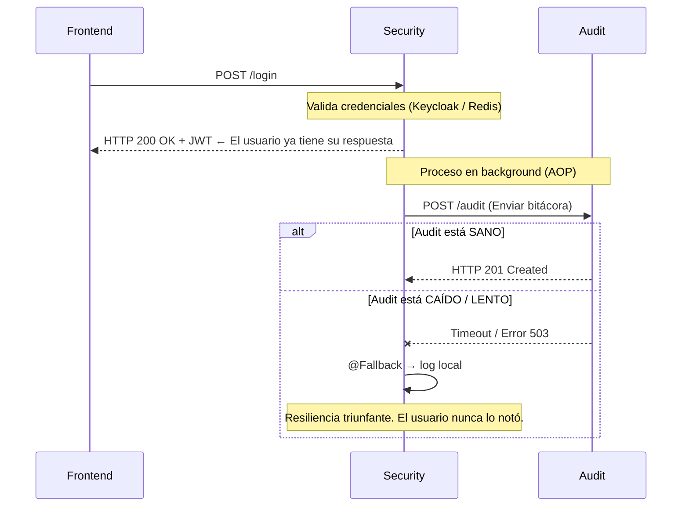
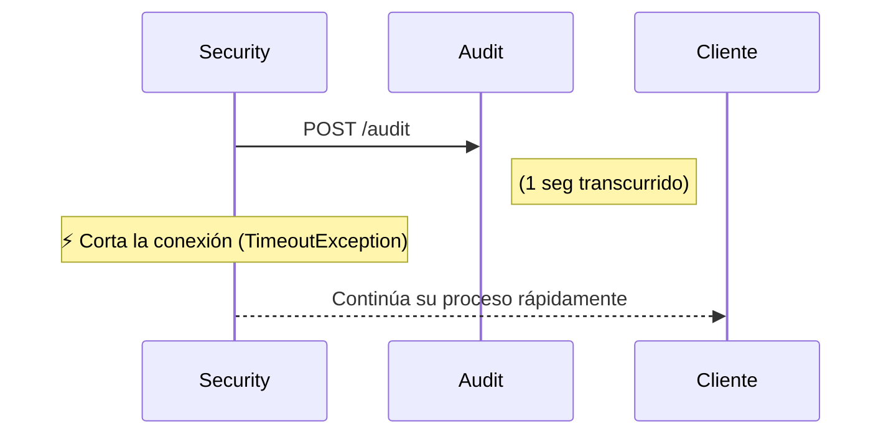
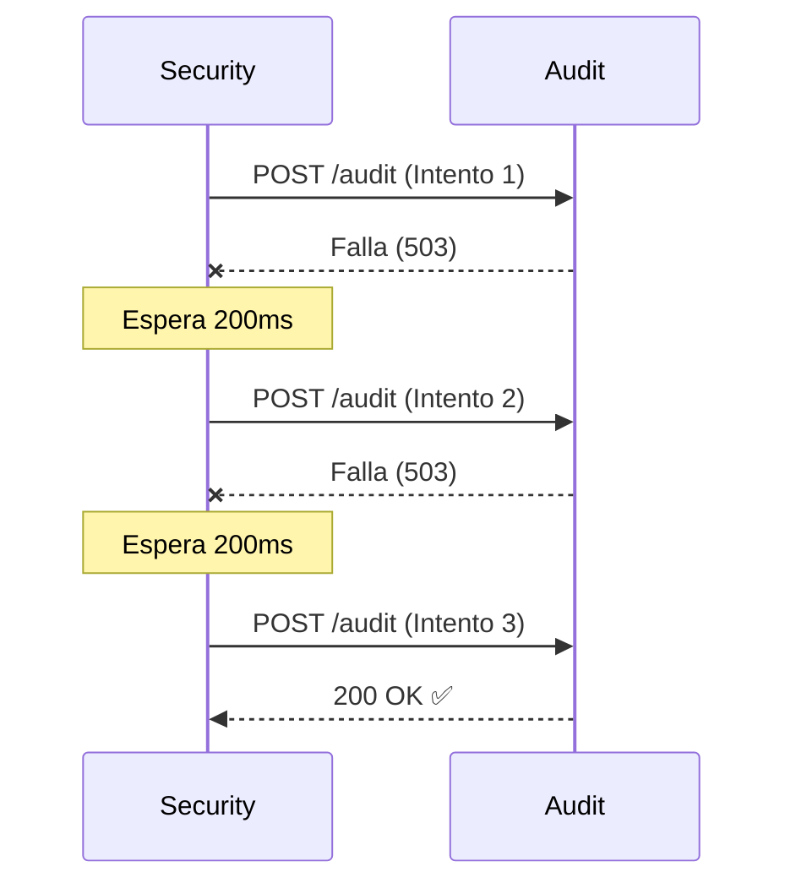
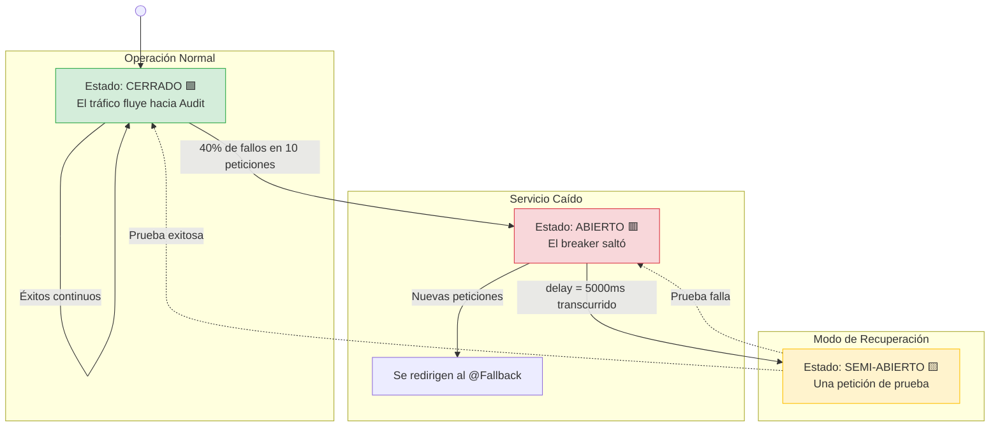
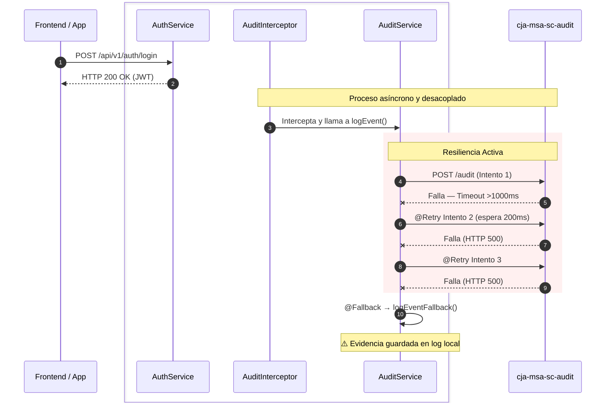

# Resiliencia y Tolerancia a Fallos

Protegemos el microservicio `cja-msa-sc-security` contra las inestabilidades del servicio de auditoría (`cja-msa-sc-audit`) con cuatro anotaciones de **MicroProfile Fault Tolerance** que se apilan como capas de defensa. Si una falla, activamos la siguiente.

:::info Principio de Resiliencia
No se trata de **si** un sistema va a fallar, sino de **cuándo** y **cómo** nos recuperamos. En arquitecturas distribuidas, la red no es confiable, la latencia no es cero y los servidores no son inmortales. La resiliencia es el escudo que garantiza que un componente débil **jamás** provoque un efecto dominó.
:::

---

## 1. Radiografía Visual: El Escenario del Colapso

Este diagrama muestra el caso real que nos motivó: el login de un usuario **nunca debe verse afectado** por una caída del servicio de auditoría.



---

## 2. Las Cuatro Capas de Defensa

```kotlin title="build.gradle.kts"
implementation("io.quarkus:quarkus-smallrye-fault-tolerance")
```

Las anotaciones se aplican en cascada sobre el mismo método. El orden de evaluación es: **Timeout → Retry → CircuitBreaker → Fallback**.

import Tabs from '@theme/Tabs';
import TabItem from '@theme/TabItem';

<Tabs>
<TabItem value="timeout" label="1. @Timeout">

**Fija un límite estricto** de espera. Si la llamada supera el umbral, lanza una `TimeoutException` inmediatamente, liberando el hilo.



```java title="AuditService.java"
@Timeout(value = 1000) // Máximo 1 segundo de espera
public void logEvent(...) {
    auditRestClient.sendAuditLog(auditData);
}
```

:::tip Caso de uso real
Pasarela de Pagos lenta: si el banco no responde en 3 segundos, abortar y mostrar "Intente nuevamente", sin saturar los hilos del servidor.
:::

</TabItem>
<TabItem value="retry" label="2. @Retry">

Permite que una operación fallida se intente de nuevo automáticamente. Útil para **fallos transitorios** (micro-cortes de red, pods reiniciando).



```java title="AuditService.java"
@Retry(maxRetries = 2, delay = 200) // 2 reintentos extra, 200ms entre ellos
public void logEvent(...) { ... }
```

:::info Caso de uso real
Pods de Kubernetes reiniciando: el sistema detecta la falla, espera 200ms, y el pod ya arrancó para el segundo intento.
:::

</TabItem>
<TabItem value="circuit-breaker" label="3. @CircuitBreaker">

Un **interruptor térmico** de software. Si los fallos son sistemáticos, corta el flujo para no ahogar al servicio caído, dejando tiempo para que se recupere.



```java title="AuditService.java"
// Abre el circuito si 4/10 llamadas fallan. Lo mantiene abierto 5 segundos.
@CircuitBreaker(requestVolumeThreshold = 10, failureRatio = 0.4, delay = 5000)
public void logEvent(...) { ... }
```

</TabItem>
<TabItem value="fallback" label="4. @Fallback">

El **Plan B definitivo**. Si todas las capas anteriores fallan, un método alternativo provee una respuesta degradada en lugar de propagar el error.

```java title="AuditService.java"
@Timeout(1000)
@Retry(maxRetries = 2, delay = 200)
@CircuitBreaker(requestVolumeThreshold = 10, failureRatio = 0.4, delay = 5000)
@Fallback(fallbackMethod = "logEventFallback")
public void logEvent(...) { ... }

// El throwable permite saber exactamente QUÉ política disparó el fallback
public void logEventFallback(..., Throwable t) {
    if (t instanceof TimeoutException) {
        log.warn("🚨 @Timeout detonado — Audit no respondió a tiempo");
    } else if (t instanceof CircuitBreakerOpenException) {
        log.warn("🚨 @CircuitBreaker abierto — Audit en modo de recuperación");
    } else {
        log.warn("🚨 @Retry agotado — Fallo persistente en Audit");
    }
}
```

:::caution Degradación Elegante
El `@Fallback` **no arregla el problema**, lo contiene. El microservicio de auditoría sigue caído, pero la experiencia del usuario es intacta. El log de fallback sirve como evidencia técnica para el equipo de operaciones.
:::

</TabItem>
</Tabs>

---

## 3. El Flujo Completo con Todas las Capas Activas



---

## 4. Estructura del Proyecto

```text
cja-msa-sc-security/
├── build.gradle.kts                              <- Añadida: quarkus-smallrye-fault-tolerance
└── src/main/java/cja/msa/sc/security/
    └── infrastructure/adapters/out/rest/audit/
        └── AuditService.java                     <- [MODIFICADO] @Timeout @Retry @CircuitBreaker @Fallback
```
