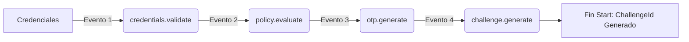
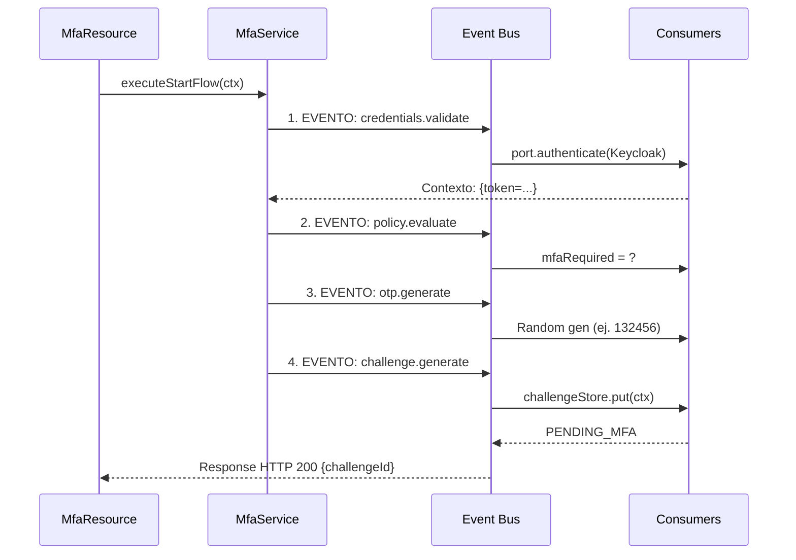
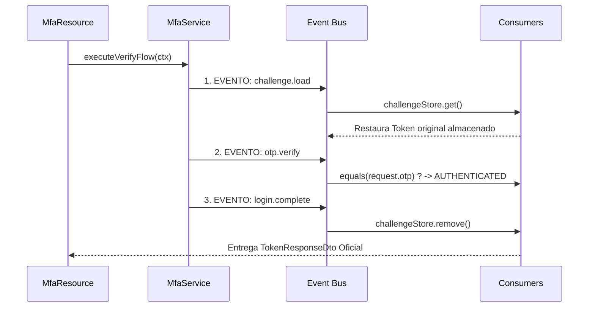

# Event Bus y MFA con Arquitectura Orientada a Eventos

## 1. Introducción: MFA Orientado a Eventos

El proceso de Autorización Multifactor (MFA) es el ejemplo perfecto para aplicar una arquitectura orientada a eventos (EDA). Visualicémoslo de manera sencilla:



En un flujo tradicional, estos pasos se programarían como una gigante cadena procedural anidada. Utilizando el **Quarkus Event Bus**, transformamos el MFA en una **línea de ensamblaje dinámica**. Cada paso se convierte en una "estación" especializada e independiente. Esto nos brinda la superpotencia de **saltar pasos en tiempo real** sin necesidad de reescribir la lógica superior de nuestro orquestador central (API).

---

## 2. Las Piezas del Rompecabezas

Para lograr esta arquitectura ágil y desacoplada, dependemos de tres engranajes fundamentales. Analicemos el rol de cada uno:

import Tabs from '@theme/Tabs';
import TabItem from '@theme/TabItem';

<Tabs>
<TabItem value="bus" label="1. Event Bus">

Es la infraestructura central que enruta y mueve los mensajes a través de Quarkus. 
Su única función es tomar un paquete y entregarlo en un **`Address`** (dirección lógica) predeterminado a lo largo de nuestro microservicio. Ningún componente llama a otro componente directamente; todos hablan exclusiva y únicamente mediante el Bus.

</TabItem>
<TabItem value="consumers" label="2. Consumers">

Son listeners pasivos o reactivos (anotados con `@ConsumeEvent`). 
Jamás ejecutan instrucciones o llamadas externas de forma arbitraria; **sólo son gatillados si un evento llega a la dirección concreta que están vigilando**. Son quienes ejecutan el "trabajo duro" de cada estación.

</TabItem>
<TabItem value="context" label="3. Contexto (MfaEventContext)">

Constituye el núcleo del modelo de datos de la orquestación. Es la **"Bandeja"** compartida por donde transita la información. En lugar de recibir millones de Request pequeños vacíos, el modelo viaja encapsulado dentro del mensaje acumulando decisiones paso a paso.

```java title="MfaEventContext.java"
@Data @Builder
public class MfaEventContext {
    private String username;          
    private String password;          
    private TokenResponseDto token;   
    private boolean mfaRequired;      
    private String challengeId;       
    private String otpCode;           
    private String otpCodeReceived;   
    private MfaStatus status;         
}
```

</TabItem>
</Tabs>

---

## 3. Los Dos Flujos en Acción: Start vs Verify

Este proceso se divide operacionalmente en dos partes asíncronas separadas en el tiempo (`/start` que alista el requerimiento, y `/verify` que evalúa un factor local introducido por el cliente). Comparemos paso a paso cada endpoint.

<Tabs>
<TabItem value="start" label="1. POST /mfa/start (Inicialización)">

El endpoint `Start` prepara meticulosamente todo el proceso verificando formalmente al usuario en una red exterior sin arrojar su sesión operativa, retornando un `ChallengeId` provisorio.

```json title="Payload de Entrada (MfaStartRequestDto)"
{
  "username": "user@example.com",
  "password": "SecretPassword123!"
}
```



### ¿Qué hace cada evento en Start?
- **`credentials.validate`**: Se comunica asincrónicamente o de modo bloqueante con Keycloak para obtener el JWT real. Retiene el token en el `MfaEventContext`.
- **`policy.evaluate`**: Consulta heurísticas o reglas simples de sistema (ej. "Admin salta segundo factor"). Modifica la variable analítica `mfaRequired`.
- **`otp.generate`**: Observa el contexto; si se requiere MFA genera un código random. Presta este espacio para integrar SDKs de envíos de SMS/Correos de terceros.
- **`challenge.generate`**: Crea la matrícula unívoca temporaria `challengeId`, guarda todo el paquete recolectado hacia nuestra caché, devolviendo control a la API y congelando la historia.

**Implementación del Consumer Bloqueante:**
Dado que confirmar el password de un usuario obliga una travesía intensa de red hacia IAM (Keycloak), este primer Consumer exige contar con `blocking = true` para no asfixiar el valioso Event Loop reactivo central.

```java title="MfaEventConsumers.java (Start Worker)"
@ConsumeEvent(value = "security.mfa.credentials.validate", blocking = true)
public MfaEventContext validateCredentials(MfaEventContext context) {
    TokenResponseDto token = authenticationPort.authenticate(context.getUsername(), context.getPassword());
    
    context.setToken(token); // Almacenamiento pasivo
    context.setPassword("***"); // Por seguridad purgamos la contraseña
    return context;
}
```

</TabItem>
<TabItem value="verify" label="2. POST /mfa/verify (Completación)">

Finaliza y unifica la sesión pendiente. El usuario despacha su código SMS asignado al ticket `challengeId` subyacente y el sistema evalúa, reviviendo el estado anterior.

```json title="Payload de Entrada (MfaVerifyRequestDto)"
{
  "challengeId": "123e4567-e89b-12d3-a456-426614174000",
  "otpCode": "849201"
}
```



### ¿Qué hace cada evento en Verify?
- **`challenge.load`**: Su tarea es puramente de recuperación técnica. Acude a la Caché o DB compartida buscando el identificador del usuario para resucitar el token y la política suspendida previamente.
- **`otp.verify`**: Ejecuta la comprobación computacional o criptográfica, confirmando que el valor enviado por la capa REST coteja exactamente con el dictado.
- **`login.complete`**: Consume y extingue el ticket de la Caché (extrema seguridad anti-repetición) y devuelve el token oficial pre-asentado hacia la etapa terminal.

**Implementación de Rehidratación:**
Para persistir o ceder el recuerdo del contexto temporal entre las llamadas Start y Verify aisladas, optamos en este modelo por usar un mapa robusto y concurrente `ConcurrentHashMap` a título de Caché veloz.

```java title="MfaEventConsumers.java (Verify State)"
private final ConcurrentMap<String, MfaEventContext> challengeStore = new ConcurrentHashMap<>();

@ConsumeEvent(value = "security.mfa.challenge.load", blocking = true)
public MfaEventContext loadChallengeBlocking(MfaEventContext context) {
    // 1. Resucitamos las acciones del Start()
    MfaEventContext storedContext = challengeStore.get(context.getChallengeId());
    
    if (storedContext == null) throw new WebApplicationException("Challenge expirado", Status.BAD_REQUEST);

    // 2. Insertamos el token 2FA para el cotejo subsecuente
    storedContext.setOtpCodeReceived(context.getOtpCodeReceived());
    return storedContext;
}
```

</TabItem>
</Tabs>

---

## 4. Diseño y Estructura Organizacional

Archivos técnicos impactados y su distribución en forma de jerarquía tras el refactor propuesto para este flujo orientado a eventos dentro del paquete `cja.msa.sc.security`:

```text
cja-msa-sc-security/src/main/java/cja/msa/sc/security/.../
├── application/service/
│   ├── MfaService.java              <- Orchestrator unificador reactivo
│   └── MfaEventConsumers.java       <- Lógica de Worker Nodes: Alberga los @ConsumeEvent
├── domain/model/
│   ├── MfaEventContext.java         <- Shared Context DTO consolidado 
│   ├── MfaChallenge.java            <- Unidad lógca para serializaciones externas
│   └── enums/MfaStatus.java         <- Estado del Tracker de progreso de sesión
├── infrastructure/adapters/in/rest/
│   ├── MfaResource.java             <- Superficie API en POST /mfa/start y /mfa/verify
│   └── dto/request_response/        <- Input/Output Contracts
```
