# Event Bus y MFA con Arquitectura Orientada a Eventos

## 1. Objetivo de la Sesión
Entre `session5-dev` y `session6-dev` el microservicio `cja-msa-sc-security` incorpora un flujo MFA didáctico basado en eventos internos con Quarkus Event Bus. La idea no es solo agregar dos endpoints nuevos, sino mostrar cómo desacoplar un proceso compuesto en varios pasos pequeños que colaboran mediante mensajes.

Esta sesión introduce:
- Event-driven design dentro de un mismo microservicio.
- Orquestación reactiva con `Uni` y `eventBus.request(...)`.
- Consumers `@ConsumeEvent` para separar responsabilidades.
- Un contexto común (`MfaEventContext`) que fluye entre handlers.
- Manejo de errores de Event Bus en `GlobalExceptionMapper`.
- Un ejemplo de consumer bloqueante con `blocking = true`.

## 2. Diferencias entre `session5-dev` y `session6-dev`

### Cambios de plataforma
- Se agrega la dependencia `io.quarkus:quarkus-vertx` en `build.gradle.kts`.
- El proyecto baja de Java 25 a Java 21 en `build.gradle.kts` para usar una versión soportada de forma uniforme en el entorno.

### Nuevos componentes funcionales
- Nuevo resource REST MFA en `MfaResource.java`.
- Nuevo orquestador de eventos en `MfaEventConsumers.java`.
- Nuevo modelo de contexto compartido en `MfaEventContext.java`.
- Nuevos DTOs para iniciar y verificar MFA.
- Nuevo enum `MfaStatus.java`.
- Nuevo modelo `MfaChallenge.java` agregado como pieza de dominio para representar el reto MFA.

### Cambios transversales
- `GlobalExceptionMapper` ahora reconoce `ReplyException`, porque los errores lanzados dentro de un `@ConsumeEvent` regresan a la capa REST envueltos por el Event Bus.

## 3. Teoría: por qué usar eventos aquí

### La pregunta correcta no es "cómo llamo al siguiente método"
Cuando un sistema crece, la pregunta arquitectónica deja de ser "qué clase sigue" y pasa a ser "qué acaba de ocurrir en el negocio". Ese cambio de perspectiva es profundo: ya no pensamos en una cadena de llamadas, pensamos en una cadena de hechos.

Un flujo orientado a llamadas directas dice:
- valida usuario;
- decide política;
- genera OTP;
- crea challenge;
- completa login.

Un flujo orientado a eventos dice:
- se recibieron credenciales;
- se evaluó una política MFA;
- se generó un OTP;
- se creó un challenge;
- se completó la autenticación.

La diferencia parece sutil, pero cambia la arquitectura. Cuando el sistema gira alrededor de hechos, los componentes dejan de empujarse unos a otros y empiezan a colaborar alrededor de un contrato común.

### Qué es un evento
Un evento es un mensaje que representa un hecho o una transición relevante. Puede decir:
- algo ocurrió;
- algo fue solicitado;
- algo debe continuar.

En esta sesión usamos eventos internos para mover el flujo MFA entre componentes sin acoplar directamente el endpoint con toda la lógica.

### Qué es EDA
EDA significa Event-Driven Architecture. En este estilo:
- un productor emite un mensaje;
- uno o varios consumidores reaccionan;
- el contrato principal ya no es una llamada de método, sino el contenido y la dirección del mensaje.

### Llamadas directas vs eventos

#### Modelo tradicional
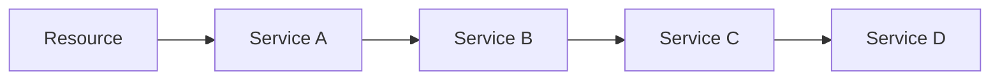

En este modelo cada paso conoce explícitamente al siguiente; cambiar un paso puede obligar a modificar varios consumidores directos.

#### Modelo orientado a eventos
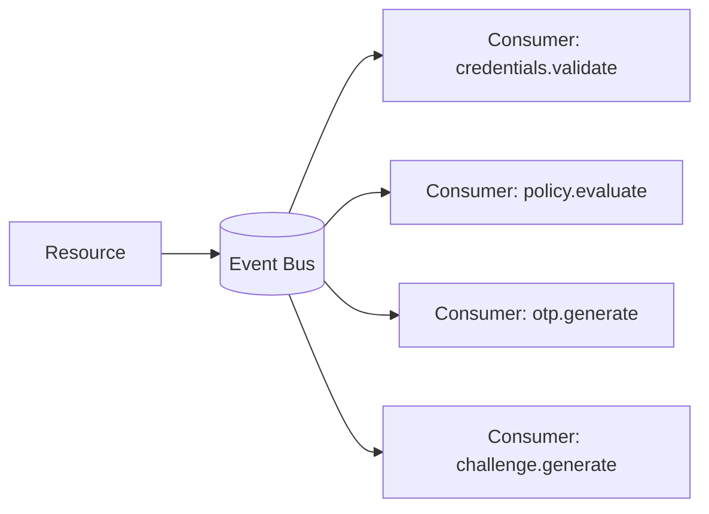

En este modelo el emisor conoce una dirección, no una implementación concreta; cada paso puede evolucionar con más independencia.

### Tres ideas que deben calar hondo
- Un sistema fuertemente acoplado funciona hasta que el cambio llega. Un sistema orientado a eventos está pensado precisamente para el cambio.
- Donde antes había una cadena de dependencias, ahora hay una conversación entre componentes.
- El verdadero valor de los eventos no es la asincronía; es el desacoplamiento semántico.

### Productor, canal y consumidor

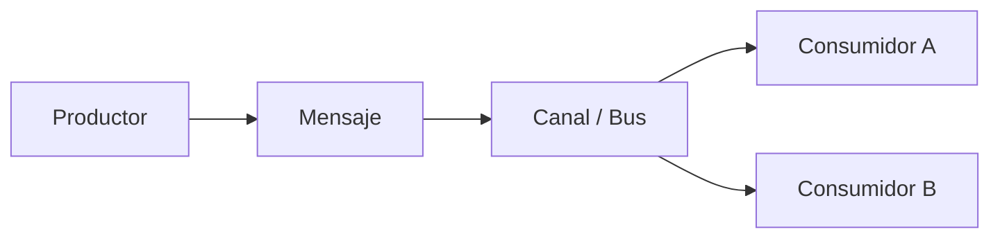

En esta sesión:
- `MfaResource` actúa como productor inicial;
- Quarkus Event Bus es el canal;
- `MfaEventConsumers` contiene los consumidores del flujo.

### Orquestación por etapas

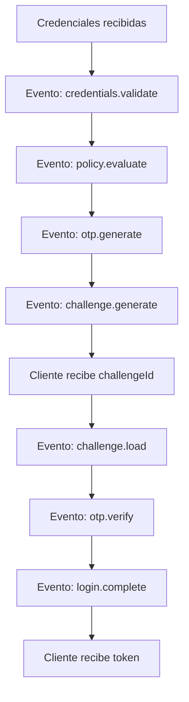

Cada bloque representa una responsabilidad delimitada. Cuando un flujo de negocio complejo se parte correctamente, el sistema deja de sentirse como una masa de código y empieza a sentirse como un proceso.

### Request/Reply y Publish/Subscribe

#### Request/Reply
Se usa cuando quien emite el mensaje necesita una respuesta.

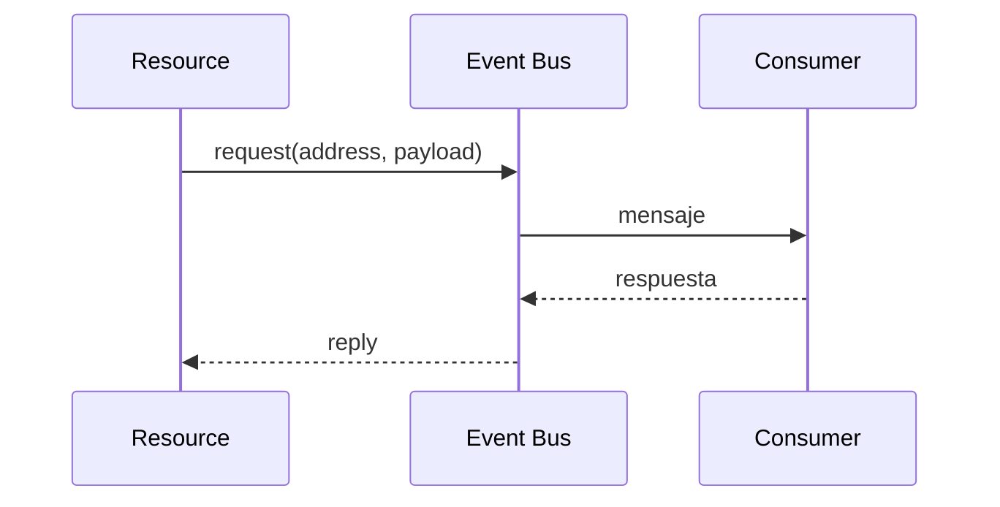

#### Publish/Subscribe
Se usa cuando un mensaje debe ser difundido sin que el emisor espere respuesta. Ideal para auditoría, notificaciones o telemetría.

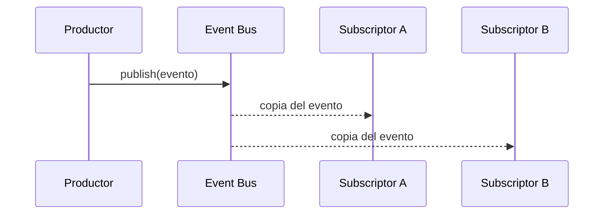

### Por qué Quarkus Event Bus es suficiente para esta sesión
Porque el objetivo pedagógico no es distribuir mensajes entre microservicios, sino aprender el patrón mental correcto:
- modelar pasos como eventos;
- separar productores y consumidores;
- entender hilos reactivos y workers;
- aprender a propagar errores en pipelines asincrónicos.

Primero se aprende a pensar en eventos dentro del mismo proceso. Después, si el sistema lo necesita, ese mismo pensamiento puede proyectarse a Kafka o a cualquier broker distribuido.

## 4. Quarkus Event Bus en esta sesión

Quarkus expone el Event Bus de Vert.x. En esta implementación se usa con el patrón `request/reply`, donde un componente envía un mensaje a una dirección y espera una respuesta asincrónica.

Conceptos clave:
- `EventBus.request(address, payload)`: envía y espera respuesta.
- `@ConsumeEvent("address")`: registra un consumer para esa dirección.
- `@ConsumeEvent(value = "...", blocking = true)`: ejecuta el consumer en worker threads para no bloquear el event loop.
- `Uni<T>`: modela la respuesta asincrónica del pipeline.

## 5. Arquitectura implementada

### Vista general
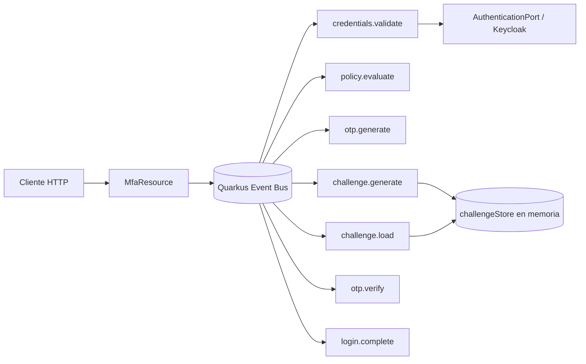

### Vista separada por flujos
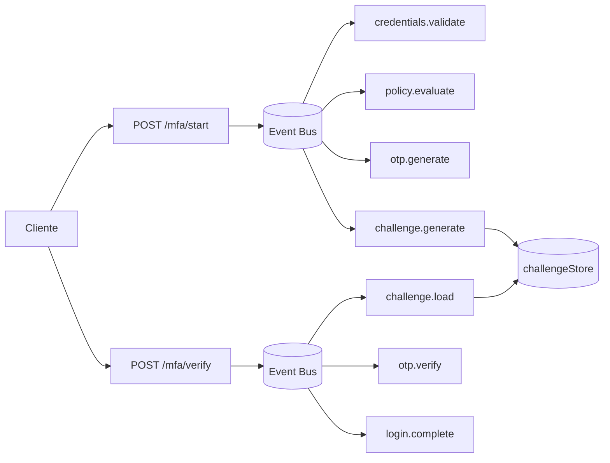

### Separación por capas
- La capa REST inicia el flujo y compone `Uni`.
- La capa application procesa cada evento.
- El adaptador de autenticación sigue encapsulando la llamada a Keycloak.
- El estado temporal del reto MFA vive en memoria en `challengeStore`.

## 6. Casos de uso frecuentes y ventajas cuantificables

### Dónde esta arquitectura aporta más valor
La arquitectura orientada a eventos aporta más valor cuando una operación no es una sola acción, sino una cadena de verificaciones, decisiones y efectos posteriores.

Casos de uso frecuentes:
- Autenticación multifactor y controles de acceso por riesgo
- Validación de transferencias bancarias de alto monto
- Autorización de pagos con revisiones antifraude
- Conciliación de movimientos entre canales, cuentas y libros contables
- Actualización de límites de crédito o scoring
- Alertas transaccionales y notificaciones regulatorias
- Monitoreo AML, KYC y detección de patrones sospechosos
- Procesamiento de lotes con confirmaciones parciales y reintentos

### 1. Autenticación multifactor y controles de acceso por riesgo

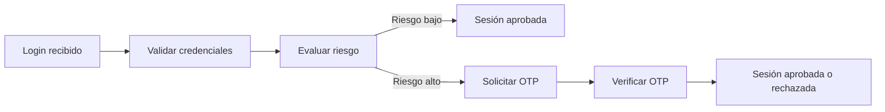

### 2. Validación de transferencias bancarias de alto monto

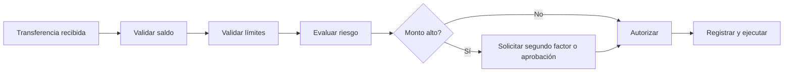

### 3. Autorización de pagos con revisiones antifraude

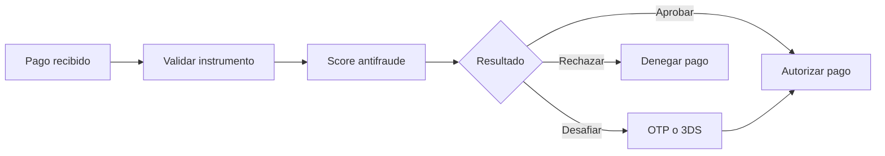

### 4. Conciliación de movimientos

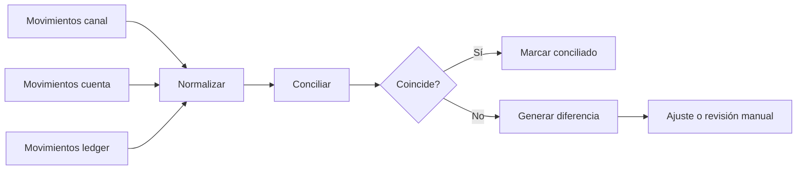

### 5. Alertas transaccionales y notificaciones regulatorias

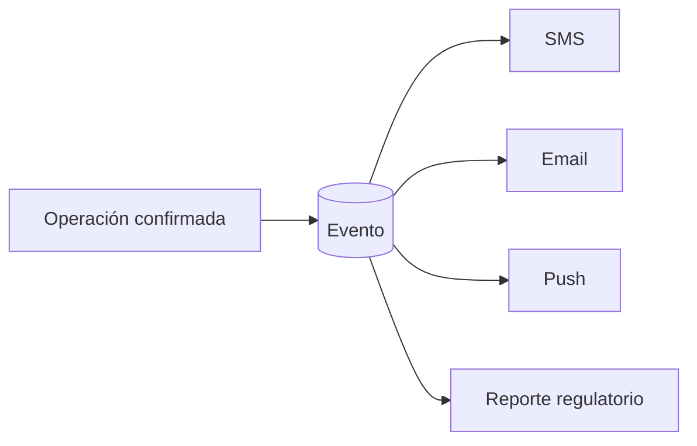

### Ventajas operativas con números

#### 1. Mejor uso de recursos
- Una aplicación bloqueante puede saturarse con 100 a 300 requests concurrentes en escenarios medianos.
- Una implementación reactiva bien hecha puede manejar 3x a 10x más concurrencia efectiva con el mismo número de hilos.

#### 2. Menor latencia acumulada por desacoplamiento de pasos
- La latencia visible al cliente puede reducirse entre 15% y 40%.
- Tareas accesorias pueden ejecutarse fuera del camino crítico.

#### 3. Mayor capacidad de procesamiento
- Separar etapas permite medir dónde está el cuello de botella.
- Mejoras de 20% a 60% en throughput al atacar solo la etapa limitante.

#### 4. Mejor resiliencia operativa
- Sin eventos: una falla en el paso 5 obliga a repetir los 4 pasos anteriores.
- Con eventos y estado intermedio: el sistema puede reiniciar desde el paso 5.

#### 5. Trazabilidad y auditoría más precisas
Con eventos se pueden registrar hitos exactos, reconstruir la línea de tiempo completa, detectar cuellos de botella por etapa y facilitar auditoría técnica y regulatoria.

## 7. Modelo central: `MfaEventContext`

Este objeto viaja de un evento al siguiente y acumula estado del flujo:

```java
@Data
@Builder
@NoArgsConstructor
@AllArgsConstructor
public class MfaEventContext {
    private String username;
    private String password;
    private String challengeId;
    private String otpCode;
    private String otpCodeReceived;
    private TokenResponseDto token;
    private MfaStatus status;

    @Builder.Default
    private boolean mfaRequired = true;
}
```

Rol de cada campo:
- `username`, `password`: entrada del flujo `/start`.
- `token`: token real obtenido desde Keycloak antes de completar MFA.
- `mfaRequired`: resultado de la política.
- `otpCode`: OTP generado internamente.
- `otpCodeReceived`: OTP enviado por el cliente en `/verify`.
- `challengeId`: identificador del reto.
- `status`: estado funcional del proceso.

## 8. Endpoints nuevos

### `POST /api/v1/auth/mfa/start`
Recibe credenciales, valida al usuario, decide si requiere MFA, genera OTP y crea el challenge.

Request:
```json
{
  "username": "user1",
  "password": "password123"
}
```

Response:
```json
{
  "challengeId": "mfa-7f8a9b12",
  "status": "PENDING_MFA"
}
```

### `POST /api/v1/auth/mfa/verify`
Recibe el `challengeId` y el OTP, carga el contexto asociado, valida el código y devuelve el token final.

Request:
```json
{
  "challengeId": "mfa-7f8a9b12",
  "otpCode": "123456"
}
```

Response:
```json
{
  "access_token": "...",
  "refresh_token": "...",
  "expires_in": 300
}
```

## 9. Flujo `start` paso a paso

### Secuencia
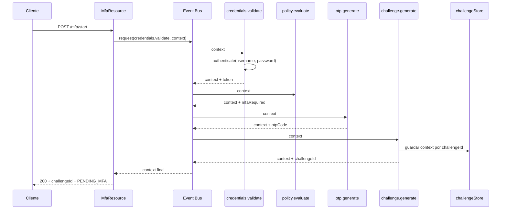

### Eventos del flujo `start`
1. **`security.mfa.credentials.validate`** — Consumer bloqueante. Valida credenciales contra `AuthenticationPort`. Guarda el token en el contexto.
2. **`security.mfa.policy.evaluate`** — Decide si el usuario necesita MFA. En la implementación didáctica, `admin` no requiere MFA.
3. **`security.mfa.otp.generate`** — Genera OTP si la política lo requiere.
4. **`security.mfa.challenge.generate`** — Genera `challengeId`. Persiste el contexto en `challengeStore`.

### Cómo se comporta cada paso

#### 1. `credentials.validate`
Primer filtro real del flujo. Autentica las credenciales recibidas contra el proveedor de identidad. El token se guarda temporalmente en el contexto para reutilizarlo al final del MFA. El password deja de ser información útil una vez pasada esta etapa.

#### 2. `policy.evaluate`
Decide si el segundo factor es obligatorio. Este paso no valida OTP ni toca infraestructura externa; solo aplica una regla de negocio. Separar política de autenticación evita mezclar reglas de negocio con detalles técnicos.

#### 3. `otp.generate`
Si `mfaRequired = true`, genera un OTP de 6 dígitos y lo registra en el contexto. Si `mfaRequired = false`, simplemente no genera OTP y deja el flujo avanzar. En la demo el envío es simulado mediante logs.

#### 4. `challenge.generate`
Materializa el reto MFA. Convierte el estado acumulado en una referencia concreta que el cliente puede usar después en `/verify`. Crea un `challengeId` único, asocia ese identificador al contexto actual y guarda el contexto en memoria.

## 10. Flujo `verify` paso a paso

### Secuencia
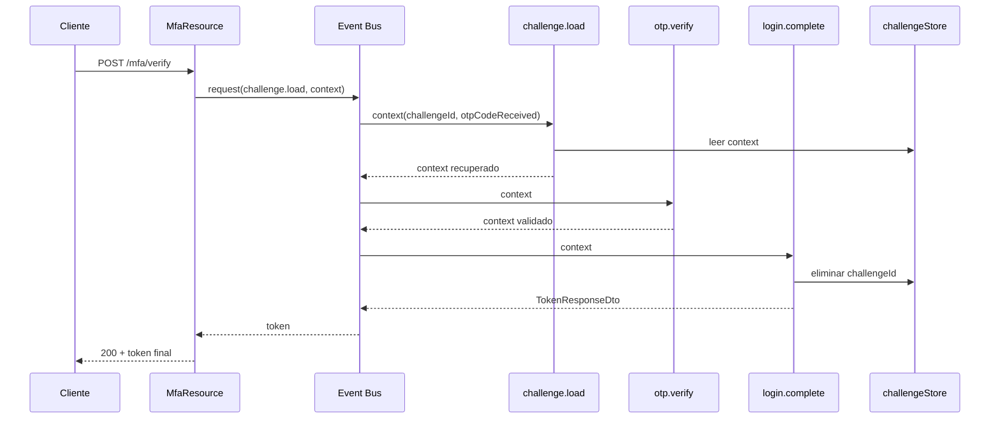

### Eventos del flujo `verify`
1. **`security.mfa.challenge.load`** — Consumer bloqueante. Recupera el contexto guardado en memoria. Copia `otpCodeReceived` al contexto persistido.
2. **`security.mfa.otp.verify`** — Si `mfaRequired = true`, compara OTP generado vs OTP recibido. Si no aplica MFA, deja pasar el flujo.
3. **`security.mfa.login.complete`** — Recupera el token que ya estaba en el contexto. Limpia el challenge almacenado.

### Cómo se comporta cada paso

#### 1. `challenge.load`
Rehidrata el flujo. Busca el `challengeId` en `challengeStore`. Si no existe, el flujo falla con error porque el reto es inválido o ya no está disponible. Si existe, copia el OTP enviado por el cliente al contexto recuperado.

#### 2. `otp.verify`
Validación funcional del segundo factor. Si el usuario requiere MFA, compara OTP generado y OTP recibido. Si no coinciden, lanza error de autenticación. Si coinciden, marca el flujo como `AUTHENTICATED`.

#### 3. `login.complete`
Cierre del flujo. Recupera el token del contexto, elimina el challenge del almacenamiento temporal para evitar reutilización y devuelve el token final.

### Lectura conceptual del flujo completo
- `start` prepara el proceso: autentica, decide política, genera OTP y crea el challenge.
- `verify` resuelve el proceso: recupera estado, valida OTP y entrega el token final.

Dicho de otro modo:
- `start` construye la promesa de autenticación;
- `verify` convierte esa promesa en una sesión autenticada.

## 11. Direcciones del Event Bus

| Dirección | Tipo | Responsabilidad |
|---|---|---|
| `security.mfa.credentials.validate` | request/reply | Validar credenciales y guardar token |
| `security.mfa.policy.evaluate` | request/reply | Resolver si aplica MFA |
| `security.mfa.otp.generate` | request/reply | Generar OTP si es necesario |
| `security.mfa.challenge.generate` | request/reply | Crear challenge y persistir contexto |
| `security.mfa.challenge.load` | request/reply | Recuperar challenge/contexto |
| `security.mfa.otp.verify` | request/reply | Validar OTP recibido |
| `security.mfa.login.complete` | request/reply | Entregar token final y cerrar flujo |

## 12. Consumers bloqueantes vs no bloqueantes

### Consumers no bloqueantes
- `security.mfa.policy.evaluate`
- `security.mfa.otp.generate`
- `security.mfa.challenge.generate`
- `security.mfa.otp.verify`
- `security.mfa.login.complete`

Estos deben ser rápidos y no bloquear el event loop.

### Consumers bloqueantes
- `security.mfa.credentials.validate`
- `security.mfa.challenge.load`

Motivo:
- `credentials.validate` invoca autenticación externa.
- `challenge.load` representa un punto natural de I/O si el storage en el futuro pasa a BD o Redis.

## 13. Manejo de errores y `ReplyException`

Cuando un consumer lanza una excepción dentro de `@ConsumeEvent`, el error no siempre llega a REST como `WebApplicationException` original. Al cruzar el Event Bus, Quarkus/Vert.x puede envolverlo en `ReplyException`.

Por eso `session6-dev` agrega soporte en `GlobalExceptionMapper`:
- reconoce `ReplyException`;
- inspecciona el mensaje;
- devuelve una respuesta JSON consistente al cliente.

### Flujo de error simplificado
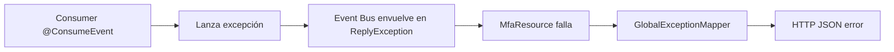

## 14. Archivos nuevos o modificados en `session6-dev`

### Nuevos
- `MfaEventConsumers.java` — Orquestador de eventos
- `MfaEventContext.java` — Modelo de contexto compartido
- `MfaChallenge.java` — Pieza de dominio para el reto MFA
- `MfaStatus.java` — Enum de estados MFA
- `MfaResource.java` — Resource REST MFA
- `MfaStartRequestDto.java`, `MfaVerifyRequestDto.java` — DTOs de request
- `MfaStartResponseDto.java`, `MfaVerifyResponseDto.java` — DTOs de response

### Modificados
- `build.gradle.kts` — Dependencia `quarkus-vertx`
- `gradle.properties` — Ajustes menores
- `GlobalExceptionMapper.java` — Soporte para `ReplyException`

## 15. Decisiones de diseño visibles en la rama

### 1. Estado temporal en memoria
Se usa `ConcurrentMap<String, MfaEventContext>` como almacenamiento temporal. Esto simplifica la demo, pero no sirve en despliegues con múltiples réplicas.

### 2. Token antes de OTP
El token se obtiene en `credentials.validate` y se retiene en el contexto hasta `login.complete`. Este patrón simplifica el ejercicio, aunque en un sistema real podría requerir controles extra de expiración y seguridad.

### 3. Contexto mutable
`MfaEventContext` es mutable porque cada consumer agrega información al mismo objeto. Para un flujo didáctico esto reduce ruido. En un sistema más estricto podrían preferirse eventos inmutables por etapa.

## 16. Relación con arquitectura de microservicios

Este diseño es una puerta de entrada a EDA, pero todavía en modo local:
- **hoy:** mensajes dentro del mismo proceso → **mañana:** algunos eventos podrían salir a Kafka;
- **hoy:** `challengeStore` en memoria → **mañana:** `challengeStore` en Redis;
- **hoy:** orquestación directa desde un resource → **mañana:** un saga/orchestrator o un process manager.

La lección importante es que el contrato por mensaje ya existe. Cambiar el transporte después es más fácil cuando el flujo ya está partido en eventos.

## 17. Limitaciones del ejemplo
- No hay expiración real de challenge.
- No hay OTP delivery real por SMS o email.
- No hay almacenamiento distribuido.
- No hay reintentos ni deduplicación.
- `MfaVerifyResponseDto` existe en la rama, pero el endpoint `/verify` devuelve realmente `TokenResponseDto`.
- La inferencia de errores basada en `ReplyException` sigue siendo una aproximación técnica, no un contrato de negocio robusto.

## 18. Resumen

`session6-dev` agrega mucho más que MFA. Agrega un nuevo estilo de organización del flujo:
- la API deja de ejecutar toda la lógica de forma monolítica;
- el proceso se divide en eventos pequeños;
- el contexto viaja entre consumers;
- los errores deben entender el paso por Event Bus;
- la sesión introduce bases reales para avanzar luego a patrones EDA distribuidos.
