# Event Bus y MFA con Arquitectura Orientada a Eventos

Entre `session5-dev` y `session6-dev`, el microservicio `cja-msa-sc-security` incorpora un flujo **MFA (Multi-Factor Authentication)** didáctico basado en eventos internos con el **Quarkus Event Bus**. La idea no es solo agregar endpoints, sino mostrar cómo desacoplar un proceso compuesto en pasos pequeños que colaboran mediante mensajes.

Esta sesión introduce:
- Event-driven design dentro de un mismo microservicio.
- Orquestación reactiva con `Uni` y `eventBus.request(...)`.
- Consumers `@ConsumeEvent` para separar responsabilidades.
- Un contexto común (`MfaEventContext`) que fluye entre handlers.
- Manejo de errores de Event Bus en `GlobalExceptionMapper`.
- Ejemplos de consumers bloqueantes con `blocking = true`.

---

## 1. Radiografía Visual: La Orquestación por Etapas

El flujo MFA se divide en dos operaciones principales (`Start` y `Verify`), cada una compuesta por una secuencia de decisiones operadas a través del Event Bus:

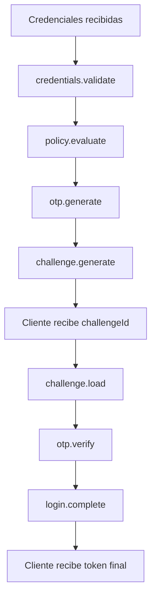

Cada bloque representa una responsabilidad delimitada. Cuando un flujo de negocio complejo se parte correctamente, el sistema deja de sentirse como una masa de código acoplada y empieza a reflejar un proceso continuo y escalable.

:::info Nueva dependencia en sesión 6
```kotlin title="build.gradle.kts"
implementation("io.quarkus:quarkus-vertx")
```
:::

---

## 2. ¿Por qué Eventos?

Cuando un sistema crece, la pregunta arquitectónica deja de ser "¿qué clase sigue?" y pasa a ser **"¿qué acaba de ocurrir en el negocio?"**. El sistema deja de organizarse por dependencias técnicas para hacerlo por significado.

import Tabs from '@theme/Tabs';
import TabItem from '@theme/TabItem';

<Tabs>
<TabItem value="eda" label="Llamadas vs Eventos">

**Flujo tradicional (Acoplado):**
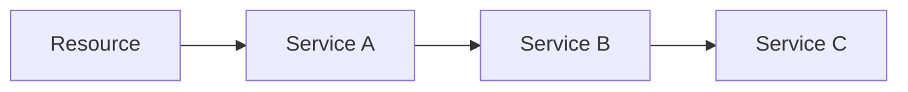
Cada clase conoce explícitamente a la siguiente. Cambiar o agregar una regla altera la cadena.

**Flujo orientado a eventos (Desacoplado):**
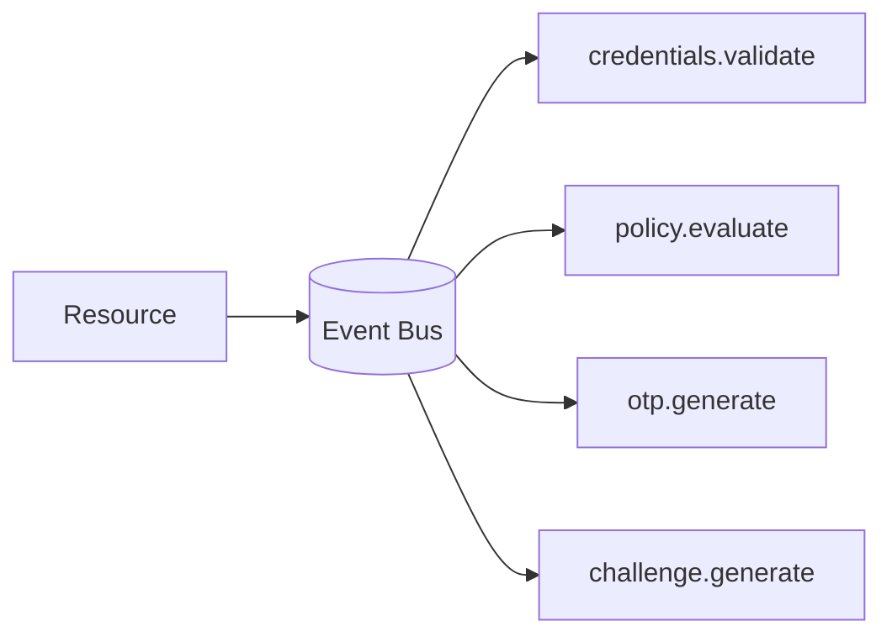
El emisor conoce una **dirección**, no una implementación. Cada paso evoluciona con independencia.

:::tip Las tres ideas clave del EDA
1. Un sistema fuertemente acoplado funciona hasta que el cambio llega. Un sistema orientado a eventos está pensado para absorber el cambio.
2. Donde antes había llamadas a métodos y dependencias directas, ahora hay una **conversación entre componentes**.
3. El verdadero valor de los eventos no es la asincronía puramente técnica; es el **desacoplamiento semántico**.
:::

</TabItem>
<TabItem value="patterns" label="Request/Reply vs Pub/Sub">

**Request/Reply** — El emisor espera una respuesta:
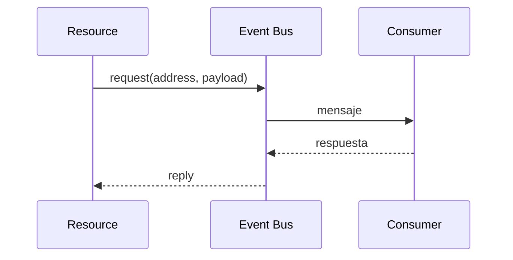
En esta sesión se utiliza **Request/Reply** para encadenar ambos flujos MFA con `eventBus.request(...)`.

**Publish/Subscribe** — El emisor difunde sin esperar respuesta (ideal para auditoría, notificaciones):
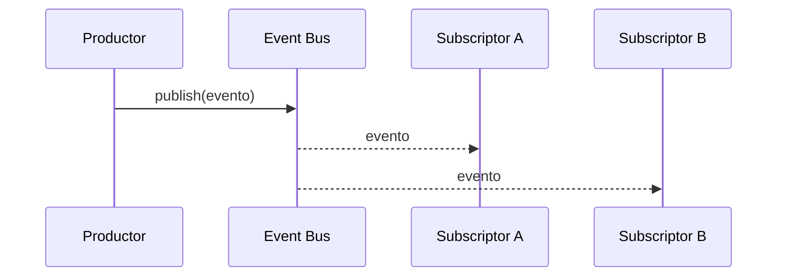

</TabItem>
<TabItem value="concepts" label="Conceptos Quarkus">

Quarkus expone internamente el Event Bus de Vert.x con una API sencilla:

| Concepto | Rol |
|:---|:---|
| `EventBus.request(address, payload)` | Envía mensaje y espera respuesta asincrónica |
| `@ConsumeEvent("address")` | Registra un consumer para engancharse a una dirección |
| `@ConsumeEvent(blocking = true)` | Ejecuta en Worker thread (ideal para llamadas bloqueantes o I/O) |
| `Uni<T>` | Representa el bloque de reactividad a componer |

</TabItem>
</Tabs>

---

## 3. El Contexto Central: `MfaEventContext`

Este objeto viaja de un evento al siguiente actuando como estado consolidado del flujo. En lugar de empujar múltiples parámetros aislados entre métodos, pasamos un contrato acumulativo.

```java title="domain/model/MfaEventContext.java"
@Data @Builder @NoArgsConstructor @AllArgsConstructor
public class MfaEventContext {
    private String username;          // Entrada del flujo /start
    private String password;          // Entrada del flujo /start
    
    // Almacenado del primer factor y reglas de negocio
    private TokenResponseDto token;   // Token real (Keycloak) retenido antes de acabar
    @Builder.Default
    private boolean mfaRequired = true; // Resultado de evaluar la política de seguridad
    
    // Ciclo del segundo factor (Challenge & OTP temporal)
    private String challengeId;       // Identificador público del desafío MFA   
    private String otpCode;           // OTP generado internamente
    private String otpCodeReceived;   // OTP provisto por el cliente en /verify
    
    private MfaStatus status;         // Estado funcional dinámico (PENDING, AUTHENTICATED...)
}
```

---

## 4. Endpoints Nuevos de Interacción

La arquitectura de la API HTTP está partida en dos fronteras funcionales claras. **Start prepara el proceso y Verify lo resuelve.** 

<Tabs>
<TabItem value="login_start" label="POST /mfa/start">

Inicia la validación autenticando el usuario (primer factor) y definiendo si el flujo actualiza el requerimiento de un desafío OTP. 

**Request:**
```json
{
  "username": "user1",
  "password": "password123"
}
```

**Response (200 OK):**
```json
{
  "challengeId": "mfa-7f8a9b12",
  "status": "PENDING_MFA"
}
```

</TabItem>
<TabItem value="login_verify" label="POST /mfa/verify">

Entrega un OTP para resolver el `challengeId`. La decisión valida todo consolidando este aporte con la sesión (cargada mediante su ID). Otorga entonces el verdadero JWT.

**Request:**
```json
{
  "challengeId": "mfa-7f8a9b12",
  "otpCode": "123456"
}
```

**Response (200 OK):**
```json
{
  "access_token": "...",
  "refresh_token": "...",
  "expires_in": 300
}
```

</TabItem>
</Tabs>

---

## 5. Los Dos Flujos en Profundidad

<Tabs>
<TabItem value="start" label="1. POST /mfa/start (Preparación)">

Recibe credenciales, valida si hay primer factor exitoso, define el control lógico (si aplica o no la condición administrativa), asigna un código de OTP y genera/almacena el respectivo challenge temporal.

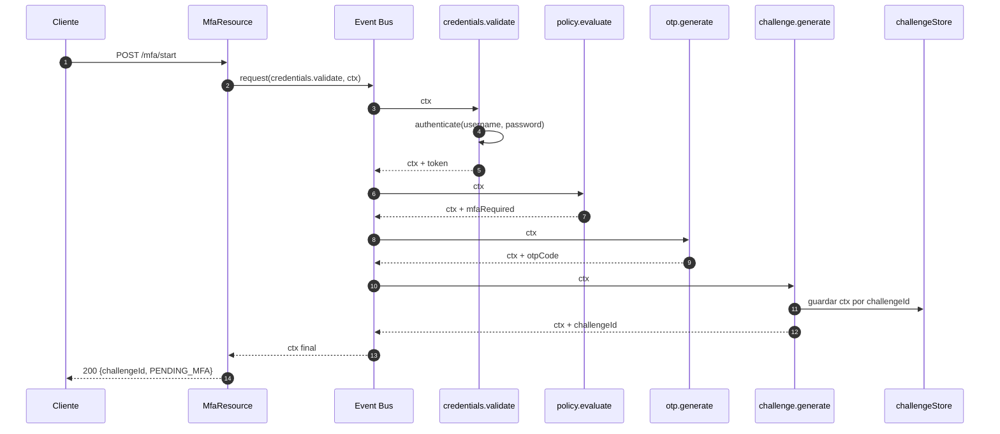

### Eventos del flujo `start`

| Dirección / Evento | Tipo | Rol y Comportamiento | 
|:---|:---|:---|
| `credentials.validate` | **Bloqueante** | **Primer Filtro**: Interactúa extrínsecamente con Keycloak. Obtiene el token y lo asocia al contexto inicial. En un fallo, quiebra al pipeline por completo. |
| `policy.evaluate` | No bloqueante | **Política**: Decide reglas de negocio sin tocar recursos netos (ej. admin salta restricción MFA). Configura la bandera de pre-requisito. |
| `otp.generate` | No bloqueante | **Gestión Temporal**: Asume status exitoso de Policy. Despacha generación al azar de OTP condicionalmente si la política marcó requerido. |
| `challenge.generate` | No bloqueante | **Continuidad**: Construye `challengeId` devolviendo control REST y persistiendo la huella. **Start no autentica de fondo**, sino que consolida la base promesada temporal del usuario. |

:::caution Consumer Bloqueante
`credentials.validate` usa `@ConsumeEvent(blocking = true)` por diseño indispensable. Hacer comunicación HTTP (Keycloak) de I/O en la hebra original detendría el **Event Loop Principal**, bloqueando la recepción concurrente de otros requests y hundiendo la escalabilidad global.
:::

</TabItem>
<TabItem value="verify" label="2. POST /mfa/verify (Resolución)">

Rehabilita el pipeline recuperando el Storage inicial, verifica que el factor OTP brindado cuaje fielmente al registrado, y entrega el Payload original (el `TokenResponseDto`) obtenido.

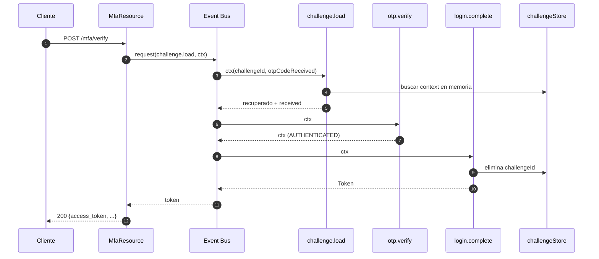

### Eventos del flujo `verify`

| Dirección / Evento | Tipo | Rol y Comportamiento |
|:---|:---|:---|
| `challenge.load` | **Bloqueante** | **Rehidratación**: Ingestiona y cruza inputs del cliente contra los datos mantenidos in-mem (`challengeId`) devolviéndolos. Falla si ya venció (o expiró) tal ticket. |
| `otp.verify` | No bloqueante | **Validación 2FA**: Sincroniza `otpCode` guardado originalmente con el temporal provisto (`otpCodeReceived`) (si y sólo sí aplicó regla de MFA activo). |
| `login.complete` | No bloqueante | **Cerramiento y Release**: Limpia rastro derribando el objeto in-memory asincrono por un uso de política de seguridad (Uso único) y devuelve finamente su token original hacia el Resource. |

</TabItem>
</Tabs>

---

## 6. Manejo de Errores: Consideraciones de Vertx

Cuando un consumer lanza una lógica fallida tradicional controlada (ej: un `UnauthorizedException` o `NotFoundException`), un pase en tránsito a través de los *threads y futures* de Vertx/Quarkus puede llevar a una recarga de genéricos englobados, enviándolo como formato `ReplyException` directo hacia REST API. 
Extendemos puntualmente la estrategia del middleware captador *GlobalExceptionMapper* de nuestra aplicación forzando una desencapsulación y extracción exacta al mapping:

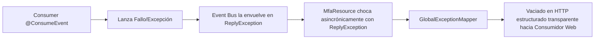

```java title="GlobalExceptionMapper.java"
if (ex instanceof ReplyException replyEx) {
    // Desencapsula el código del error originante.
    // Retorna HTTP Response limpia compatible a specs (401, 500, Problem Details, etc).
}
```

---

## 7. Casos de Uso Reales del EDA

A nivel arquitectónico corporativo, aplicar "Event Bus" nos otorga un beneficio superador: particionar latencias e impedir fallos dominó catastróficos por bloqueos sincrónicos. Cada handler consumista actúa como validación transaccional por sí mismo separando piezas. Estas asimilaciones de orquestación por *Etapas de Decisión* (EDA) en transacciones reguladas son ideales (Fintech/Banca y Empresas Medición Corporativa):

<Tabs>
<TabItem value="mfa" label="Riesgo Extendido">

Rutas lógicas asincrónicas acceden de manera individual según factor e histórico periférico.
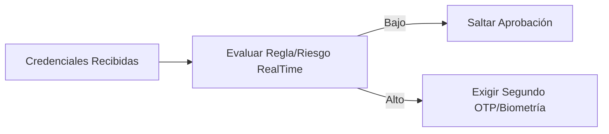
> Añadir nuevas validadoras "listeners" (o algoritmos) como consumidores adicionales al EventBus no quiebra el componente de autorización REST puro y mantiene separada cada responsabilidad.
</TabItem>
<TabItem value="high_trx" label="Transferencias Severas">

Evita que validaciones OFAC/Limites cuelguen las operaciones masivas.
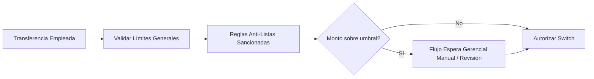
> Permite detener flujos en tramos exactos. Si la `Regla de Listas` entra en Timeout o saturación, no empuja un Crash masivo sobre la conciliación inicial ni bloquea transaccionales de bajo riesgo de otros componentes.
</TabItem>
<TabItem value="antifraud" label="Antifraude Tarjetas">

El score analítico geográfico se transgrede con independencia.
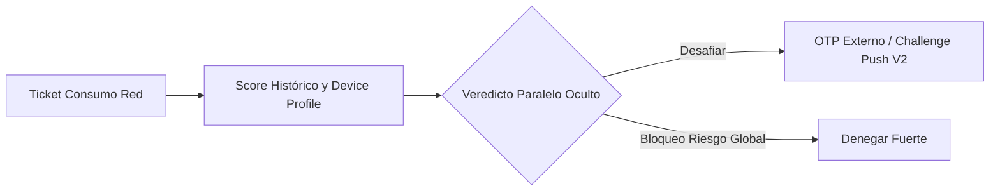
</TabItem>
<TabItem value="conciliations" label="Conciliación Periódica">

Para batchs asincrónicos o cierres diarios pesados en donde unas transacciones son orígenes asimétricos:
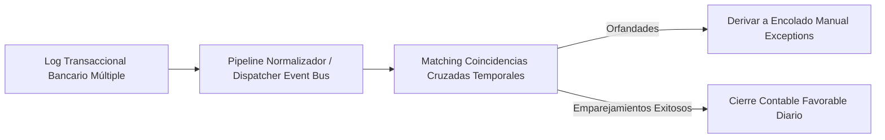
> Garantiza un sistema partible en unidades. Fallos en una tanda no tumban el recuadro gigantesco entero.
</TabItem>
</Tabs>

### Ventajas operativas directas con números
1. **Mejor uso de recursos (Capacidad Multiplicada)**: Al liberar Threads principales bloqueantes a Workers netos en delegación (`event loop` sano), la base Node/Container puede elevar escalabilidad 3x sostenido para tareas netamente REST.
2. **Alta Resiliencia Segmentable**: El quiebre en pasos salva tiempo a no tener que re-calcular del _"Paso 0 a 10"_, basta recaer contra la lógica en el tramo averiado (o desvío de exceptions aislada a DLQ).
3. **Escala Particular Aislable**: Funciones que reciben cargas asimétricas intensas escalaran los pod consumistas sólo escuchando ese address de mensajes.

---

## 8. Diseño y Estructura Organizacional

Archivos impactados y su distribución de jerarquía nueva en conjunto por la `session6-dev`:

```text
cja-msa-sc-security/src/main/java/cja/msa/sc/security/.../
├── application/service/
│   ├── MfaService.java              <- Orchestrator unificador (Llama al Event Bus en ambos flujos)
│   └── MfaEventConsumers.java       <- Componente de orquestación pura: Alberga los 7 @ConsumeEvent
├── domain/model/
│   ├── MfaEventContext.java         <- Carrier de información inter-estado y de transbordo (Shared DTO/Context)
│   ├── MfaChallenge.java            <- Unidad de dominio que sostiene el ID representativo lógico de operación temporal
│   └── enums/MfaStatus.java         <- Máquinas de estado en Enum para tracking
├── infrastructure/adapters/in/rest/
│   ├── MfaResource.java             <- REST endpoints directos en POST /mfa/start y /mfa/verify
│   └── dto/request_response/        <- Record/POJOs de Contratos I/O (MfaVerifyRequestDto, MfaStartResponseDto...)
```
