# Event Bus y MFA con Arquitectura Orientada a Eventos

El microservicio `cja-msa-sc-security` incorpora un flujo **MFA (Multi-Factor Authentication)** basado en eventos internos con el **Quarkus Event Bus**. El objetivo no es solo agregar endpoints, sino demostrar cómo desacoplar un proceso compuesto en pasos pequeños que colaboran mediante mensajes.

---

## 1. Radiografía Visual: La Orquestación por Etapas

El flujo MFA se divide en dos operaciones (Start y Verify), cada una compuesta por una cadena de eventos encadenados a través del Event Bus:

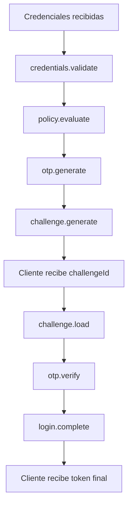

:::info Nueva dependencia en sesión 6
```kotlin title="build.gradle.kts"
implementation("io.quarkus:quarkus-vertx")
```
:::

---

## 2. ¿Por qué Eventos?

import Tabs from '@theme/Tabs';
import TabItem from '@theme/TabItem';

<Tabs>
<TabItem value="eda" label="Llamadas vs Eventos">

**Flujo tradicional (Acoplado):**
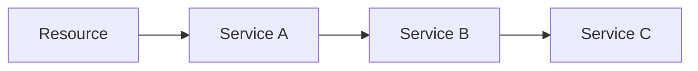
Cada paso conoce al siguiente. Cambiar uno puede romper la cadena.

**Flujo orientado a eventos (Desacoplado):**
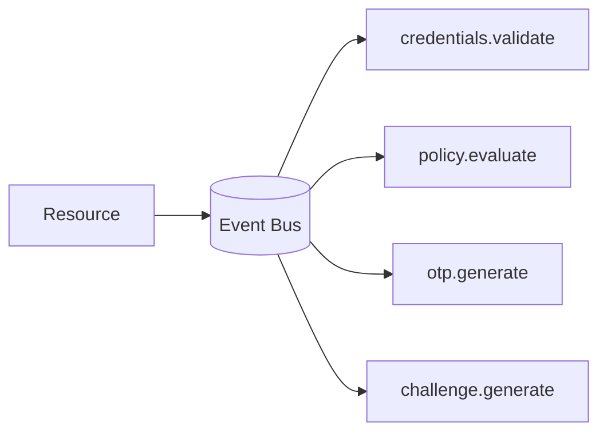
El emisor conoce una **dirección**, no una implementación concreta. Cada paso evoluciona de forma independiente.

:::tip Las tres ideas clave del EDA
1. Un sistema fuertemente acoplado funciona hasta que el cambio llega. Un sistema orientado a eventos está pensado para el cambio.
2. Donde antes había dependencias directas, ahora hay una **conversación entre componentes**.
3. El verdadero valor de los eventos no es la asincronía; es el **desacoplamiento semántico**.
:::

</TabItem>
<TabItem value="patterns" label="Request/Reply vs Pub/Sub">

**Request/Reply** — El emisor espera una respuesta:
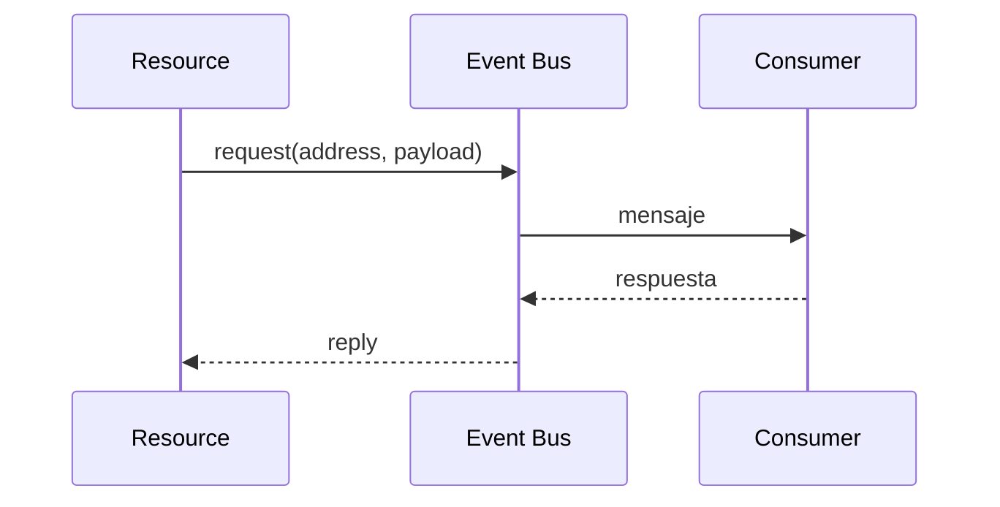

**Publish/Subscribe** — El emisor difunde sin esperar respuesta (ideal para auditoría, notificaciones):
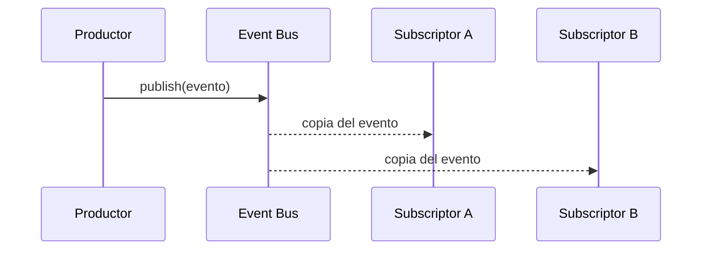

En esta sesión se utiliza **Request/Reply** para encadenar el flujo MFA con `eventBus.request(...)`.

</TabItem>
<TabItem value="concepts" label="Conceptos Quarkus">

Quarkus expone el Event Bus de Vert.x con una API sencilla:

| Concepto | Rol |
|:---|:---|
| `EventBus.request(address, payload)` | Envía mensaje y espera respuesta |
| `@ConsumeEvent("address")` | Registra un consumer para esa dirección |
| `@ConsumeEvent(blocking = true)` | Ejecuta el consumer en worker thread (para I/O) |
| `Uni<T>` | Modela la respuesta asincrónica |

</TabItem>
</Tabs>

---

## 3. El Contexto Central: `MfaEventContext`

Este objeto **viaja de un evento al siguiente**, acumulando el estado del flujo completo:

```java title="MfaEventContext.java"
@Data @Builder @NoArgsConstructor @AllArgsConstructor
public class MfaEventContext {
    private String username;          // Entrada del flujo /start
    private String password;          // Entrada del flujo /start
    private String challengeId;       // Identificador del reto MFA
    private String otpCode;           // OTP generado internamente
    private String otpCodeReceived;   // OTP enviado por el cliente en /verify
    private TokenResponseDto token;   // Token JWT de Keycloak (pre-autenticado)
    private MfaStatus status;         // Estado funcional del proceso
    @Builder.Default
    private boolean mfaRequired = true;
}
```

---

## 4. Los Dos Flujos MFA

<Tabs>
<TabItem value="start" label="POST /mfa/start">

Recibe credenciales, valida al usuario, decide si requiere MFA, genera OTP y crea el challenge.

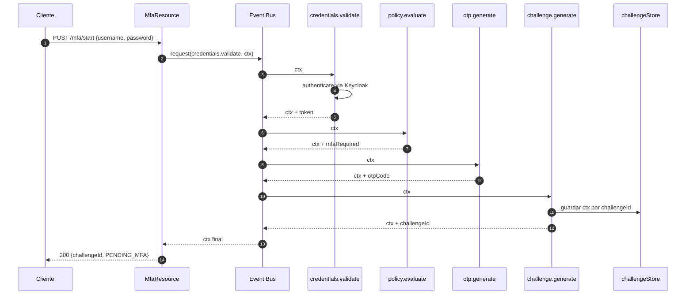

**Descripción de cada evento:**

| Evento | Tipo | Responsabilidad |
|:---|:---|:---|
| `credentials.validate` | **Bloqueante** | Autentica contra Keycloak, guarda token en contexto |
| `policy.evaluate` | No bloqueante | Decide si el usuario necesita MFA |
| `otp.generate` | No bloqueante | Genera OTP de 6 dígitos si `mfaRequired=true` |
| `challenge.generate` | No bloqueante | Crea challengeId y persiste contexto en memoria |

:::caution Consumer Bloqueante
`credentials.validate` usa `@ConsumeEvent(blocking = true)` porque invoca una llamada externa a Keycloak. Sin `blocking = true`, **bloquearía el Netty Event Loop** y degradaría el rendimiento del servidor.
:::

</TabItem>
<TabItem value="verify" label="POST /mfa/verify">

Recibe el `challengeId` y el OTP, carga el contexto, valida el código y retorna el token final.

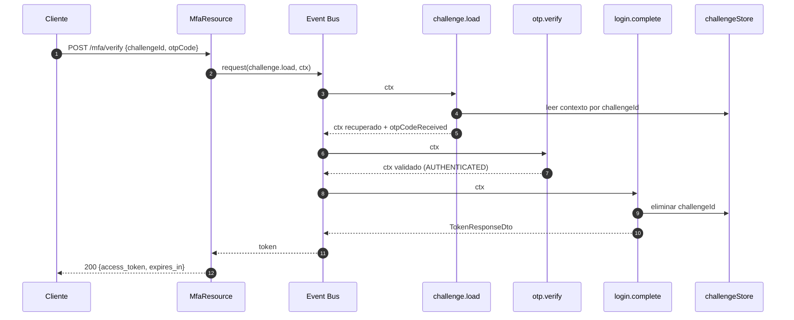

**Descripción de cada evento:**

| Evento | Tipo | Responsabilidad |
|:---|:---|:---|
| `challenge.load` | **Bloqueante** | Recupera contexto de challengeStore, copia otpCodeReceived |
| `otp.verify` | No bloqueante | Compara OTP generado vs OTP recibido |
| `login.complete` | No bloqueante | Retorna token, elimina challenge para evitar reutilización |

</TabItem>
</Tabs>

---

## 5. Manejo de Errores: `ReplyException`

Cuando un consumer lanza una excepción dentro de `@ConsumeEvent`, Vert.x la envuelve en una `ReplyException` antes de propagarla a la capa REST. Por eso `session6-dev` extiende el `GlobalExceptionMapper`:

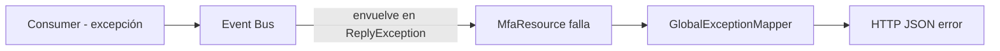

```java title="GlobalExceptionMapper.java (extendido)"
if (ex instanceof ReplyException replyEx) {
    // Inspecciona el mensaje del ReplyException
    // Devuelve una respuesta JSON consistente al cliente
}
```

---

## 6. Casos de Uso Reales del EDA

Esta arquitectura aporta mayor valor cuando una operación es una **cadena de verificaciones**, no una sola acción. En el sector financiero esto es especialmente relevante:

<Tabs>
<TabItem value="mfa" label="Autenticación y Riesgo">

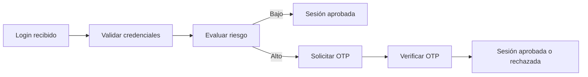

</TabItem>
<TabItem value="transfers" label="Transferencias Bancarias">

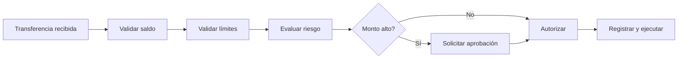

</TabItem>
<TabItem value="notifications" label="Notificaciones Regulatorias">

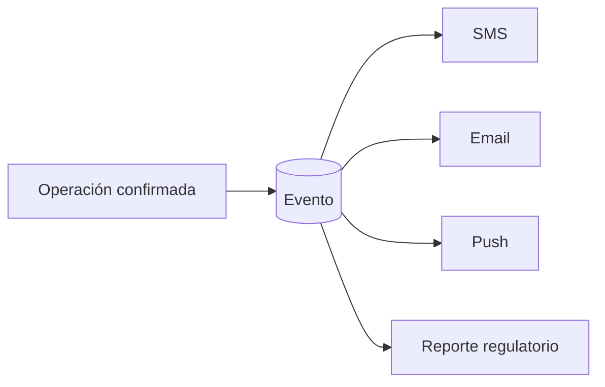

El mismo evento activa múltiples consumidores de forma independiente. Pub/Sub en acción.

</TabItem>
</Tabs>

---

## 7. Estructura de Archivos

**Nuevos en `session6-dev`:**
```text
cja-msa-sc-security/.../
├── MfaResource.java             <- REST: POST /mfa/start y /mfa/verify
├── MfaEventConsumers.java       <- Orquestador: 7 @ConsumeEvent
├── MfaEventContext.java         <- Contexto compartido entre eventos
├── MfaChallenge.java            <- Pieza de dominio
├── MfaStatus.java               <- Enum de estados
└── dto/ (MfaStartRequestDto, MfaVerifyRequestDto, MfaStartResponseDto...)
```

**Modificados:**
- `build.gradle.kts` — Añadida `quarkus-vertx`
- `GlobalExceptionMapper.java` — Soporte para `ReplyException`

---

## 8. Limitaciones del Ejemplo y Evolución Futura

:::caution Limitaciones intencionales de esta demo
- **Sin persistencia distribuida**: `challengeStore` vive en memoria → no funciona con múltiples réplicas (futuro: **Redis**).
- **Sin expiración real de OTP**: el challenge no expira automáticamente.
- **Sin delivery real**: el OTP se envía por logs, no por SMS/Email.
:::

> **Hoy** mensajes dentro del mismo proceso → **Mañana** esos eventos pueden salir a **Apache Kafka**.
> **Hoy** `challengeStore` en memoria → **Mañana** `challengeStore` en **Redis**.
> **Hoy** orquestación directa → **Mañana** un **Saga / Process Manager**.

La lección clave: el **contrato por mensaje ya existe**. Cambiar el transporte después es mucho más fácil cuando el flujo ya está partido en eventos.
