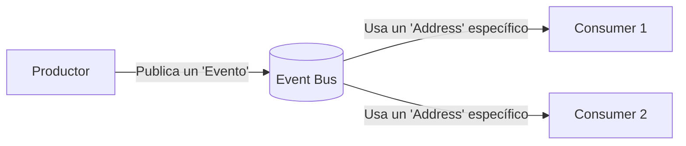
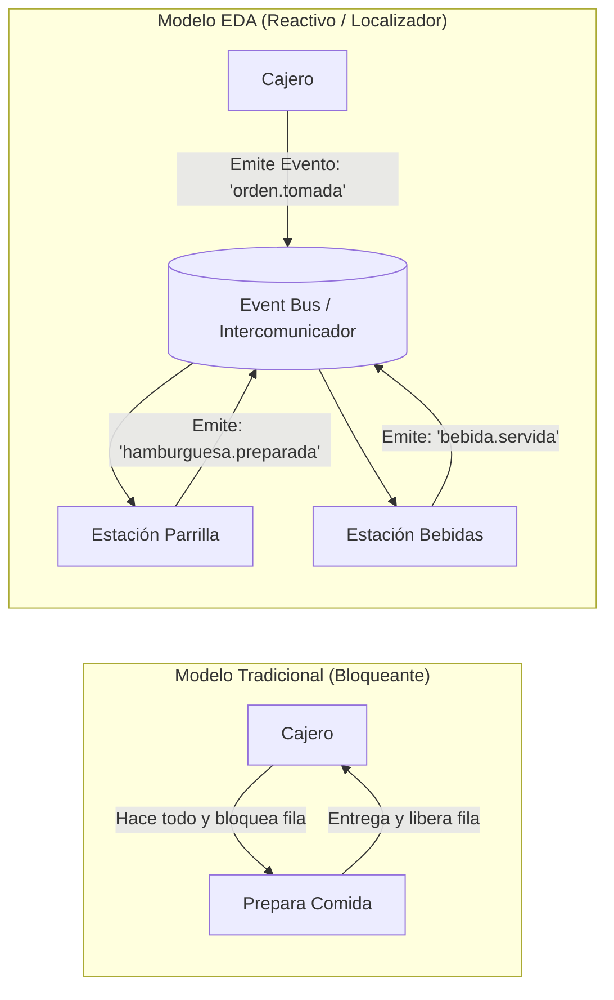
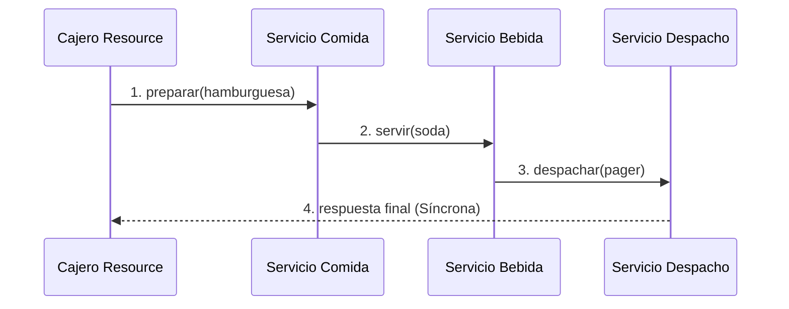
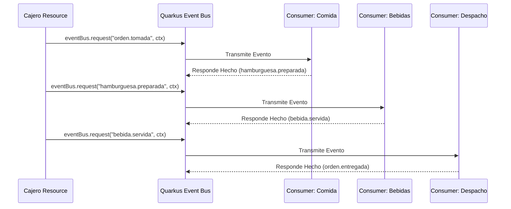
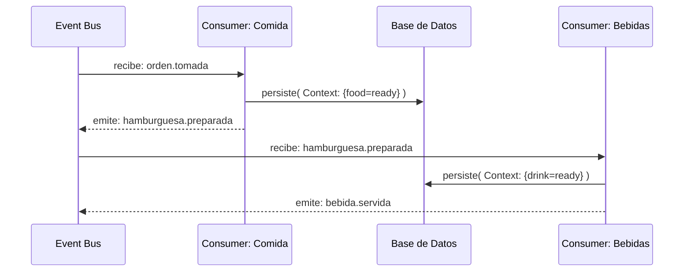
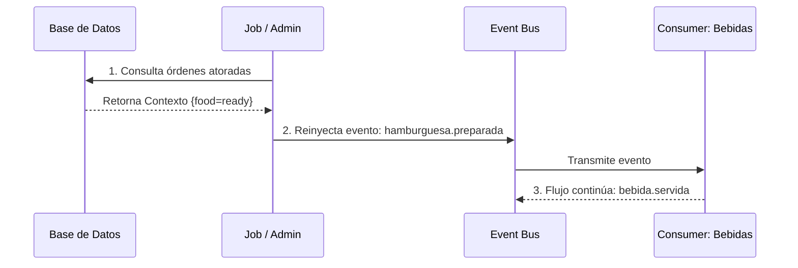
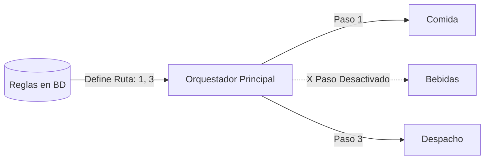

# Event-Driven Design con Quarkus y Event Bus

Antes de construir flujos distribuidos completos, necesitamos entender el **cambio de mentalidad** que hace a un sistema orientado a eventos algo fundamentalmente diferente a un sistema basado en llamadas directas.

:::info Fundamento Conceptual
El enfoque orientado a eventos transforma nuestra arquitectura en un modelo puramente reactivo y desacoplado. Para aprovechar estas capacidades en Quarkus, es esencial comprender **por qué** modelamos los procesos como eventos independientes y cómo esto nos proporciona ventajas empresariales únicas.
:::

---

## 1. El Glosario Reactivo: Conceptos Fundamentales

Antes de entrar en las analogías, definamos las 4 piezas de Lego con las que se construye cualquier sistema orientado a eventos:

import Tabs from '@theme/Tabs';
import TabItem from '@theme/TabItem';

<Tabs>
<TabItem value="evento" label="Evento">

**¿Qué es?**
Un evento es un **mensaje que representa un dato, contexto o suceso importante**. Su propósito principal es encapsular información (payload) y viajar por el sistema para ser capturado por cualquier componente interesado, operando como un estímulo para desencadenar otras tareas.

</TabItem>
<TabItem value="bus" label="Event Bus">

**¿Qué es?**
El Event Bus (o Bus de Eventos) es la **autopista central** de comunicación. 
Es el intermediario que recibe los eventos de un remitente y se encarga de entregárselos a quien (o quienes) estén interesados en escucharlo, logrando que los componentes no necesiten conocerse entre sí.

</TabItem>
<TabItem value="address" label="Address">

**¿Qué es?**
El término "Address" (o Dirección) es como un **canal de radio o un hashtag**. 
Cuando alguien publica un evento, no lo envía a una persona específica, lo publica en una `address`. Cualquiera que se suscriba a esa `address` recibirá el mensaje. Ejemplo: `address = "orden.tomada"`.

</TabItem>
<TabItem value="consumer" label="Consumer">

**¿Qué es?**
El Consumer (Consumidor o Listener) es la **pieza de código que está escuchando** pacientemente una `address` específica. En el momento en que un evento pasa por esa dirección, el Event Bus despierta al Consumer y le entrega el mensaje para que reaccione.

</TabItem>
</Tabs>

### Arquitectura Conceptual
La interacción de todas estas piezas se resume visualmente en este ecosistema:



---

## 2. La Analogía del Restaurante: ¿Por qué EDA?

Imagina un restaurante de comida rápida. Analicémoslo bajo dos enfoques:

**Modelo Tradicional (Síncrono)**
Llegas a la caja de pedidos y pides un combo. El cajero anota tu orden, se voltea, va a la estación de carne y prepara la hamburguesa. Luego va a la máquina de sodas y sirve la bebida. Vuelve a la caja y te entrega el pedido. Mientras tanto, la fila detrás de ti está bloqueada. El cajero, el cocinero y el despachador de bebidas están **fuertemente acoplados**. Si se rompe la máquina de sodas, todo el proceso lanza un error y te devuelven el dinero.

**Modelo Orientado a Eventos (EDA)**
Llegas a la caja de pedidos. El cajero toma el pago, te da un **localizador (pager)** y emite al intercomunicador (Event Bus): *"¡`orden.tomada`!"*.
Inmediatamente, él puede seguir atendiendo a la siguiente persona en la fila.
Por detrás, las estaciones (Consumidores) escuchan hechos (eventos) y reaccionan de manera independiente:
1. La estación de parrilla escucha `orden.tomada` y al terminar emite `hamburguesa.preparada`.
2. La estación de bebidas escucha que la parrilla terminó (`hamburguesa.preparada`) y emite `bebida.servida`.
3. El despachador escucha que ambas cosas están listas (`bebida.servida`), y hace sonar tu localizador (`orden.entregada`).



---

## 3. Radiografía Visual: Sistema Tradicional vs EDA

Veamos cómo se traduce exactamente esta analogía en diagramas de secuencia arquitectónicos.

### Flujo Tradicional (Cadena de Llamadas)
Cada componente llama directamente al siguiente. El orquestador o la caja original tiene la responsabilidad de conocer y mandar a llamar a cada servicio.



### Flujo EDA (Cadena de Eventos/Hechos)
El Cajero Resource no conoce a cuáles estaciones llamar. Solo publica el Evento al Bus. El bus transmite los mensajes a los despachadores correctos según qué evento ha sucedido.



:::tip Desacoplamiento Real
En el modelo EDA, el Cajero conoce el "intercomunicador", pero no tiene ni idea de cuántos cocineros hay atrás, en qué estufa cocinan ni qué tecnología usan.
:::

---

## 4. Ventajas Avanzadas de EDA

El diseño orientado a eventos nos otorga características que un sistema síncrono no puede igualar fácilmente en esta misma analogía.

<Tabs>
<TabItem value="context" label="1. Almacenamiento de Contextos (DB)">

En un flujo síncrono tradicional, si el proceso se cae a la mitad (ej: se acaba el gas de la parrilla), el usuario recibe un Error 500 y tiene que volver a formar toda la fila. El estado desaparece.

En EDA, dado que cada transición de la orden es un "objeto u orden de contexto" (Ej: `OrderContext`), podemos **guardar el estado acumulativo en una base de datos** tras cada paso procesado exitosamente por cualquier consumidor.



```java
@ConsumeEvent("hamburguesa.preparada")
public OrderContext registrarPaso(OrderContext ctx) {
    ctx.setFoodReady(true);
    // Guardamos que la comida ya está lista, por si se va la luz
    orderRepository.persist(ctx);
    return ctx;
}
```

</TabItem>
<TabItem value="replay" label="2. Replay y Reproducción de Flujos">

Al persistir los eventos en DB, logramos una característica fundamental: **reproducir (replay)** flujos exactos. 

Si el paso 3 (`bebida.servida`) falla porque se trabó la máquina de hielos, no le obligamos al cliente a formarse y pagar de nuevo. Simplemente tomamos su `OrderContext` guardado (que ya tiene la comida lista), destrabamos la máquina y **reinyectamos el evento** directo al bus, reanudando todo en `hamburguesa.preparada`.



:::info Casos de Uso Reales
- **Retry Patterns:** Reintentos automáticos tras fallos transitorios.
- **Forense Técnico:** Reproducir una traza de eventos de una TX fallida en ambiente de pruebas para observar el error exacto.
:::

</TabItem>
<TabItem value="dynamic" label="3. Dinamismo y Rutas a Medida">

Al ser independiente cada paso, la orquestación puede ser **dinámica**. 

Podemos consultar si la máquina de bebidas se descompuso y simplemente saltarnos la estación de bebidas dinámicamente, enviando el trayecto directo al despacho en runtime, sin alterar código.



```java title="Pipeline Dinámico"
// El Cajero sabe qué pedir según la orden de DB, y no por código Hardcodeado
List<String> estacionesActivas = inventoryService.getEstacionesActivas();
// estaciones = ["orden.tomada", "hamburguesa.preparada"] (sin pasar por bebidas)

OrderContext ctx = new OrderContext(request);

for (String paso : estacionesActivas) {
    // Si la máquina de bebidas está caída, el evento se brincará ese paso
    ctx = eventBus.request(paso, ctx).await().indefinitely().body();
}
```

</TabItem>
</Tabs>

---

## 5. El Quarkus Event Bus: Implementación Práctica

Para aplicar esta arquitectura, utilizamos la API de **Vert.x Event Bus** proporcionada por Quarkus.

### El Productor (Event Source)
El Cajero genera el evento inicial utilizando **Request/Reply**, esperando la confirmación de forma no bloqueante usando Mutiny (`Uni`).

```java title="CajeroResource.java"
@Inject 
EventBus eventBus;

public Uni<Response> recibirPedido(OrderRequest request) {
    OrderContext context = new OrderContext(request);
    
    // Envía el evento inicial al intercomunicador de la cocina
    return eventBus.<OrderContext>request("orden.tomada", context)
        .onItem().transform(Message::body)
        .map(ctx -> Response.ok(ctx).build());
}
```

### Los Consumidores (Listeners)

Aquí es donde los "Cocineros" escuchan las órdenes suscritas. Es crucial respetar una regla de rendimiento de Quarkus.

```java title="EstacionesConsumers.java"
// 1. Consumer NO bloqueante: Tareas exclusivamente de memoria o cálculo en CPU
@ConsumeEvent("bebida.servida")
public OrderContext prepararBebidaFria(OrderContext ctx) {
    // Es instantáneo, cálculo rápido, no requiere I/O externo
    ctx.setDrinkType("COLD");
    return ctx;
}

// 2. Consumer BLOQUEANTE: Tareas de entrada/salida (I/O, BD, API Externas, Disco)
@ConsumeEvent(value = "orden.tomada", blocking = true)
public OrderContext cocinarCarne(OrderContext ctx) {
    // Simula ir al congelador o a una Base de Datos Externa (I/O).
    inventarioDB.descontarCarne();
    ctx.setFoodReady(true);
    return ctx;
}
```

:::danger Regla Crítica de Rendimiento
Si un consumidor interactúa con la Base de Datos, llama a una red HTTP externa, o accede al FileSystem local, **DEBE declararse con `blocking = true`**. Si omites esto, Quarkus pensará que el hilo principal (Event Loop) se colgó por tu culpa y tu aplicación dejará de responder llamas nuevas.
:::
