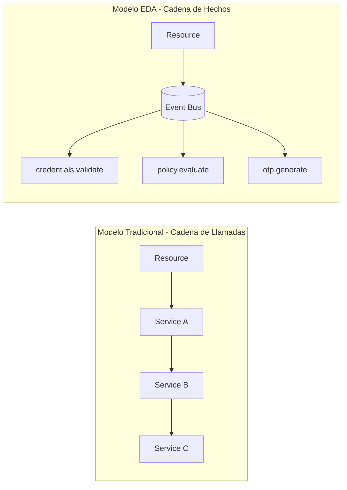
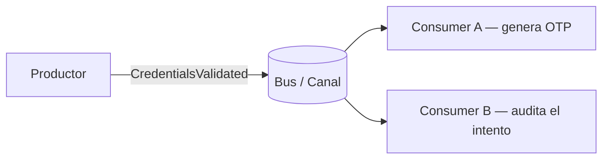
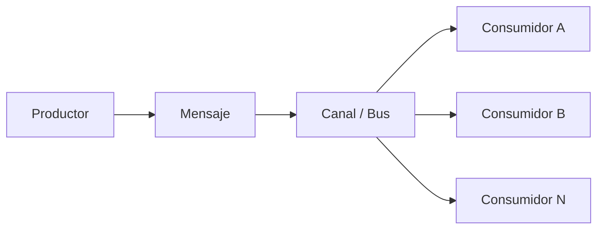
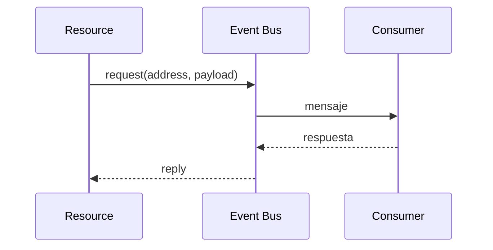
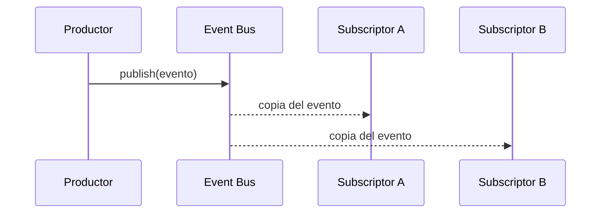
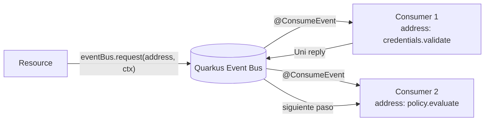

# Event-Driven Design con Quarkus y Event Bus

Antes de construir el flujo MFA con eventos, necesitamos entender el **cambio de mentalidad** que hace a un sistema orientado a eventos algo fundamentalmente diferente a un sistema basado en llamadas directas. Esta sección sienta las bases teóricas y prácticas para todo lo que viene después.

:::info Fundamento del Tema 6
Esta sección es la base conceptual. El flujo MFA que verás en la sección siguiente solamente tiene sentido si entiendes primero **por qué** modelamos cada paso como un evento.
:::

---

## 1. Radiografía Visual: Cómo Cambia el Sistema

La diferencia entre ambos modelos no es tecnológica: es una diferencia de **perspectiva arquitectónica**.



| Dimensión | Modelo Tradicional | Modelo EDA |
|:---|:---|:---|
| **Contrato** | Llamada a método | Mensaje hacia una dirección |
| **Acoplamiento** | Fuerte — cada paso conoce al siguiente | Débil — el emisor conoce la dirección, no la implementación |
| **Extensibilidad** | Cambiar un paso puede romper los demás | Se añaden consumers sin tocar el productor |
| **Trazabilidad** | Difícil de auditar paso a paso | Cada evento es un hecho registrable |

---

## 2. Los Tres Conceptos Clave

import Tabs from '@theme/Tabs';
import TabItem from '@theme/TabItem';

<Tabs>
<TabItem value="event" label="1. ¿Qué es un Evento?">

Un evento es un **mensaje que representa un hecho o una transición relevante** en el sistema. No es una orden; es una notificación de que algo ocurrió o algo debe continuar.



La clave está en el **nombre del evento**: usa lenguaje del negocio, no de la tecnología.

| Mal nombre | Buen nombre |
|:---|:---|
| `callValidateService()` | `credentials.validate` |
| `sendHttpPost()` | `audit.log` |
| `executeStep3()` | `otp.generate` |

</TabItem>
<TabItem value="eda" label="2. ¿Qué es EDA?">

**EDA (Event-Driven Architecture)** es un estilo de diseño donde:
- Un **productor** emite un mensaje describiendo algo que ocurrió.
- Un **canal** (bus, broker) transporta el mensaje.
- Uno o varios **consumidores** reaccionan al mensaje de forma independiente.



:::tip ¿Cuándo usar EDA?
EDA aporta más valor cuando una operación no es una sola acción, sino una **cadena de verificaciones, decisiones y efectos**:
- Autenticación multifactor
- Validación de transferencias bancarias
- Conciliación de movimientos contables
- Detección de fraude en tiempo real
:::

</TabItem>
<TabItem value="patterns" label="3. Patrones de Comunicación">

**Request/Reply** — El emisor espera una respuesta del consumer:


**Publish/Subscribe** — El emisor difunde sin esperar respuesta (múltiples consumers en paralelo):


**En esta sesión**: usamos **Request/Reply** con `eventBus.request(...)` para encadenar el flujo MFA de forma reactiva y controlada.

</TabItem>
</Tabs>

---

## 3. El Quarkus Event Bus

Quarkus expone el **Vert.x Event Bus** con una API limpia y compatible con el modelo reactivo de `Mutiny`.



### API Fundamental

```java title="Productor (MfaResource.java)"
@Inject EventBus eventBus;

// Envía y espera respuesta (Request/Reply)
Uni<MfaEventContext> result = eventBus.request("credentials.validate", ctx)
    .map(reply -> (MfaEventContext) reply.body());
```

```java title="Consumer (MfaEventConsumers.java)"
// Consumer no bloqueante — solo para lógica pura, sin I/O
@ConsumeEvent("policy.evaluate")
public MfaEventContext evaluatePolicy(MfaEventContext ctx) {
    ctx.setMfaRequired(!ctx.getUsername().equals("admin"));
    return ctx;
}

// Consumer bloqueante — necesario cuando hay I/O externo
@ConsumeEvent(value = "credentials.validate", blocking = true)
public MfaEventContext validateCredentials(MfaEventContext ctx) {
    // Llama a Keycloak (I/O externo) — DEBE ser blocking
    TokenResponseDto token = authPort.authenticate(ctx.getUsername(), ctx.getPassword());
    ctx.setToken(token);
    return ctx;
}
```

:::caution Regla de Oro: blocking = true
Si un consumer realiza **cualquier I/O** (llamada HTTP, lectura de BD, acceso a Redis), DEBE anotarse con `blocking = true`. Sin esto, el consumer bloqueará el **Netty Event Loop**, degradando el rendimiento de **todo el servidor**.
:::

---

## 4. Desacoplamiento Semántico: El Verdadero Valor

El beneficio más importante del EDA no es técnico; es conceptual. Al separar cada paso en un evento con nombre propio:

1.  **El código refleja el negocio**: `credentials.validate`, `policy.evaluate`, `otp.generate` son frases que un Product Owner entiende sin saber Java.
2.  **La extensión no rompe nada**: para agregar auditoría a cada paso, simplemente se suscribe otro consumer a la misma dirección.
3.  **La trazabilidad es natural**: cada evento es un punto de registro independiente, reconstruible como línea de tiempo.

> Primero se aprende a pensar en eventos dentro del mismo proceso. Después, si el sistema lo necesita, ese mismo pensamiento puede proyectarse a **Apache Kafka** o cualquier broker distribuido.
