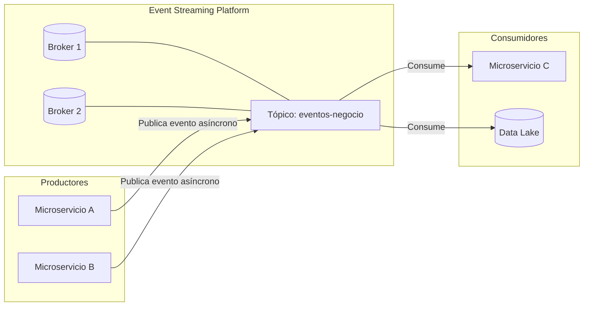
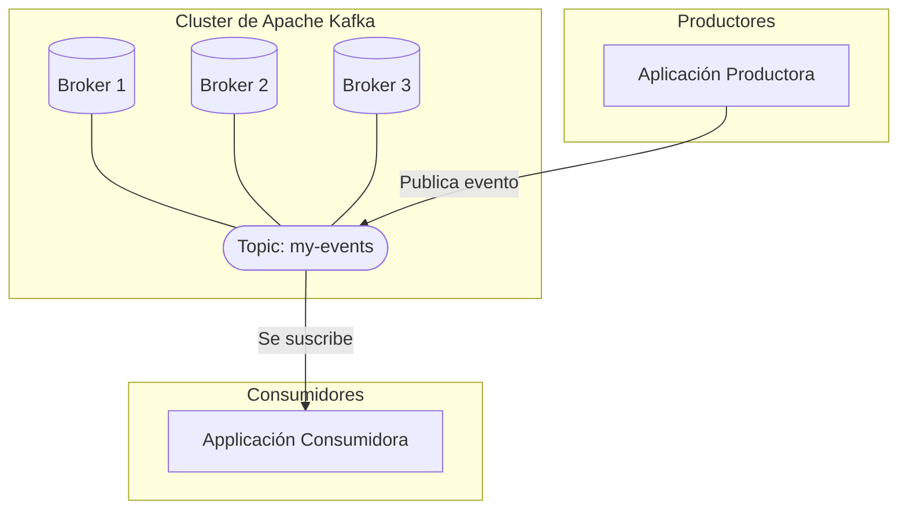
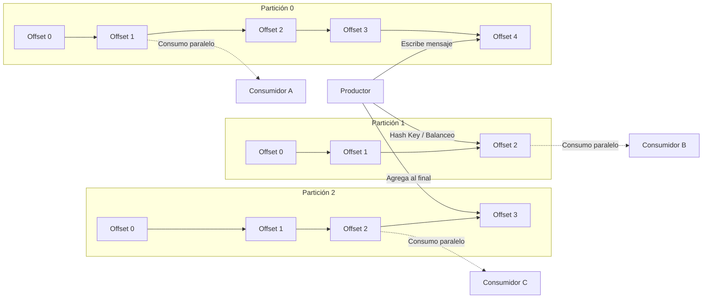
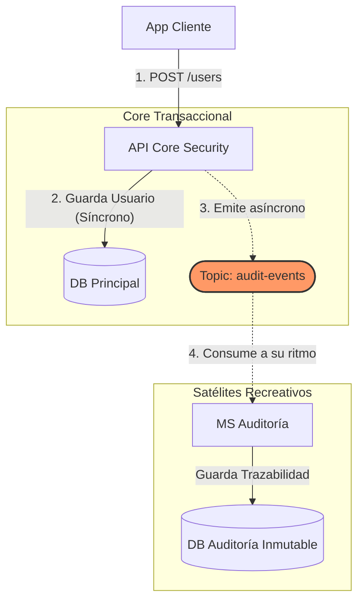
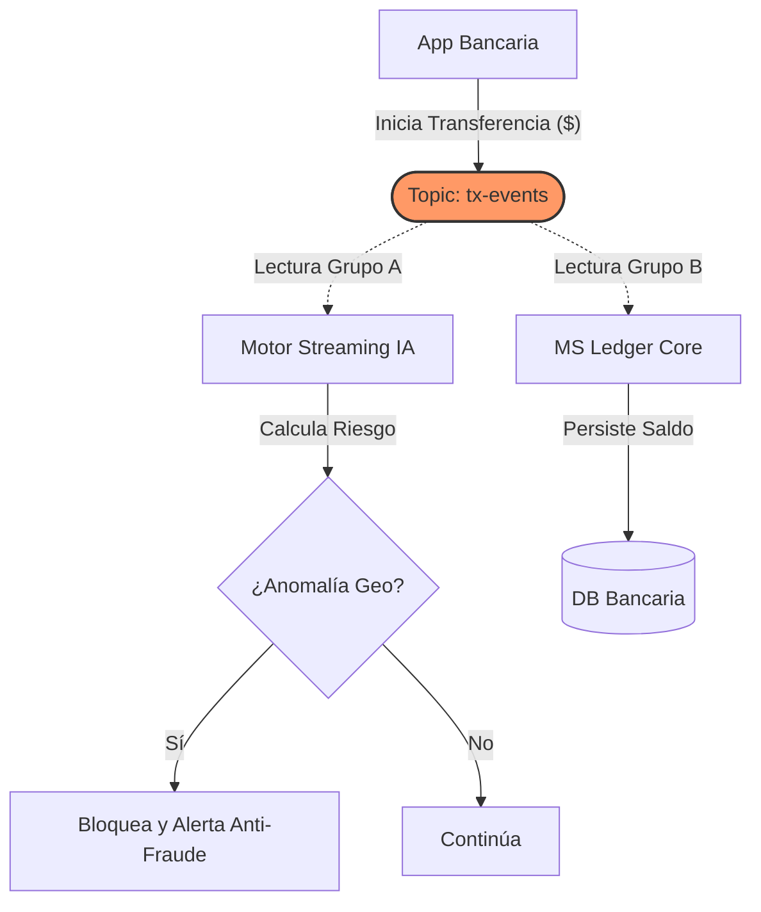
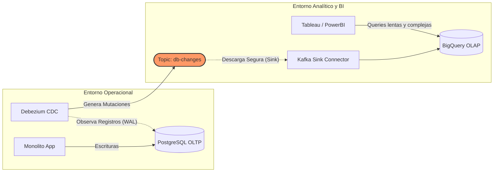

# Teoría y Arquitectura de Kafka

:::info Objetivo de la Sección
Comprender a profundidad **Apache Kafka**, su modelo arquitectónico basado en logs inmutables y por qué se ha vuelto el estándar de facto para arquitecturas orientadas a eventos (Event-Driven Architecture).
:::

## 1. Visión Arquitectónica General

El poder de Kafka radica en su capacidad para actuar como el sistema nervioso central de una arquitectura de microservicios, desacoplando completamente a los emisores de los receptores.

---

## 2. ¿Qué es Apache Kafka y por qué importa?

**Apache Kafka** es una plataforma distribuida de transmisión de eventos (Event Streaming). A diferencia de los sistemas de mensajería tradicionales (como RabbitMQ, ActiveMQ) que eliminan los mensajes una vez leídos mediante un modelo de colas efímeras, Kafka actúa fundamentalmente como un **registro (log) de eventos inmutable y persistente en disco**.

:::tip La diferencia fundamental
Los brokers tradicionales **empujan (push)** mensajes efímeros a los consumidores.
En Kafka, los eventos se almacenan duraderamente, y los consumidores **jalan (pull)** los mensajes a su propio ritmo recordando su "offset" (posición de lectura).
:::

### ¿Por qué importa en arquitecturas modernas?
- **Desacoplamiento extremo:** El productor genera datos sin importarle quién, cómo o cuándo los consumirá.
- **Escalabilidad horizontal masiva:** Permite procesar millones de mensajes por segundo distribuyendo la carga a lo largo de *Particiones*.
- **Retención (Replay):** Al persistir en disco, nuevos microservicios pueden conectarse días después, "viajar al pasado" y reprocesar el histórico completo de eventos de negocio.

---

## 3. Componentes Mecánicos Internos

Para dominar Kafka, debes entender cómo estructura la información:

import Tabs from '@theme/Tabs';
import TabItem from '@theme/TabItem';

<Tabs>
<TabItem value="components" label="Componentes Clave">

A nivel lógico y físico, la plataforma interactúa uniendo Productores, Brokers (servidores) y Consumidores a través de Tópicos.

- **Producer (Productor):** Aplicación que escribe (publica) eventos en Kafka.
- **Consumer (Consumidor):** Aplicación que lee (se suscribe a) eventos desde Kafka.
- **Broker:** Un nodo o servidor individual de Kafka. Un clúster se compone de múltiples brokers trabajando en conjunto para replicar datos.
- **Topic (Tópico):** La categoría lógica donde se guardan los eventos (ej. `audit-events`). Piensa en ello como una tabla en una base de datos.
- **Partition (Partición):** Los tópicos se dividen en fragmentos físicos llamados particiones, albergados en diferentes brokers para paralelizar lecturas y escrituras.
- **Offset:** Un número secuencial inmutable que identifica la posición exacta de un mensaje dentro de una partición.

</TabItem>
<TabItem value="diagram" label="Particiones y Offsets">

Cada tópico se divide internamente en **Particiones** para poder procesar mensajes en paralelo y distribuir el almacenamiento. Dentro de cada partición, cada mensaje tiene un **Offset** inmutable.

Cada vez que un Productor emite un evento, Kafka lo asigna a una de las particiones (generalmente aplicando un *Hash* a la llave o *Key* enviada en el mensaje). Las particiones garantizan el **orden temporal** de los mensajes pero **sólo dentro de la misma partición**.

</TabItem>
</Tabs>

---

## 4. Conceptos de Tolerancia a Fallos: Retries y DLQ

En un sistema asíncrono puro estilo "Fire-and-forget", prepararnos para el fallo es innegociable.

### Reintentos Nativos (Retries)
Si un broker de Kafka colapsa temporalmente, el cliente productor no lanza una excepción instantánea. El diseño resiliente interrumpe el flujo de entrada a la red, guarda el mensaje en buffers locales y **reintenta su envío** tras un lapso de `retry-backoff-ms`.

:::note El reto de la Idempotencia
Al configurar reintentos automáticos, corres el riesgo de que el broker sí haya guardado el mensaje pero el `ACK` se haya perdido en la red. El productor enviará el mensaje de nuevo. Por esto, los consumidores deben estar diseñados de manera **idempotente**: procesar el mismo evento varias veces debe tener el mismo resultado en el estado del sistema que procesarlo una sola vez (ej. usar `UPSERT` en lugar de `INSERT`).
:::

### Dead Letter Queue (DLQ)
Si tras agotar el máximo número de reintentos (`retries=MAX`) un consumidor no logra procesar estructuralmente un mensaje (ej. formato JSON corrupto, "mensaje envenenado"), desechar el evento provoca pérdida de datos y fallos en auditoría. 

:::warning Protección con DLQ (Dead Letter Queue)
Un DLQ es un tópico alternativo (ej. `audit-events-dlq`) usado como "sala de emergencias". Los mensajes fallidos se derivan y encolan allí para **no bloquear el particionado principal** y permitir inspección humana u operativas de reproceso sin romper el Single Responsibility Principle del flujo original.
:::

---

## 5. Casos de Uso Reales en la Industria Corporativa

Kafka brilla cuando un mismo evento de negocio detona múltiples reacciones satélites independientes.

<Tabs>
<TabItem value="audit" label="1. Auditoría y Trazabilidad (Forensic)">

### Evitando acoplamiento y cuellos de botella
En sistemas tradicionales, si el servicio principal necesita registrar una auditoría tras cada acción (ej. crear usuario, modificar política), debe invocar de forma *síncrona* a la base de datos de auditoría o a un API externo. Esto acopla ambos servicios, penaliza la latencia de cara al usuario final y añade un punto crítico de fallo.

Al usar Kafka, el API principal realiza su trabajo core, y simplemente emite un evento `ResourceModified` de estilo *fire-and-forget*. El microservicio de Auditoría lo consume de forma desconectada y segura.

</TabItem>
<TabItem value="metrics" label="2. Monitoreo Anti-Fraude Bancario">

### Múltiples consumidores del mismo evento funcional
Imagina una plataforma bancaria moderna. Cuando una transferencia se realiza, no solo debe registrarse en la contabilidad del usuario, sino que el equipo legal necesita evaluarla contra modelos de lavado de dinero en milisegundos.

Kafka permite que un único evento ("Transacción de $5,000") alimente simultáneamente al microservicio de contabilidad clásica y a un potente clúster de Inteligencia Artificial (Apache Flink / Spark) sin que ambos tengan conocimiento del otro, garantizando que el sistema no se congele durante el análisis de riesgo.

</TabItem>
<TabItem value="sync" label="3. Sincronización a Data Lake (CDC)">

### Liberando de carga al motor relacional (OLTP vs OLAP)
Ejecutar "queries densos" de métricas analíticas (Business Intelligence) sobre la misma base de datos donde se transacciona la paquetería del día es un error catástrofico de rendimiento.

Herramientas especializadas como **Debezium** se enganchan a los archivos de log profundos de la base de datos PostgreSQL (*Binlogs / WAL*), detectando puramente los INSERTS y UPDATES sin afectar la aplicación principal. Estos se transmiten a Kafka, quien hace de puente para enviarlos a gigantes bodegas de datos columnares como Snowflake o BigQuery (OLAP) para ser explotados libremente por científicos de datos.

</TabItem>
</Tabs>
