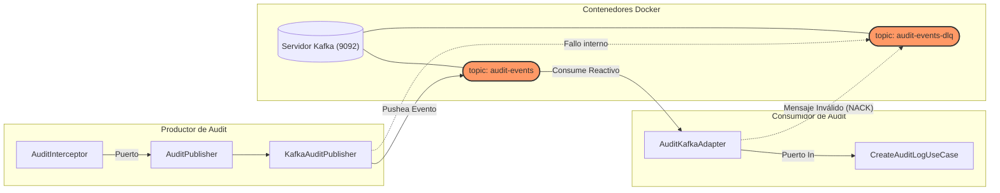

# Implementación de Kafka con Quarkus

:::info Objetivo de la Sección
Aplicar los conceptos teóricos de Kafka creando adaptadores tanto de **Producción (Emisión)** como de **Consumo (Suscripción)** dentro del ecosistema Quarkus, respaldando Arquitecturas Limpias (Ports & Adapters) y configurando políticas de DLQ (Dead Letter Queue) locales.
:::

## 1. Arquitectura de Implementación: Port & Adapters

La integración no ensucia la lógica de negocio; Quarkus actúa como puente conectando clases de inyección hacia colas reactivas (SmallRye Messaging). Veremos cómo el microservicio de Seguridad produce, y el de Auditoría consume.



---

## 2. Dependencias Obligatorias

Tanto en tu servicio Productor como en el Consumidor, debes habilitar la especificación MicroProfile Reactive Messaging dentro del `build.gradle.kts`:

```kotlin
implementation("io.quarkus:quarkus-smallrye-reactive-messaging-kafka")
```

---

## 3. Construyendo el Productor (Producer)

:::tip Patrón "Sidecar" vs "Integración Directa"
En Arquitectura Hexagonal, el cliente Kafka es sólamente un conector más. El **Core de Seguridad** no sabe que existe un tópico de *Kafka*, solo sabe que existe una interfaz `AuditPublisher` lista para exportar registros.
:::

### 3.1. Configuración del Productor (`application.properties`)

```properties title="src/main/resources/application.properties"
# Selector de arquitectura a Inyectar dinámicamente @LookupIfProperty
audit.mode=kafka

# Evita que Quarkus Dev Services levante un contenedor Testcontainer aleatorio (forcing locale)
kafka.bootstrap.servers=${KAFKA_BOOTSTRAP_SERVERS:localhost:9092}

# --- KAFKA PRODUCER (Canal: audit-out -> Topic: audit-events) ---
mp.messaging.outgoing.audit-out.connector=smallrye-kafka
mp.messaging.outgoing.audit-out.topic=audit-events
mp.messaging.outgoing.audit-out.value.serializer=io.quarkus.kafka.client.serialization.ObjectMapperSerializer

# Resiliencia Productora: Reintentos Nativos
mp.messaging.outgoing.audit-out.retries=3
mp.messaging.outgoing.audit-out.retry-backoff-ms=1000
mp.messaging.outgoing.audit-out.acks=all

# --- KAFKA PRODUCER DLQ (fallback explícito) ---
mp.messaging.outgoing.audit-dlq-out.connector=smallrye-kafka
mp.messaging.outgoing.audit-dlq-out.topic=audit-events-dlq
mp.messaging.outgoing.audit-dlq-out.value.serializer=io.quarkus.kafka.client.serialization.ObjectMapperSerializer
```

### 3.2. Adaptador de Salida Kafka

Inyectamos emisores (`Emitter<T>`) asociados a los canales definidos previamente.

import Tabs from '@theme/Tabs';
import TabItem from '@theme/TabItem';

<Tabs>
<TabItem value="puerto" label="El Puerto (Interfaz)">

En Hexagonal, las clases de tu propio subdominio nunca referencian librerías exógenas como Kafka. Dependen de implementaciones abstractas:
```java
public interface AuditPublisher {
    void publish(AuditEvent event);
}
```

</TabItem>
<TabItem value="adaptador" label="KafkaAuditPublisher.java">

Este adaptador delega enriquecimientos a un Mapper (ej. añadiendo `originService`) y usa `.send()`. 
Nótese el bloque `.whenComplete((success, failure))` para capturar rechazos del *Broker* sin interrumpir al usuario REST.

```java
import org.eclipse.microprofile.reactive.messaging.Channel;
import org.eclipse.microprofile.reactive.messaging.Emitter;

@ApplicationScoped
@LookupIfProperty(name = "audit.mode", stringValue = "kafka")
@Slf4j
public class KafkaAuditPublisher implements AuditPublisher {

    @Inject
    @Channel("audit-out")    // Conectado a mp.messaging.outgoing.audit-out
    Emitter<AuditEvent> emitter;

    @Inject
    @Channel("audit-dlq-out") // Canal DLQ explícito
    Emitter<AuditEvent> dlqEmitter;

    @Override
    public void publish(AuditEvent event) {
        log.info("[KAFKA PUBLISHER] Preparando envío del evento.");
        
        try {
            emitter.send(event).whenComplete((success, failure) -> {
                if (failure != null) {
                    log.error("Fallo tras reintentos al enviar al tópico principal. Derivando a DLQ...", failure);
                    sendToDlq(event);
                } else {
                    log.info("Evento insertado en audit-events exitosamente!");
                }
            });
        } catch (Exception e) {
            sendToDlq(event);
        }
    }

    private void sendToDlq(AuditEvent event) {
        dlqEmitter.send(event).whenComplete((success, failure) -> {
            if (failure != null) {
                log.error("[DLQ CRITICO] Servidor de Kafka irrecuperable.", failure);
            }
        });
    }
}
```

</TabItem>
</Tabs>

:::tip Magia de Compilación con `@LookupIfProperty`
Inyectar usando una propiedad activa o inactiva en tiempo de ejecución (runtime) significa que tu empaquetado binario **GraalVM Native Image** conservará ambas estrategias (vía HTTP Rest o vía Kafka) en su byte-code, posibilitando una conmutación instantánea mediante variables de entornos como un *Feature Flag* duro.
:::

---

## 4. Construyendo el Consumidor (Consumer) con Retornos Mágicos DLQ

Ahora en el microservicio contra-cara (`cja-msa-sc-audit`), debemos "suscribirnos" reactivamente al tópico para escuchar el flujo.

### 4.1. Configuración del Consumidor y Routing DLQ (`application.properties`)

```properties title="src/main/resources/application.properties"
# Kafka Global
kafka.bootstrap.servers=${KAFKA_BOOTSTRAP_SERVERS:localhost:9092}

# --- KAFKA CONSUMER (Canal: audit-in -> escucha a: audit-events) ---
mp.messaging.incoming.audit-in.connector=smallrye-kafka
mp.messaging.incoming.audit-in.topic=audit-events
mp.messaging.incoming.audit-in.group.id=audit-service

# --- ESTRATEGIA EXCLUSIVA AUTOMÁTICA DE DLQ ---
mp.messaging.incoming.audit-in.failure-strategy=dead-letter-queue
mp.messaging.incoming.audit-in.dead-letter-queue.topic=audit-events-dlq
```

:::info Serializadores Automáticos
A diferencia del Producer donde establecemos manualmentee el serializer JSON (`value.serializer=io.quarkus.kafka...ObjectMapperSerializer`), **SmallRye Reactive Messaging deduce el deserializer correcto** en base al tipo de objeto (`AuditEvent`) definido en el método consumidor, quitándonos esa rigidez visual.
:::

### 4.2. El Componente Adaptador Input (Subscriber)

Aquí Quarkus enruta iterativamente los mensajes y los mapea hacia nuestro Domain usando la anotación `@Incoming`. 

```java title="infrastructure/adapters/in/kafka/AuditKafkaAdapter.java"
import org.eclipse.microprofile.reactive.messaging.Incoming;
import io.smallrye.mutiny.Uni;

@ApplicationScoped
@Slf4j
public class AuditKafkaAdapter {

    @Inject
    AuditLogService auditLogService; // Capa UseCase / Domain

    @Inject
    AuditKafkaMapper mapper;

    // Reactivamente consume el topic bindeado en propiedades
    @Incoming("audit-in")
    public Uni<Void> processIncomingAudit(AuditEvent event) {
        log.info("[KAFKA CONSUMER] Recibiendo payload de validación Kafka.");

        // SIMULADOR DIDÁCTICO DE ERROR PARA ACTIVAR EL DLQ:
        if ("SIMULATE_ERROR".equals(event.functionality())) {
            log.error("Simulated error occurred for DLQ demonstration. " +
                      "Message will be routed to DLQ.");
            // Esto provocará un 'Not Acknowledged (NACK)', 
            // y Quarkus lo moverá en automático a 'audit-events-dlq'.
            throw new IllegalArgumentException("Payload Envenenado Simulado");
        }

        return auditLogService.createAuditLog(mapper.toDomain(event))
            .onItem().invoke(inserted -> log.info("Successfully persisted audit log from Kafka"))
            .replaceWithVoid();
    }
}
```

---

## 5. Paso a Paso para la Verificación Local

Sigue este procedimiento para garantizar que tus microservicios hablan entre sí de forma reactiva y que el DLQ te protege contra datos envenenados.

<Tabs>
<TabItem value="start" label="1. Infraestructura">

Levanta el Broker de Kafka y la red de contenedores:
```bash
docker-compose up -d kafka
```
Asegúrate de tener expuesto el puerto `9092` y opcionalmente el panel de control *Kafka UI* (usualmente en el `8090`). Luego inicia las aplicaciones en terminales separadas:
```bash
./gradlew quarkusDev
```

</TabItem>
<TabItem value="success" label="2. Flujo Exitoso">

Invoca algún *Endpoint* en el servidor de Seguridad que expulse evento de auditoria (`POST /api/v1/users/login`).

En tu consola *Kafka UI* deberías ver aparecer JSONs bien formados sobre el tópico `audit-events`. El servicio *Audit* de la otra punta los procesará inmediatamente:

```bash
[KAFKA CONSUMER] Recibiendo payload de validación Kafka.
[INFO] Successfully persisted audit log from Kafka
```

</TabItem>
<TabItem value="dlq" label="3. Prueba DLQ (Error)">

Desde la interfaz manual (*Kafka UI -> Produce Message*) publica contra el tópico `audit-events` un string configurado maliciosamente para detonar el error didáctico:

```json
{
   "functionality": "SIMULATE_ERROR",
   "username": "admin",
   "eventType": "FAIL",
   "detail": "Este mensaje forzará al consumidor a rechazarlo"
}
```

Tu aplicación consumidora en la terminal registrará el fallo:
```bash
[ERROR] Simulated error occurred for DLQ demonstration. Message will be routed to DLQ.
```

:::success Comprobación Zero Message Loss
Al recargar los *Topics* de tu red Kafka observarás que el tópico `audit-events-dlq` ha capturado íntegramente el registro erróneo. ¡Ni un solo mensaje se pierde en producción!
:::

</TabItem>
</Tabs>
