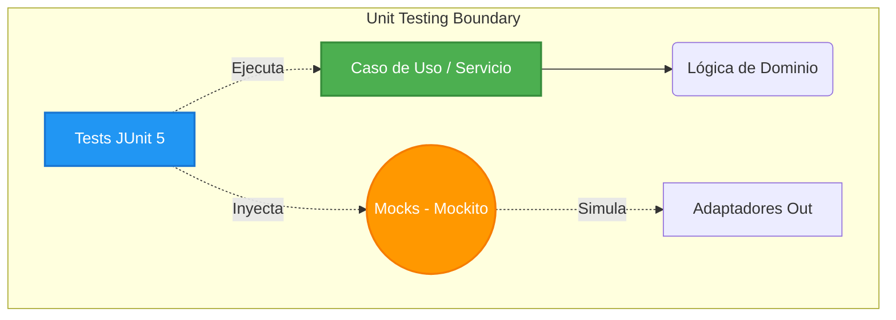
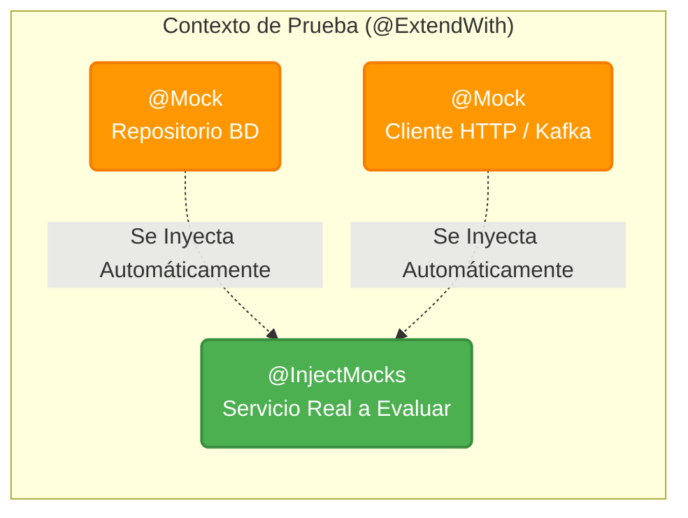

import Tabs from '@theme/Tabs';
import TabItem from '@theme/TabItem';

# Tests Unitarios con Java y Quarkus

:::info ¿Qué son las Pruebas Unitarias?
Son metodologías automáticas que evalúan el comportamiento de una pequeña unidad de código (como una clase o un método) de **forma completamente aislada**. No se conectan a bases de datos ni levantan servidores HTTP; verifican exclusivamente que la lógica de negocio procesa correctamente las entradas y arroja las salidas esperadas.
:::

:::tip QA Principle
El código sin pruebas no es código terminado. Una base de **Tests Unitarios** sólida es la red de seguridad que permite la evolución continua y el refactoring sin miedo a regresiones.
:::

## Arquitectura de Pruebas Unitarias

En la **Arquitectura Hexagonal**, las pruebas unitarias se enfocan puramente en la **Lógica de Negocio** (Capa de Dominio y Casos de Uso), aislando completamente el framework (Quarkus) y la infraestructura externa (Bases de Datos, APIs, Brokers).



---

## Ecosistema de Anotaciones (JUnit 5 + Mockito)

Para configurar el entorno de una clase de prueba, utilizamos un conjunto específico de anotaciones que le indican a JUnit y Mockito cómo operar la inyección de dependencias simuladas.

<Tabs>
<TabItem value="junit" label="Anotaciones JUnit 5">

* **`@ExtendWith(MockitoExtension.class)`**: Instruye a JUnit 5 que permita la inicialización de Mocks de Mockito durante la ejecución de este test, sin necesidad de levantar contenedores Spring o Quarkus.
* **`@Test`**: Marca el método como un ejecutable de prueba.
* **`@DisplayName("...")`**: Permite asignar un nombre descriptivo (en español) a la prueba, el cual aparecerá en los reportes de ejecución facilitando la detección rápida si la prueba llega a fallar.

</TabItem>
<TabItem value="mockito" label="Anotaciones Mockito">



* **`@Mock`**: Crea una imitación completa y controlable de una dependencia externa (como un Repositorio o un cliente HTTP). Dicho mock no ejecutará lógica real; sus respuestas serán controladas por nosotros.
* **`@InjectMocks`**: Inyecta automáticamente todos los `@Mock` previamente declarados dentro de la instancia de nuestra clase funcional Real (el Caso de Uso o Servicio que deseamos poner a prueba).

</TabItem>
</Tabs>

---

## Anatomía del Patrón AAA, Asserts y Verify

Toda prueba bien estructurada debe dividirse en 3 fases: **Arrange (Preparar), Act (Actuar), y Assert (Comprobar)**. 


### Ejemplo de Implementación Completa

A continuación explicamos el funcionamiento de las **aserciones (`assertEquals`)** para validar variables de salida, y de espionaje (`verify`) para medir interacciones programáticas.

```java
import org.junit.jupiter.api.DisplayName;
import org.junit.jupiter.api.Test;
import org.junit.jupiter.api.extension.ExtendWith;
import org.mockito.InjectMocks;
import org.mockito.Mock;
import org.mockito.junit.jupiter.MockitoExtension;
import java.util.Optional;

import static org.junit.jupiter.api.Assertions.assertEquals;
// Importamos static Mockito.verify y Mockito.when
import static org.mockito.Mockito.*;

@ExtendWith(MockitoExtension.class)
@DisplayName("Tests para el Servicio de Dominio de Usuarios")
public class UserQueryServiceTest {

    @Mock
    private UserRepositoryPort userRepository; // <- Simulado

    @InjectMocks
    private UserQueryService userQueryService; // <- Real a Testear

    @Test
    @DisplayName("Debe retornar un usuario existente por su ID exitosamente")
    void testFindUserByIdSuccess() {
        // 1. ARRANGE (Preparar Escenario e Instruir a los Mocks)
        String userId = "123-uuid";
        User expectedUser = new User(userId, "xavier", "admin");
        
        // Literalmente instruimos: "Cuando el repositorio sea invocado con este ID, entonces retorna expectedUser"
        when(userRepository.findById(userId)).thenReturn(Optional.of(expectedUser));

        // 2. ACT (Ejecutar la Lógica de Negocio Real)
        User actualUser = userQueryService.findById(userId);

        // 3. ASSERT (Validar Resultados Litelares)
        // Mediante `assertEquals` verificamos que (EXPECTATIVA == REALIDAD)
        assertEquals("xavier", actualUser.getUsername());
        assertEquals("123-uuid", actualUser.getId());
        
        // 4. VERIFY (Validar Interacciones Internas del Framework mockeado)
        // Verificamos de forma espía que la BD simulada en esta prueba fue instada 
        // exactamente 1 vez (times: 1) enviando param: userId
        verify(userRepository, times(1)).findById(userId);
    }
}
```

:::note Verificación de Comportamiento (`verify`)
A diferencia de los `Asserts` (que evalúan el tipo y valor que un método retorna hacia afuera), el uso de `verify` en Mockito funge como un sistema de vigilancia dentro de la ejecución que nos constata que un componente delegado sí fue tocado adecuadamente. Emplear verificativos como `times(n)`, `never()` y `any()` dictamina las reglas de qué debía o no ejecutarse.
:::

---

## Gestión de Excepciones (`assertThrows`)

:::tip Validación del Camino Trágico
Las pruebas no solo deben confirmar el "Camino Feliz". Asegúrate de evaluar explícitamente cómo tu servicio evalúa datos corruptos o produce Domain Exceptions usando `assertThrows`.
:::

Para verificar el lanzamiento de excepciones esperadas de dominio y asegurar que nuestro mensaje de negocio no fue alterado:

```java
@Test
@DisplayName("Debe lanzar UserNotFoundException si el usuario no existe")
void testFindUserByIdNotFound() {
    // Arrange: Simulamos que la búsqueda a la base de datos devuelve Vacío (Empty)
    String userId = "invalid-uuid";
    when(userRepository.findById(userId)).thenReturn(Optional.empty());

    // Act & Assert: Englobamos la ejecución conflictiva en la captura assertThrows
    UserNotFoundException exception = assertThrows(
        UserNotFoundException.class, 
        () -> userQueryService.findById(userId)
    );
    
    // Y probamos que el mensaje interno es íntegro a las reglas de negocio
    assertEquals("El usuario solicitado no existe", exception.getMessage());
    verify(userRepository, times(1)).findById(userId);
}
```

---

## Ejecución desde CLI

Ejecuta tu suite de pruebas unitarias empleando Gradle. Dado que estas pruebas previnieron levantar servidores HTTP y frameworks pesados, la ejecución será asombrosamente instantánea:

```bash
# Ejecutar toda la suite de pruebas unitarias del proyecto
./gradlew test

# Ejecutar únicamente una clase de prueba específica
./gradlew test --tests "cja.msa.sc.security.application.service.UserQueryServiceTest"
```
