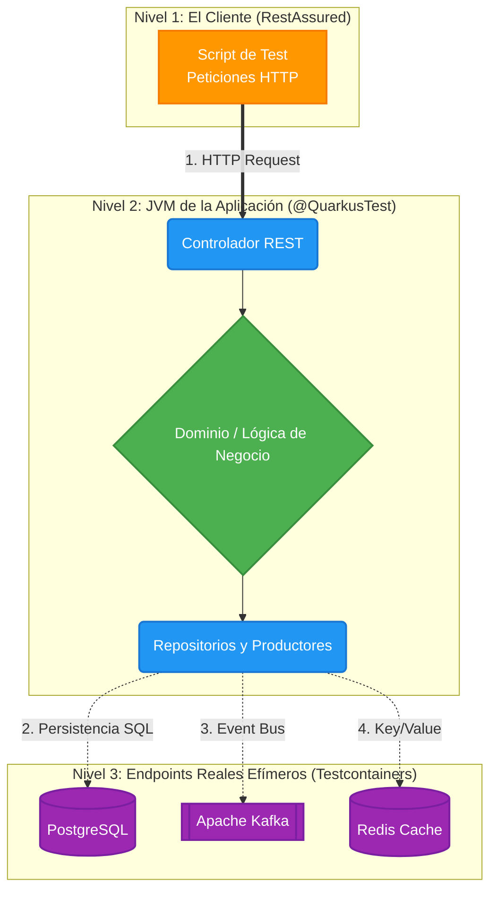

import Tabs from '@theme/Tabs';
import TabItem from '@theme/TabItem';

# Tests de Integración en Quarkus

:::info Diferencia crucial: Unitarios vs Integración
Mientras que los **Tests Unitarios** aíslan componentes individuales (Usando Mockito para simular y evadir el Framework), los **Tests de Integración** arrancan todo el contexto de alojamiento de Quarkus y verifican que las piezas en su conjunto logran interactuar correctamente con **Bases de Datos, APIs Externas y Brokers** (usualmente mediante Testcontainers).
:::

:::tip QA Principle
Cien Pruebas Unitarias verdes no garantizan que el sistema funcione en producción si tu aplicación no se puede conectar a la base de datos real. **Los Tests de Integración** cierran la brecha probando el ecosistema orquestado en su totalidad.
:::

## Arquitectura de Tests de Integración

En la Arquitectura Hexagonal, las Pruebas de Integración se centran en evaluar los **Adaptadores** simulando la interacción real del cliente. Observa en tres niveles cómo Quarkus instrumenta el entorno completo efímero para ti:



---

## Ecosistema de Anotaciones de Integración

Para configurar el entorno de Integración, Quarkus nos brinda constructores altamente eficientes:

<Tabs>
<TabItem value="quarkus" label="Anotaciones de Contexto">

* **`@QuarkusTest`**: Arranca la aplicación entera en un thread separado dentro de la misma JVM. Escanea dependencias e inicializa el contenedor CDI y DevServices (Testcontainers).
* **`@TestHTTPEndpoint`**: Permite definirle a la clase de prueba a qué controlador REST apuntarán por defecto las llamadas, evitando repetir subdominios y rutas raíz en cada método de test.

</TabItem>
<TabItem value="mocking" label="Anotaciones de Espionaje">

* **`@InjectMock`**: A veces en un test de integración necesitamos suplantar una sola pequeña pieza (e.g. Un cliente externo RestClient fuera de nuestra red) mientras el resto y la base de datos corren de verdad. `@InjectMock` reemplaza un Bean CDI real subyacente de Quarkus por un espía de Mockito en tiempo de arranque.

</TabItem>
</Tabs>

---

## El Patrón Given-When-Then (RestAssured + Asserts)

RestAssured opera bajo el paradigma de desarrollo guiado por comportamiento (BDD). A nivel gráfico, el Patrón `Given-When-Then` consolida esta fase tripartita:


### Implementando un Test de Endpoint con Asserts y Verify

La fase **Then** incluye potentes aserciones nativas (.body) donde evaluaremos variables web. Si combinamos esto con `@InjectMock`, también podemos usar un comando de verificación de Mockito (`verify`):

```java
import io.quarkus.test.junit.QuarkusTest;
import io.quarkus.test.InjectMock;
import io.restassured.http.ContentType;
import org.junit.jupiter.api.DisplayName;
import org.junit.jupiter.api.Test;

// RestAssured (Given-When-Then) y Asserts (Hamcrest Core)
import static io.restassured.RestAssured.given;
import static org.hamcrest.Matchers.equalTo;
import static org.hamcrest.Matchers.notNullValue;
// Importamos Mockito.verify y Mockito.times
import static org.mockito.Mockito.*;

@QuarkusTest
@DisplayName("Integration Tests para API de MFA")
public class MfaResourceIntegrationTest {

    // Reemplazamos momentáneamente el cliente externo por un Mock
    @InjectMock
    SmsRestClient smsRestClient;

    @Test
    @DisplayName("Debe validar el flujo MFA enviando OTP y devolver 200 OK")
    void testMfaAuthSuccess() {
        when(smsRestClient.sendOtp(any())).thenReturn(Boolean.TRUE);

        given() 
            .contentType(ContentType.JSON)
            .body("{ \"username\": \"admin\", \"otp\": \"123456\" }")
        .when() 
            .post("/api/v1/auth/mfa/verify")
        .then() 
            .statusCode(200) 
            .body("token", notNullValue()) 
            .body("mfa_verified", equalTo(true)); 
            
        // VERIFY: Garantizamos que la interación invisible haya sucedido.
        verify(smsRestClient, times(1)).sendOtp(any());
    }
}
```

---

## Tests de Integración Especializados

Una aplicación moderna no se limita a exponer APIs HTTP; se comunica mediante memorias caché y buses de mensajería asíncrona.

<Tabs>
<TabItem value="redis" label="Testeando Redis (Caché)">

### Validando Lógica Key/Value Realmente Contra Memoria

DevServices arrancará un contenedor Redis en segundo plano al detectar la extensión en tu classpath.

Puedes interactuar directamente inyectando tu adaptador, limpiando la base antes de usarla mediante `@BeforeEach`, e invocando lógicas que deban desencadenar inserciones:

```java
import io.quarkus.redis.datasource.RedisDataSource;
import io.quarkus.test.junit.QuarkusTest;
import jakarta.inject.Inject;
import org.junit.jupiter.api.BeforeEach;
import org.junit.jupiter.api.Test;
import static org.junit.jupiter.api.Assertions.assertNotNull;

@QuarkusTest
public class RedisAuthCacheTest {

    @Inject
    RedisDataSource redisDataSource; // Para limpiezas de contexto
    
    @Inject
    AuthCacheAdapter authCacheAdapter; // Tu adaptador funcional a validar

    @BeforeEach
    void setup() {
        redisDataSource.flushall(); // Limpieza para arrancar en blanco
    }

    @Test
    void debeGuardarTokenEnCacheCorrectamente() {
        // Act
        authCacheAdapter.saveSession("user123", "token_valido", 3600);
        
        // Assert: Validas que la lógica funcionó conectada a una Data real
        String retrievedToken = authCacheAdapter.getSession("user123");
        assertNotNull(retrievedToken);
    }
}
```

</TabItem>
<TabItem value="kafka" label="Testeando Kafka (Mensajería)">

### Validando Eventos Asíncronos 

Al igual que Redis, Quarkus nos aprovisiona un entorno de Kafka transitorio para testContainers automático.

El reto de probar Brokers asíncronos es esperar a que el consumidor termine. Para ello integramos utilidades de Awaitility u observadores directos sobre los canales:

```java
import io.quarkus.test.junit.QuarkusTest;
import io.smallrye.reactive.messaging.memory.InMemoryConnector;
import io.smallrye.reactive.messaging.memory.InMemorySink;
import jakarta.inject.Inject;
import org.junit.jupiter.api.Test;
import static org.awaitility.Awaitility.await;
import static org.junit.jupiter.api.Assertions.assertEquals;

import java.time.Duration;

@QuarkusTest
public class KafkaAuditPublisherTest {

    @Inject
    KafkaAuditPublisher publisher; // Enviará el evento
    
    // Conector en Memoria para espiar los Tópicos de Quarkus
    @Inject
    @Any
    InMemoryConnector connector;

    @Test
    void debePublicarMensajeSatisfactoriamente() {
        // Interceptamos la salida simulada "audit-events"
        InMemorySink<AuditMessage> sink = connector.sink("audit-events");
        sink.clear();

        // 1. Act: Publicamos vía nuestro adapter Real
        publisher.publish(new AuditMessage("LOGIN_SUCCESS", "127.0.0.1"));
        
        // 2. Assert: Empleamos Awaitility para esperar la latencia natural
        await().atMost(Duration.ofSeconds(2)).until(() -> sink.received().size() == 1);
        
        AuditMessage produced = sink.received().get(0).getPayload();
        assertEquals("LOGIN_SUCCESS", produced.getAction());
    }
}
```

</TabItem>
</Tabs>

---

## Ejecución desde CLI

Los test de integración levantan toda la artillería en memoria; son nuestra validación central que aporta el verdadero Value de Negocio al Producto de Software.

```bash
# Ejecutar toda la batería integral (Toma de todos los test y Testcontainers)
./gradlew test

# Ejecutar una clase inyectando perfil específico individualizado
./gradlew test --tests "cja.msa.sc.security.infrastructure.adapters.in.rest.MfaResourceIntegrationTest"
```
