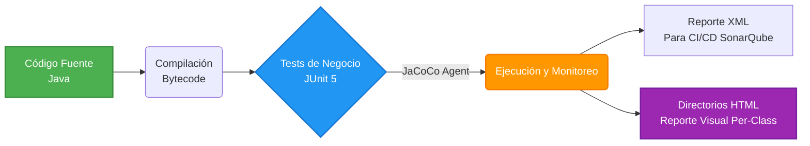

import Tabs from '@theme/Tabs';
import TabItem from '@theme/TabItem';

#  Code Coverage con JaCoCo en Quarkus

:::info ¿Qué es la Cobertura de Código?
Es una métrica de calidad que define **qué porcentaje de tu código fuente fue efectivamente ejecutado (testeado)** durante el transcurso automatizado de tu suite de pruebas. Una alta cobertura suele denotar robustez ante regresiones.
:::

## El Ciclo de Vida de JaCoCo

**JaCoCo (Java Code Coverage)** es la herramienta estándar del ecosistema. En Quarkus, se integra de manera totalmente nativa para la inyección de sondas (*probes*) durante la fase de testing, escaneando tanto los resultados unitarios como los de integración y agrupándolos en reportes HTML legibles.



---

## Configuración e Instalación

:::tip Zero-Config en Quarkus
A diferencia de configuraciones heredadas donde debes configurar plugins robustos pre/post fase test, **Quarkus automatiza casi todo el trabajo**. Basta con agregar una única dependencia oficial en tiempo de compilación.
:::

Añade la siguiente extensión a tu archivo `build.gradle.kts` en el subbloque de la capa de dependencias de testing:

```kotlin
// Extensión oficial de JaCoCo preconfigurada por el Framework
testImplementation("io.quarkus:quarkus-jacoco")
```

---

## Ejecución y Mapeo Interactivo

Una vez instalado, interactuar con los reportes resultantes es un proceso simple dentro de nuestro flujo de integración continua local.

<Tabs>
<TabItem value="ejecutar" label="1. Ejecución CLI">

### Compilar y Generar Métricas

Ejecuta el ciclo de pruebas tradicional con Gradle. Quarkus detectará la agregación en runtime y anexará dinámicamente el agente de JaCoCo a la misma JVM paralela invocada:

```bash
# Limpia ensamblados previos, compila de cero y corre la suite.
./gradlew clean test
```

Al finalizar, recibirás un reporte genérico de Build Failure/Success. Detrás de escena, independientemente de si algún test fracasó, JaCoCo habrá interceptado el éxito y mapeado todas las líneas navegadas en un consolidado total.

</TabItem>
<TabItem value="reporte" label="2. Análisis del Reporte HTML">

### Desgloce del Reporte (index.html) y Métricas

Abre la ubicación generada mediante tu explorador de archivos:
`<Raiz-del-Proyecto>/build/jacoco-report/index.html`


Al abrir el reporte, observarás un panel tabular dividiendo tu proyecto por paquetes. Estas son las columnas clave para interpretar tu nivel de cobertura:

* **Element:** Muestra el nivel estructural explorado (Paquete, Clase o Método). Son enlaces interactivos; al darle clic profundizarás hasta visualizar el código fuente.
* **Missed Instructions / Cov.:** Mide la cantidad de *bytecodes* compilados que tus pruebas ignoraron ("Missed"). La barra de color (Rojo/Verde) muestra la proporción directa.
* **Missed Branches / Cov.:** Mide las vías lógicas (`if/else`, `switch`). Si tienes un código con un `if`, debes probar el escenario donde ocurre la condición y **también** el escenario donde no ocurre. Si solo pruebas uno, tendrás un *Branch* perdido.
* **Missed / Cxty:** Complejidad Ciclomática. Revela cuántos caminos disjuntos existen en el bloque y cuántos fallaste en cubrir.
* **Lines, Methods, Classes:** Estadísticas literales sobre el volumen puro de líneas de texto, métodos y clases que no tienen ningún test que pase por ellas.

#### ¿Dónde veo el Porcentaje Total de Cobertura?
Basta con fijarse en la **última fila inferior** de la tabla, titulada **Total**. Las columnas con el sufijo **Cov.** (Coverage) en esta franja inferior consolidan el cálculo aritmético de todos tus paquetes, ofreciéndote (en porcentaje) la métrica general y definitiva de salud algorítmica de todo tu microservicio.

</TabItem>
<TabItem value="codigo" label="3. Vista de Código">

### Interpretación Profunda de Código (Code View)

Al hacer clic iterativamente sobre un paquete y clase en el reporte general, irromperás finalmente en el código fuente de un archivo Java (como el `KafkaAuditPublisher`). El sistema te mostrará tu lógica original con fondos semánticos de color en cada línea mostrando la "radiografía" exacta del comportamiento que tuvo la suite.


#### La Semántica de Colores
En la captura de Kafka podemos analizar con extrema precisión el nivel de calidad alcanzado:

* 🟩 **Fondo Verde (Full Coverage):** Líneas instruidas y validadas exitosamente. Observa cómo las sentencias instrumentales (líneas `36`, `38`, `42` y el `else` de la `46`) se pintaron de verde porque nuestra prueba unitaria/integración de "Camino Feliz" navegó a través de ellas.
* 🟨 **Diamante y Fondo Amarillo (Partial Coverage):** Fíjate en la línea `43` (`if (failure != null)`). Tiene un diamante. Significa bifurcación en el camino y tu suite solo testeó una realidad de las dos posibles (`false`). Probaste el `else` donde todo estaba bien, pero **olvidaste programar una prueba** enviando un fallo (`failure=true`) para entrar dentro del bloque del `if`.
* 🟥 **Fondo Rojo (No Coverage):** Al no haber programado escenarios de error, el compilador expone como ignoradas las líneas `44-45` críticas (derivamiento al DLQ `sendToDlq`) y el caso borde de excepción silenciosa `catch (Exception e)` ubicado en las líneas `50-52`. Son código "fantasma" sin garantía de operar verdaderamente.

:::tip El valor del Rojo y Amarillo
Descubrir líneas ignoradas no es un castigo, es un *mapa del tesoro*. Te indica a gritos qué "Caso Borde" tienes que escribir a continuación en tu clase `KafkaAuditPublisherTest` (ej. instanciar un *Mock* que obligue a lanzar una Excepción o un `Failure` adrede, para someter a prueba a ese bloque rojo y volverlo verde).
:::

</TabItem>
</Tabs>

---

## Métricas de Calidad

:::warning Cuidado con la Burocracia del 100%
**Coverage es una Guía de confianza, no un Objetivo a alcanzar ciegamente.** Exigir el 100% literal obligará inherentemente a la capa de desarrollo a testear métodos Getters y Setters tontos, Constructores vacíos, o implementaciones autogeneradas (como `Mappers` de MapStruct) sin retorno real de inversión ni valor de negocio.
:::

Un analista o arquitecto moderno prioriza testear el núcleo innegociable de la **Arquitectura Hexagonal**. Una métrica de cobertura sana en un Microservicio gira en torno al **80% a 85% concentrado puramente en la Capa de Aplicación (Casos de Uso) y Controladores Core**.

### Forzar Umbrales en Repositorio (Opcional)

Si trabajas en corporativos y requieres que la capa CI/CD rechace el pipeline (`Build Failed`) cuando los desarrollos infrinjan el límite mínimo acordado, usa `application.properties`:

```properties title="src/main/resources/application.properties"
# Imponer métrica dura: Si el ratio baja del 85%, crashear compilación
quarkus.jacoco.minimum-line-coverage=0.85
```
