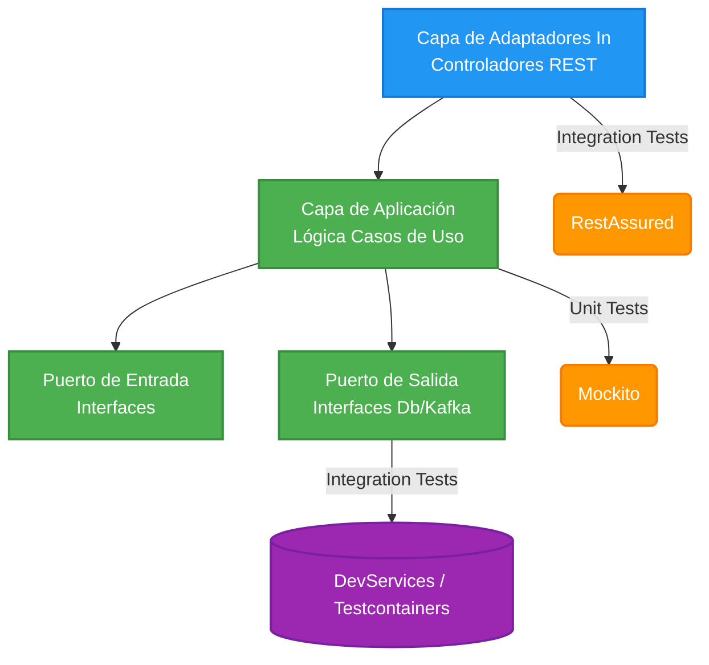

import Tabs from '@theme/Tabs';
import TabItem from '@theme/TabItem';

# Microservicio: Testing y Cobertura

En esta sesión aprenderemos a asegurar la calidad de nuestro código incorporando **Unit Testing**, **Integration Testing** y midiendo la **Cobertura de Código (Code Coverage)** empleando JaCoCo. Todo ello respetando nuestra Arquitectura Hexagonal y Clean Architecture.

:::info QA como Pilar
El testing es el pilar fundamental que nos permite desarrollar con confianza, iterar más rápido y asegurar que las modificaciones no rompan los requerimientos ya existentes evitando regresiones en Producción.
:::

---

## 1. Unit vs Integration Testing

<Tabs>
<TabItem value="unit" label="Pruebas Unitarias">

### Aislando el Componente
* **Alcance:** Prueba un componente o clase aislada (ej: Casos de Uso, Servicios de Dominio).
* **Dependencias:** Se emplea la inyección de "Mocks" o "Stubs" (`Mockito`) para simular componentes/servicios de infraestructura externos.
* **Velocidad:** Instantáneas (milisegundos) ya que no requieren del ecosistema Quarkus ni de puertos de red abiertos.
* **Prioridad:** Ideal para la Lógica de Negocio (Cálculos matemáticos, validaciones funcionales, flujos de orquestación pura).

</TabItem>
<TabItem value="integration" label="Pruebas de Integración">

### Integrando el Ecosistema
* **Alcance:** Prueba la interacción secuencial entre varios componentes y adaptadores (ej: Controladores REST, Base de Datos, Broker Kafka).
* **Dependencias:** Se levantan componentes efímeros reales (Contenedores Docker) vía **Testcontainers**/DevServices para validar el contexto CDI entero (`@QuarkusTest`).
* **Velocidad:** Lentas (segundos o minutos por el coste inicial bi-direccional del motor).
* **Prioridad:** Validar REST API (Códigos HTTP 200, 403), consultas de lectura a BD reales, inyección asíncrona a Tópicos o Caché Redis.

</TabItem>
</Tabs>

---

## 2. Stack de Testing Oficial

Para nuestro microservicio `cja-msa-sc-security` empleamos el ecosistema nativo auto-configurado por Quarkus:

* **[JUnit 5]**: El framework estándar en Java para declarar la anatomía de los ciclos y métodos de prueba (`@Test`, `@BeforeEach`).
* **[Mockito]**: Herramienta esencial para suplantar identidades mediante *mocks* (simulaciones de puertos de salida).
* **[RestAssured]**: Librería BDD (`given().when().then()`) para invocar y asertar rutas/endpoints HTTP REST fluidamente.
* **[@QuarkusTest]**: Core Testing Engine de Quarkus. Inicializa el ciclo *CDI* inyectando *Beans* reales para integración.
* **[JaCoCo]**: Herramienta de compilación capaz de rastrear líneas del Bytecode compilado instruyendo mapas térmicos de completitud en la suite.

---

## 3. Arquitectura de Testing

Al emplear Arquitectura Hexagonal, la responsabilidad se divide matemáticamente basándose en su anillo/capa correspondiente:



---

## 4. Estándar Didáctico de Pruebas implementado

Para potenciar este código fuente formativo, todas las clases de prueba han sido estricta e intencionalmente configuradas bajo tres preceptos absolutos de ingeniería moderna:

1. **Nomenclatura declarativa:** Uso de `@DisplayName("Debe fallar al recibir nulo")`; facilita su lectura terminal para auditores.
2. **Patrón AAA (Arrange, Act, Assert):** Segregación semántica horizontal instruyendo exactamente las fases de Preparación, Ejecución y Comprobación en código fuente.
3. **RestAssured Elegante:** Tabulación vertical del pipeline semántico `Given/When/Then` para que la lectura sea lo más similar posible a la narración de un usuario interactuando con Postman.

### Archivos de Test Destacados en el Proyecto

#### Unit Testing Core (Aislados)
* **`UserQueryServiceTest.java`**: Aislamiento total a un Servicio de Dominio empleando `Mockito`. Valida la inserción programática de IDs evitando bases de datos.
* **`AuthServiceTest.java`**: Aísla lógicas de orquestación, reaccionando a casos como "Cache Hit/Miss" forzando un retorno ciego a componentes caídos simulados.

#### Integration Testing Core (Contenedores)
* **`MfaResourceTest.java`**: Emplea RestAssured (`/api/v1/auth/mfa/verify`) garantizando la deserialización HTTP al Controlador `200 OK`.
* **`KafkaAuditPublisherTest.java`**: Valida a un consumidor emisor asíncrono sobre Tópicos aprovisionando un DevService transitorio in-memory tolerando fallos hacia un DLQ (Dead Letter Queue).
* **`RedisAuthCacheAdapterTest.java`**: Emplea el inyector interactivo global para lanzar Redis nativo efímero operando en microsegundos su persistencia `flushall()`.
* **`UserResourceTest.java`**: Simulación `@TestSecurity` probando blindajes OIDC sin precisar levantar la robustez de Keycloak (`403 Forbidden`).

---

## 5. Ejecución Central y Emisión

Integramos el plugin oficial a nuestro proyecto para auto-monitorear nuestros reportes de robustez y mapear la sanidad sin realizar configuraciones esotéricas complejas.

```kotlin title="build.gradle.kts (Dependencia Nativa Requerida)"
testImplementation("io.quarkus:quarkus-jacoco")
```

Para generar tu reporte universal de Suite y métricas HTML, solo corremos la consola en nuestro entorno habitual de integración continua.

```bash
# Limpia ensamblados previos, compila de cero, corre los test y levanta JaCoCo
./gradlew clean test
```

### Ubicación del Autodescubrimiento Gráfico

* **Directorio Test Outcomes (Gradle):** `build/reports/tests/test/index.html` — Aquí encuentras la batería genérica (cuántos pasaron, cuántos fallaron, logs de error individual con `System.out.println`).
* **Directorio Code Coverage (JaCoCo):** `build/jacoco-report/index.html` — Aquí visualizas la radiografía exacta línea por línea de la profundidad exploratoria de tu proyecto (con codificación semántica Verde, Amarillo y Rojo por bloque ignorado por tu equipo de QA).

---

## 6. Ejecución de la Sesión

Sigue el paso a paso en modo live coding (2 horas estimadas):

1. Explicar Diferencia (Unit vs Integration).
2. TDD Rápido de 1 Endpoint REST asegurado con Keycloak `@TestSecurity`.
3. Revisión y Explicación de Unit Testing de Caso de Uso (`AuthService.java`).
4. Generación de reporte por consola: `./gradlew clean test`.
5. Mostrar y Navegar Reporte JaCoCo HTML.

---

## 7. Estructura del Proyecto de Testing

La ruta habitual de reposición donde ubicamos las clases replicando el dominio original `src/main/java`:

```text
src/
└── test/
    └── java/
        └── cja/msa/sc/security/
            ├── application/
            │   └── service/            <-- Unit Tests aislando Business Rules
            └── infrastructure/
                └── adapters/
                    ├── in/rest/        <-- Integrations Tests (REST Endpoints)
                    └── out/            <-- Integrations Tests (DB Postgres, Brokers Kafka)
```

---

## 8. Buenas Prácticas Relevantes

:::tip La Regencia de los Tests
Para triunfar corporativamente con QA y DevOps, mantén tu código de pruebas tan pulcro y refinado como el del dominio mismo.
:::

:::warning Umbrales Burocráticos
**Coverage es una Guía de confianza, no un Objetivo literal ciego.** Buscar un 100% perfecto obliga a testar Getters, Modelos vacíos o `Mappers` auto-generados inflando tiempos sin retorno real de negocio. Enfócate intensamente en lograr **~85% en las capas puras del Core Business**.
:::

* **Independencia Rotunda:** Ningún método de tu suite debe apoyarse en la secuela (o suciedad en base de datos) originada por el test contiguo anterior. Todo `@Test` debe ser individual y limpio (apóyate en `@BeforeEach` y `.flush()`).
* **Ahorra Recursos de CICD:** Marca tests voluminosos o que exijan levante de base de datos extensa con `@Tag("integration")`. Así podrías crear pipelines dinámicos donde un *Hotfix Branch* evite correr la batería general agilizando tiempos de producción.
