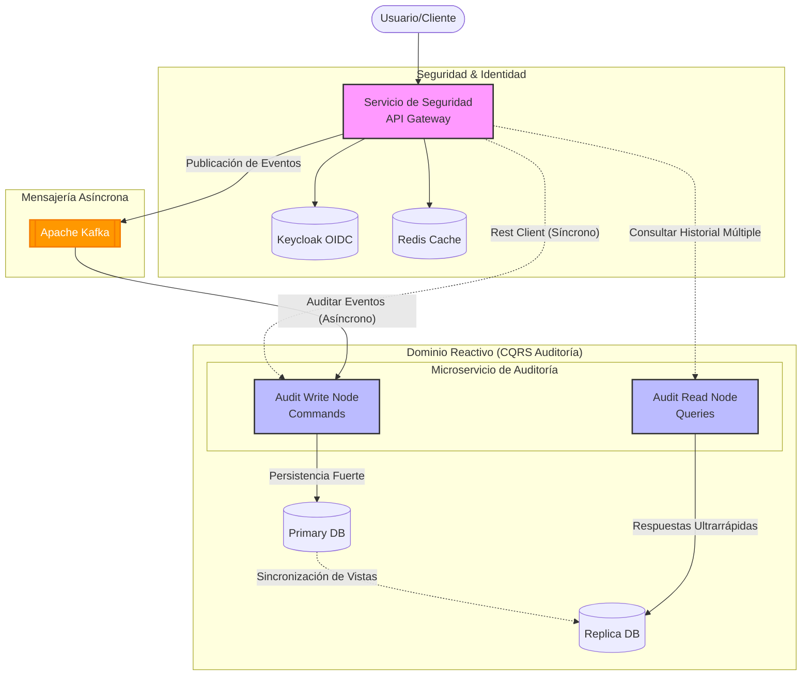

import Tabs from '@theme/Tabs';
import TabItem from '@theme/TabItem';

# Backend Java con Quarkus

:::info Propósito del Curso
Este curso ha sido diseñado para transformar ingenieros de software en expertos de **arquitecturas modernas de grado financiero**, utilizando el stack más avanzado de Java, Quarkus y ecosistemas asíncronos distribuidos.
:::

## Arquitectura del Ecosistema

Siguiendo el principio de **Visual First**, aquí se presenta el flujo de interacción de la infraestructura completa que orquestarás a lo largo de las sesiones:

## ¿Por qué Quarkus y Arquitectura Hexagonal?

:::tip Insight Arquitectónico
La robustez de un sistema financiero no reside solo en su código, sino en la **separación clara de responsabilidades** y su cobertura probada metodológicamente.
:::

- **Quarkus**: Eficiencia sin precedentes con tiempos de arranque casi instantáneos y bajo consumo de memoria (Cloud Native).
- **Hexagonal**: Protege tu lógica de negocio de cambios tecnológicos en la infraestructura externa.

## Stack Tecnológico Maestro

| Herramienta | Rol Crítico |
| :--- | :--- |
| **Java 21/25** | Lenguaje de vanguardia con Virtual Threads. |
| **Quarkus 3.x** | El framework Java más rápido para la nube. |
| **Mutiny** | Programación reactiva simplificada. |
| **Keycloak** | Estándar de seguridad OIDC para servicios financieros. |
| **Apache Kafka** | Broker de mensajería para desacoplamiento asíncrono. |
| **Redis & Postgres** | El balance perfecto entre velocidad efímera y persistencia histórica. |
| **JaCoCo & JUnit 5** | Motores de calidad (QA) y medidores de cobertura de Test Unitario/Integración. |

## Mapa de Ruta Integral (Roadmap)

<Tabs>
  <TabItem value="fundamentos" label="Fase 1: Bases" default>
    - **Sesión 1**: Arquitectura Hexagonal y Estructura.
    - **Sesión 2**: OpenAPI y Seguridad con Keycloak.
  </TabItem>
  <TabItem value="reactivo" label="Fase 2: Reactividad">
    - **Sesión 3**: Auditoría Reactiva con Mutiny.
    - **Sesión 4**: Persistencia CQRS (Postgres + Redis).
  </TabItem>
  <TabItem value="avanzado" label="Fase 3: Resiliencia">
    - **Sesión 5**: Fault Tolerance y Resiliencia (Circuit Breakers).
    - **Sesión 6**: Event-Driven MFA Workflow.
  </TabItem>
  <TabItem value="eventos" label="Fase 4: Eventos">
    - **Sesión 7**: Apache Kafka, mensajería asíncrona y Dead Letter Queues.
  </TabItem>
  <TabItem value="testing" label="Fase 5: Calidad">
    - **Sesión 8**: Testing Unitario, de Integración (DevServices) y Code Coverage (JaCoCo).
  </TabItem>
</Tabs>

## Microservicios que Desarrollarás

### 🛡️ `cja-msa-sc-security`
El cerebro del sistema. Orquestador de identidades, validación de tokens corporativos, flujos MFA y emisor de eventos reactivos hacia el broker de Kafka.

### 📝 `cja-msa-sc-audit`
El sistema nervioso subyacente. Un servicio 100% no-bloqueante que consume los tópicos de Kafka permanentemente para persistir ininterrumpidamente cada rastro de actividad crítica del banco.

---

:::warning Prerrequisitos de Arquitectura
Asegúrate de tener instalados **JDK 21+**, **Docker** (para levantar Keycloak, Postgres, Kafka y Redis) y un IDE moderno (IntelliJ/VS Code) antes de comenzar la Sesión 1.
:::
