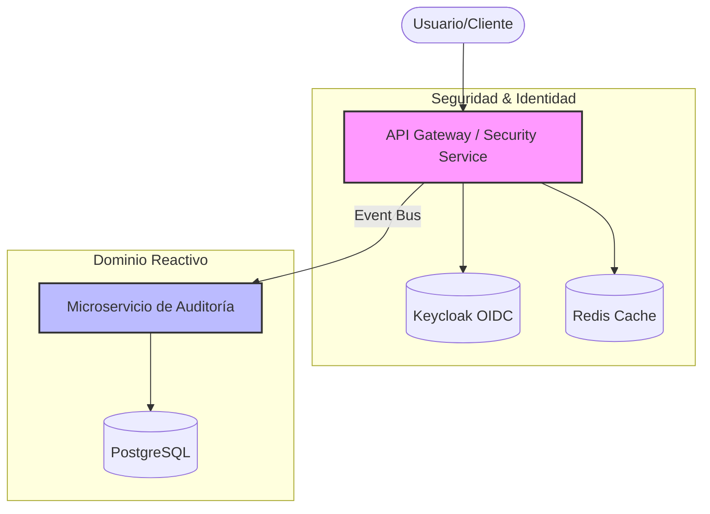

import Tabs from '@theme/Tabs';
import TabItem from '@theme/TabItem';

# Backend Java con Quarkus

:::info Propósito del Curso
Este curso ha sido diseñado para transformar ingenieros de software en expertos de **arquitecturas modernas de grado financiero**, utilizando el stack más avanzado de Java y Quarkus.
:::

## Arquitectura del Ecosistema

Siguiendo el principio de **Visual First**, aquí se presenta el flujo de interacción de los componentes que construirás a lo largo de las sesiones:

## ¿Por qué Quarkus y Arquitectura Hexagonal?

:::tip Insight Arquitectónico
La robustez de un sistema financiero no reside solo en su código, sino en la **separación clara de responsabilidades**.
:::

- **Quarkus**: Eficiencia sin precedentes con tiempos de arranque casi instantáneos y bajo consumo de memoria (Cloud Native).
- **Hexagonal**: Protege tu lógica de negocio de cambios tecnológicos en la infraestructura.

## Stack Tecnológico Maestro

| Herramienta | Rol Crítico |
| :--- | :--- |
| **Java 21/25** | Lenguaje de vanguardia con Virtual Threads. |
| **Quarkus 3.x** | El framework Java más rápido para la nube. |
| **Mutiny** | Programación reactiva simplificada. |
| **Keycloak** | Estándar de seguridad OIDC para servicios financieros. |
| **Redis & Postgres** | El balance perfecto entre velocidad y persistencia. |

## Mapa de Ruta (Roadmap)

<Tabs>
  <TabItem value="fundamentos" label="Fase 1: Bases" default>
    - **Sesión 1**: Arquitectura Hexagonal y Estructura.
    - **Sesión 2**: OpenAPI y Seguridad con Keycloak.
  </TabItem>
  <TabItem value="reactivo" label="Fase 2: Reactividad">
    - **Sesión 3**: Auditoría Reactiva con Mutiny.
    - **Sesión 4**: Persistencia CQRS (Postgres + Redis).
  </TabItem>
  <TabItem value="avanzado" label="Fase 3: Resiliencia">
    - **Sesión 5**: Fault Tolerance y Resiliencia.
    - **Sesión 6**: Event-Driven MFA Workflow.
  </TabItem>
</Tabs>

## Microservicios que Desarrollarás

### 🛡️ `cja-msa-sc-security`
El cerebro del sistema. Orquestador de identidades, validación de tokens y flujos de autenticación multifactor.

### 📝 `cja-msa-sc-audit`
El sistema nervioso. Un servicio 100% no-bloqueante que captura y persiste cada rastro de actividad crítica.

---

:::warning Prerrequisitos
Asegúrate de tener instalados **JDK 21+**, **Docker** y un IDE moderno (IntelliJ/VS Code) antes de comenzar la Sesión 1.
:::
