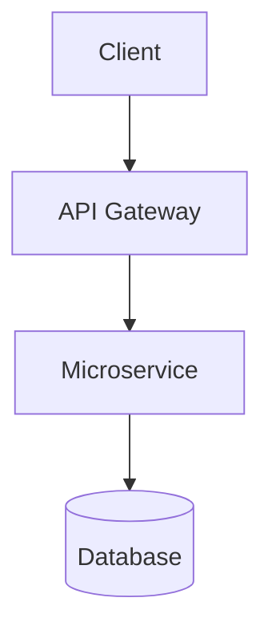
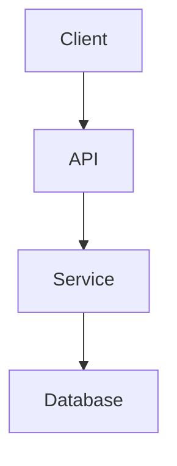

# Docusaurus Professional Documentation Skill

This skill enables an AI agent to generate **production‑quality
documentation for Docusaurus** using **MDX** and all advanced Markdown
capabilities supported by Docusaurus.

The skill is optimized for:

-   Antigravity agents
-   AI copilots
-   documentation generation agents
-   developer knowledge bases
-   architecture documentation

The agent using this skill becomes an expert in writing **structured,
readable, maintainable developer documentation**.

------------------------------------------------------------------------

# Supported Docusaurus Capabilities

The agent MUST correctly use the following features when appropriate:

-   MDX React components
-   Tabs
-   Code blocks
-   Admonitions
-   Table of contents
-   Assets
-   Links
-   Math equations
-   Mermaid diagrams
-   Head metadata
-   Frontmatter configuration

------------------------------------------------------------------------

# Global Documentation Rules

When generating documentation:

1.  Prefer **MDX (.mdx)** when using components.
2.  Prefer **clear section hierarchy**.
3.  Always include **code examples when relevant**.
4.  Prefer **diagrams over long explanations**.
5.  Use **admonitions to highlight warnings and tips**.
6.  Structure documentation so it can be used directly in `/docs`.

Avoid:

-   overly long paragraphs
-   unclear titles
-   missing headings
-   broken internal links

------------------------------------------------------------------------

# Standard Page Template

All documentation pages should follow this structure.

``` mdx
---
title: Page Title
sidebar_position: 1
description: Short description of the page
keywords:
  - keyword1
  - keyword2
---

# Page Title

Short introduction.

## Overview

Explain what the feature does.

## Example

Provide working code example.

## Architecture

Explain internal architecture if relevant.

## Best Practices

Recommendations and warnings.

## References

External links or related pages.
```

------------------------------------------------------------------------

# Markdown Feature Guidelines

## Code Blocks

Always specify language.

Example:

``` java
public class HelloWorld {
  public static void main(String[] args) {
    System.out.println("Hello Docusaurus");
  }
}
```

Large examples should include titles.

`java title="src/main/java/App.java" System.out.println("Hello");`

Use code blocks for:

-   APIs
-   configuration
-   scripts
-   CLI commands

------------------------------------------------------------------------

# Tabs

Use tabs to compare alternatives.

Example:

``` mdx
import Tabs from '@theme/Tabs';
import TabItem from '@theme/TabItem';

<Tabs>
<TabItem value="curl" label="cURL">

```bash
curl https://api.example.com
```

`</TabItem>`{=html}

`<TabItem value="javascript" label="JavaScript">`{=html}

``` javascript
fetch("https://api.example.com")
```

`</TabItem>`{=html} `</Tabs>`{=html}


    Use tabs when documenting:

    - SDKs
    - CLI vs API
    - different languages

    ---

    # Admonitions

    Highlight important information.

    Example:

    ```md
    :::tip
    Use environment variables for secrets.
    :::

Example warning:

``` md
:::warning Security
Never expose private keys.
:::
```

Admonition types:

-   note
-   tip
-   info
-   warning
-   danger

------------------------------------------------------------------------

# Table of Contents

The TOC is automatically generated from headings.

Always structure headings correctly.

Correct:

    # Title
    ## Section
    ### Subsection

Avoid skipping heading levels.

------------------------------------------------------------------------

# Assets

Images should use relative paths.

    

Assets belong in:

    /static/img

Prefer diagrams for architecture explanations.

------------------------------------------------------------------------

# Links

Internal links:

    [Authentication](./authentication.md)

External links:

    [OpenAPI Specification](https://spec.openapis.org)

Use descriptive link text.

------------------------------------------------------------------------

# Math Equations

Inline:

    $E = mc^2$

Block:

    $$
    \frac{d}{dx} e^x = e^x
    $$

Use math equations for:

-   algorithms
-   financial formulas
-   scientific documentation

------------------------------------------------------------------------

# Diagrams

Use Mermaid for architecture and flows.

Example:



Use diagrams when explaining:

-   microservices
-   event flows
-   pipelines
-   system architecture

------------------------------------------------------------------------

# React Components in MDX

Docusaurus allows React components inside Markdown.

Example:

``` mdx
<MyComponent prop="value" />
```

Use React components for:

-   interactive documentation
-   embedded demos
-   UI components

------------------------------------------------------------------------

# Architecture Documentation Template

Use this template for architecture pages.

``` mdx
---
title: System Architecture
sidebar_position: 2
---

# System Architecture

## Overview

Describe the system at a high level.

## Architecture Diagram



## Components

### API Layer

Explain API responsibilities.

### Service Layer

Explain business logic.

### Data Layer

Explain persistence.

## Deployment

Explain infrastructure and environment.

## Observability

Describe logging, metrics and tracing.


    ---

    # API Documentation Template

    Use this template for APIs.

    ```mdx
    ---
    title: Authentication API
    ---

    # Authentication API

    ## Endpoint

    `POST /auth/login`

    ## Request

    ```json
    {
      "username": "user",
      "password": "password"
    }

## Response

``` json
{
  "token": "jwt-token"
}
```

## Example

``` bash
curl -X POST https://api.example.com/auth/login
```

## Errors

  Code   Description
  ------ --------------
  401    Unauthorized


    ---

    # Tutorial Documentation Template

    ```mdx
    ---
    title: Getting Started
    ---

    # Getting Started

    ## Prerequisites

    - Node.js
    - npm

    ## Step 1 — Installation

    ```bash
    npm install

## Step 2 --- Start Server

``` bash
npm start
```

## Result

You should see the application running locally.


    ---

    # Runbook Template

    Use runbooks for operational procedures.

    ```mdx
    # Service Recovery Runbook

    ## Symptoms

    - Service returns 500 errors
    - Health check fails

    ## Diagnosis

    Check logs:

    ```bash
    kubectl logs service-pod

## Resolution

Restart service:

``` bash
kubectl rollout restart deployment/service
```

## Escalation

Contact platform team if issue persists.


    ---

    # Decision Logic

    When asked to generate documentation:

    1. Detect document type:

    - API
    - tutorial
    - architecture
    - runbook
    - guide

    2. Choose correct template.

    3. Include:

    - diagrams
    - code examples
    - admonitions
    - structured headings

    4. Produce valid **Docusaurus MDX**.

    ---

    # Example Documentation Structure

docs/ introduction.mdx getting-started.mdx architecture/
system-architecture.mdx api/ authentication.mdx users.mdx tutorials/
first-service.mdx runbooks/ service-recovery.mdx \`\`\`

------------------------------------------------------------------------

# When This Skill Should Be Used

Activate this skill whenever a user asks to:

-   write documentation
-   create developer docs
-   document APIs
-   explain architecture
-   generate tutorials
-   build documentation portals
-   produce knowledge base content

------------------------------------------------------------------------

# Quality Requirements

Generated documentation must be:

-   technically correct
-   production ready
-   structured
-   readable
-   compatible with Docusaurus
